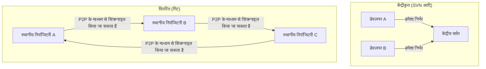
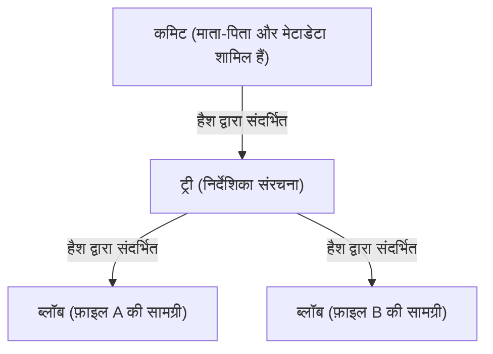

# गिट का दर्शन (विकेंद्रीकरण का सौंदर्यशास्त्र)

सॉफ़्टवेयर विकास की दुनिया में, ऐसे उपकरण दुर्लभ हैं जिन्होंने डेवलपर्स की सोच और वर्कफ़्लो को मूल रूप से गिट जितना बदल दिया है। "फ़ाइल इतिहास को प्रबंधित करने वाले उपकरण" की सीमाओं को पार करते हुए, गिट के मूल में एक शक्तिशाली "दर्शन" है। यह विकेंद्रीकरण (Decentralization), स्वायत्तता (Autonomy), और क्रिप्टोग्राफिक विश्वास (Cryptographic Trust) के तीन स्तंभों द्वारा समर्थित सौंदर्यशास्त्र है।

इस लेख में, हम वास्तुकला के दृष्टिकोण से इस बात की गहराई में जाएंगे कि लिनक्स कर्नेल के निर्माता लिनस टोरवाल्ड्स (Linus Torvalds) ने गिट को किस विचार से बनाया, और कैसे इसने दुनिया भर के डेवलपर्स को आकर्षित किया और आज की ओपन सोर्स संस्कृति की नींव बनाई।

## 1. जन्म की पृष्ठभूमि: केंद्रीकरण का एंटीथीसिस

2005 में जब गिट का जन्म हुआ था, तब संस्करण नियंत्रण प्रणालियों (VCS) की मुख्य धारा CVS और Subversion (SVN) जैसे "केंद्रीकृत" मॉडल थे। इनमें एक विशाल केंद्रीय सर्वर होता है, जहाँ सभी डेवलपर नवीनतम कोड प्राप्त करने के लिए पहुँचते हैं और अपने परिवर्तनों को सर्वर पर भेजते (कमिट करते) हैं।

हालाँकि, लिनक्स कर्नेल जैसे विशाल प्रोजेक्ट्स में जहाँ दुनिया भर के हजारों लोग एक साथ विकास में भाग लेते हैं, केंद्रीकृत मॉडल में एक घातक बाधा थी। सर्वर से कनेक्शन का अनिवार्य होना, विफलता का एकल बिंदु (Single Point of Failure) होना, और सबसे बढ़कर "ब्रांच बनाना और मर्ज करना बहुत भारी और धीमा होना"।

लिनस ने मौजूदा प्रणालियों के प्रति तीव्र असंतोष के कारण, पूरी तरह से नई संस्करण नियंत्रण प्रणाली को स्वयं बनाने का निर्णय लिया। यहीं पर "वितरित (Distributed)" प्रतिमान बदलाव (पैराडाइम शिफ्ट) को अपनाया गया।

गिट में, प्रत्येक व्यक्ति की स्थानीय मशीन पर "रिपॉजिटरी की एक पूर्ण प्रति" मौजूद होती है। नेटवर्क से कनेक्ट न होने पर भी, आप सभी पिछले इतिहास को खोज सकते हैं, ब्रांच बना सकते हैं और कमिट कर सकते हैं। यह केवल प्रदर्शन में सुधार नहीं था, बल्कि प्रत्येक डेवलपर को "पूर्ण संप्रभुता" देने वाला एक वैचारिक बदलाव था।

## 2. कमिट ग्राफ का सौंदर्यशास्त्र: DAG (डायरेक्टेड एसाइक्लिक ग्राफ)

गिट की आंतरिक संरचना को समझने के लिए सबसे महत्वपूर्ण अवधारणा "DAG (Directed Acyclic Graph: प्रत्यक्ष चक्रीय ग्राफ)" है। गिट इतिहास को केवल "पैच के अनुक्रम (अंतर)" के रूप में प्रबंधित नहीं करता है, बल्कि स्नैपशॉट के बीच संबंधों को DAG के रूप में बनाता है।

प्रत्येक कमिट में उस समय पूरे प्रोजेक्ट के स्नैपशॉट के लिए एक पॉइंटर (ट्री) और एक या अधिक "पैरेंट कमिट्स" के लिए पॉइंटर होते हैं। इस सरल डेटा संरचना की श्रृंखला के माध्यम से, गिट जटिल ब्रांचिंग और मर्जिंग इतिहास को गणितीय रूप से सुसंगत ग्राफ के रूप में प्रस्तुत करता है।

इस दृष्टिकोण की सुंदरता यह है कि इतिहास को स्वाभाविक रूप से "एक ही रेखा" के बजाय "समानांतर में आगे बढ़ने वाली कई समयरेखाओं" के रूप में व्यक्त किया जाता है। डेवलपर स्वतंत्र रूप से इतिहास को शाखाओं में बाँट सकते हैं, प्रयोग कर सकते हैं, और यदि वे विफल होते हैं, तो उस शाखा को छोड़ सकते हैं, और यदि वे सफल होते हैं, तो इसे मुख्य धारा में मिला सकते हैं। इतिहास केवल अतीत का रिकॉर्ड नहीं है, बल्कि डेवलपर के "विचारों का प्रक्षेपवक्र (सोच का मार्ग)" ही बन जाता है।

## 3. एक "हल्के परीक्षण मैदान" के रूप में ब्रांच

SVN में, ब्रांच बनाने का मतलब निर्देशिका (डायरेक्टरी) की प्रतिलिपि बनाना था, जो एक भारी ऑपरेशन था जो समय और डिस्क स्थान की खपत करता था। इसलिए, ब्रांच बनाना एक विशेष घटना थी और मनोवैज्ञानिक बाधा बहुत अधिक थी।

हालाँकि, गिट में, एक ब्रांच केवल एक "विशिष्ट कमिट को इंगित करने वाला एक गतिशील पॉइंटर (फ़ाइल में 40-वर्ण हैश मान)" है। ब्रांच बनाने की लागत शाब्दिक रूप से शून्य के करीब है।

इस "सस्ती शाखाओं (Cheap Branches)" के डिज़ाइन ने स्वयं विकास पद्धति को बदल दिया। फीचर ब्रांच और टॉपिक ब्रांच जैसी अवधारणाएँ पैदा हुईं, और "चाहे कितना भी छोटा बदलाव क्यों न हो, पहले एक ब्रांच बनाएँ और प्रयोग करें" की प्रथा स्थापित हो गई। इसने डेवलपर्स को "विफलता के डर के बिना परीक्षण और त्रुटि (ट्रायल एंड एरर) करने की स्वतंत्रता" दी।

## 4. क्रिप्टोग्राफिक विश्वास: SHA-1 और कंटेंट-एड्रेसेबल सिस्टम

विकेंद्रीकृत प्रणाली में सबसे बड़ी चुनौती यह सुनिश्चित करना है कि "डेटा अखंडता (Integrity)" की गारंटी कैसे दी जाए। ऐसे माहौल में जहाँ कोई भी रिपॉजिटरी को संशोधित कर सकता है और एक-दूसरे के साथ कोड का आदान-प्रदान कर सकता है, आप कैसे साबित कर सकते हैं कि कोड के साथ छेड़छाड़ नहीं की गई है और इतिहास वैध है?

गिट ने "कंटेंट-एड्रेसेबल फाइल सिस्टम (Content-Addressable Filesystem)" द्वारा इस समस्या को बहुत ही खूबसूरती से हल किया। गिट में सभी ऑब्जेक्ट्स (कमिट्स, ट्रीज, और BLOBs जो फ़ाइल की सामग्री हैं) को उनके कंटेंट के आधार पर गणना किए गए SHA-1 हैश मान (40-वर्ण हेक्साडेसिमल) द्वारा पहचाना और संग्रहीत किया जाता है।

यदि फ़ाइल की सामग्री 1 बाइट भी बदलती है, तो उस फ़ाइल का हैश मान बदल जाएगा, उसे समाहित करने वाले ट्री का हैश मान बदल जाएगा, और परिणामस्वरूप, कमिट का हैश मान भी बदल जाएगा। दूसरे शब्दों में, इतिहास के किसी भी हिस्से को चुपचाप बदलना क्रिप्टोग्राफिक रूप से असंभव है।

गिट को डिज़ाइन करते समय, लिनस टोरवाल्ड्स की यह प्रबल इच्छा थी कि "डेटा को नष्ट करने या उससे छेड़छाड़ करने की बिल्कुल भी अनुमति नहीं दी जानी चाहिए"। गिट का हैश मॉडल केंद्रीय प्राधिकरण (सर्वर) पर भरोसा किए बिना डेटा में ही विश्वास पैदा करने के विकेंद्रीकरण के अंतिम रूप का प्रतीक है, जो ब्लॉकचेन के समान है।

## 5. मर्ज और संवाद: एक सामाजिक प्रक्रिया के रूप में प्रोग्रामिंग

गिट का असली मूल्य शाखाओं में बँटे इतिहास को एकीकृत करने वाले "मर्ज (Merge)" में निहित है। वितरित विकास में, कई डेवलपर्स के लिए एक ही समय में एक ही फ़ाइल को संपादित करना आम बात है, जिसके परिणामस्वरूप गंभीर संघर्ष (कॉन्फ्लिक्ट) होते हैं।

गिट का मर्ज एल्गोरिदम बहुत उत्कृष्ट है, लेकिन फिर भी ऐसे संघर्ष उत्पन्न होते हैं जिन्हें यांत्रिक रूप से हल नहीं किया जा सकता है। हालाँकि, गिट के दर्शन में, कॉन्फ्लिक्ट एक "त्रुटि" नहीं है, बल्कि एक ऐसा कार्य है जो उन "बिंदुओं को स्पष्ट करता है जहाँ डेवलपर्स के बीच संवाद की आवश्यकता होती है"।

किसके कोड को अपनाना है, या क्या दोनों का उपयोग करने वाला कोई नया लॉजिक लिखना है? मर्ज कॉन्फ्लिक्ट्स को सुलझाना कोड के पीछे के "इरादे" को संरेखित करने की एक सामाजिक प्रक्रिया बन जाती है। गिट स्थानीय रूप से और सुरक्षित रूप से इस प्रक्रिया को करने के लिए एक पूर्ण सैंडबॉक्स प्रदान करता है।

## 6. ओपन सोर्स संस्कृति का लोकतंत्रीकरण और GitHub का उदय

गिट के विकेंद्रीकरण के दर्शन ने ओपन सोर्स विकास के तरीके को मौलिक रूप से बदल दिया। अतीत में ओपन सोर्स विकास में, एक स्पष्ट पदानुक्रम था: विशेषाधिकार प्राप्त कुछ लोग (कोर कमिटर्स) जिनके पास केंद्रीय रिपॉजिटरी में "कमिट करने का अधिकार" था, और सामान्य डेवलपर्स जो मेलिंग सूची के माध्यम से पैच भेजते थे।

हालाँकि, गिट की दुनिया में, हर किसी के पास मूल रिपॉजिटरी का "पूर्ण क्लोन" होता है, और वे अपने स्थानीय वातावरण में "निरंकुश राजा" होते हैं। परिवर्तन करने के बाद, वे मूल से अनुरोध करते हैं "मेरे परिवर्तनों को शामिल करें (Pull Request)"। इस पुल रिक्वेस्ट अवधारणा (गिट में ही निर्मित नहीं, बल्कि गिट के वितरित मॉडल के शीर्ष पर GitHub द्वारा निर्मित एक अवधारणा) के साथ, कोड योगदान का नाटकीय रूप से लोकतंत्रीकरण किया गया था।

जब तक कोड की गुणवत्ता अच्छी है, इसे मर्ज कर दिया जाएगा, चाहे इसे किसी ने भी लिखा हो। गिट की वास्तुकला की सपाट प्रकृति ने योग्यता के आधार पर एक खुले और मुक्त विकास समुदाय के गठन को प्रोत्साहित किया।

## 7. निष्कर्ष: गिट हमें क्या सिखाता है

गिट सिर्फ एक उपकरण नहीं है। यह "स्वतंत्रता" और "जिम्मेदारी" की सॉफ्टवेयर जैसी अभिव्यक्ति है।

केंद्रीय सर्वर पर निर्भर हुए बिना अपने हाथों में पूरा इतिहास और संप्रभुता रखना। विफलता के डर के बिना शाखाएं (ब्रांच) बनाना और परीक्षण-और-त्रुटि (ट्रायल एंड एरर) करना। और परिणामों को दूसरों के साथ साझा करना, और संवाद के माध्यम से इतिहास को एक साथ बुनना (मर्ज करना)।

विकेंद्रीकरण का सौंदर्यशास्त्र किसी विशिष्ट प्राधिकरण पर निर्भर होने के बजाय, व्यक्तिगत स्वायत्तता और क्रिप्टोग्राफिक सत्यापन क्षमता के आधार पर "विश्वास का नेटवर्क" बनाना है। उन `git commit` और `git push` कमांड्स के पीछे, जिन्हें हम हर दिन लापरवाही से टाइप करते हैं, एक भव्य दर्शन निहित है जिसने सॉफ्टवेयर विकास को स्वतंत्र और लोकतांत्रिक बनाने का प्रयास किया।
