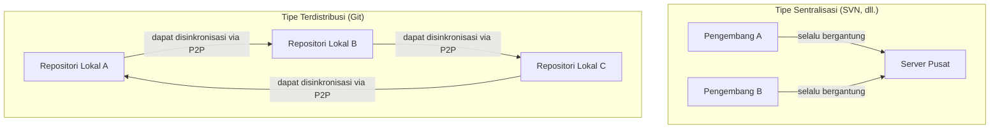
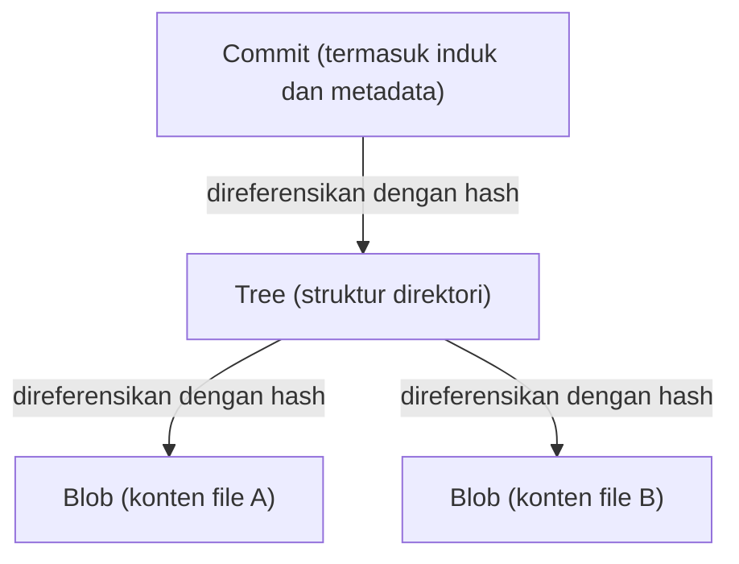

# Filosofi Git (Estetika Desentralisasi)

Di dunia pengembangan perangkat lunak, jarang ada alat yang mengubah secara mendasar pemikiran dan alur kerja para pengembang seperti Git. Lebih dari sekadar "alat untuk mengelola riwayat file", Git memiliki "filosofi" yang kuat di intinya. Ini adalah estetika yang didukung oleh tiga pilar: Desentralisasi (Decentralization), Otonomi (Autonomy), dan Kepercayaan Kriptografi (Cryptographic Trust).

Dalam artikel ini, kita akan menggali lebih dalam dari perspektif arsitektur tentang filosofi apa yang mendasari Linus Torvalds, pencipta kernel Linux, dalam menciptakan Git, dan bagaimana hal itu dapat memikat para pengembang di seluruh dunia serta membentuk fondasi budaya open source saat ini.

## 1. Latar Belakang Kelahiran: Antitesis terhadap Sentralisasi

Pada tahun 2005, saat Git lahir, arus utama sistem kontrol versi (VCS) adalah tipe "sentralisasi" seperti CVS dan Subversion (SVN). Ini adalah model di mana terdapat satu server pusat yang besar, dan semua pengembang mengaksesnya untuk mendapatkan kode terbaru serta mengirim (commit) perubahan mereka ke server.

Namun, dalam proyek raksasa seperti kernel Linux di mana ribuan orang dari seluruh dunia berpartisipasi dalam pengembangan secara bersamaan, tipe sentralisasi ini memiliki hambatan yang fatal. Koneksi ke server adalah keharusan, terdapat titik kegagalan tunggal (Single Point of Failure), dan yang terpenting adalah "membuat cabang (branch) dan menggabungkannya (merge) sangat berat dan lambat".

Linus, didorong oleh ketidakpuasan yang kuat terhadap sistem yang ada, memutuskan untuk membangun sistem kontrol versi yang sama sekali baru dengan tangannya sendiri. Pergeseran paradigma yang diadopsi saat itu adalah tipe "Terdistribusi" (Distributed).

Di Git, "salinan repositori yang lengkap" ada di mesin lokal setiap orang. Bahkan tanpa terhubung ke jaringan, Anda dapat mencari seluruh riwayat masa lalu, membuat cabang, dan melakukan commit. Ini bukan hanya sekadar peningkatan kinerja, melainkan sebuah perubahan filosofis yang memberikan "kedaulatan penuh" kepada setiap individu pengembang.

## 2. Estetika Grafik Commit: DAG (Directed Acyclic Graph)

Konsep paling penting untuk memahami struktur internal Git adalah "DAG (Directed Acyclic Graph: Grafik Asiklik Berarah)". Git tidak mengelola riwayat sekadar sebagai "serangkaian patch (perbedaan)", melainkan membangun hubungan antar snapshot sebagai DAG.

Setiap commit memiliki [pointer](/id/p/c-language-pointers-memory-management-stack-heap/) (tree) ke snapshot dari keseluruhan proyek pada saat itu, dan [pointer](/id/p/c-language-pointers-memory-management-stack-heap/) ke satu atau lebih "commit induk". Melalui rangkaian struktur data sederhana ini, Git merepresentasikan percabangan dan penggabungan riwayat yang kompleks sebagai grafik yang konsisten secara matematis.

Keindahan pendekatan ini terletak pada bagaimana riwayat diekspresikan secara alami, bukan sebagai "satu garis lurus", melainkan sebagai "beberapa garis waktu yang berjalan secara paralel". Pengembang bebas mencabangkan riwayat, bereksperimen, dan membuang cabang tersebut jika gagal, atau menggabungkannya ke arus utama jika berhasil. Riwayat bukan sekadar catatan masa lalu, melainkan menjadi "jejak pemikiran" dari pengembang itu sendiri.

## 3. Cabang sebagai "Taman Bermain Eksperimen yang Ringan"

Dalam SVN, membuat cabang berarti menyalin direktori, yang merupakan operasi berat serta menghabiskan waktu dan ruang disk. Oleh karena itu, membuat cabang adalah peristiwa khusus dengan hambatan psikologis yang tinggi.

Namun di Git, cabang hanyalah "[pointer](/id/p/c-language-pointers-memory-management-stack-heap/) dinamis yang menunjuk ke commit tertentu (nilai hash 40 karakter dalam sebuah file)". Biaya untuk membuat cabang secara harfiah mendekati nol.

Desain "Cabang Murah" (Cheap Branches) ini mengubah metodologi pengembangan itu sendiri. Konsep-konsep seperti cabang fitur (feature branch) dan cabang topik (topic branch) lahir, dan praktik "sekecil apa pun perubahannya, buat cabang terlebih dahulu untuk bereksperimen" menjadi mapan. Ini memberi pengembang "kebebasan untuk mencoba dan membuat kesalahan tanpa takut gagal".

## 4. Kepercayaan Kriptografi: SHA-1 dan Sistem Pengalamatan Konten

Dalam sistem yang terdesentralisasi, tantangan terbesar adalah bagaimana memastikan "Integritas Data" (Data Integrity). Dalam lingkungan di mana siapa pun dapat mengubah repositori dan saling bertukar kode, bagaimana kita bisa membuktikan bahwa kode tidak dirusak dan riwayatnya sah?

Git memecahkan masalah ini dengan elegan melalui "Sistem File Beralamatkan Konten" (Content-Addressable Filesystem). Semua objek dalam Git (commit, tree, dan BLOB yang merupakan konten file) diidentifikasi dan disimpan berdasarkan nilai hash SHA-1 (40 karakter heksadesimal) yang dihitung berdasarkan isinya.

Jika konten file berubah walau hanya 1 byte, nilai hash file tersebut akan berubah, nilai hash dari tree yang menyertainya akan berubah, dan pada akhirnya nilai hash dari commit juga akan berubah. Dengan kata lain, secara kriptografi mustahil untuk memalsukan sebagian dari riwayat secara diam-diam.

Linus Torvalds, dalam merancang Git, memiliki tekad yang kuat bahwa "perusakan atau pemalsuan data sama sekali tidak dapat ditoleransi". Model hash Git mewujudkan bentuk pamungkas dari desentralisasi—mirip dengan [blockchain](/id/p/blockchain-technology-smart-contract-distributed-ledger/)—yang menanamkan kepercayaan pada data itu sendiri tanpa bergantung pada otoritas pusat (server).

## 5. Penggabungan dan Dialog: Pemrograman sebagai Proses Sosial

Keunggulan sejati Git terletak pada "Penggabungan" (Merge), yang menyatukan riwayat-riwayat yang terpisah. Dalam pengembangan terdistribusi, sangat umum bagi beberapa pengembang untuk mengedit file yang sama secara bersamaan, sehingga sering terjadi konflik.

Meskipun algoritma penggabungan Git sangat baik, konflik yang tidak dapat diselesaikan secara mekanis tetap akan terjadi. Namun, dalam filosofi Git, konflik bukanlah "kesalahan", melainkan fitur yang menunjukkan "titik di mana dialog antar pengembang diperlukan".

Kode siapa yang akan diadopsi, atau apakah akan menulis logika baru yang memanfaatkan keduanya? Menyelesaikan konflik penggabungan menjadi sebuah proses sosial untuk menyelaraskan "niat" di balik kode. Git menyediakan kotak pasir (sandbox) yang sempurna untuk melakukan proses ini dengan aman secara lokal.

## 6. Demokratisasi Budaya Open Source dan Kebangkitan GitHub

Filosofi desentralisasi Git secara fundamental telah mengubah cara pengembangan open source dilakukan. Dalam pengembangan open source di masa lalu, terdapat hierarki yang jelas antara segelintir elit (core committer) yang memiliki "hak commit" ke repositori pusat, dan pengembang biasa yang mengirimkan patch melalui milis (mailing list).

Namun dalam dunia Git, semua orang memiliki "klon lengkap" dari repositori utama, dan menjadi "penguasa absolut" di lingkungan lokalnya sendiri. Setelah membuat perubahan, mereka meminta repositori utama, "Tolong gabungkan perubahan saya" (Pull Request). Melalui konsep Pull Request ini (yang sebenarnya tidak terpasang di Git itu sendiri, melainkan dibangun oleh GitHub di atas model distribusi Git), kontribusi kode mengalami demokratisasi yang dramatis.

Selama kualitas kodenya bagus, itu akan digabungkan tidak peduli siapa yang menulisnya. Sifat datar dari arsitektur Git telah mendorong terbentuknya komunitas pengembangan yang terbuka dan bebas berdasarkan meritokrasi.

## 7. Kesimpulan: Apa yang Diajarkan Git Kepada Kita

Git bukan sekadar alat. Ia adalah ekspresi perangkat lunak tentang "kebebasan" dan "tanggung jawab".

Tidak bergantung pada server pusat, memiliki sejarah dan kedaulatan yang utuh di tangan sendiri. Mencabangkan (branch) tanpa takut gagal, dan melakukan proses coba-coba. Serta, membagikan hasil tersebut dengan orang lain, merajut sejarah bersama melalui dialog (merge).

Estetika desentralisasi bukanlah tentang bergantung pada otoritas tertentu, melainkan tentang membangun "jaringan kepercayaan" yang didasarkan pada otonomi individu dan verifikasi kriptografi. Di balik perintah `git commit` atau `git push` yang sering kita ketik tanpa berpikir panjang setiap harinya, terdapat sebuah filosofi luar biasa yang berusaha menjadikan pengembangan perangkat lunak sebagai sesuatu yang bebas dan demokratis.
