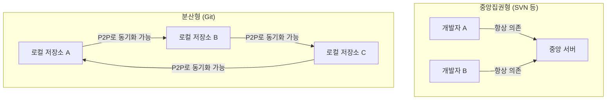
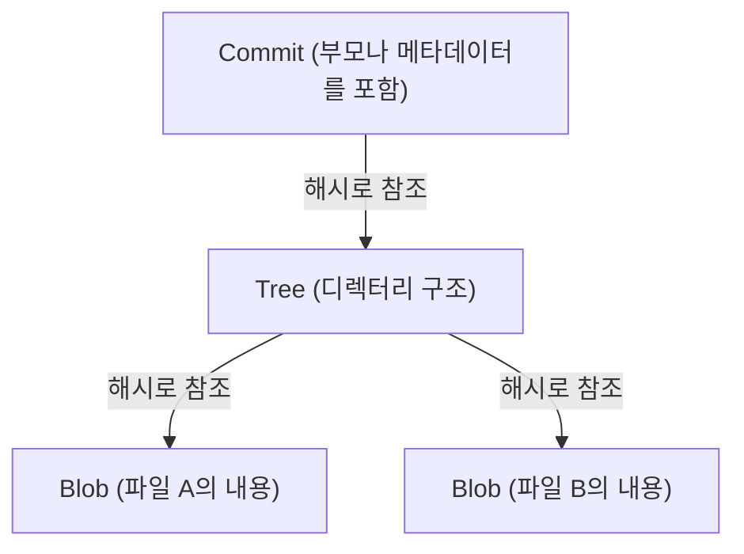

# Git의 사상 (탈중앙화의 미학)

소프트웨어 개발의 세계에서 Git만큼 개발자의 사고나 워크플로우를 근본부터 변용시킨 도구는 드물다. 단순한 '파일의 이력을 관리하는 도구'라는 틀을 넘어, Git은 그 근저에 강력한 '철학'을 가지고 있다. 그것은 탈중앙화(Decentralization), 자율성(Autonomy), 그리고 암호학적 신뢰(Cryptographic Trust)라는 세 개의 기둥으로 지탱되는 미학이다.

본고에서는 리눅스 커널의 창시자인 리누스 토발즈(Linus Torvalds)가 어떤 사상을 바탕으로 Git을 창조해 냈으며, 그것이 어떻게 전 세계의 개발자를 매료시키고 오늘날의 오픈소스 문화의 기반을 형성하게 되었는지를 아키텍처 관점에서 깊이 파헤쳐 본다.

## 1. 탄생의 배경: 중앙집권에 대한 안티테제

Git이 탄생한 2005년 당시, 버전 관리 시스템(VCS)의 주류는 CVS나 Subversion(SVN)과 같은 '중앙집권형'이었다. 이들은 하나의 거대한 중앙 서버가 존재하고, 모든 개발자가 그곳에 접속하여 최신 코드를 가져오고, 자신의 변경 사항을 서버에 전송(커밋)하는 모델이다.

그러나 리눅스 커널과 같이 전 세계의 수천 명이 동시에 개발에 참여하는 거대 프로젝트에 있어서, 중앙집권형은 치명적인 병목 현상을 안고 있었다. 서버 접속이 필수적이라는 점, 단일 장애점(Single Point of Failure)이 존재한다는 점, 그리고 무엇보다 '브랜치의 생성이나 병합이 무겁고 느리다'는 점이다.

리누스는 기존 시스템에 대한 강한 불만에서, 자신의 손으로 완전히 새로운 버전 관리 시스템을 구축하기로 결심했다. 거기서 채택된 것이 '분산형(Distributed)'이라는 패러다임 전환이다.

Git에서는 모든 사람의 로컬 머신 상에 '완전한 저장소의 복사본'이 존재한다. 네트워크에 접속해 있지 않아도, 과거의 모든 이력을 검색하고 브랜치를 만들며 커밋을 수행할 수 있다. 이것은 단순한 성능 향상이 아니라, 개발자 한 사람 한 사람에게 '완전한 주권'을 부여한다는 사상적 전환이었다.

## 2. 커밋 그래프의 미학: DAG (유향 비순환 그래프)

Git의 내부 구조를 이해하는 데 있어 가장 중요한 개념이 'DAG (Directed Acyclic Graph: 유향 비순환 그래프)'이다. Git은 이력을 단순한 '패치의 연속(차이)'으로 관리하는 것이 아니라, 스냅샷 간의 관계성을 DAG로 구축한다.

각 커밋은 그 시점의 프로젝트 전체의 스냅샷을 가리키는 포인터(트리)와 하나 이상의 '부모 커밋'을 가리키는 포인터를 가진다. 이 단순한 데이터 구조의 연쇄를 통해 Git은 복잡한 브랜치의 분기와 병합의 이력을 수학적으로 모순이 없는 그래프로 표현한다.

이 접근법의 아름다움은 이력이 '하나의 선'이 아니라 '병행해서 진행되는 복수의 타임라인'으로 자연스럽게 표현된다는 점에 있다. 개발자는 자유롭게 역사를 분기시키고 실험하며, 실패하면 그 분기를 버리고, 성공하면 본류에 합류시킬 수 있다. 이력은 단순한 과거의 기록이 아니라 개발자의 '사고의 궤적' 그 자체가 된다.

## 3. 브랜치라는 '가벼운 실험장'

SVN에서 브랜치의 생성은 디렉터리의 복사를 의미하며, 시간과 디스크 용량을 소비하는 무거운 작업이었다. 그렇기 때문에 브랜치를 만드는 것은 특별한 이벤트였으며, 심리적인 장벽이 높았다.

하지만 Git에서 브랜치는 단순한 '특정 커밋을 가리키는 동적인 포인터(파일 내의 40자 해시값)'에 불과하다. 브랜치를 생성하는 비용은 말 그대로 제로에 가깝다.

이 '저렴한 브랜치(Cheap Branches)'라는 설계는 개발 방법론 그 자체를 변혁했다. 피처 브랜치(Feature Branch), 토픽 브랜치(Topic Branch) 같은 개념이 생겨났고, '아무리 작은 변경이라도 우선은 브랜치를 만들어 실험한다'는 관행이 정착되었다. 이것은 개발자에게 '실패를 두려워하지 않고 시행착오를 겪을 자유'를 부여한 것이다.

## 4. 암호학적 신뢰: SHA-1과 콘텐츠 주소 지정 방식

탈중앙화된 시스템에 있어서, 가장 큰 과제는 '데이터의 무결성(Integrity)'을 어떻게 담보할 것인가이다. 누구나 저장소를 개조하고 서로 코드를 교환하는 환경에서, 코드가 위조되지 않았다는 것, 이력이 정당하다는 것을 어떻게 증명할 것인가.

Git은 이 문제를 '콘텐츠 주소 지정 파일 시스템(Content-Addressable Filesystem)'을 통해 우아하게 해결했다. Git 내의 모든 객체(커밋, 트리, 파일 내용인 BLOB)는 그 내용을 바탕으로 계산된 SHA-1 해시값(40자의 16진수)에 의해 식별되고 저장된다.

파일의 내용이 1바이트라도 변경되면 그 파일의 해시값이 변경되고, 이를 포함하는 트리의 해시값이 변경되며, 결과적으로 커밋의 해시값도 변경된다. 즉, 이력의 일부를 몰래 조작하는 것은 암호학적으로 불가능하다.

리누스 토발즈는 Git을 설계함에 있어 '데이터의 파괴나 위조를 절대 용서하지 않겠다'는 강한 의지를 갖고 있었다. Git의 해시 모델은 중앙의 권위(서버)에 의존하지 않고 데이터 자체에 신뢰를 내재시킨다는, 블록체인과도 상통하는 탈중앙화의 궁극적인 형태를 구현하고 있다.

## 5. 병합과 대화: 사회적 과정으로서의 프로그래밍

Git의 진면목은 분기된 역사를 통합하는 '병합(Merge)'에 있다. 분산형 개발에서는 복수의 개발자가 동시에 같은 파일을 편집하고 심하게 충돌(Conflict)하는 것이 일상다반사가 된다.

Git의 병합 알고리즘은 매우 우수하지만, 그럼에도 기계적으로 해결할 수 없는 충돌은 발생한다. 그러나 Git의 사상에서 충돌은 '에러'가 아니라 '개발자 간의 대화가 필요한 시점'을 명시하는 기능이다.

누구의 코드를 채택할 것인가, 혹은 양쪽을 모두 살리는 새로운 로직을 작성할 것인가. 병합 충돌의 해결은 코드 배후에 있는 '의도'를 조율하는 사회적 과정이 된다. Git은 이 과정을 로컬에서 안전하게 수행하기 위한 완전한 샌드박스를 제공하고 있는 것이다.

## 6. 오픈소스 문화의 민주화와 GitHub의 대두

Git의 탈중앙화 사상은 오픈소스 개발의 형태를 근본부터 바꾸었다. 과거의 오픈소스 개발에서는 중앙 저장소에 대한 '커밋 권한'을 가진 소수의 특권 계급(코어 커미터)과 패치를 메일링 리스트로 보내는 일반 개발자라는 명확한 계층 구조가 존재했다.

하지만 Git의 세계에서는 누구나 본가 저장소의 '완전한 클론'을 가지고, 자신의 로컬에서는 자신이 '전제 군주'가 된다. 변경을 가한 후 본가에 '나의 변경을 가져가 줘(Pull Request)'라고 의뢰한다. 이 Pull Request 개념(Git 자체에는 내장되어 있지 않지만, Git의 분산 모델 위에 GitHub가 구축한 개념)을 통해 코드 기여는 극적으로 민주화되었다.

코드의 질만 좋다면 누가 작성한 것이든 병합된다. Git의 아키텍처가 가진 수평적인 성질이 실력주의에 기반한 개방적이고 자유로운 개발 커뮤니티의 형성을 뒷받침한 것이다.

## 7. 결론: Git이 가르쳐 주는 것

Git은 단순한 도구가 아니다. 그것은 '자유'와 '책임'에 대한 소프트웨어적인 표현이다.

중앙 서버에 의존하지 않고 자신의 수중에 완전한 역사와 주권을 가지는 것. 실패를 두려워하지 않고 분기(브랜치)하며 시행착오를 거듭하는 것. 그리고 그 결과를 타인과 공유하고 대화를 통해 역사를 엮어 나가는(병합하는) 것.

탈중앙화의 미학이란 특정 권위에 의존하는 것이 아니라, 개개인의 자율성과 암호학적 검증 가능성에 기반한 '신뢰의 네트워크'를 구축하는 것이다. 우리가 매일 무심코 입력하는 `git commit`이나 `git push`라는 명령어 이면에는 소프트웨어 개발을 자유롭고 민주적인 것으로 만들고자 했던 장대한 철학이 살아 숨쉬고 있는 것이다.
