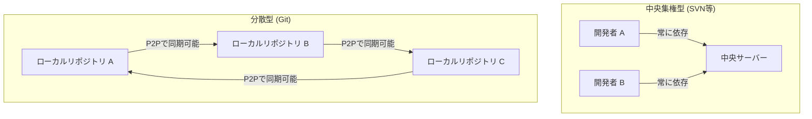
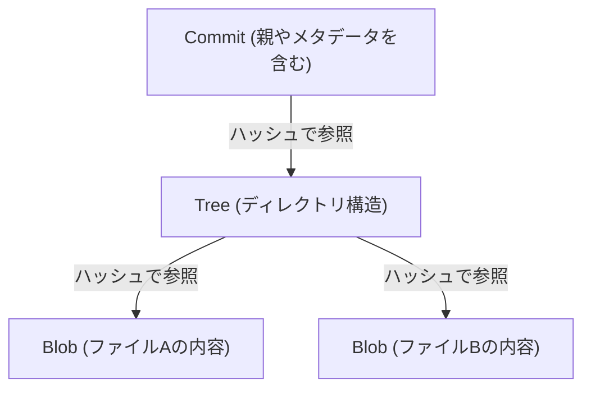

# Gitの思想（非中央集権の美学）

ソフトウェア開発の世界において、Gitほど開発者の思考やワークフローを根本から変容させたツールは稀である。単なる「ファイルの履歴を管理するツール」という枠を超え、Gitはその根底に強力な「哲学」を持っている。それは、非中央集権（Decentralization）、自律性（Autonomy）、そして暗号学的信頼（Cryptographic Trust）という三つの柱によって支えられた美学である。

本稿では、Linuxカーネルの生みの親であるリーナス・トーバルズ（Linus Torvalds）がどのような思想のもとにGitを創り出し、それがどのようにして世界中の開発者を魅了し、今日のオープンソース文化の基盤を形成するに至ったのかを、アーキテクチャの観点から深掘りしていく。

## 1. 誕生の背景：中央集権へのアンチテーゼ

Gitが誕生した2005年当時、バージョン管理システム（VCS）の主流はCVSやSubversion（SVN）といった「中央集権型」であった。これらは一つの巨大な中央サーバーが存在し、すべての開発者がそこにアクセスして最新のコードを取得し、自身の変更をサーバーに送信（コミット）するモデルである。

しかし、Linuxカーネルのような世界中の数千人が同時に開発に参加する巨大プロジェクトにおいて、中央集権型は致命的なボトルネックを抱えていた。サーバーへの接続が必須であること、単一障害点（Single Point of Failure）が存在すること、そして何より「ブランチの作成やマージが重厚で遅い」ということである。

リーナスは、既存のシステムに対する強い不満から、自らの手で全く新しいバージョン管理システムを構築することを決意した。そこで採用されたのが「分散型（Distributed）」というパラダイムシフトである。

Gitにおいては、すべての人間のローカルマシン上に「完全なリポジトリのコピー」が存在する。ネットワークに接続していなくても、過去のすべての履歴を検索し、ブランチを切り、コミットを行うことができる。これは単なるパフォーマンスの向上ではなく、開発者一人一人に「完全な主権」を与えるという思想的な転換であった。

## 2. コミットグラフの美学：DAG（有向非巡回グラフ）

Gitの内部構造を理解する上で最も重要な概念が「DAG（Directed Acyclic Graph：有向非巡回グラフ）」である。Gitは履歴を単なる「パッチの連続（差分）」として管理するのではなく、スナップショット間の関係性をDAGとして構築する。

各コミットは、その時点でのプロジェクト全体のスナップショットへのポインタ（ツリー）と、一つ以上の「親コミット」へのポインタを持つ。この単純なデータ構造の連鎖によって、Gitは複雑なブランチの分岐やマージの履歴を、数学的に矛盾のないグラフとして表現する。

このアプローチの美しさは、履歴が「一本の線」ではなく「並行して進む複数のタイムライン」として自然に表現される点にある。開発者は自由に歴史を分岐させ、実験し、失敗すればその分岐を捨て去り、成功すれば本流に合流させることができる。履歴は単なる過去の記録ではなく、開発者の「思考の軌跡」そのものとなる。

## 3. ブランチという「軽量な実験場」

SVNにおいて、ブランチの作成はディレクトリのコピーを意味し、時間とディスク容量を消費する重い操作であった。そのため、ブランチを切ることは特別なイベントであり、心理的なハードルが高かった。

しかしGitにおいて、ブランチは単なる「特定のコミットを指し示す動的なポインタ（ファイル内の40文字のハッシュ値）」に過ぎない。ブランチを作成するコストは文字通りゼロに近い。

この「安価なブランチ（Cheap Branches）」という設計は、開発手法そのものを変革した。フィーチャーブランチ、トピックブランチといった概念が生まれ、「どんなに小さな変更であっても、まずはブランチを切って実験する」というプラクティスが定着した。これは、開発者に対して「失敗を恐れずに試行錯誤する自由」を与えたのである。

## 4. 暗号学的信頼：SHA-1とコンテンツアドレス方式

非中央集権のシステムにおいて、最大の課題は「データの完全性（Integrity）」をいかに担保するかである。誰もがリポジトリを改変し、互いにコードを交換し合う環境において、コードが改ざんされていないこと、履歴が正当であることをどうやって証明するのか。

Gitはこの問題を「コンテンツアドレス指定ファイルシステム（Content-Addressable Filesystem）」によってエレガントに解決した。Git内のすべてのオブジェクト（コミット、ツリー、ファイルの内容であるBLOB）は、その内容を元に計算されたSHA-1ハッシュ値（40文字の16進数）によって識別され、保存される。

ファイルの内容が1バイトでも変われば、そのファイルのハッシュ値が変わり、それを含むツリーのハッシュ値が変わり、結果としてコミットのハッシュ値も変わる。つまり、履歴の一部をこっそり改ざんすることは暗号学的に不可能である。

リーナス・トーバルズは、Gitを設計するにあたり「データの破壊や改ざんを絶対に許さない」という強い意志を持っていた。Gitのハッシュモデルは、中央の権威（サーバー）に頼ることなく、データそのものに信頼を内在させるという、ブロックチェーンにも通じる非中央集権の究極の形を体現している。

## 5. マージと対話：社会的なプロセスとしてのプログラミング

Gitの真骨頂は、分岐した歴史を統合する「マージ（Merge）」にある。分散型開発においては、複数の開発者が同時に同じファイルを編集し、激しくコンフリクト（競合）することが日常茶飯事となる。

Gitのマージアルゴリズムは非常に優秀であるが、それでも機械的に解決できないコンフリクトは発生する。しかし、Gitの思想においてコンフリクトは「エラー」ではなく、「開発者同士の対話が必要なポイント」を明示する機能である。

誰のコードを採用するのか、あるいは両方を活かす新しいロジックを書くのか。マージコンフリクトの解決は、コードの背後にある「意図」をすり合わせる社会的なプロセスとなる。Gitは、このプロセスをローカルで安全に行うための完全なサンドボックスを提供しているのである。

## 6. オープンソース文化の民主化とGitHubの台頭

Gitの非中央集権の思想は、オープンソース開発のあり方を根本から変えた。かつてのオープンソース開発では、中央のリポジトリへの「コミット権」を持つ少数の特権階級（コアコミッター）と、パッチをメーリングリストで送る一般の開発者という明確なヒエラルキーが存在した。

しかしGitの世界では、誰もが本家リポジトリの「完全なクローン」を持ち、自分のローカルでは自分が「専制君主」となる。変更を加えた後、本家に「私の変更を取り込んでくれ（Pull Request）」と依頼する。このPull Requestの概念（Git自体には組み込まれていないが、Gitの分散モデルの上にGitHubが構築した概念）により、コードのコントリビューションは劇的に民主化された。

コードの質さえ良ければ、誰が書いたものであろうとマージされる。Gitのアーキテクチャが持つフラットな性質が、実力主義に基づくオープンで自由な開発コミュニティの形成を後押ししたのである。

## 7. 結論：Gitが教えてくれること

Gitは単なるツールではない。それは「自由」と「責任」についてのソフトウェア的な表現である。

中央のサーバーに依存せず、自らの手元に完全な歴史と主権を持つこと。失敗を恐れずに分岐（ブランチ）し、試行錯誤すること。そして、その結果を他者と共有し、対話を通して歴史を紡ぎ合わせていく（マージする）こと。

非中央集権の美学とは、特定の権威に依存するのではなく、個々の自律性と、暗号学的な検証可能性に基づく「信頼のネットワーク」を構築することである。私たちが毎日何気なく打ち込んでいる `git commit` や `git push` というコマンドの裏には、ソフトウェア開発を自由で民主的なものにしようとした、壮大な哲学が息づいているのである。
