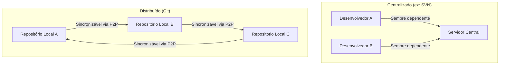
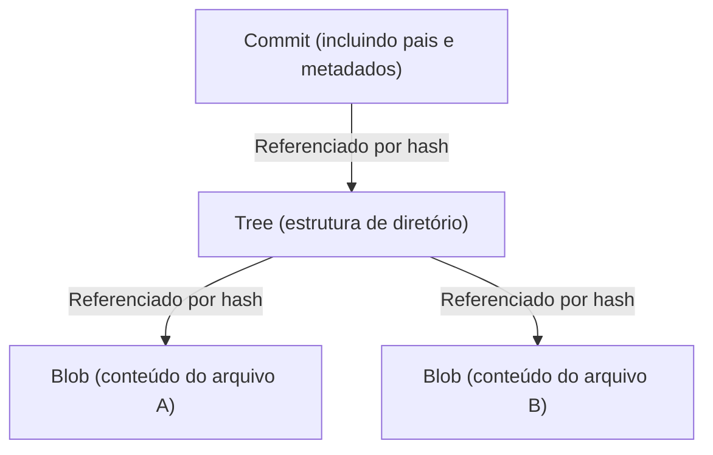

# A Filosofia do Git (A Estética da Descentralização)

No mundo do desenvolvimento de software, é raro encontrar uma ferramenta que tenha transformado tão fundamentalmente o pensamento e o fluxo de trabalho dos desenvolvedores quanto o Git. Ultrapassando os limites de ser apenas uma "ferramenta para gerenciar o histórico de arquivos", o Git possui uma poderosa "filosofia" em sua base. É uma estética sustentada por três pilares: Descentralização (Decentralization), Autonomia (Autonomy) e Confiança Criptográfica (Cryptographic Trust).

Neste artigo, nos aprofundaremos, sob a perspectiva da arquitetura, em qual filosofia Linus Torvalds, o criador do kernel do Linux, baseou-se para criar o Git, e como ele conseguiu cativar desenvolvedores em todo o mundo, formando a base da cultura de código aberto de hoje.

## 1. O Contexto de seu Nascimento: Uma Antítese à Centralização

Em 2005, quando o Git nasceu, a corrente principal dos Sistemas de Controle de Versão (VCS) era "centralizada", como o CVS e o Subversion (SVN). Esses modelos envolviam um único servidor central gigante, onde todos os desenvolvedores acessavam para obter o código mais recente e enviavam (commit) suas alterações para o servidor.

No entanto, em projetos massivos como o kernel do Linux, onde milhares de pessoas de todo o mundo participam do desenvolvimento simultaneamente, o modelo centralizado apresentava gargalos fatais. A conexão com o servidor era obrigatória, existia um Ponto Único de Falha (Single Point of Failure), e, acima de tudo, "criar branches e fazer merges era algo pesado e lento".

Impulsionado por uma forte insatisfação com os sistemas existentes, Linus decidiu construir um sistema de controle de versão totalmente novo com as próprias mãos. Foi aí que adotou a mudança de paradigma "Distribuído" (Distributed).

No Git, uma "cópia completa do repositório" existe nas máquinas locais de todas as pessoas. Mesmo sem estar conectado à rede, você pode pesquisar todo o histórico passado, criar branches e fazer commits. Isso não foi apenas uma melhoria de desempenho, mas uma mudança filosófica de conceder "soberania total" a cada desenvolvedor individualmente.

## 2. A Estética do Grafo de Commits: DAG (Grafo Acíclico Dirigido)

O conceito mais importante para entender a estrutura interna do Git é o "DAG" (Directed Acyclic Graph: Grafo Acíclico Dirigido). O Git não gerencia o histórico como uma mera "sequência de patches (diferenças)", mas constrói as relações entre os instantâneos (snapshots) como um DAG.

Cada commit possui um ponteiro (tree) para um snapshot de todo o projeto naquele momento, e ponteiros para um ou mais "commits pais". Através dessa simples cadeia de estrutura de dados, o Git representa o complexo histórico de ramificações e mesclagens (merges) de branches como um grafo matematicamente consistente.

A beleza dessa abordagem reside no fato de que o histórico é expresso naturalmente, não como uma "linha única", mas como "múltiplas linhas do tempo correndo em paralelo". Os desenvolvedores podem ramificar livremente a história, experimentar, descartar a ramificação se falhar ou integrá-la à corrente principal se for bem-sucedida. O histórico torna-se não apenas um registro do passado, mas a própria "trajetória de pensamento" do desenvolvedor.

## 3. Branches como "Laboratórios Leves"

No SVN, a criação de uma branch significava copiar um diretório, uma operação pesada que consumia tempo e espaço em disco. Portanto, criar uma branch era um evento especial com um alto obstáculo psicológico.

No entanto, no Git, uma branch é apenas um "ponteiro dinâmico apontando para um commit específico (um valor de hash de 40 caracteres em um arquivo)". O custo de criar uma branch é literalmente próximo de zero.

Esse design de "Branches Baratas" (Cheap Branches) transformou a própria metodologia de desenvolvimento. Conceitos como feature branches e topic branches nasceram, e a prática de "por menor que seja a mudança, primeiro crie uma branch e experimente" tornou-se comum. Isso deu aos desenvolvedores "a liberdade de tentativa e erro sem medo do fracasso".

## 4. Confiança Criptográfica: SHA-1 e Sistema Baseado em Endereçamento de Conteúdo

Em um sistema descentralizado, o maior desafio é como garantir a "Integridade dos Dados" (Integrity). Em um ambiente onde qualquer um pode modificar o repositório e trocar códigos entre si, como provar que o código não foi adulterado e que o histórico é legítimo?

O Git resolveu esse problema de forma elegante por meio de um "Sistema de Arquivos Endereçável por Conteúdo" (Content-Addressable Filesystem). Todos os objetos no Git (commits, árvores (trees) e os BLOBs que são o conteúdo dos arquivos) são identificados e armazenados por um valor de hash SHA-1 (um número hexadecimal de 40 caracteres) calculado a partir do seu conteúdo.

Se o conteúdo de um arquivo mudar em um único byte, o valor do hash desse arquivo muda, o valor do hash da árvore que o contém muda e, como resultado, o valor do hash do commit também muda. Ou seja, é criptograficamente impossível adulterar secretamente parte do histórico.

Ao projetar o Git, Linus Torvalds tinha uma forte determinação de que "a destruição ou adulteração de dados nunca deveria ser permitida". O modelo de hash do Git incorpora a forma definitiva de descentralização, que também está presente no blockchain: não depender de uma autoridade central (servidor), mas incorporar a confiança nos próprios dados.

## 5. Merge e Diálogo: Programação como um Processo Social

A verdadeira essência do Git está no "Merge", que integra a história ramificada. No desenvolvimento distribuído, é algo cotidiano que vários desenvolvedores editem os mesmos arquivos ao mesmo tempo e ocorram conflitos (conflicts) intensos.

Embora o algoritmo de merge do Git seja excelente, conflitos que não podem ser resolvidos mecanicamente ainda ocorrem. No entanto, na filosofia do Git, um conflito não é um "erro", mas uma funcionalidade que destaca um "ponto onde o diálogo entre os desenvolvedores é necessário".

De quem é o código a ser adotado, ou deve-se escrever uma nova lógica que aproveite ambos? A resolução de um conflito de merge torna-se um processo social de alinhamento das "intenções" por trás do código. O Git fornece uma sandbox (caixa de areia) completa para realizar esse processo localmente e com segurança.

## 6. A Democratização da Cultura de Código Aberto e a Ascensão do GitHub

A filosofia descentralizada do Git mudou fundamentalmente a maneira como o desenvolvimento de código aberto funciona. No antigo desenvolvimento de código aberto, existia uma hierarquia clara entre uma pequena classe privilegiada (core committers) com "direitos de commit" no repositório central e os desenvolvedores em geral que enviavam patches por listas de e-mail.

No entanto, no mundo do Git, todos têm um "clone completo" do repositório original, e no seu repositório local, você é o "monarca absoluto". Após fazer alterações, você pede ao original: "Por favor, incorpore as minhas alterações (Pull Request)". Através deste conceito de Pull Request (um conceito construído pelo GitHub sobre o modelo distribuído do Git, embora não esteja embutido no próprio Git), as contribuições de código foram dramaticamente democratizadas.

Contanto que a qualidade do código seja boa, ele será mesclado, não importa quem o tenha escrito. A natureza plana da arquitetura do Git impulsionou a formação de comunidades de desenvolvimento abertas e livres baseadas na meritocracia.

## 7. Conclusão: O Que o Git Nos Ensina

O Git não é apenas uma ferramenta. É uma expressão em software de "liberdade" e "responsabilidade".

Não depender de um servidor central, tendo história e soberania completas em suas próprias mãos. Ramificar (branching) e fazer tentativas e erros sem medo do fracasso. E então compartilhar esses resultados com os outros, tecendo a história juntos através do diálogo (merging).

A estética da descentralização não se baseia na dependência de uma autoridade específica, mas na construção de uma "rede de confiança" baseada na autonomia individual e na verificabilidade criptográfica. Por trás dos comandos `git commit` e `git push` que digitamos casualmente todos os dias, respira uma grande filosofia que buscou tornar o desenvolvimento de software livre e democrático.
