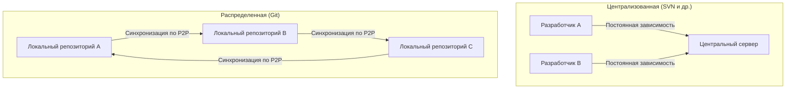
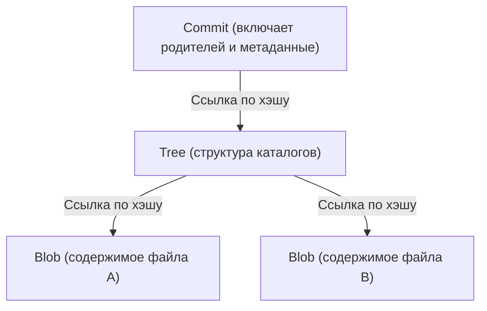

# Идеология Git (эстетика децентрализации)

В мире разработки программного обеспечения редко встречаются инструменты, которые бы так радикально изменили мышление и рабочий процесс разработчиков, как Git. Выходя за рамки простого «инструмента управления историей файлов», Git несет в себе мощную «философию». Это эстетика, опирающаяся на три столпа: децентрализацию (Decentralization), автономию (Autonomy) и криптографическое доверие (Cryptographic Trust).

В этой статье мы углубимся в архитектуру и рассмотрим, какие идеи Линус Торвальдс (Linus Torvalds), создатель ядра Linux, заложил в основу Git, как эта система покорила разработчиков по всему миру и сформировала фундамент современной культуры открытого исходного кода.

## 1. История создания: антитеза централизации

В 2005 году, когда появился Git, доминирующими системами контроля версий (VCS) были «централизованные» решения, такие как CVS и Subversion (SVN). В этой модели существует один огромный центральный сервер, к которому обращаются все разработчики для получения актуального кода и отправки (коммита) своих изменений.

Однако для масштабных проектов, таких как ядро Linux, где одновременно участвуют тысячи разработчиков со всего мира, централизованный подход стал фатальным узким местом. Необходимость постоянного подключения к серверу, наличие единой точки отказа (Single Point of Failure) и, самое главное, «тяжелые и медленные процессы создания веток и слияния».

Из-за сильного недовольства существующими системами Линус решил создать с нуля совершенно новую систему контроля версий. Смена парадигмы заключалась в принятии «распределенной (Distributed)» модели.

В Git полная копия репозитория находится на локальной машине каждого человека. Даже без подключения к сети можно искать по всей истории, создавать ветки и делать коммиты. Это был не просто прирост производительности, а идеологический сдвиг, наделивший каждого разработчика «полным суверенитетом».

## 2. Эстетика графа коммитов: DAG (направленный ациклический граф)

Самой важной концепцией для понимания внутренней структуры Git является «DAG» (Directed Acyclic Graph — направленный ациклический граф). Git не управляет историей как простым «набором патчей (разниц)», а строит взаимосвязи между снимками (снапшотами) в виде DAG.

Каждый коммит имеет указатель (дерево) на полный снимок проекта в данный момент времени и один или несколько указателей на «родительские коммиты». С помощью этой простой цепочки структур данных Git представляет сложную историю ветвлений и слияний как математически непротиворечивый граф.

Красота этого подхода заключается в том, что история естественно отображается не как «одна прямая линия», а как «несколько параллельно развивающихся временных линий». Разработчики могут свободно разделять историю, экспериментировать, отказываться от неудачных веток и вливать успешные изменения в основной поток. История становится не просто записью прошлого, а «траекторией мыслей» самих разработчиков.

## 3. Ветка как «легковесная площадка для экспериментов»

В SVN создание ветки означало копирование каталога, что было тяжелой операцией, потребляющей время и дисковое пространство. Поэтому создание ветки было особым событием, сопровождающимся высоким психологическим барьером.

В Git ветка — это просто «динамический указатель на определенный коммит» (файл с 40-символьным хэшем). Затраты на создание ветки в буквальном смысле близки к нулю.

Дизайн «дешевых веток» (Cheap Branches) трансформировал саму методологию разработки. Появились такие концепции, как ветки для фич (feature branches) и тематические ветки (topic branches), укоренилась практика: «каким бы незначительным ни было изменение, сначала создай ветку и поэкспериментируй». Это дало разработчикам «свободу пробовать и ошибаться без страха».

## 4. Криптографическое доверие: SHA-1 и контентная адресация

В децентрализованной системе самой большой проблемой является обеспечение «целостности данных» (Integrity). Как в среде, где каждый может изменять репозиторий и обмениваться кодом, доказать, что код не был подделан и история подлинна?

Git элегантно решил эту проблему с помощью «файловой системы с контентной адресацией» (Content-Addressable Filesystem). Все объекты в Git (коммиты, деревья и содержимое файлов — BLOB-объекты) идентифицируются и сохраняются по значению хэша SHA-1 (40 шестнадцатеричных символов), вычисленному на основе их содержимого.

Если содержимое файла изменится хотя бы на 1 байт, изменится его хэш, затем изменится хэш дерева, содержащего этот файл, и, как следствие, изменится хэш коммита. Другими словами, тайная подделка части истории криптографически невозможна.

При проектировании Git Линус Торвальдс проявил твердую волю: «абсолютно не допускать уничтожения или фальсификации данных». Хэш-модель Git воплощает собой высшую форму децентрализации, сродни блокчейну, в которой доверие заложено в самих данных, а не в центральном авторитете (сервере).

## 5. Слияние и диалог: программирование как социальный процесс

Истинная сила Git кроется в «слиянии» (Merge), объединяющем разветвленную историю. При распределенной разработке часто случается так, что несколько разработчиков одновременно редактируют один и тот же файл, что приводит к жестким конфликтам.

Хотя алгоритм слияния в Git очень хорош, все равно возникают конфликты, которые нельзя разрешить автоматически. Однако в идеологии Git конфликт — это не «ошибка», а функция, указывающая на «необходимость диалога между разработчиками».

Чей код принять или написать новую логику, объединяющую оба варианта? Разрешение конфликта слияния становится социальным процессом согласования «намерений», стоящих за кодом. Git предоставляет идеальную песочницу для безопасного выполнения этого процесса локально.

## 6. Демократизация культуры открытого исходного кода и подъем GitHub

Децентрализованная идеология Git в корне изменила подход к разработке ПО с открытым исходным кодом. В прошлом существовала четкая иерархия: немногочисленная привилегированная группа (core committers), имеющая права на коммит в центральный репозиторий, и рядовые разработчики, отправлявшие патчи через списки рассылки.

В мире Git у каждого есть «полный клон» основного репозитория, и в своей локальной среде каждый является «абсолютным монархом». После внесения изменений вы просите основной проект «принять мои изменения (Pull Request)». Благодаря этой концепции (которая не встроена в сам Git, но была создана GitHub поверх распределенной модели Git), вклад в код стал кардинально демократизированным.

Если код качественный, он будет объединен независимо от того, кто его написал. Плоская архитектура Git способствовала формированию открытого и свободного сообщества разработчиков, основанного на меритократии.

## 7. Заключение: чему нас учит Git

Git — это не просто инструмент. Это программное воплощение понятий «свобода» и «ответственность».

Это независимость от центрального сервера и обладание полной историей и суверенитетом в своих руках. Это ветвление (создание веток) без страха неудач и экспериментирование. А также обмен результатами с другими и сплетение истории через диалог (слияние).

Эстетика децентрализации заключается не в зависимости от конкретного авторитета, а в построении «сети доверия», основанной на индивидуальной автономии и криптографической проверяемости. За командами `git commit` и `git push`, которые мы каждый день машинально набираем, скрывается грандиозная философия, стремящаяся сделать разработку программного обеспечения свободной и демократичной.
