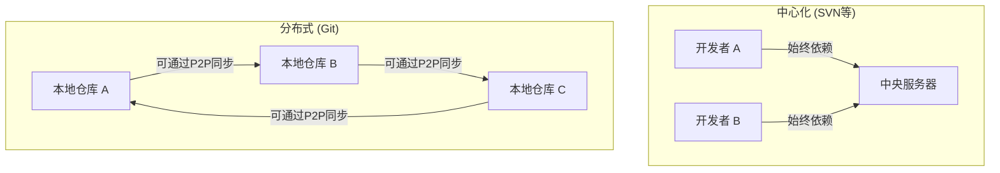
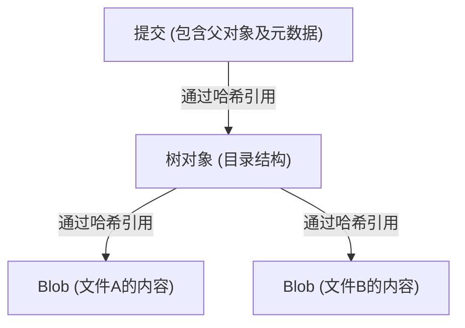

# Git的思想（去中心化的美学）

在软件开发的世界里，很少有工具能像Git这样从根本上改变开发者的思维和工作流。超越了单纯的“文件历史管理工具”这一范畴，Git在其底层拥有着强大的“哲学”。这是一种由去中心化（Decentralization）、自治（Autonomy）和密码学信任（Cryptographic Trust）三大支柱所支撑的美学。

本文将从架构的角度深入剖析Linux内核创始人林纳斯·托瓦兹（Linus Torvalds）是在何种思想下创造了Git，以及它究竟如何吸引了全世界的开发者，并奠定了当今开源文化的基石。

## 1. 诞生的背景：对中心化的反叛

在Git诞生的2005年，版本控制系统（VCS）的主流是CVS和Subversion（SVN）等“中心化”系统。在这些模型中，存在一个巨大的中央服务器，所有开发者都需要访问它以获取最新代码，并将自己的修改发送（提交）到服务器上。

然而，在像Linux内核这样有全球数千人同时参与开发的巨大项目中，中心化模型暴露出了致命的瓶颈。它必须保持与服务器的连接、存在单点故障（Single Point of Failure），以及最重要的一点——“创建分支和合并的过程极其繁重且缓慢”。

由于对现有系统的强烈不满，林纳斯决定亲自构建一个全新的版本控制系统。他所采用的，便是“分布式（Distributed）”这一范式转移。

在Git中，每个人的本地机器上都存在一个“完整的仓库副本”。即使没有网络连接，开发者也能检索所有的历史记录、创建分支并进行提交。这不仅仅是性能的提升，更是一种赋予每个开发者“完全主权”的思想转变。

## 2. 提交图的美学：DAG（有向无环图）

要理解Git的内部结构，最重要的概念就是“DAG（Directed Acyclic Graph：有向无环图）”。Git并不只是将历史作为单纯的“补丁序列（差异）”来管理，而是将快照之间的关系构建为DAG。

每个提交都持有一个指向该时刻整个项目快照的指针（树对象），以及一个或多个指向“父提交”的指针。通过这种简单数据结构的链接，Git在数学上以无矛盾的图表达了复杂的分支分化和合并历史。

这种方法的美妙之处在于，历史被自然地表现为“并行发展的多条时间线”，而不是“一条直线”。开发者可以自由地分化历史、进行实验，如果失败了就可以丢弃该分支，如果成功了则将其合并入主干。历史不再只是过去的记录，而是开发者“思考轨迹”的真实写照。

## 3. 分支：作为“轻量级实验场”

在SVN中，创建分支意味着复制目录，这是一个消耗时间和磁盘空间的繁重操作。因此，拉取分支是一件特殊的事情，心理门槛很高。

但在Git中，分支只不过是“指向特定提交的动态指针（文件内40个字符的哈希值）”。创建分支的成本可以说几乎为零。

这种“廉价分支（Cheap Branches）”的设计改变了开发方法本身。由此诞生了特性分支（Feature Branch）、主题分支（Topic Branch）等概念，“无论多么微小的修改，都要先切出一个分支来实验”成为了固定的最佳实践。这赋予了开发者“不怕失败，勇于试错的自由”。

## 4. 密码学信任：SHA-1与内容寻址方式

在去中心化的系统中，最大的挑战在于如何确保“数据的完整性（Integrity）”。在一个人人都可以修改仓库、互相交换代码的环境中，如何证明代码没有被篡改、历史是合理的呢？

Git通过“内容寻址文件系统（Content-Addressable Filesystem）”优雅地解决了这个问题。Git中的所有对象（提交、树、作为文件内容的BLOB）都是由基于其内容计算出的SHA-1哈希值（40个字符的十六进制数）来标识和保存的。

哪怕文件内容改变了1个字节，该文件的哈希值就会改变，包含它的树对象的哈希值也会随之改变，最终导致提交的哈希值发生改变。换言之，想要暗中篡改一部分历史记录，在密码学上是不可能的。

林纳斯·托瓦兹在设计Git时，怀揣着“绝不允许数据破坏或篡改”的坚定意志。Git的哈希模型不依赖中央权威（服务器），而是将信任内在化于数据本身，这体现了与区块链一脉相承的去中心化的终极形态。

## 5. 合并与对话：作为社会过程的编程

Git的真正精髓在于整合分化历史的“合并（Merge）”。在分布式开发中，多名开发者同时编辑同一个文件并引发激烈冲突（Conflict），这是家常便饭。

尽管Git的合并算法非常优秀，但仍会发生机器无法解决的冲突。然而在Git的思想中，冲突并非“错误”，而是明确提示“需要开发者之间进行对话的关键点”的功能。

采用谁的代码？或者编写结合两者的新逻辑？解决合并冲突，成为了就代码背后的“意图”达成共识的社会过程。Git为此提供了一个能在本地安全进行这一过程的完美沙盒。

## 6. 开源文化的民主化与GitHub的崛起

Git的去中心化思想从根本上改变了开源开发的模式。在以往的开源开发中，存在着明确的等级制度：少数拥有向中央仓库“提交权限”的特权阶级（核心提交者），以及通过邮件列表发送补丁的普通开发者。

但在Git的世界里，每个人都拥有官方仓库的“完整克隆”，在自己的本地，自己就是“专制君主”。在进行修改后，再向官方请求“请合并我的修改（Pull Request）”。借助Pull Request这一概念（它本身并非内置于Git，而是GitHub在Git的分布式模型上构建的概念），代码贡献被极大地民主化了。

只要代码质量过关，无论是由谁编写的都会被合并。Git架构所具有的扁平化特质，推动了一个基于实力主义的、开放且自由的开发社区的形成。

## 7. 结论：Git带给我们的启示

Git不仅仅是一个工具，它更是关于“自由”与“责任”的软件学表达。

不依赖中央服务器，在自己的手中掌握完整的历史与主权。不惧失败地分化（分支）、试错。然后将这些成果与他人分享，通过对话将历史编织在一起（合并）。

去中心化的美学在于，不依赖特定的权威，而是基于个体的自治性和密码学的可验证性，构建起一个“信任网络”。在我们每天不假思索地敲下的 `git commit` 和 `git push` 命令背后，正呼吸着试图让软件开发变得自由且民主的宏大哲学。
