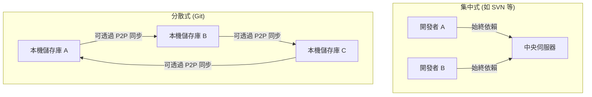
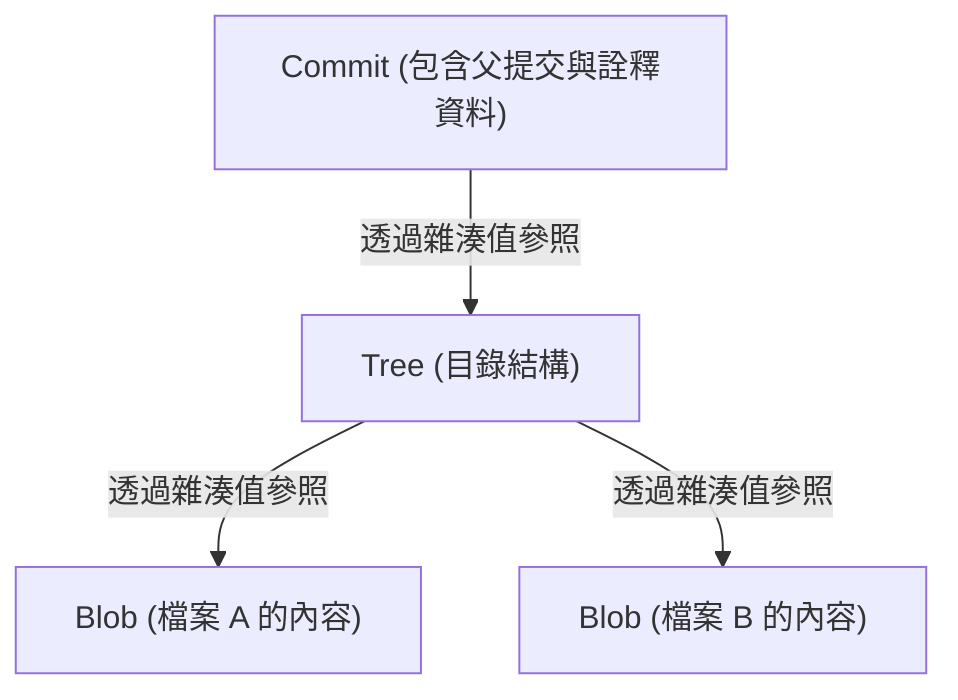

# Git 的思想（去中心化的美學）

在軟體開發的世界裡，很少有工具能像 Git 這樣，從根本上改變開發者的思考與工作流程。Git 超越了單純「管理檔案歷史的工具」的框架，其根基蘊含著強大的「哲學」。那是由去中心化（Decentralization）、自主性（Autonomy）以及密碼學信任（Cryptographic Trust）這三大支柱所支撐的美學。

本文將從架構的觀點深入探討，Linux 核心之父林納斯·托瓦茲（Linus Torvalds）是基於何種思想創造出 Git，以及它是如何吸引全世界的開發者，進而形成今日開源文化基礎的。

## 1. 誕生的背景：對中心化的反叛

在 Git 誕生的 2005 年，版本控制系統（VCS）的主流是如 CVS 或 Subversion（SVN）這類的「集中式」。這是一種存在單一巨大中央伺服器，所有開發者都需要存取該伺服器以取得最新程式碼，並將自己的變更傳送（提交）到伺服器的模型。

然而，在像 Linux 核心這樣有全球數千人同時參與開發的巨大專案中，集中式系統卻有著致命的瓶頸。這包括必須連線至伺服器、存在單點故障（Single Point of Failure），以及最重要的一點——「建立與合併分支的過程既繁重又緩慢」。

出於對現有系統的強烈不滿，林納斯決心親手打造一個全新的版本控制系統。為此他所採用的，正是名為「分散式（Distributed）」的典範轉移。

在 Git 中，每個人的本機電腦上都存在著「完整的儲存庫副本」。即使沒有連上網路，也能夠搜尋過去所有的歷史紀錄、建立分支以及進行提交。這不僅僅是效能的提升，更是賦予每一位開發者「完整主權」的思想轉變。

## 2. 提交圖的美學：DAG（有向無環圖）

要理解 Git 的內部結構，最重要的概念就是「DAG（Directed Acyclic Graph：有向無環圖）」。Git 並非將歷史紀錄當作單純的「連續修補程式（差異）」來管理，而是將快照之間的關聯性建構成為 DAG。

每個提交都擁有一指向當時專案整體快照的指標（Tree），以及一個或多個指向「父提交」的指標。透過這個簡單資料結構的連鎖，Git 得以將複雜的分支分岔與合併歷史，表現為數學上毫無矛盾的圖形。

這種做法的美妙之處在於，歷史紀錄不是「一條直線」，而是被自然地表現為「並行發展的多條時間線」。開發者可以自由地讓歷史分岔並進行實驗，若失敗便可捨棄該分支，若成功則能將其合併回主幹。歷史紀錄不再只是單純的過去紀錄，而是開發者「思考軌跡」的化身。

## 3. 分支：一個「輕量級的實驗場」

在 SVN 中，建立分支意味著複製目錄，是一個會消耗時間與磁碟空間的繁重操作。因此，建立分支成了一項特殊的事件，帶來了很高的心理門檻。

然而在 Git 裡，分支只不過是「指向特定提交的動態指標（檔案內 40 個字元的雜湊值）」。建立分支的成本，字面意義上幾近於零。

這種「廉價分支（Cheap Branches）」的設計，徹底改變了開發方法本身。功能分支（Feature Branch）、主題分支（Topic Branch）等概念應運而生，並確立了「無論多小的變更，都先建立分支來進行實驗」的實踐慣例。這賦予了開發者「不畏失敗、自由嘗試錯誤」的權利。

## 4. 密碼學信任：SHA-1 與內容定址方式

在去中心化系統中，最大的課題是如何確保「資料的完整性（Integrity）」。在一個任何人都可以修改儲存庫並互相交換程式碼的環境裡，該如何證明程式碼未遭竄改、歷史紀錄是正確的呢？

Git 透過「內容定址檔案系統（Content-Addressable Filesystem）」優雅地解決了這個問題。Git 內部的所有物件（提交、樹狀物件、以及作為檔案內容的 BLOB），都是藉由基於其內容計算出來的 SHA-1 雜湊值（40 個字元的十六進位數字）來識別與儲存。

只要檔案內容改變了哪怕 1 個位元組，該檔案的雜湊值就會改變，包含它的 Tree 的雜湊值也會改變，進而導致 Commit 的雜湊值發生改變。也就是說，要在暗中竄改部分歷史紀錄，在密碼學上是不可能的。

林納斯·托瓦茲在設計 Git 時，抱持著「絕對不允許資料遭受破壞或竄改」的強烈意志。Git 的雜湊模型不依賴中央權威（伺服器），而是將信任內建於資料本身之中，這體現了與[區塊鏈](/zh-tw/p/blockchain-technology-smart-contract-distributed-ledger/)相通的去中心化的終極型態。

## 5. 合併與對話：作為社會化過程的程式設計

Git 的精髓在於整合已分岔歷史的「合併（Merge）」。在分散式開發中，多名開發者同時編輯同一個檔案，並產生激烈衝突（Conflict）是家常便飯。

Git 的合併演算法非常優秀，但仍會發生無法透過機器解決的衝突。然而，在 Git 的思想中，衝突並非「錯誤」，而是用以明示「開發者之間需要進行對話的節點」的功能。

要採用誰的程式碼，或者是否要編寫能活用兩者的新邏輯？解決合併衝突，是一個磨合隱藏在程式碼背後「意圖」的社會化過程。Git 為此提供了一個完整的沙盒，讓這個過程可以在本機安全地進行。

## 6. 開源文化的民主化與 GitHub 的崛起

Git 去中心化的思想，從根本上改變了開源開發的樣貌。在過去的開源開發中，存在著明確的階級制度：擁有向中央儲存庫「提交權限」的少數特權階級（核心提交者），以及透過郵件列表發送修補程式的一般開發者。

但在 Git 的世界裡，每個人都擁有官方儲存庫的「完整複製（Clone）」，在自己的本機端，自己就是「專制君主」。在加入變更後，再向官方提出「請採納我的變更（Pull Request）」的請求。透過這個 Pull Request 的概念（雖然未內建於 Git 本身，但卻是 GitHub 建立在 Git 分散式模型之上的概念），程式碼貢獻被戲劇性地民主化了。

只要程式碼的品質夠好，無論是誰寫的都會被合併。Git 架構所具備的扁平化特性，推動了基於實力主義、開放且自由的開發社群的形成。

## 7. 結論：Git 告訴我們的事

Git 不只是一個工具。它是關於「自由」與「責任」的軟體表現形式。

不依賴中央伺服器，在自己的手邊擁有完整的歷史與主權。不畏失敗地進行分岔（分支），並不斷嘗試錯誤。接著，將結果與他人分享，透過對話將歷史編織在一起（合併）。

去中心化的美學，並非依賴特定的權威，而是建構一個基於個體自主性與密碼學可驗證性的「信任網路」。在我們每天不經意輸入的 `git commit` 或 `git push` 等指令背後，正呼吸著試圖讓軟體開發變得自由且民主的宏大哲學。
