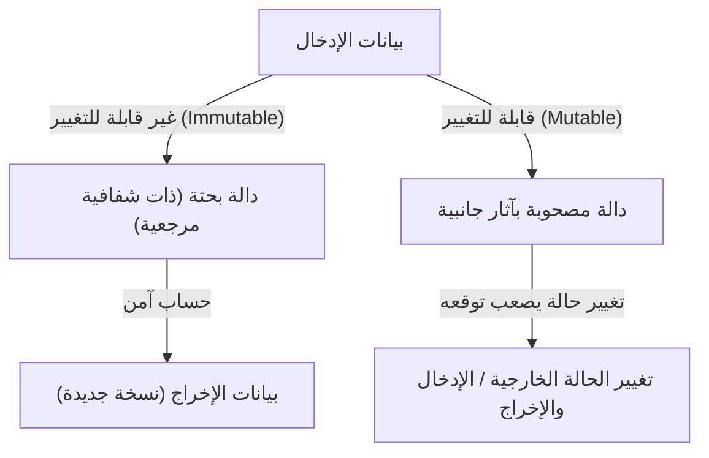
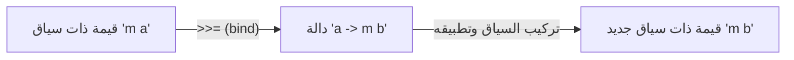

# مقدمة: لماذا هاسكل؟

توجد العديد من النماذج في لغات البرمجة. الحتمية (Imperative)، الكائنية التوجه (Object-Oriented)، الإجرائية (Procedural)، والوظيفية (Functional). من بينها، تبرز لغة هاسكل (Haskell)، والتي تُعرف باسم "اللغة الوظيفية البحتة" (Purely Functional Language)، بحضور فريد. بالنسبة للعديد من المبرمجين، غالباً ما يُنظر إلى هاسكل على أنها "أكاديمية للغاية"، "غير عملية"، أو أن "الموناد صعبة جداً". ومع ذلك، فإن فلسفة البرمجة التي تقدمها هاسكل مليئة بالتلميحات القوية لتحسين جودة الكود الذي نكتبه يومياً (مثل JavaScript و Python و Rust و Go وغيرها) من الأساس.

في هذا المقال، سنبدأ من الفلسفة الكامنة وراء لغة هاسكل، وسنتعمق بشرح مفصل جداً بدءاً من الدوال البحتة، وإدارة الآثار الجانبية، وصولاً إلى عالم "الموناد" (Monad) الذي يُحبط العديد من المتعلمين. بحلول الوقت الذي تنتهي فيه من قراءة هذا المقال، ستتمكن من فهم أن الموناد ليس مجرد مفهوم رياضي صعب، بل هو نمط تصميم أنيق في البرمجة.

## 1. نموذج البرمجة الوظيفية البحتة

الفكرة الأساسية الكامنة وراء البرمجة الوظيفية هي "التعامل مع الحسابات كتقييم للدوال الرياضية". خاصة في لغة وظيفية "بحتة" مثل هاسكل، يتم اتباع هذه القاعدة بصرامة شديدة.

### الشفافية المرجعية (Referential Transparency)

واحدة من أهم ميزات اللغات الوظيفية البحتة هي "الشفافية المرجعية". يشير هذا إلى الخاصية التي تضمن أن استبدال أي تعبير في البرنامج بنتيجة تقييمه لن يغير سلوك البرنامج ككل.

على سبيل المثال، لنفترض أن لدينا دالة `f(x) = x + 1`. دالة `f(2)` ستُرجع دائماً `3`. سواء تم تشغيلها اليوم أو غداً أو في الجانب الآخر من الأرض، فإن النتيجة ستكون دائماً `3`. بفضل هذه الخاصية "نفس المدخلات تُرجع دائماً نفس المخرجات"، يمكن للمبرمجين توقع سلوك الكود دون القلق بشأن الحالة الداخلية للدالة أو البيئة الخارجية.

### عدم القابلية للتغيير (Immutability)

في اللغات الوظيفية البحتة، لا يمكن تغيير قيمة المتغير بمجرد تعريفه (عدم القابلية للتغيير). لا يوجد تعيين إتلافي (Destructive Assignment) مثل `x = x + 1` المألوف في لغات مثل C أو Java. بدلاً من تغيير الحالة، تُرجع البيانات التي تحتوي على الحالة الجديدة المُعدلة. نتيجة لذلك، لا تحدث أبداً أخطاء معقدة هيكلياً مثل حالات التسابق (Race Condition) في البيئات متعددة الخيوط (Multi-threaded).

## 2. كيف نتعامل مع "شر" الآثار الجانبية

لكي يكون البرنامج مفيداً في العالم الحقيقي، يجب أن يعرض نصاً على الشاشة، أو يكتب في ملف، أو يقوم باتصالات شبكية. كل هذه تُسمى "آثار جانبية" (Side Effects). الآثار الجانبية تدمر الشفافية المرجعية. لأن دوالاً مثل "دالة جلب الوقت الحالي" أو "دالة قراءة محتويات ملف" قد تُغير نتائجها في كل مرة يتم تنفيذها.

لا تحظر هاسكل الآثار الجانبية تماماً. لو فعلت ذلك، ستكون البرامج بلا معنى سوى تسخين وحدة المعالجة المركزية (CPU). نهج هاسكل هو "عزل الآثار الجانبية". فهي تفصل بشكل واضح بين عالم الحسابات البحتة والعالم غير النقي المصحوب بآثار جانبية، وذلك باستخدام نظام الأنواع (Type System).

هنا يظهر أخيراً مفهوم "الموناد".

## 3. الطريق إلى الموناد: المُطَبِّقات (Functor) والـ (Applicative)

لفهم الموناد، فإن أقصر طريق هو البدء من المفاهيم التأسيسية وهي "Functor" و "Applicative".

### القيم ذات السياق (Context)

أثناء البرمجة، غالباً ما نتعامل مع "قيمة ذات سياق معين" بدلاً من "القيمة" نفسها.
- سياق "قد لا توجد قيمة" (Maybe / Optional)
- سياق "ربما حدث خطأ" (Either / Result)
- سياق "يمتلك قيماً متعددة" (List)
- سياق "لم يتم حسابه بعد (غير متزامن)" (Promise / Future)

### (Functor): التعامل مع القيم داخل السياق

إن الـ Functor هو آلية لتطبيق دالة على هذه "القيم ذات السياق" مع الحفاظ على السياق نفسه. في هاسكل، يتم تعريفه كدالة تُسمى `fmap` (وعاملها هو `<$>` ).

على سبيل المثال، لنفترض أن لدينا `5` داخل صندوق يعني "قد تكون هناك قيمة (Maybe)" (أي `Just 5`). إذا أردنا تطبيق الدالة `(* 2)` عليها، فإن الـ Functor يُلخص عملية فتح الصندوق، وإجراء الحساب، ثم إعادته إلى الصندوق.

`fmap (* 2) (Just 5)` ستصبح `Just 10`.
`fmap (* 2) Nothing` ستبقى `Nothing`.

### (Applicative): تطبيق دالة داخل السياق على قيمة داخل السياق

الـ Applicative هو نسخة أكثر قوة من الـ Functor. إذا كانت الدالة نفسها موجودة داخل سياق (صندوق)، فيمكن تطبيقها على قيمة موجودة داخل صندوق آخر (العامل `<*>` ). هذا يجعل من السهل التعامل مع الدوال التي تأخذ معاملات متعددة داخل السياقات.

## 4. مرحباً بك في عالم الموناد (Monad)

أخيراً يظهر الموناد. الموناد هو مفهوم مشتق من "نظرية الفئات" (Category Theory) في الرياضيات، ولكن في مجال البرمجة، فإن الفهم العملي الأفضل له هو أنه "نمط تصميم لربط (تسلسل) الحسابات التي تمتلك سياقاً".

بالإضافة إلى الحسابات التي يمكن التعامل معها بواسطة Functor أو Applicative، يمتلك الموناد قدرة قوية على "تحديد الحساب التالي (دالة تُرجع سياقاً جديداً) بناءً على نتيجة الحساب السابق (قيمة داخل السياق)".

### عامل الربط `>>=` (bind)

جوهر الموناد هو عامل يُسمى `>>=` (bind). يمتلك هذا العامل النوع التالي (كتعبير مُبسط):

`m a -> (a -> m b) -> m b`

1. `m a` : قيمة `a` تمتلك سياقاً `m` (مثال: `Just 5`)
2. `(a -> m b)` : دالة تأخذ قيمة عادية `a` وتُرجع قيمة `b` تمتلك سياقاً `m`
3. كنتيجة، يتم إرجاع قيمة `m b` تمتلك سياقاً جديداً

بفضل هذه الآلية، على سبيل المثال، يمكننا ربط سلسلة من العمليات مثل "البحث عن مستخدم في قاعدة البيانات، وإذا تم العثور عليه جلب ملفه الشخصي، وإذا وُجد جلب رابط صورته" (حيث يمكن لأي منها أن يفشل = أي تُرجع `Nothing`)، بشكل أنيق دون الحاجة لكتابة كود لمعالجة الأخطاء (سلسلة من التحققات لـ null باستخدام جمل if).

## 5. أمثلة عملية للموناد وفائدتها

دعونا نلقي نظرة على بعض المونادات الشائعة في هاسكل. جميعها تتشارك نفس الواجهة `>>=` ، ولكن كل منها يقدم "سياقاً" مختلفاً.

### موناد Maybe: حسابات قد تفشل
إذا حدث فشل (`Nothing`) أثناء الحساب، سيتم تخطي الحسابات اللاحقة وتصبح النتيجة النهائية `Nothing`. يعمل بشكل مشابه لعامل التحقق من الـ null الشرطي (`?.`) في لغات أخرى.

### موناد Either: فشل مع سبب الخطأ
يشبه Maybe، ولكن عند الفشل، يمكنه حمل معلومات إضافية (`Left`) مثل رسالة خطأ أو كود خطأ. يعمل كبديل لمعالجة الاستثناءات.

### موناد State: حسابات مصحوبة بحالة
إنه موناد لمحاكاة "تغيير الحالة" في اللغات الوظيفية البحتة. يقوم بإخفاء وتمرير الحالة (State) خلال سلسلة من الحسابات، مما يسمح بكتابة كود كما لو كنت تستخدم متغيرات قابلة للتغيير.

### موناد IO: عزل الآثار الجانبية
الموناد الأهم والذي يجعل من هاسكل لغة عملية. يقوم بعزل الأثر الجانبي لـ "التفاعل مع العالم الخارجي" في صندوق يُسمى "موناد IO". يتم التعبير عن برنامج هاسكل بأكمله كعملية IO ضخمة واحدة، وتظل جميع الدوال بحتة حتى تقوم بيئة التشغيل بتنفيذ عمل IO في النهاية.

## 6. فلسفة البرمجة: نظرية الفئات والحساب

هناك مقولة شهيرة (وتُربك المبتدئين) تقول إن الموناد هو "مجرد كائن مونويد في فئة المفاعيل الذاتية" (A monad is just a monoid in the category of endofunctors) في نظرية الفئات، ولكن بالنسبة لمهندسي البرمجيات، فإن الأهم من الصرامة الرياضية هو "قوة التجريد" التي يجلبها.

من خلال وجود واجهة مشتركة (Type Class) تُسمى الموناد، يمكننا التعامل مع مفاهيم مختلفة تماماً مثل "الفشل"، "الحالة"، "عدم التزامن"، "الإدخال والإخراج"، و "اللاحتمية (القوائم)" باستخدام نفس العامل تماماً (`>>=`) ونفس الصيغة (نحو `do`). هذه قفزة مذهلة في القدرة التعبيرية.

## الخلاصة: ما الذي تُعلمنا إياه هاسكل

قد يبدو عالم موناد هاسكل كمنحدر شديد الانحدار في البداية. ولكن بمجرد الوصول إلى قمته والنظر إلى المناظر الطبيعية من خلال الموناد، ستتغير وجهة نظرك تجاه البرمجة من الأساس.

كيفية إدارة الآثار الجانبية، كيفية تجريد الحالة، كيفية توسيع نطاق تركيب الدوال. هذه الحلول التي يقدمها نموذج هاسكل الوظيفي البحت استمرت في التأثير بشكل كبير على اللغات السائدة الحديثة، مثل نوع `Result` و `Option` في لغة Rust، ومفهومي `Promise` و `async/await` في JavaScript.

إن تعلم هاسكل ليس مجرد حفظ قواعد نحوية جديدة، بل هو رحلة لاكتساب "نموذج ذهني" جديد لعملية الحساب نفسها.
