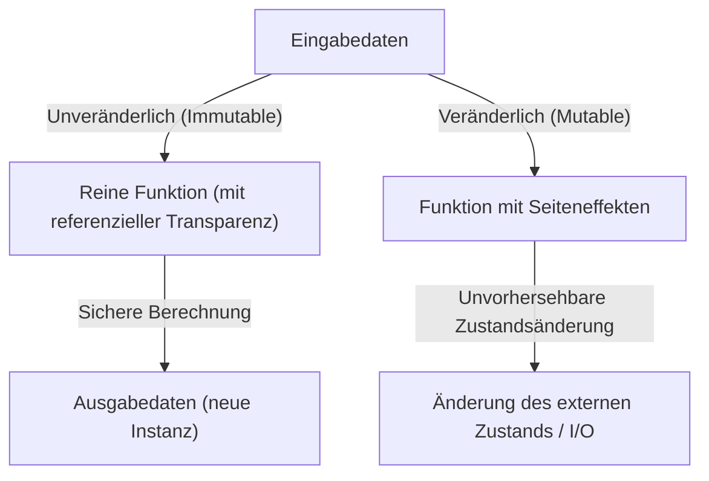
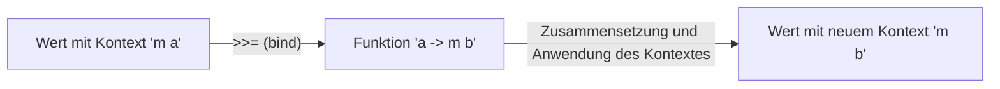

# Einführung: Warum Haskell?

Es gibt viele Paradigmen in Programmiersprachen: imperativ, objektorientiert, prozedural und funktional. Unter ihnen nimmt Haskell, bekannt als eine "rein funktionale Sprache (Purely Functional Language)", eine einzigartige Stellung ein. Für viele Programmierer hat Haskell das Image, "zu akademisch", "nicht praktisch" oder "Monaden sind zu schwer" zu sein. Allerdings ist die Philosophie, die Haskell bietet, voller mächtiger Hinweise, um die Qualität des Codes, den wir täglich schreiben (JavaScript, Python, Rust, Go usw.), grundlegend zu verbessern.

In diesem Artikel beginnen wir mit der Philosophie, die der Sprache Haskell zugrunde liegt, und gehen detailliert und tiefgreifend auf reine Funktionen, das Management von Seiteneffekten und die Welt der "Monaden (Monad)" ein, an der viele Lernende scheitern. Wenn Sie diesen Artikel zu Ende gelesen haben, werden Sie verstehen, dass Monaden nicht nur ein schwieriges mathematisches Konzept, sondern ein elegantes Entwurfsmuster in der Programmierung sind.

## 1. Das Paradigma der rein funktionalen Programmierung

Die Grundlage der funktionalen Programmierung ist die Idee, "Berechnungen als die Auswertung mathematischer Funktionen zu behandeln". Besonders in "reinen" funktionalen Sprachen wie Haskell wird diese Regel äußerst strikt eingehalten.

### Referenzielle Transparenz (Referential Transparency)

Eines der wichtigsten Merkmale rein funktionaler Sprachen ist die "Referenzielle Transparenz". Dies bezieht sich auf die Eigenschaft, dass das Ersetzen eines beliebigen Ausdrucks im Programm durch sein Auswertungsergebnis das Verhalten des gesamten Programms nicht verändert.

Angenommen, wir haben eine Funktion `f(x) = x + 1`. `f(2)` gibt immer `3` zurück. Ob Sie es heute ausführen, morgen oder auf der anderen Seite der Erde, das Ergebnis ist immer `3`. Aufgrund dieser Eigenschaft, "für dieselbe Eingabe immer dieselbe Ausgabe zurückzugeben", können Programmierer das Verhalten des Codes vorhersagen, ohne sich über den internen Zustand der Funktion oder die äußere Umgebung Sorgen machen zu müssen.

### Unveränderlichkeit (Immutability)

In rein funktionalen Sprachen können die Werte einmal definierter Variablen nicht mehr geändert werden (Unveränderlichkeit). Es gibt keine destruktiven Zuweisungen wie `x = x + 1`, die uns aus C oder Java vertraut sind. Anstatt den Zustand zu ändern, geben sie Daten mit dem neuen, geänderten Zustand zurück. Dadurch entstehen in Multithreading-Umgebungen strukturell keine komplexen Bugs wie Race Conditions (Wettlaufsituationen).

## 2. Wie man mit dem "Bösen" der Seiteneffekte umgeht

Damit ein Programm in der realen Welt nützlich ist, muss es Text auf dem Bildschirm anzeigen, in Dateien schreiben oder über ein Netzwerk kommunizieren. All dies wird als "Seiteneffekte (Side Effects)" bezeichnet. Seiteneffekte zerstören die referenzielle Transparenz. Das liegt daran, dass "eine Funktion, die die aktuelle Zeit abruft" oder "eine Funktion, die den Inhalt einer Datei liest", bei jeder Ausführung möglicherweise ein anderes Ergebnis liefert.

Haskell verbietet Seiteneffekte nicht vollständig. Wenn sie verboten wären, wäre ein Programm eine bedeutungslose Entität, die nur die CPU aufwärmt. Haskells Ansatz ist die "Isolierung von Seiteneffekten". Es trennt die Welt der reinen Berechnung klar von der unreinen Welt, die von Seiteneffekten begleitet wird, indem es das Typsystem verwendet.

Hier kommt schließlich das Konzept der "Monade" ins Spiel.

## 3. Der Weg zu Monaden: Funktoren (Functor) und Applikative (Applicative)

Um Monaden zu verstehen, ist es eine Abkürzung, mit den zugrunde liegenden Konzepten von "Funktoren (Functor)" und "Applikativen (Applicative)" zu beginnen.

### Werte mit einem Kontext (Context)

Beim Programmieren gehen wir oft nicht mit "Werten" selbst um, sondern mit "Werten mit einem bestimmten Kontext".
- Der Kontext "Ein Wert könnte nicht existieren" (Maybe / Optional)
- Der Kontext "Ein Fehler könnte aufgetreten sein" (Either / Result)
- Der Kontext "Hat mehrere Werte" (List)
- Der Kontext "Noch nicht berechnet (asynchron)" (Promise / Future)

### Funktoren (Functor): Manipulieren von Werten in einem Kontext

Ein Funktor ist ein Mechanismus, um Funktionen auf diese "Werte mit Kontext" anzuwenden, während der Kontext beibehalten wird. In Haskell ist dies als die Funktion `fmap` (oder der Operator `<$>`) definiert.

Angenommen, Sie haben ein `5` in einer Box, die sagt "es könnte einen Wert geben (Maybe)" (`Just 5`). Wenn Sie die Funktion `(* 2)` darauf anwenden möchten, ist die Abstraktion des Prozesses, die Box zu öffnen, zu berechnen und sie wieder in die Box zu legen, ein Funktor.

`fmap (* 2) (Just 5)` wird zu `Just 10`.
`fmap (* 2) Nothing` bleibt `Nothing`.

### Applikative (Applicative): Anwenden von Funktionen in einem Kontext auf Werte in einem Kontext

Applicative ist ein noch mächtigerer Funktor. Wenn sich die Funktion selbst ebenfalls in einem Kontext (Box) befindet, kann sie auf einen Wert in einer anderen Box angewendet werden (Operator `<*>`). Dies macht es einfach, Funktionen, die mehrere Argumente annehmen, innerhalb eines Kontextes zu behandeln.

## 4. Willkommen in der Welt der Monaden (Monad)

Schließlich das Erscheinen der Monade. Die Monade ist ein Konzept aus der mathematischen "Kategorientheorie (Category Theory)", aber beim Programmieren ist es am praktischsten, sie als "Entwurfsmuster zur Verkettung (Chaining) von Berechnungen mit Kontext" zu verstehen.

Zusätzlich zu den von Functor und Applicative behandelten Berechnungen haben Monaden die mächtige Fähigkeit, "die nächste Berechnung (eine Funktion, die einen neuen Kontext zurückgibt) basierend auf dem Ergebnis der vorherigen Berechnung (dem Wert im Kontext) zu bestimmen".

### Der bind-Operator (`>>=`)

Der Kern einer Monade ist ein Operator namens `>>=` (bind). Dieser Operator hat den folgenden Typ (vereinfachte Darstellung):

`m a -> (a -> m b) -> m b`

1. `m a` : Ein Wert `a` mit dem Kontext `m` (z. B.: `Just 5`)
2. `(a -> m b)` : Eine Funktion, die einen normalen Wert `a` annimmt und einen Wert `b` mit dem Kontext `m` zurückgibt
3. Als Ergebnis wird ein Wert `m b` mit einem neuen Kontext zurückgegeben

Dank dieses Mechanismus ist es beispielsweise möglich, eine Reihe von Operationen elegant zu verketten (wie "Suche nach einem Benutzer aus der DB, wenn gefunden, rufe sein Profil ab, und wenn gefunden, rufe die Bild-URL ab"), die alle fehlschlagen können (die Möglichkeit, `Nothing` zurückzugeben), ohne den Fehlerbehandlungscode (eine Kette von Null-Prüfungen mit if-Anweisungen) schreiben zu müssen.

## 5. Konkrete Beispiele und Praktikabilität von Monaden

Lassen Sie uns einige der typischen Monaden in Haskell betrachten. Sie alle teilen sich dieselbe `>>=`-Schnittstelle, bieten aber jeweils einen anderen "Kontext".

### Maybe-Monade: Eine Berechnung, die fehlschlagen kann

Wenn während der Berechnung ein Fehler (`Nothing`) auftritt, werden nachfolgende Berechnungen übersprungen und das Endergebnis wird `Nothing`. Sie funktioniert ähnlich wie der Nullbedingungsoperator (`?.`) in anderen Sprachen.

### Either-Monade: Fehler mit einem Grund für das Scheitern

Ähnlich wie Maybe, kann aber im Fehlerfall zusätzliche Informationen (`Left`) wie Fehlermeldungen oder Fehlercodes mit sich führen. Es dient als Alternative zur Ausnahmebehandlung.

### State-Monade: Berechnungen, die einen Zustand beinhalten

Eine Monade zur Simulation von "Zustandsänderungen" in einer rein funktionalen Sprache. Sie ermöglicht es Ihnen, den Zustand (State) innerhalb einer Berechnungskette zu verbergen und weiterzugeben, sodass Sie Code schreiben können, als ob Sie veränderliche Variablen verwenden würden.

### IO-Monade: Isolierung von Seiteneffekten

Die wichtigste Monade, die Haskell zu einer praktischen Sprache macht. Sie schließt den Seiteneffekt der "Interaktion mit der Außenwelt" in eine Box namens "IO-Monade" ein. Das gesamte Haskell-Programm wird als eine riesige IO-Monade dargestellt, und alle Funktionen bleiben rein, bis die Laufzeitumgebung diese IO-Aktion am Ende ausführt.

## 6. Philosophie der Programmierung: Kategorientheorie und Berechnung

Es gibt ein berühmtes (und für Anfänger verwirrendes) Sprichwort, dass eine Monade nur ein Monoid in der Kategorie der Endofunktoren (A monad is just a monoid in the category of endofunctors) ist, aber für Software-Ingenieure ist das Wichtigste nicht ihre mathematische Strenge, sondern die "Macht der Abstraktion", die sie bringt.

Durch die Existenz einer gemeinsamen Schnittstelle (Typklasse) namens Monade können wir völlig unterschiedliche Konzepte wie "Fehler", "Zustand", "Asynchronität", "I/O" und "Nicht-Determinismus (Listen)" mit exakt demselben Operator (`>>=`) und derselben Syntax (`do`-Notation) behandeln. Dies ist ein erstaunlicher Sprung in der Ausdruckskraft.

## Fazit: Was Haskell uns lehrt

Die Welt von Haskells Monaden mag auf den ersten Blick wie eine steile Klippe aussehen. Wenn Sie jedoch den Gipfel erreicht haben und die Landschaft durch die Monaden betrachten, wird sich Ihre Sicht auf die Programmierung grundlegend ändern.

Wie man Seiteneffekte verwaltet, wie man Zustand abstrahiert und wie man Funktionskomposition skaliert. Diese vom Haskell- und dem rein funktionalen Paradigma vorgestellten Lösungen haben weiterhin einen tiefgreifenden Einfluss auf moderne Mainstream-Sprachen wie Rusts `Result`- und `Option`-Typen sowie JavaScripts `Promise` und `async/await`.

Haskell zu lernen bedeutet nicht nur, neue Grammatik auswendig zu lernen, sondern es ist eine Reise, um ein neues "mentales Modell" für den Akt des Berechnens selbst zu erwerben.
