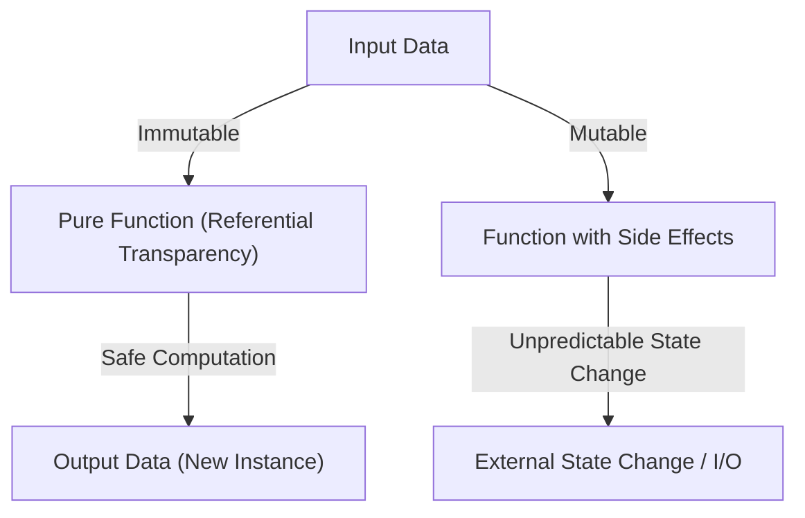
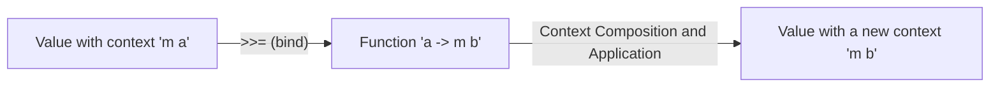

# Introduction: Why Haskell?

There are many programming paradigms: imperative, object-oriented, procedural, and functional. Among them, Haskell, a "Purely Functional Language," stands out with a unique presence. For many programmers, Haskell tends to have an image of being "too academic," "impractical," or "having monads that are too difficult." However, the programming philosophy presented by Haskell is full of powerful hints for fundamentally improving the quality of the code we write daily (JavaScript, Python, Rust, Go, etc.).

In this article, starting from the philosophy behind the language Haskell, we will explore in profound detail everything from pure functions and side-effect management to the world of "Monads," where many learners face frustration. By the time you finish reading this article, you will understand that monads are not merely difficult mathematical concepts, but rather elegant design patterns in programming.

## 1. The Paradigm of Purely Functional Programming

At the root of functional programming is the idea of "treating computation as the evaluation of mathematical functions." This rule is observed extremely strictly, especially in "pure" functional languages like Haskell.

### Referential Transparency

One of the most important features of pure functional languages is "referential transparency." This refers to the property that the overall behavior of a program does not change even if any expression in the program is replaced with its evaluated result.

For example, suppose we have a function `f(x) = x + 1`. `f(2)` will always return `3`. Whether you execute it today, tomorrow, or on the other side of the Earth, the result is always `3`. Because of this property of "always returning the same output for the same input," programmers can predict the behavior of the code without worrying about the internal state of the function or the external environment.

### Immutability

In pure functional languages, the value of a variable once defined cannot be changed (immutability). Destructive assignments like `x = x + 1`, which are familiar in C or Java, do not exist. Instead of mutating the state, you return data that holds the new, modified state. Because of this structurally, complex bugs like race conditions in multi-threaded environments simply do not occur.

## 2. How to Deal with the "Evil" of Side Effects

For a program to be useful in the real world, it needs to display text on a screen, write to files, or perform network communication. All of these are called "Side Effects." Side effects destroy referential transparency. This is because functions like "get current time" or "read file contents" can potentially return different results each time they are executed.

Haskell does not completely forbid side effects. If it did, programs would be meaningless entities that just warm up the CPU. Haskell's approach is the "isolation of side effects." It uses the type system to clearly separate the world of pure computation from the impure world involving side effects.

Here is where the concept of "Monad" finally makes its appearance.

## 3. The Path to Monads: Functor and Applicative

To understand monads, a shortcut is to start with their foundational concepts: "Functor" and "Applicative."

### Values with Context

When programming, we often handle not just "values" themselves but "values with some kind of context."
- The context that "a value might not exist" (Maybe / Optional)
- The context that "an error might have occurred" (Either / Result)
- The context of "having multiple values" (List)
- The context of "not computed yet (asynchronous)" (Promise / Future)

### Functor: Manipulating Values inside a Context

A Functor is a mechanism to apply a function to these "values with context" while preserving the context. In Haskell, it is defined as the function `fmap` (or as the operator `<$>`).

For example, suppose we have the value `5` inside a box that says "there might be a value (Maybe)" (`Just 5`). If you want to apply the function `(* 2)` to it, opening the box, computing, and putting it back in the box is the abstracted task of a Functor.

`fmap (* 2) (Just 5)` becomes `Just 10`.
`fmap (* 2) Nothing` remains `Nothing`.

### Applicative: Applying Functions in a Context to Values in a Context

Applicative makes Functors even more powerful. If the function itself is also in a context (box), it can be applied to a value in another box (using the `<*>` operator). This makes it easy to handle functions that take multiple arguments within a context.

## 4. Welcome to the World of Monads

Finally, the Monad appears. The monad is a concept originating from "Category Theory" in mathematics, but in programming, it is most practical to understand it as a "design pattern for chaining computations with context."

In addition to the computations handled by Functor and Applicative, a monad has the powerful ability to "determine the next computation (a function that returns a new context) based on the result of the previous computation (a value inside a context)."

### The bind Operator (`>>=`)

The core of a monad is an operator called `>>=` (bind). This operator has the following type signature (simplified):

`m a -> (a -> m b) -> m b`

1. `m a` : A value `a` with context `m` (e.g., `Just 5`)
2. `(a -> m b)` : A function that takes a regular value `a` and returns a value `b` with context `m`
3. As a result, a value `m b` with a new context is returned

With this mechanism, a series of operations like "Search for a user from the DB, if found fetch their profile, if found fetch their image URL" (where any can fail = potentially returning `Nothing`), can be beautifully connected without writing error-handling code (chains of null checks using if statements).

## 5. Concrete Examples and Practicality of Monads

Let's look at some representative monads in Haskell. They all share the same `>>=` interface but provide different "contexts".

### Maybe Monad: Computations that Might Fail
If a failure (`Nothing`) occurs during the computation, subsequent computations are skipped, and the final result is `Nothing`. It works similarly to the null-conditional operator (`?.`) in other languages.

### Either Monad: Failures with a Reason
Similar to Maybe, but it can carry additional information like error messages or error codes (`Left`) upon failure. It acts as an alternative to exception handling.

### State Monad: Computations with State
A monad for simulating "state changes" in a pure functional language. It allows you to write code as if you were using mutable variables by hiding and passing the State through the chain of computations.

### IO Monad: Isolation of Side Effects
The most important monad that makes Haskell a practical language. It encapsulates the side effects of "interacting with the outside world" into a box called the "IO Monad." The entire Haskell program is represented as one giant IO monad, and all functions remain pure until the runtime environment finally executes those IO actions.

## 6. The Philosophy of Programming: Category Theory and Computation

There is a famous (and beginner-confusing) quote saying that "A monad is just a monoid in the category of endofunctors," but for software engineers, what is important is not its mathematical rigor, but the "power of abstraction" it brings.

Because of the existence of the common interface (type class) called monad, we can handle completely different concepts such as "failure," "state," "asynchronous," "I/O," and "non-determinism (lists)" using exactly the same operator (`>>=`) and syntax (`do` notation). This is an astonishing leap in expressive power.

## Conclusion: What Haskell Teaches Us

The world of Haskell's monads might look like a steep cliff at first. However, once you reach the top and view the scenery through monads, your perspective on programming will change fundamentally.

How to manage side effects, how to abstract state, how to scale function composition. The solutions presented by Haskell and the pure functional paradigm continue to greatly influence modern mainstream languages, such as Rust's `Result` and `Option` types, and JavaScript's `Promise` and `async/await`.

Learning Haskell is not merely memorizing a new syntax; it is a journey to acquire a new "mental model" for the act of computation itself.
