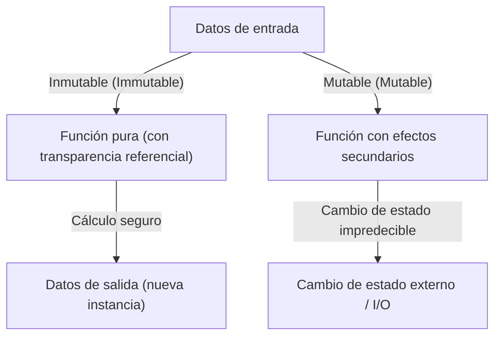
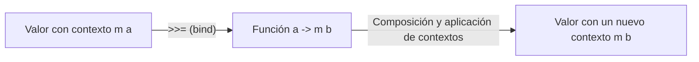

# Introducción: ¿Por qué Haskell?

Existen numerosos paradigmas en los lenguajes de programación: imperativo, orientado a objetos, procedimental y funcional. Entre ellos, Haskell, conocido como un "lenguaje puramente funcional" (Purely Functional Language), destaca por su presencia única. Muchos programadores suelen tener la imagen de que Haskell es "demasiado académico", "poco práctico" o que "las mónadas son demasiado difíciles". Sin embargo, la filosofía de programación que ofrece Haskell está llena de ideas poderosas para mejorar radicalmente la calidad del código que escribimos a diario (JavaScript, Python, Rust, Go, etc.).

En este artículo, partiremos de la filosofía detrás del lenguaje Haskell y explicaremos con gran detalle y profundidad las funciones puras, la gestión de efectos secundarios y el mundo de las "Mónadas" (Monads), donde muchos estudiantes se frustran. Para cuando termine de leer este artículo, comprenderá que las mónadas no son solo un concepto matemático difícil, sino un elegante patrón de diseño en programación.

## 1. El paradigma de la programación puramente funcional

En la base de la programación funcional está la idea de "tratar el cálculo como la evaluación de funciones matemáticas". Especialmente en lenguajes "puramente" funcionales como Haskell, esta regla se sigue muy estrictamente.

### Transparencia referencial (Referential Transparency)

Una de las características más importantes de los lenguajes puramente funcionales es la "transparencia referencial". Esto se refiere a la propiedad de que, incluso si se reemplaza cualquier expresión en el programa por el resultado de su evaluación, el comportamiento general del programa no cambia.

Por ejemplo, supongamos que tenemos una función `f(x) = x + 1`. `f(2)` siempre devolverá `3`. Ya sea que se ejecute hoy, mañana o en el otro lado del mundo, el resultado siempre será `3`. Esta propiedad de "devolver siempre la misma salida para la misma entrada" permite a los programadores predecir el comportamiento del código sin preocuparse por el estado interno de la función o el entorno externo.

### Inmutabilidad (Immutability)

En los lenguajes puramente funcionales, el valor de una variable, una vez definida, no puede cambiarse (inmutabilidad). No existen las asignaciones destructivas como `x = x + 1`, tan familiares en C o Java. En lugar de cambiar el estado, se devuelve un nuevo dato con el estado modificado. Esto evita estructuralmente errores complejos, como las condiciones de carrera (Race Conditions) en entornos multihilo.

## 2. Cómo lidiar con el "mal" de los efectos secundarios

Para que un programa sea útil en el mundo real, necesita mostrar texto en la pantalla, escribir en archivos o comunicarse por red. Todo esto se denomina "efectos secundarios" (Side Effects). Los efectos secundarios destruyen la transparencia referencial. Esto se debe a que una "función que obtiene la hora actual" o una "función que lee el contenido de un archivo" puede cambiar de resultado cada vez que se ejecuta.

Haskell no prohíbe completamente los efectos secundarios. Si lo hiciera, los programas no serían más que existencias sin sentido que solo calientan la CPU. El enfoque de Haskell es el "aislamiento de los efectos secundarios". Utiliza el sistema de tipos para separar claramente el mundo de los cálculos puros del mundo impuro que involucra efectos secundarios.

Aquí es donde entra por fin el concepto de "mónada".

## 3. El camino hacia las mónadas: Functores (Functor) y Aplicativos (Applicative)

Para entender las mónadas, la forma más rápida es comenzar con los conceptos fundamentales de "Functores" (Functor) y "Aplicativos" (Applicative).

### Valores con contexto (Context)

Al programar, a menudo no manejamos "valores" en sí mismos, sino "valores con algún tipo de contexto".
- Contexto de "el valor podría no existir" (Maybe / Optional)
- Contexto de "podría haber ocurrido un error" (Either / Result)
- Contexto de "tener múltiples valores" (List)
- Contexto de "aún no se ha calculado (asíncrono)" (Promise / Future)

### Functores (Functor): Manipulando valores dentro de un contexto

Un Functor es un mecanismo para aplicar una función a estos "valores con contexto" manteniendo el contexto. En Haskell, se define como la función `fmap` (o el operador `<$>`).

Por ejemplo, supongamos que tenemos un `5` dentro de una caja que significa "podría haber un valor (Maybe)" (`Just 5`). Si queremos aplicar la función `(* 2)` a esto, el Functor abstrae el proceso de abrir la caja, calcular y volver a guardarlo en la caja.

`fmap (* 2) (Just 5)` se convierte en `Just 10`.
`fmap (* 2) Nothing` permanece como `Nothing`.

### Aplicativos (Applicative): Aplicando funciones en un contexto a valores en un contexto

El Applicative es una versión aún más potente del Functor. Cuando la función misma también está dentro de un contexto (caja), se puede aplicar a un valor dentro de otra caja (operador `<*>`). Esto facilita el manejo de funciones que toman múltiples argumentos dentro de un contexto.

## 4. Bienvenidos al mundo de las Mónadas (Monad)

Finalmente aparecen las mónadas. Aunque es un concepto derivado de la "Teoría de categorías" (Category Theory) en matemáticas, en programación es más práctico entenderlo como un "patrón de diseño para encadenar cálculos con contexto".

Además de los cálculos que se podían manejar con Functor y Applicative, las mónadas tienen la poderosa capacidad de "decidir el siguiente cálculo (una función que devuelve un nuevo contexto) basándose en el resultado del cálculo anterior (el valor dentro del contexto)".

### El operador bind (`>>=`)

El núcleo de la mónada es el operador llamado `>>=` (bind). Este operador tiene el siguiente tipo (representación simplificada):

`m a -> (a -> m b) -> m b`

1. `m a`: Un valor `a` con un contexto `m` (ej: `Just 5`)
2. `(a -> m b)`: Una función que toma un valor normal `a` y devuelve un valor `b` con un contexto `m`
3. Como resultado, se devuelve un valor `m b` con un nuevo contexto

Con este mecanismo, por ejemplo, una serie de procesos como "buscar un usuario en la BD, si se encuentra obtener el perfil de ese usuario, y si se encuentra obtener la URL de su imagen" (donde cualquiera puede fallar = devolver `Nothing`), se pueden encadenar maravillosamente sin tener que escribir código de manejo de errores (cadenas de verificaciones de null con sentencias if).

## 5. Ejemplos concretos y utilidad de las mónadas

Veamos algunas de las mónadas más representativas en Haskell. Todas comparten la misma interfaz `>>=`, pero proporcionan diferentes "contextos".

### Mónada Maybe: Cálculos que pueden fallar
Si ocurre un fallo (`Nothing`) durante el cálculo, se omiten los cálculos posteriores y el resultado final será `Nothing`. Funciona de manera similar al operador condicional nulo (`?.`) de otros lenguajes.

### Mónada Either: Fallos con un motivo de error
Similar a Maybe, pero permite transportar información adicional (`Left`) como mensajes de error o códigos de error en caso de fallo. Es una alternativa al manejo de excepciones.

### Mónada State: Cálculos con estado
Es una mónada para simular "cambios de estado" en un lenguaje puramente funcional. Oculta y pasa el estado (State) en la cadena de cálculos, permitiendo escribir código como si se estuvieran usando variables mutables.

### Mónada IO: Aislamiento de efectos secundarios
La mónada más importante que hace que Haskell sea un lenguaje práctico. Encierra los efectos secundarios de "interactuar con el mundo exterior" en una caja llamada "mónada IO". Todo el programa Haskell se representa como una única y enorme mónada IO, y todas las funciones permanecen puras hasta que el entorno de ejecución ejecuta esa acción IO al final.

## 6. Filosofía de programación: Teoría de categorías y computación

Existe una famosa (y confusa para los principiantes) frase que dice que "una mónada es solo un monoide en la categoría de endofunctores" (A monad is just a monoid in the category of endofunctors), pero lo que es importante para un ingeniero de software no es su rigor matemático, sino el "poder de abstracción" que aporta.

Al existir una interfaz común (clase de tipos) llamada mónada, podemos manejar conceptos completamente diferentes como "fallo", "estado", "asincronía", "I/O" y "no determinismo (listas)" utilizando exactamente los mismos operadores (`>>=`) y sintaxis (notación `do`). Este es un salto asombroso en la expresividad.

## Conclusión: Lo que Haskell nos enseña

El mundo de las mónadas en Haskell puede parecer un acantilado escarpado al principio. Sin embargo, una vez que llegas a la cima y contemplas el paisaje a través de las mónadas, tu perspectiva sobre la programación cambia radicalmente.

Cómo gestionar los efectos secundarios, cómo abstraer el estado y cómo escalar la composición de funciones. Las soluciones que ofrecen Haskell y el paradigma puramente funcional siguen influyendo enormemente en los lenguajes principales modernos, como los tipos `Result` y `Option` de Rust, o `Promise` y `async/await` de JavaScript.

Aprender Haskell no es simplemente memorizar una nueva sintaxis, sino un viaje para adquirir un nuevo "modelo mental" sobre el acto mismo de la computación.
