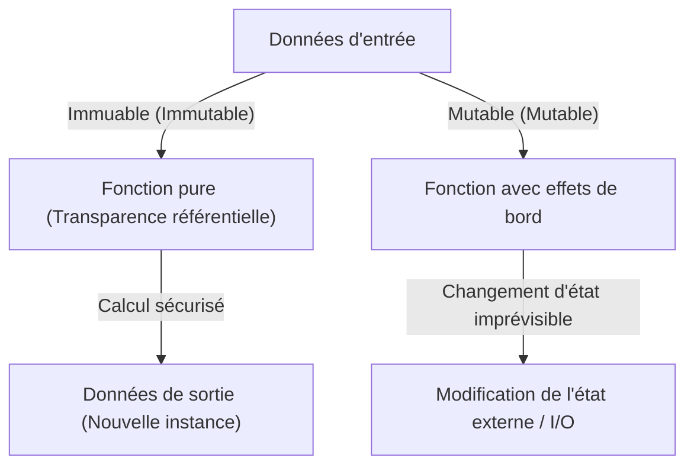
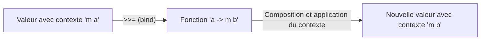

# Introduction : Pourquoi Haskell ?

Il existe de nombreux paradigmes dans les langages de programmation. Impératif, orienté objet, procédural et fonctionnel. Parmi eux, Haskell, qualifié de "langage purement fonctionnel" (Purely Functional Language), dégage une présence singulière. Pour beaucoup de programmeurs, Haskell a souvent l'image d'être "trop académique", "pas pratique" ou encore que "les monades sont trop difficiles". Cependant, la philosophie de programmation que propose Haskell regorge d'indices puissants pour améliorer fondamentalement la qualité du code que nous écrivons au quotidien (JavaScript, Python, Rust, Go, etc.).

Dans cet article, nous partirons de la philosophie qui sous-tend le langage Haskell pour explorer en profondeur les fonctions pures, la gestion des effets de bord et le monde des "Monades" (Monad) où de nombreux apprenants abandonnent. À la fin de cette lecture, vous comprendrez que les monades ne sont pas de simples concepts mathématiques obscurs, mais d'élégants modèles de conception (design patterns) en programmation.

## 1. Le paradigme de la programmation purement fonctionnelle

Le fondement de la programmation fonctionnelle repose sur l'idée de "traiter les calculs comme l'évaluation de fonctions mathématiques". Dans un langage "purement" fonctionnel comme Haskell en particulier, cette règle est strictement respectée.

### Transparence référentielle (Referential Transparency)

L'une des caractéristiques les plus importantes des langages purement fonctionnels est la "transparence référentielle". Il s'agit de la propriété selon laquelle le remplacement de n'importe quelle expression dans un programme par le résultat de son évaluation ne modifie pas le comportement global du programme.

Par exemple, supposons que nous ayons une fonction `f(x) = x + 1`. `f(2)` renverra toujours `3`. Que vous l'exécutiez aujourd'hui, demain ou à l'autre bout du monde, le résultat sera toujours `3`. Grâce à cette propriété de "toujours renvoyer la même sortie pour une même entrée", le programmeur peut prédire le comportement du code sans se soucier de l'état interne de la fonction ou de l'environnement externe.

### Immuabilité (Immutability)

Dans un langage purement fonctionnel, la valeur d'une variable une fois définie ne peut pas être modifiée (immuabilité). Il n'existe pas d'assignation destructive comme `x = x + 1` que l'on connaît bien en C ou en Java. Au lieu de modifier l'état, la fonction renvoie des données avec un nouvel état modifié. Ainsi, les bugs complexes tels que les conditions de concurrence (Race Condition) dans les environnements multithreads ne se produisent pas structurellement.

## 2. Comment faire face au "mal" que sont les effets de bord

Pour qu'un programme soit utile dans le monde réel, il doit afficher du texte à l'écran, écrire dans des fichiers ou communiquer via un réseau. Tout cela est appelé "effets de bord" (Side Effects). Les effets de bord détruisent la transparence référentielle. En effet, une "fonction qui obtient l'heure actuelle" ou une "fonction qui lit le contenu d'un fichier" peut voir son résultat changer à chaque exécution.

Haskell n'interdit pas complètement les effets de bord. S'il les interdisait, le programme ne serait qu'une entité dénuée de sens ne servant qu'à faire chauffer le processeur. L'approche de Haskell est "l'isolation des effets de bord". Il sépare clairement le monde des calculs purs du monde impur accompagné d'effets de bord, à l'aide du système de types.

C'est ici qu'entre enfin en scène le concept de "Monade".

## 3. Le chemin vers les monades : Foncteurs (Functor) et Applicatifs (Applicative)

Pour comprendre les monades, le chemin le plus court est de commencer par les concepts qui en sont la base : les "Foncteurs" (Functor) et les "Applicatifs" (Applicative).

### Une valeur avec un contexte (Context)

En programmant, il est fréquent de manipuler non pas une "valeur" elle-même, mais une "valeur avec un certain contexte".
- Un contexte où "la valeur peut ne pas exister" (Maybe / Optional)
- Un contexte où "une erreur a pu se produire" (Either / Result)
- Un contexte "ayant plusieurs valeurs" (List)
- Un contexte qui "n'a pas encore été calculé (asynchrone)" (Promise / Future)

### Foncteur (Functor) : Manipuler une valeur dans un contexte

Un Functor est un mécanisme permettant d'appliquer une fonction à ces "valeurs avec contexte" tout en maintenant ce contexte. En Haskell, cela est défini comme la fonction `fmap` (l'opérateur `<$>`).

Par exemple, supposons que nous ayons un `5` dans une boîte où "il pourrait y avoir une valeur (Maybe)" (`Just 5`). Si nous voulons lui appliquer la fonction `(* 2)`, l'opération d'ouvrir la boîte, de calculer et de remettre dans la boîte est abstraite par le Functor.

`fmap (* 2) (Just 5)` devient `Just 10`.
`fmap (* 2) Nothing` reste `Nothing`.

### Applicatif (Applicative) : Appliquer une fonction dans un contexte à une valeur dans un contexte

L'Applicatif rend le Functor encore plus puissant. Si la fonction elle-même est à l'intérieur d'un contexte (une boîte), elle peut être appliquée à une valeur dans une autre boîte (opérateur `<*>`). Cela permet de gérer facilement des fonctions prenant plusieurs arguments dans un contexte.

## 4. Bienvenue dans le monde des Monades (Monad)

Voici enfin la monade. Bien que la monade soit un concept issu de la "Théorie des catégories" (Category Theory) en mathématiques, il est plus pratique en programmation de la comprendre comme un "modèle de conception (design pattern) permettant de chaîner des calculs avec un contexte".

En plus des calculs que l'on pouvait gérer avec les Functors et Applicatives, la monade possède la puissante capacité de "déterminer le calcul suivant (une fonction renvoyant un nouveau contexte) en fonction du résultat du calcul précédent (la valeur dans le contexte)".

### L'opérateur bind (`>>=`)

Le cœur de la monade est l'opérateur appelé `>>=` (bind). Cet opérateur a le type suivant (représentation simplifiée) :

`m a -> (a -> m b) -> m b`

1. `m a` : Une valeur `a` avec un contexte `m` (ex : `Just 5`)
2. `(a -> m b)` : Une fonction qui prend une valeur normale `a` et renvoie une valeur `b` avec un contexte `m`
3. Le résultat est une nouvelle valeur `m b` avec un contexte

Grâce à ce mécanisme, par exemple, une série d'opérations telles que "rechercher un utilisateur dans la base de données, puis obtenir son profil s'il est trouvé, puis obtenir l'URL de son image s'il est trouvé" (chacune pouvant échouer = renvoyer `Nothing`) peut être joliment chaînée sans avoir à écrire de code de gestion d'erreurs (une succession de vérifications de null via des instructions if).

## 5. Exemples concrets et utilité des Monades

Regardons quelques-unes des monades représentatives en Haskell. Elles partagent toutes la même interface `>>=`, mais fournissent chacune un "contexte" différent.

### La monade Maybe : Les calculs qui peuvent échouer
Si un échec (`Nothing`) se produit pendant le calcul, les calculs suivants sont ignorés et le résultat final sera `Nothing`. Elle fonctionne de manière similaire à l'opérateur conditionnel null (`?.`) dans d'autres langages.

### La monade Either : L'échec avec une raison d'erreur
Similaire à Maybe, mais en cas d'échec, elle permet de transporter des informations supplémentaires (`Left`) telles qu'un message d'erreur ou un code d'erreur. Elle sert d'alternative à la gestion des exceptions.

### La monade State : Les calculs accompagnés d'un état
C'est une monade pour simuler le "changement d'état" dans un langage purement fonctionnel. Elle masque et transmet l'état (State) à l'intérieur de la chaîne de calculs, permettant d'écrire le code comme si l'on utilisait des variables mutables.

### La monade IO : L'isolation des effets de bord
C'est la monade la plus importante et celle qui fait de Haskell un langage pratique. Elle enferme l'effet de bord qu'est l'"interaction avec le monde extérieur" dans une boîte appelée "monade IO". L'ensemble d'un programme Haskell est représenté comme une seule et gigantesque monade IO, et toutes les fonctions restent pures jusqu'à ce que l'environnement d'exécution exécute finalement cette action IO à la toute fin.

## 6. Philosophie de la programmation : Théorie des catégories et calculs

Il existe une phrase célèbre (et qui déroute les débutants) selon laquelle "Une monade n'est qu'un monoïde dans la catégorie des endofoncteurs" (A monad is just a monoid in the category of endofunctors) en théorie des catégories. Mais ce qui est important pour un ingénieur logiciel, plus que sa rigueur mathématique, c'est le "pouvoir d'abstraction" qu'elle apporte.

Grâce à l'existence d'une interface commune (classe de types) appelée monade, nous pouvons traiter des concepts complètement différents tels que "échec", "état", "asynchronisme", "I/O" et "non-déterminisme (listes)" avec exactement le même opérateur (`>>=`) ou la même syntaxe (notation `do`). Il s'agit d'un bond spectaculaire en termes de pouvoir d'expression.

## Conclusion : Ce que Haskell nous enseigne

Le monde des monades en Haskell peut sembler au début être une falaise abrupte. Cependant, une fois que l'on atteint le sommet et que l'on observe le paysage à travers le prisme des monades, notre perspective sur la programmation change fondamentalement.

Comment gérer les effets de bord, comment abstraire les états, comment faire passer à l'échelle la composition de fonctions. Ces solutions proposées par Haskell et le paradigme purement fonctionnel continuent d'avoir une influence majeure sur les langages grand public contemporains, tels que les types `Result` et `Option` de Rust, ou les `Promise` et `async/await` de JavaScript.

Apprendre Haskell n'est pas simplement retenir une nouvelle syntaxe, c'est un voyage pour acquérir un nouveau "modèle mental" vis-à-vis de l'acte même de calculer.
