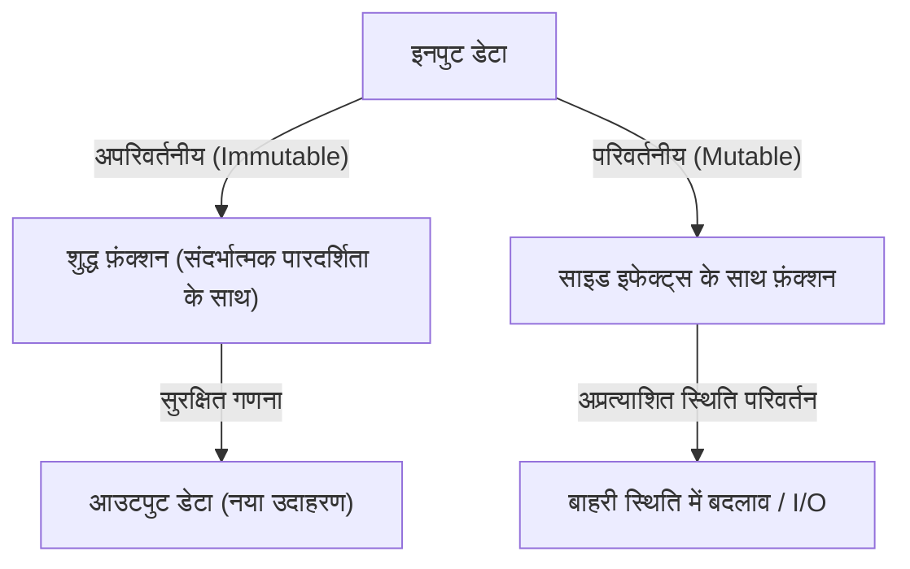
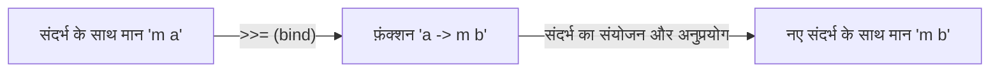

# परिचय: हास्केल क्यों?

प्रोग्रामिंग भाषाओं में कई प्रतिमान मौजूद हैं। आज्ञाकारी (Imperative), ऑब्जेक्ट-ओरिएंटेड, प्रक्रियात्मक (Procedural), और कार्यात्मक (Functional)। इनमें से, हास्केल, जिसे 'शुद्ध कार्यात्मक भाषा' (Purely Functional Language) कहा जाता है, की एक अनूठी उपस्थिति है। कई प्रोग्रामर्स के लिए, हास्केल की अक्सर ऐसी छवि होती है कि यह "बहुत शैक्षणिक है", "व्यावहारिक नहीं है", या "मोनैड बहुत कठिन हैं"। हालाँकि, हास्केल द्वारा प्रस्तुत प्रोग्रामिंग दर्शन शक्तिशाली सुरागों से भरा है जो मौलिक रूप से उस कोड (JavaScript, Python, Rust, Go आदि) की गुणवत्ता में सुधार कर सकता है जिसे हम दैनिक रूप से लिखते हैं।

इस लेख में, हम हास्केल भाषा के पीछे के दर्शन से शुरू करेंगे और शुद्ध कार्यों, साइड इफेक्ट प्रबंधन और 'मोनैड' (Monad) की दुनिया के बारे में बहुत विस्तार से और गहराई से बताएंगे, जहां कई शिक्षार्थी हार मान लेते हैं। इस लेख को पढ़ने के बाद, आप समझ जाएंगे कि मोनैड केवल एक कठिन गणितीय अवधारणा नहीं है, बल्कि प्रोग्रामिंग में एक शानदार डिज़ाइन पैटर्न है।

## 1. शुद्ध कार्यात्मक प्रोग्रामिंग का प्रतिमान

कार्यात्मक प्रोग्रामिंग के मूल में "गणितीय कार्यों के मूल्यांकन के रूप में गणना का इलाज" करने का विचार है। विशेष रूप से हास्केल जैसी "शुद्ध" कार्यात्मक भाषा में, इस नियम का बहुत सख्ती से पालन किया जाता है।

### संदर्भात्मक पारदर्शिता (Referential Transparency)

शुद्ध कार्यात्मक भाषाओं की सबसे महत्वपूर्ण विशेषताओं में से एक 'संदर्भात्मक पारदर्शिता' है। यह उस गुण को संदर्भित करता है जहां प्रोग्राम में किसी भी अभिव्यक्ति को उसके मूल्यांकन परिणाम से बदलने पर समग्र प्रोग्राम का व्यवहार नहीं बदलता है।

उदाहरण के लिए, मान लें कि एक फ़ंक्शन `f(x) = x + 1` है। `f(2)` हमेशा `3` देता है। चाहे आप इसे आज चलाएं, कल चलाएं, या पृथ्वी के दूसरी तरफ चलाएं, परिणाम हमेशा `3` होगा। यह "समान इनपुट के लिए हमेशा समान आउटपुट लौटाने" का गुण प्रोग्रामर्स को फ़ंक्शन की आंतरिक स्थिति या बाहरी वातावरण की चिंता किए बिना कोड के व्यवहार की भविष्यवाणी करने की अनुमति देता है।

### अपरिवर्तनीयता (Immutability)

शुद्ध कार्यात्मक भाषा में, एक बार परिभाषित चर का मान नहीं बदला जा सकता है (अपरिवर्तनीयता)। सी (C) भाषा या जावा में परिचित `x = x + 1` जैसे विनाशकारी असाइनमेंट मौजूद नहीं हैं। स्थिति को बदलने के बजाय, यह नई परिवर्तित स्थिति के साथ डेटा लौटाता है। यह संरचनात्मक रूप से मल्टी-थ्रेडेड वातावरण में रेस कंडीशन (Race Condition) जैसे जटिल बग को होने से रोकता है।

## 2. "बुराई" नामक साइड इफेक्ट्स का सामना कैसे करें

किसी प्रोग्राम को वास्तविक दुनिया में उपयोगी बनाने के लिए, उसे स्क्रीन पर टेक्स्ट प्रदर्शित करने, फ़ाइलों में लिखने या नेटवर्क संचार करने की आवश्यकता होती है। इन सभी को 'साइड इफेक्ट्स' (Side Effect) कहा जाता है। साइड इफेक्ट्स संदर्भात्मक पारदर्शिता को नष्ट करते हैं। ऐसा इसलिए है क्योंकि "वर्तमान समय प्राप्त करने वाला फ़ंक्शन" या "फ़ाइल की सामग्री पढ़ने वाला फ़ंक्शन" हर बार निष्पादित होने पर अलग-अलग परिणाम दे सकता है।

हास्केल साइड इफेक्ट्स को पूरी तरह से प्रतिबंधित नहीं करता है। यदि यह प्रतिबंधित होता, तो प्रोग्राम केवल सीपीयू को गर्म करने वाला एक निरर्थक अस्तित्व बन जाएगा। हास्केल का दृष्टिकोण "साइड इफेक्ट्स को अलग करना" है। यह प्रकार प्रणाली (Type System) का उपयोग करके शुद्ध गणना की दुनिया और साइड इफेक्ट्स से जुड़ी अशुद्ध दुनिया को स्पष्ट रूप से अलग करता है।

यहाँ अंततः 'मोनैड' की अवधारणा सामने आती है।

## 3. मोनैड का मार्ग: फ़ंक्टर (Functor) और एप्लिकेटिव (Applicative)

मोनैड को समझने के लिए, इसकी नींव बनाने वाली 'फ़ंक्टर' (Functor) और 'एप्लिकेटिव' (Applicative) की अवधारणाओं से शुरुआत करना सबसे आसान तरीका है।

### संदर्भ (Context) वाले मान

प्रोग्रामिंग करते समय, हम अक्सर केवल "मान" के बजाय "किसी संदर्भ के साथ मान" से निपटते हैं।
- संदर्भ कि "मान मौजूद नहीं हो सकता है" (Maybe / Optional)
- संदर्भ कि "कोई त्रुटि हुई हो सकती है" (Either / Result)
- संदर्भ कि "इसमें कई मान हैं" (List)
- संदर्भ कि "अभी तक गणना नहीं की गई है (एसिंक्रोनस)" (Promise / Future)

### फ़ंक्टर (Functor): संदर्भ में मान में हेरफेर करना

फ़ंक्टर (Functor) संदर्भ को बनाए रखते हुए इन "संदर्भित मानों" पर कार्यों को लागू करने का एक तंत्र है। हास्केल में, इसे `fmap` फ़ंक्शन (ऑपरेटर के रूप में `<$>`) के रूप में परिभाषित किया गया है।

उदाहरण के लिए, मान लें कि एक बॉक्स में `5` है जो कहता है "मान हो सकता है (Maybe)" (`Just 5`)। यदि हम इस पर फ़ंक्शन `(* 2)` लागू करना चाहते हैं, तो फ़ंक्टर बॉक्स खोलने, गणना करने और उसे वापस बॉक्स में रखने के कार्य को अमूर्त करता है।

`fmap (* 2) (Just 5)` `Just 10` बन जाता है।
`fmap (* 2) Nothing` `Nothing` ही रहता है।

### एप्लिकेटिव (Applicative): संदर्भ में फ़ंक्शन को संदर्भ में मान पर लागू करना

एप्लिकेटिव (Applicative) फ़ंक्टर का अधिक शक्तिशाली संस्करण है। यदि फ़ंक्शन स्वयं एक संदर्भ (बॉक्स) के अंदर है, तो इसे किसी अन्य बॉक्स के अंदर के मान पर लागू किया जा सकता है (ऑपरेटर `<*>`)। यह कई तर्कों को लेने वाले कार्यों को संदर्भ के भीतर आसानी से संभालने की अनुमति देता है।

## 4. मोनैड (Monad) की दुनिया में आपका स्वागत है

अंत में, मोनैड आता है। मोनैड गणित में "श्रेणी सिद्धांत" (Category Theory) से उत्पन्न एक अवधारणा है, लेकिन प्रोग्रामिंग में, इसे "संदर्भित गणनाओं को श्रृंखलाबद्ध (Chain) करने के लिए एक डिज़ाइन पैटर्न" के रूप में समझना सबसे व्यावहारिक है।

फ़ंक्टर और एप्लिकेटिव के साथ संभाली जा सकने वाली गणनाओं के अलावा, मोनैड में "पिछले गणना परिणाम (संदर्भ में मान) के आधार पर अगली गणना (एक नया संदर्भ लौटाने वाला फ़ंक्शन) तय करने" की शक्तिशाली क्षमता है।

### बाइंड ऑपरेटर (`>>=`)

मोनैड का मूल `>>=` (बाइंड) नामक ऑपरेटर है। इस ऑपरेटर का प्रकार (सरल प्रतिनिधित्व) इस प्रकार है:

`m a -> (a -> m b) -> m b`

1. `m a` : संदर्भ `m` के साथ मान `a` (उदाहरण: `Just 5`)
2. `(a -> m b)` : एक फ़ंक्शन जो एक सामान्य मान `a` लेता है और संदर्भ `m` के साथ मान `b` देता है
3. परिणामस्वरूप, एक नए संदर्भ के साथ मान `m b` वापस आ जाता है

इस तंत्र के साथ, उदाहरण के लिए, "डीबी से उपयोगकर्ता खोजें, यदि मिल जाए तो उपयोगकर्ता की प्रोफ़ाइल प्राप्त करें, यदि मिल जाए तो छवि यूआरएल प्राप्त करें" जैसी प्रक्रियाओं की एक श्रृंखला (जिनमें से सभी विफल हो सकती हैं = `Nothing` वापस आ सकता है) को त्रुटि-हैंडलिंग कोड (if स्टेटमेंट का उपयोग करके शून्य जाँच की श्रृंखला) लिखे बिना खूबसूरती से जोड़ा जा सकता है।

## 5. मोनैड के विशिष्ट उदाहरण और व्यावहारिकता

आइए हास्केल में कुछ विशिष्ट मोनैड्स देखें। ये सभी समान `>>=` इंटरफ़ेस साझा करते हैं, लेकिन प्रत्येक एक अलग "संदर्भ" प्रदान करता है।

### Maybe मोनैड: गणनाएं जो विफल हो सकती हैं
यदि गणना के दौरान कोई विफलता (`Nothing`) होती है, तो यह बाद की गणनाओं को छोड़ देता है और अंतिम परिणाम को `Nothing` बना देता है। यह अन्य भाषाओं में नल-सशर्त ऑपरेटर (`?.`) के समान काम करता है।

### Either मोनैड: त्रुटि कारणों के साथ विफलता
Maybe के समान, लेकिन विफलता के मामले में त्रुटि संदेश या त्रुटि कोड जैसी अतिरिक्त जानकारी (`Left`) ले जा सकता है। यह अपवाद प्रबंधन (Exception Handling) का एक विकल्प है।

### State मोनैड: स्थिति के साथ गणना
यह एक मोनैड है जो शुद्ध कार्यात्मक भाषाओं में "स्थिति परिवर्तन" का अनुकरण करता है। यह गणनाओं की श्रृंखला में स्थिति (State) को छिपा कर पास करता है, जिससे आप कोड लिख सकते हैं जैसे कि आप परिवर्तनीय चर (Mutable variables) का उपयोग कर रहे हों।

### IO मोनैड: साइड इफेक्ट्स को अलग करना
यह सबसे महत्वपूर्ण मोनैड है जो हास्केल को एक व्यावहारिक भाषा बनाता है। यह "बाहरी दुनिया के साथ बातचीत" के साइड इफेक्ट्स को "IO मोनैड" नामक बॉक्स में समाहित करता है। संपूर्ण हास्केल प्रोग्राम को एक विशाल IO मोनैड के रूप में दर्शाया गया है, और सभी कार्य तब तक शुद्ध रहते हैं जब तक कि रनटाइम वातावरण अंततः उस IO कार्रवाई को निष्पादित नहीं करता है।

## 6. प्रोग्रामिंग का दर्शन: श्रेणी सिद्धांत और गणना

मोनैड के बारे में एक प्रसिद्ध (और शुरुआती लोगों को भ्रमित करने वाला) उद्धरण है कि यह "एंडोफ़ंक्टर्स की श्रेणी में एक मोनोइड" (A monad is just a monoid in the category of endofunctors) है, लेकिन सॉफ्टवेयर इंजीनियरों के लिए, इसके द्वारा लाई गई "अमूर्तता की शक्ति" इसके गणितीय कठोरता से अधिक महत्वपूर्ण है।

एक सामान्य इंटरफ़ेस (टाइप क्लास) के रूप में मोनैड के अस्तित्व के साथ, हम "विफलता", "स्थिति", "एसिंक्रोनस", "I/O", और "गैर-नियतिवाद (सूची)" जैसी पूरी तरह से अलग अवधारणाओं को समान ऑपरेटर (`>>=`) और सिंटैक्स (`do` नोटेशन) के साथ संभाल सकते हैं। यह अभिव्यंजक शक्ति में एक अद्भुत छलांग है।

## निष्कर्ष: हास्केल हमें क्या सिखाता है

हास्केल की मोनैड दुनिया पहले एक खड़ी चट्टान की तरह लग सकती है। हालाँकि, एक बार जब आप शीर्ष पर पहुँच जाते हैं और मोनैड के माध्यम से दृश्य देखते हैं, तो प्रोग्रामिंग पर आपका दृष्टिकोण मौलिक रूप से बदल जाएगा।

साइड इफेक्ट्स को कैसे प्रबंधित करें, स्थिति को कैसे अमूर्त करें, और फ़ंक्शन संरचना को कैसे स्केल करें। हास्केल और शुद्ध कार्यात्मक प्रतिमानों द्वारा प्रस्तुत ये समाधान आधुनिक मुख्यधारा की भाषाओं जैसे रस्ट के `Result` और `Option` प्रकार, और जावास्क्रिप्ट के `Promise` और `async/await` को बहुत प्रभावित करते रहते हैं।

हास्केल सीखना केवल नए व्याकरण को याद करने के बारे में नहीं है, बल्कि गणना के कार्य के लिए एक नया "मानसिक मॉडल" प्राप्त करने की यात्रा है。
