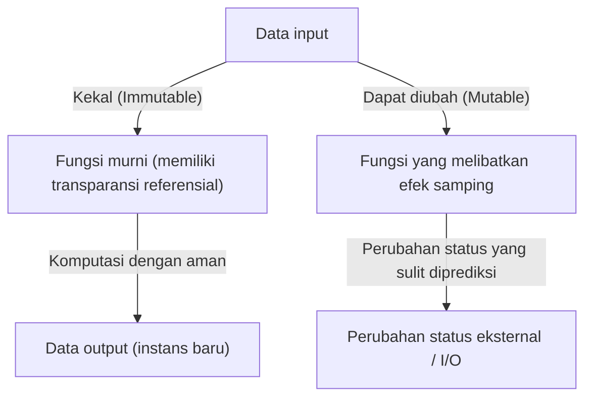
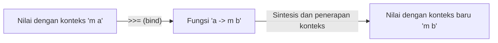

# Pendahuluan: Mengapa Haskell?

Terdapat banyak paradigma dalam bahasa pemrograman. Imperatif, berorientasi objek, prosedural, dan fungsional. Di antaranya, Haskell yang disebut sebagai "Bahasa Fungsional Murni" (Purely Functional Language) memancarkan eksistensi yang unik. Bagi banyak programmer, Haskell sering dianggap "terlalu akademis", "tidak praktis", atau "Monad-nya terlalu sulit". Namun, filosofi pemrograman yang ditawarkan oleh Haskell penuh dengan petunjuk kuat untuk secara mendasar meningkatkan kualitas kode yang kita tulis sehari-hari (JavaScript, Python, Rust, Go, dll.).

Dalam artikel ini, kita akan berangkat dari filosofi di balik bahasa Haskell, dan menjelaskan secara mendetail dan mendalam mengenai fungsi murni, manajemen efek samping, hingga dunia "Monad" yang sering membuat banyak pembelajar menyerah. Pada saat Anda selesai membaca artikel ini, Anda akan memahami bahwa Monad bukanlah sekadar konsep matematika yang sulit, melainkan pola desain yang elegan dalam pemrograman.

## 1. Paradigma Pemrograman Fungsional Murni

Akar dari pemrograman fungsional adalah gagasan untuk "memperlakukan komputasi sebagai evaluasi fungsi matematika". Terutama dalam bahasa fungsional "murni" seperti Haskell, aturan ini dipatuhi dengan sangat ketat.

### Transparansi Referensial (Referential Transparency)

Salah satu karakteristik terpenting dari bahasa fungsional murni adalah "Transparansi Referensial". Ini mengacu pada sifat di mana jika setiap ekspresi arbitrer dalam program diganti dengan hasil evaluasinya, perilaku keseluruhan program tidak akan berubah.

Sebagai contoh, misalkan ada fungsi `f(x) = x + 1`. `f(2)` akan selalu mengembalikan `3`. Baik dieksekusi hari ini, esok, maupun di belahan bumi lain, hasilnya pasti `3`. Dengan sifat "selalu mengembalikan output yang sama untuk input yang sama" ini, programmer dapat memprediksi perilaku kode tanpa mempedulikan status internal fungsi atau lingkungan eksternal.

### Kekekalan (Immutability)

Dalam bahasa fungsional murni, nilai variabel yang telah didefinisikan tidak dapat diubah (Kekekalan). Tidak ada penugasan destruktif seperti `x = x + 1` yang biasa ditemukan di C atau Java. Alih-alih mengubah status, program akan mengembalikan data dengan status baru yang telah diubah. Akibatnya, bug kompleks secara struktural seperti kondisi balapan (Race Condition) di lingkungan multi-utas tidak akan terjadi.

## 2. Bagaimana Menghadapi "Kejahatan" yang Disebut Efek Samping

Agar sebuah program berguna di dunia nyata, program tersebut perlu menampilkan teks di layar, menulis ke file, atau melakukan komunikasi jaringan. Ini semua disebut "Efek Samping" (Side Effect). Efek samping menghancurkan transparansi referensial. Sebab, "fungsi yang mendapatkan waktu saat ini" atau "fungsi yang membaca isi file" dapat menghasilkan output yang berbeda setiap kali dieksekusi.

Haskell tidak melarang efek samping sepenuhnya. Jika dilarang, program hanya akan menjadi sesuatu yang tidak berarti dan sekadar menghangatkan CPU. Pendekatan Haskell adalah "Pemisahan Efek Samping". Haskell memisahkan dunia komputasi murni dengan dunia tidak murni yang melibatkan efek samping secara jelas menggunakan sistem tipe.

Di sinilah akhirnya konsep bernama "Monad" muncul.

## 3. Jalan Menuju Monad: Functor dan Applicative

Untuk memahami Monad, jalan pintasnya adalah memulai dengan konsep dasar pembentuknya, yaitu "Functor" dan "Applicative".

### Nilai dengan Konteks (Context)

Saat melakukan pemrograman, kita sering kali menangani "nilai dengan konteks tertentu" alih-alih menangani "nilai" itu sendiri.
- Konteks "nilai mungkin tidak ada" (Maybe / Optional)
- Konteks "mungkin telah terjadi kesalahan" (Either / Result)
- Konteks "memiliki banyak nilai" (List)
- Konteks "belum dihitung (asinkron)" (Promise / Future)

### Functor: Memanipulasi Nilai di Dalam Konteks

Functor adalah mekanisme untuk menerapkan fungsi terhadap "nilai dengan konteks" tersebut sambil mempertahankan konteksnya. Dalam Haskell, ini didefinisikan sebagai fungsi `fmap` (sebagai operator dilambangkan dengan `<$>`).

Sebagai contoh, misalkan ada sebuah kotak berisi "mungkin ada nilainya (Maybe)" dan di dalamnya terdapat angka `5` (`Just 5`). Jika kita ingin menerapkan fungsi `(* 2)` pada angka tersebut, Functor akan mengabstraksikan proses membuka kotak, menghitung nilainya, lalu menyimpannya kembali ke dalam kotak.

`fmap (* 2) (Just 5)` akan menjadi `Just 10`.
`fmap (* 2) Nothing` akan tetap menjadi `Nothing`.

### Applicative: Menerapkan Fungsi dalam Konteks pada Nilai dalam Konteks

Applicative adalah bentuk Functor yang lebih kuat. Jika fungsinya juga berada di dalam konteks (kotak), Applicative dapat menerapkannya pada nilai di dalam kotak lain (menggunakan operator `<*>`). Hal ini memungkinkan kita untuk menangani fungsi yang mengambil banyak argumen secara mudah di dalam konteks.

## 4. Selamat Datang di Dunia Monad

Akhirnya, kita sampai pada Monad. Monad adalah konsep yang berasal dari "Teori Kategori" (Category Theory) dalam matematika, namun dalam pemrograman, paling praktis untuk memahaminya sebagai "pola desain untuk merantai (chaining) komputasi yang memiliki konteks".

Selain komputasi yang dapat ditangani oleh Functor dan Applicative, Monad memiliki kemampuan kuat untuk "menentukan komputasi berikutnya (fungsi yang mengembalikan konteks baru) berdasarkan hasil komputasi sebelumnya (nilai dalam konteks)".

### Operator bind (`>>=`)

Inti dari Monad adalah operator yang disebut `>>=` (bind). Operator ini memiliki tipe seperti berikut (representasi sederhana):

`m a -> (a -> m b) -> m b`

1. `m a` : Nilai `a` yang memiliki konteks `m` (Contoh: `Just 5`)
2. `(a -> m b)` : Fungsi yang menerima nilai biasa `a`, dan mengembalikan nilai `b` dengan konteks `m`
3. Sebagai hasilnya, nilai `m b` dengan konteks yang baru akan dikembalikan

Melalui mekanisme ini, misalnya, serangkaian proses seperti "Mencari pengguna dari DB, jika ditemukan ambil profilnya, jika ditemukan ambil URL gambarnya" (yang semuanya berpotensi gagal = mengembalikan `Nothing`), dapat dihubungkan dengan indah tanpa perlu menulis kode penanganan kesalahan (rantai pengecekan null menggunakan pernyataan if).

## 5. Contoh Konkret dan Kepraktisan Monad

Mari kita lihat beberapa Monad yang representatif di Haskell. Semua Monad ini berbagi antarmuka `>>=` yang sama, namun masing-masing menyediakan "konteks" yang berbeda.

### Monad Maybe: Komputasi yang Mungkin Gagal
Jika kegagalan (`Nothing`) terjadi di tengah komputasi, ia akan melompati komputasi berikutnya dan menjadikan hasil akhirnya sebagai `Nothing`. Fungsinya mirip dengan operator bersyarat null (`?.`) dalam bahasa lain.

### Monad Either: Kegagalan dengan Alasan Kesalahan
Mirip dengan Maybe, namun dapat membawa informasi tambahan (`Left`) seperti pesan atau kode kesalahan saat terjadi kegagalan. Ini menjadi alternatif untuk penanganan pengecualian (exception handling).

### Monad State: Komputasi yang Melibatkan Status
Ini adalah Monad untuk mensimulasikan "perubahan status" dalam bahasa fungsional murni. Dengan menyembunyikan dan mengoper status (State) dalam rantai komputasi, kita dapat menulis kode seolah-olah kita menggunakan variabel yang dapat diubah.

### Monad IO: Pemisahan Efek Samping
Ini adalah Monad yang paling penting dan membuat Haskell menjadi bahasa praktis. Monad IO mengurung efek samping berupa "interaksi dengan dunia luar" ke dalam sebuah kotak bernama "Monad IO". Seluruh program Haskell direpresentasikan sebagai satu Monad IO raksasa, dan semua fungsi di dalamnya tetap murni hingga lingkungan runtime mengeksekusi aksi IO tersebut di akhir.

## 6. Filosofi Pemrograman: Teori Kategori dan Komputasi

Ada sebuah kalimat terkenal (yang juga membingungkan para pemula) yang menyatakan bahwa Monad hanyalah sebuah objek monoid dalam kategori endofunktor (A monad is just a monoid in the category of endofunctors) dalam teori kategori. Namun, bagi para insinyur perangkat lunak, yang lebih penting daripada keakuratan matematisnya adalah "kekuatan abstraksi" yang disediakannya.

Dengan adanya antarmuka umum (kelas tipe) bernama Monad, kita dapat menangani konsep-konsep yang sama sekali berbeda seperti "Kegagalan", "Status", "Asinkron", "I/O", dan "Non-determinisme (Daftar)" menggunakan operator (`>>=`) dan sintaksis (`do`) yang sama persis. Ini adalah lompatan luar biasa dalam kekuatan ekspresi.

## Kesimpulan: Apa yang Haskell Ajarkan pada Kita

Dunia Monad pada Haskell mungkin pada awalnya terlihat seperti tebing curam. Namun, setelah Anda mencapai puncaknya dan memandang pemandangan melalui Monad, sudut pandang Anda terhadap pemrograman akan berubah secara mendasar.

Bagaimana cara mengelola efek samping, bagaimana mengabstraksikan status, bagaimana menskalakan komposisi fungsi. Solusi-solusi yang ditawarkan oleh Haskell dan paradigma fungsional murni terus memberikan pengaruh besar pada bahasa arus utama modern, seperti tipe `Result` dan `Option` di Rust, serta `Promise` dan `async/await` di JavaScript.

Mempelajari Haskell bukanlah sekadar mengingat sintaksis baru, melainkan sebuah perjalanan untuk mendapatkan "model mental" yang baru mengenai proses komputasi itu sendiri.
