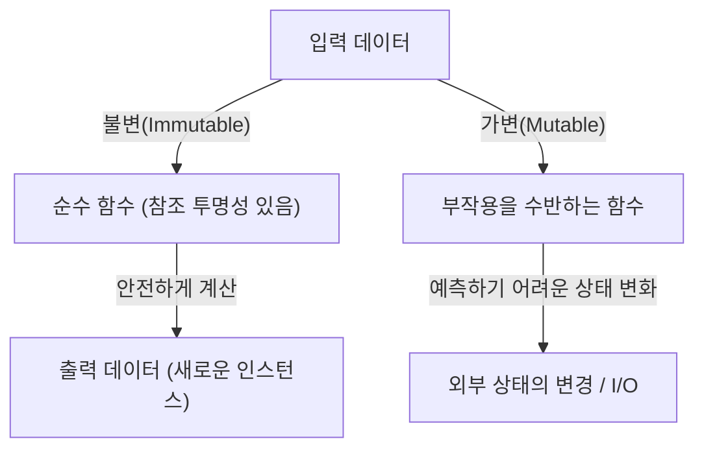
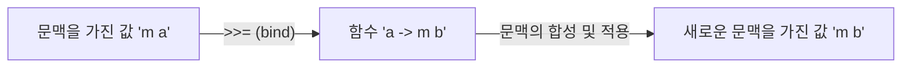

# 시작하며: 왜 Haskell인가?

프로그래밍 언어에는 수많은 패러다임이 존재합니다. 명령형, 객체 지향, 절차형, 그리고 함수형. 그중에서도 "순수 함수형 언어(Purely Functional Language)"라고 불리는 Haskell은 특이한 존재감을 발합니다. 많은 프로그래머에게 Haskell은 "너무 학술적이다", "실용적이지 않다", "모나드가 너무 어렵다"라는 이미지를 갖기 쉽습니다. 하지만 Haskell이 제시하는 프로그래밍 철학은 우리가 일상적으로 작성하는 코드(JavaScript, Python, Rust, Go 등)의 품질을 근본적으로 향상하기 위한 강력한 힌트로 가득 차 있습니다.

본 기사에서는 Haskell이라는 언어의 배경에 있는 철학에서 출발하여 순수 함수, 부작용의 관리, 그리고 많은 학습자가 좌절하는 "모나드(Monad)"의 세계까지 매우 상세하고 깊이 있게 해설해 나갈 것입니다. 이 기사를 다 읽을 무렵에는 모나드가 단순한 난해한 수학적 개념이 아니라 프로그래밍에 있어서 우아한 디자인 패턴이라는 것을 이해할 수 있을 것입니다.

## 1. 순수 함수형 프로그래밍의 패러다임

함수형 프로그래밍의 근저에 있는 것은 "계산을 수학적인 함수의 평가로 다룬다"라는 사고방식입니다. 특히 Haskell과 같은 "순수" 함수형 언어에서는 이 규칙이 극히 엄격하게 지켜지고 있습니다.

### 참조 투명성(Referential Transparency)

순수 함수형 언어의 가장 중요한 특징 중 하나가 "참조 투명성"입니다. 이것은 프로그램 내의 임의의 식을 그 평가 결과로 치환해도 프로그램 전체의 동작이 변하지 않는다는 성질을 가리킵니다.

예를 들어 `f(x) = x + 1`이라는 함수가 있다고 합시다. `f(2)`는 항상 `3`을 반환합니다. 오늘 실행해도, 내일 실행해도, 지구 반대편에서 실행해도 결과는 반드시 `3`입니다. 이 "같은 입력에 대해서는 항상 같은 출력을 반환한다"는 성질 덕분에 프로그래머는 함수의 내부 상태나 외부의 환경을 신경 쓰지 않고 코드의 동작을 예측할 수 있습니다.

### 불변성(Immutability)

순수 함수형 언어에서는 한 번 정의된 변수의 값을 변경할 수 없습니다(불변성). C 언어나 Java에서 친숙한 `x = x + 1`과 같은 파괴적 대입은 존재하지 않습니다. 상태를 변경하는 대신 변경된 새로운 상태를 가진 데이터를 반환합니다. 이에 따라 멀티스레드 환경에서의 경쟁 상태(Race Condition)와 같은 복잡한 버그가 구조상 발생하지 않게 됩니다.

## 2. 부작용이라는 "악"과 어떻게 마주할 것인가

프로그램이 실세계에서 도움이 되기 위해서는 화면에 문자를 표시하거나 파일에 쓰거나 네트워크 통신을 수행해야 합니다. 이것들은 모두 "부작용(Side Effect)"이라고 불립니다. 부작용은 참조 투명성을 파괴합니다. 왜냐하면 "현재 시각을 가져오는 함수"나 "파일의 내용을 읽는 함수"는 실행할 때마다 결과가 바뀔 가능성이 있기 때문입니다.

Haskell은 부작용을 완전히 금지하고 있는 것은 아닙니다. 만약 금지했다면 프로그램은 CPU를 데우기만 할 뿐인 무의미한 존재가 되어버렸을 것입니다. Haskell의 접근 방식은 "부작용의 격리"입니다. 순수한 계산의 세계와 부작용을 수반하는 불순한 세계를 타입 시스템을 사용하여 명확하게 분리하는 것입니다.

여기서 등장하는 것이 드디어 "모나드"라는 개념입니다.

## 3. 모나드로 가는 길: 펑터(Functor)와 어플리케이티브(Applicative)

모나드를 이해하기 위해서는 그 토대가 되는 "펑터(Functor)"와 "어플리케이티브(Applicative)"라는 개념부터 들어가는 것이 지름길입니다.

### 문맥(Context)을 가진 값

프로그래밍을 하다 보면 "값" 그 자체가 아니라 "어떠한 문맥을 가진 값"을 다루는 일이 자주 있습니다.
- "값이 존재하지 않을지도 모른다"는 문맥 (Maybe / Optional)
- "에러가 발생했을지도 모른다"는 문맥 (Either / Result)
- "여러 값을 가진다"는 문맥 (List)
- "아직 계산되지 않았다(비동기)"는 문맥 (Promise / Future)

### 펑터(Functor): 문맥 안의 값을 조작하기

Functor는 이러한 "문맥을 가진 값"에 대해 문맥을 유지한 채 함수를 적용하기 위한 메커니즘입니다. Haskell에서는 `fmap`이라는 함수(연산자로는 `<$>`)로 정의되어 있습니다.

예를 들어 "값이 있을지도 모른다(Maybe)"는 상자 안에 `5`가 들어 있다고 합시다(`Just 5`). 여기에 `(* 2)`라는 함수를 적용하고 싶은 경우, 상자를 열고 계산하고 다시 상자에 넣는 작업을 추상화한 것이 Functor입니다.

`fmap (* 2) (Just 5)`는 `Just 10`이 됩니다.
`fmap (* 2) Nothing`은 `Nothing` 그대로입니다.

### 어플리케이티브(Applicative): 문맥 안의 함수를 문맥 안의 값에 적용하기

Functor를 더욱 강력하게 만든 것이 Applicative입니다. 함수 자체도 문맥(상자) 안에 들어 있는 경우, 그것을 다른 상자 안의 값에 적용할 수 있습니다(연산자 `<*>`). 이로 인해 여러 인수를 받는 함수를 문맥 안에서 쉽게 다룰 수 있게 됩니다.

## 4. 모나드(Monad)의 세계에 오신 것을 환영합니다

드디어 모나드의 등장입니다. 모나드는 수학의 "범주론(Category Theory)"에서 유래한 개념이지만, 프로그래밍에서는 "문맥을 가진 계산을 연쇄(체인)시키기 위한 디자인 패턴"으로 이해하는 것이 가장 실천적입니다.

Functor나 Applicative로 다룰 수 있었던 계산에 더해, 모나드는 "이전 계산 결과(문맥 안에 있는 값)를 바탕으로 다음 계산(새로운 문맥을 반환하는 함수)을 결정한다"는 강력한 능력을 갖추고 있습니다.

### bind 연산자(`>>=`)

모나드의 핵심은 `>>=`(바인드)라고 불리는 연산자입니다. 이 연산자는 다음과 같은 타입을 가집니다(간이 표현):

`m a -> (a -> m b) -> m b`

1. `m a` : 문맥 `m`을 가진 값 `a` (예: `Just 5`)
2. `(a -> m b)` : 평범한 값 `a`를 받아 문맥 `m`을 가진 값 `b`를 반환하는 함수
3. 결과적으로 새로운 문맥을 가진 값 `m b`가 반환됨

이 메커니즘을 통해 예를 들어 "사용자를 DB에서 검색하고, 찾으면 그 사용자의 프로필을 가져오고, 찾으면 그 이미지 URL을 가져온다"는 일련의 처리(모두 실패한다 = `Nothing`을 반환할 가능성이 있음)를 에러 핸들링 코드(if문에 의한 null 체크 연쇄)를 작성하지 않고 아름답게 연결할 수 있습니다.

## 5. 모나드의 구체적인 예와 실용성

Haskell에 있어서 대표적인 모나드를 몇 가지 살펴보겠습니다. 이것들은 모두 같은 `>>=` 인터페이스를 공유하고 있지만, 각각 다른 "문맥"을 제공합니다.

### Maybe 모나드: 실패할지도 모르는 계산
계산 도중에 실패(`Nothing`)가 발생한 경우, 그 이후의 계산을 건너뛰고 최종 결과를 `Nothing`으로 만듭니다. 다른 언어의 Null 조건 연산자(`?.`)에 가까운 역할을 합니다.

### Either 모나드: 에러 이유를 가진 실패
Maybe와 비슷하지만 실패 시 에러 메시지나 에러 코드 등의 추가 정보(`Left`)를 운반할 수 있습니다. 예외 처리의 대체 수단이 됩니다.

### State 모나드: 상태를 수반하는 계산
순수 함수형 언어에서 "상태 변경"을 시뮬레이션하기 위한 모나드입니다. 계산의 연쇄 속에서 상태(State)를 은닉하여 넘겨주고 마치 가변 변수를 사용하는 것처럼 코드를 작성할 수 있습니다.

### IO 모나드: 부작용의 격리
가장 중요하고 Haskell을 실용적인 언어로 만들고 있는 모나드입니다. "외부 세계와의 상호 작용"이라는 부작용을 "IO 모나드"라는 상자에 가둡니다. Haskell 프로그램 전체는 거대한 하나의 IO 모나드로 표현되며, 런타임 환경이 마지막에 그 IO 액션을 실행할 때까지 모든 함수는 순수한 채로 유지됩니다.

## 6. 프로그래밍 철학: 범주론과 계산

모나드는 범주론에 있어 자기 사상 펑터 범주의 모노이드 대상(A monad is just a monoid in the category of endofunctors)이라는 유명한 (그리고 초보자를 혼란스럽게 하는) 말이 있습니다만, 소프트웨어 엔지니어에게 중요한 것은 그 수학적 엄밀성보다 그것이 가져다주는 "추상화의 힘"입니다.

모나드라는 공통 인터페이스(타입 클래스)가 존재함으로써 우리는 "실패", "상태", "비동기", "I/O", "비결정성(리스트)"이라는 전혀 다른 개념을 완전히 같은 연산자(`>>=`)나 구문(`do` 표기법)으로 다룰 수 있는 것입니다. 이것은 경이적인 표현력의 도약입니다.

## 결론: Haskell이 가르쳐 주는 것

Haskell의 모나드의 세계는 처음에는 가파른 절벽처럼 보일지도 모릅니다. 하지만 한번 그 정상에 도달하여 모나드를 통해 경치를 바라보면 프로그래밍에 대한 시각이 근본부터 바뀝니다.

부작용을 어떻게 관리할 것인가, 상태를 어떻게 추상화할 것인가, 함수의 합성을 어떻게 확장할 것인가. Haskell과 순수 함수형 패러다임이 제시하는 이러한 해결책은 Rust의 `Result` 타입이나 `Option` 타입, JavaScript의 `Promise`나 `async/await` 등 현대 주류 언어에 지대한 영향을 계속 미치고 있습니다.

Haskell을 배우는 것은 단순히 새로운 문법을 외우는 것이 아니라 계산이라는 행위 자체에 대한 새로운 "멘탈 모델"을 획득하는 여행인 것입니다.
