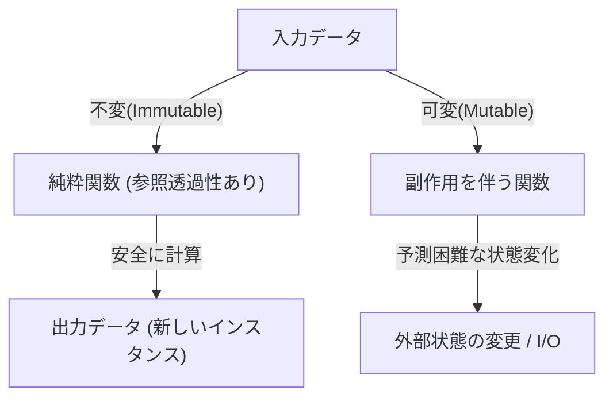
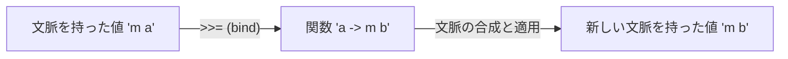

# はじめに：なぜHaskellなのか？

プログラミング言語には数多くのパラダイムが存在します。命令型、オブジェクト指向、手続き型、そして関数型。その中でも「純粋関数型言語（Purely Functional Language）」と呼ばれるHaskellは、特異な存在感を放っています。多くのプログラマーにとって、Haskellは「学術的すぎる」「実用的ではない」「モナドが難しすぎる」といったイメージを持たれがちです。しかし、Haskellが提示するプログラミングの哲学は、私たちが日常的に書くコード（JavaScript, Python, Rust, Goなど）の品質を根本から向上させるための強力なヒントに満ちています。

本記事では、Haskellという言語の背景にある哲学から出発し、純粋関数、副作用の管理、そして多くの学習者が挫折する「モナド（Monad）」の世界まで、非常に詳細かつ深掘りして解説していきます。この記事を読み終える頃には、モナドが単なる難解な数学的概念ではなく、プログラミングにおけるエレガントなデザインパターンであることが理解できるでしょう。

## 1. 純粋関数型プログラミングのパラダイム

[関数型プログラミング](/p/lambda-calculus-functional-programming/)の根底にあるのは、「計算を数学的な関数の評価として扱う」という考え方です。特にHaskellのような「純粋」関数型言語では、このルールが極めて厳密に守られています。

### 参照透過性（Referential Transparency）

純粋関数型言語の最も重要な特徴の一つが「参照透過性」です。これは、プログラム内の任意の式をその評価結果に置き換えても、プログラム全体の振る舞いが変わらないという性質を指します。

例えば、`f(x) = x + 1` という関数があるとします。`f(2)`は常に`3`を返します。今日実行しても、明日実行しても、地球の裏側で実行しても、結果は必ず`3`です。この「同じ入力に対しては常に同じ出力を返す」性質により、プログラマーは関数の内部状態や外部の環境を気にすることなく、コードの挙動を予測できます。

### 不変性（Immutability）

純粋関数型言語では、一度定義された変数の値は変更できません（不変性）。C言語やJavaでおなじみの `x = x + 1` のような破壊的代入は存在しません。状態を変更する代わりに、変更された新しい状態を持つデータを返します。これにより、マルチスレッド環境における競合状態（Race Condition）といった複雑なバグが構造上発生しなくなります。

## 2. 副作用という「悪」とどう向き合うか

プログラムが実世界で役立つためには、画面に文字を表示したり、ファイルに書き込んだり、ネットワーク通信を行ったりする必要があります。これらはすべて「副作用（Side Effect）」と呼ばれます。副作用は参照透過性を破壊します。なぜなら、「現在の時刻を取得する関数」や「ファイルの内容を読み込む関数」は、実行するたびに結果が変わる可能性があるからです。

Haskellは副作用を完全に禁止しているわけではありません。もし禁止していれば、プログラムはCPUを暖めるだけの無意味な存在になってしまいます。Haskellのアプローチは「副作用の隔離」です。純粋な計算の世界と、副作用を伴う不純な世界を、型システムを使って明確に分離するのです。

ここで登場するのが、いよいよ「モナド」という概念です。

## 3. モナドへの道：関手（Functor）とアプリカティブ（Applicative）

モナドを理解するためには、その土台となる「関手（Functor）」と「アプリカティブ（Applicative）」という概念から入るのが近道です。

### 文脈（Context）を持つ値

プログラミングをしていると、「値」そのものではなく「何らかの文脈を持った値」を扱うことがよくあります。
- 「値が存在しないかもしれない」という文脈（Maybe / Optional）
- 「エラーが発生したかもしれない」という文脈（Either / Result）
- 「複数の値を持つ」という文脈（List）
- 「まだ計算されていない（非同期）」という文脈（Promise / Future）

### 関手（Functor）：文脈の中の値を操作する

Functorは、これらの「文脈を持った値」に対して、文脈を維持したまま関数を適用するための仕組みです。Haskellでは `fmap` という関数（演算子としては `<$>`）として定義されています。

例えば、「値があるかもしれない（Maybe）」という箱の中に `5` が入っているとします（`Just 5`）。これに `(* 2)` という関数を適用したい場合、箱を開けて、計算して、また箱にしまうという作業を抽象化したのが Functor です。

`fmap (* 2) (Just 5)` は `Just 10` になります。
`fmap (* 2) Nothing` は `Nothing` のままです。

### アプリカティブ（Applicative）：文脈の中の関数を文脈の中の値に適用する

Functorをさらに強力にしたのがApplicativeです。関数自体も文脈（箱）の中に入っている場合、それを別の箱の中の値に適用することができます（演算子 `<*>`）。これにより、複数の引数を取る関数を文脈の中で容易に扱えるようになります。

## 4. モナド（Monad）の世界へようこそ

ついにモナドの登場です。モナドは数学の「圏論（Category Theory）」に由来する概念ですが、プログラミングにおいては「文脈を持った計算を連鎖（チェーン）させるためのデザインパターン」として理解するのが最も実践的です。

FunctorやApplicativeで扱えた計算に加えて、モナドは「前の計算結果（文脈の中にある値）に基づいて、次の計算（新しい文脈を返す関数）を決定する」という強力な能力を持っています。

### bind演算子（`>>=`）

モナドの核心は `>>=` （バインド）と呼ばれる演算子です。この演算子は以下のような型を持ちます（簡易表現）：

`m a -> (a -> m b) -> m b`

1. `m a` : 文脈 `m` を持った値 `a` （例：`Just 5`）
2. `(a -> m b)` : 普通の値 `a` を受け取り、文脈 `m` を持った値 `b` を返す関数
3. 結果として、新しい文脈を持った値 `m b` が返される

この仕組みにより、例えば「ユーザーをDBから検索し、見つかったらそのユーザーのプロフィールを取得し、見つかったらその画像URLを取得する」といった一連の処理（どれも失敗する＝`Nothing`を返す可能性がある）を、エラーハンドリングのコード（if文によるnullチェックの連鎖）を書くことなく、美しく繋げることができます。

## 5. モナドの具体例と実用性

Haskellにおける代表的なモナドをいくつか見てみましょう。これらはすべて同じ `>>=` のインターフェースを共有していますが、それぞれ異なる「文脈」を提供します。

### Maybeモナド：失敗するかもしれない計算
計算の途中で失敗（`Nothing`）が発生した場合、それ以降の計算をスキップして最終結果を `Nothing` にします。他言語のNull条件演算子（`?.`）に近い働きをします。

### Eitherモナド：エラー理由を持つ失敗
Maybeに似ていますが、失敗時にエラーメッセージやエラーコードなどの追加情報（`Left`）を持ち運ぶことができます。例外処理の代替となります。

### Stateモナド：状態を伴う計算
純粋関数型言語で「状態の変更」をシミュレートするためのモナドです。計算の連鎖の中で状態（State）を隠蔽して受け渡し、あたかも可変変数を使っているかのようにコードを書くことができます。

### IOモナド：副作用の隔離
最も重要かつ、Haskellを実用的な言語にしているモナドです。「外界とのやり取り」という副作用を「IOモナド」という箱に封じ込めます。Haskellのプログラム全体は、巨大な1つのIOモナドとして表現され、ランタイム環境が最後にそのIOアクションを実行するまで、すべての関数は純粋なまま保たれます。

## 6. プログラミングの哲学：圏論と計算

モナドは圏論における自己関手の圏におけるモノイド対象（A monad is just a monoid in the category of endofunctors）という有名な（そして初学者を混乱させる）言葉がありますが、ソフトウェアエンジニアにとって重要なのはその数学的厳密さよりも、それがもたらす「抽象化の力」です。

モナドという共通のインターフェース（型クラス）が存在することで、私たちは「失敗」「状態」「非同期」「I/O」「非決定性（リスト）」といった全く異なる概念を、全く同じ演算子（`>>=`）や構文（`do`記法）で扱うことができるのです。これは驚異的な表現力の飛躍です。

## 結論：Haskellが教えてくれること

Haskellのモナドの世界は、最初は急峻な崖のように見えるかもしれません。しかし、一度その頂上に到達し、モナドを通した景色を眺めると、プログラミングに対する視点が根本から変わります。

副作用をどう管理するか、状態をどう抽象化するか、関数の合成をどうスケールさせるか。Haskellと純粋関数型パラダイムが提示するこれらの解決策は、Rustの `Result` 型や `Option` 型、JavaScriptの `Promise` や `async/await` など、現代のメインストリーム言語に多大な影響を与え続けています。

Haskellを学ぶことは、単に新しい文法を覚えることではなく、計算という行為そのものに対する新しい「メンタルモデル」を獲得する旅なのです。
