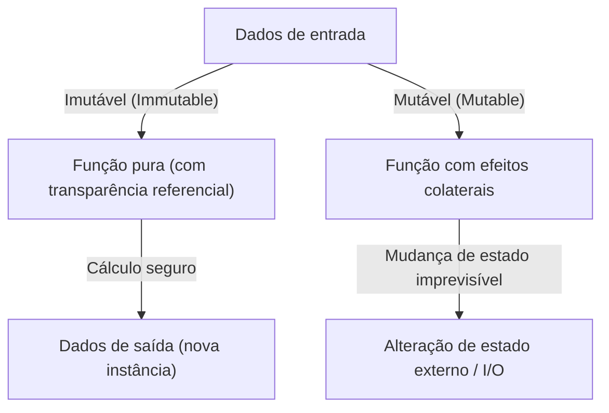
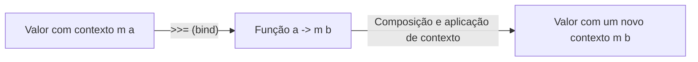

# Introdução: Por que Haskell?

Existem inúmeros paradigmas nas linguagens de programação: imperativo, orientado a objetos, procedural e funcional. Entre eles, o Haskell, chamado de "Linguagem Funcional Pura" (Purely Functional Language), exala uma presença única. Para muitos programadores, o Haskell tende a ter a imagem de ser "acadêmico demais", "pouco prático" ou de que "os mônadas são difíceis demais". No entanto, a filosofia de programação apresentada pelo Haskell está cheia de dicas poderosas para melhorar fundamentalmente a qualidade do código que escrevemos diariamente (JavaScript, Python, Rust, Go, etc.).

Neste artigo, partindo da filosofia por trás da linguagem Haskell, explicaremos em detalhes e a fundo desde as funções puras, o gerenciamento de efeitos colaterais, até o mundo dos "Mônadas" (Monads), onde muitos estudantes desistem. Ao terminar de ler este artigo, você entenderá que um mônada não é apenas um conceito matemático complexo, mas um elegante padrão de projeto na programação.

## 1. O Paradigma da Programação Funcional Pura

A base da programação funcional é a ideia de "tratar a computação como a avaliação de funções matemáticas". Especialmente em linguagens funcionais "puras" como o Haskell, essa regra é estritamente seguida.

### Transparência Referencial (Referential Transparency)

Uma das características mais importantes das linguagens funcionais puras é a "transparência referencial". Ela se refere à propriedade de que, mesmo substituindo qualquer expressão em um programa pelo seu resultado avaliado, o comportamento geral do programa não muda.

Por exemplo, suponha que exista uma função `f(x) = x + 1`. `f(2)` sempre retornará `3`. Quer você a execute hoje, amanhã ou no outro lado do mundo, o resultado sempre será `3`. Devido a essa propriedade de "sempre retornar a mesma saída para a mesma entrada", os programadores podem prever o comportamento do código sem se preocupar com o estado interno da função ou o ambiente externo.

### Imutabilidade (Immutability)

Nas linguagens funcionais puras, o valor de uma variável, uma vez definido, não pode ser alterado (imutabilidade). Não existe atribuição destrutiva como `x = x + 1`, comum em C ou Java. Em vez de alterar o estado, ela retorna dados com um novo estado modificado. Isso evita estruturalmente a ocorrência de bugs complexos, como condições de corrida (Race Conditions) em ambientes multithread.

## 2. Como Lidar com o "Mal" dos Efeitos Colaterais

Para que um programa seja útil no mundo real, é necessário exibir texto na tela, escrever em arquivos ou realizar comunicação de rede. Tudo isso é chamado de "Efeito Colateral" (Side Effect). Os efeitos colaterais quebram a transparência referencial. Isso ocorre porque uma "função que obtém a hora atual" ou uma "função que lê o conteúdo de um arquivo" pode ter resultados diferentes a cada vez que é executada.

O Haskell não proíbe completamente os efeitos colaterais. Se proibisse, o programa seria apenas uma existência sem sentido que esquenta a CPU. A abordagem do Haskell é o "isolamento dos efeitos colaterais". Ele usa o sistema de tipos para separar claramente o mundo dos cálculos puros do mundo impuro que envolve efeitos colaterais.

É aqui que, finalmente, surge o conceito de "Mônada".

## 3. O Caminho para os Mônadas: Functor e Applicative

Para entender os mônadas, o caminho mais curto é começar com os conceitos que servem de base: "Functor" (Functor) e "Applicative" (Applicative).

### Valores com Contexto (Context)

Ao programar, frequentemente lidamos não com o "valor" em si, mas com "um valor que possui algum contexto".
- Um contexto de que "o valor pode não existir" (Maybe / Optional)
- Um contexto de que "pode ter ocorrido um erro" (Either / Result)
- Um contexto de "ter múltiplos valores" (List)
- Um contexto de que "ainda não foi calculado (assíncrono)" (Promise / Future)

### Functor: Manipulando Valores Dentro de um Contexto

Um Functor é um mecanismo para aplicar funções a esses "valores com contexto" mantendo o contexto. Em Haskell, isso é definido como a função `fmap` (como operador, `<$>`).

Por exemplo, suponha que o valor `5` esteja dentro de uma caixa que diz "pode haver um valor (Maybe)" (`Just 5`). Se você quiser aplicar a função `(* 2)` a isso, abrir a caixa, calcular e colocá-la de volta na caixa é a abstração do Functor.

`fmap (* 2) (Just 5)` resulta em `Just 10`.
`fmap (* 2) Nothing` permanece `Nothing`.

### Applicative: Aplicando Funções em Contexto a Valores em Contexto

O Applicative é o que torna o Functor ainda mais poderoso. Se a própria função também estiver em um contexto (caixa), você poderá aplicá-la a um valor dentro de outra caixa (operador `<*>`). Isso facilita lidar com funções que recebem múltiplos argumentos dentro de um contexto.

## 4. Bem-vindo ao Mundo dos Mônadas (Monads)

Finalmente, os mônadas aparecem. Um mônada é um conceito derivado da "Teoria das Categorias" (Category Theory) na matemática, mas, na programação, a forma mais prática de compreendê-lo é como um "padrão de projeto para encadear cálculos que possuem um contexto".

Além dos cálculos que podem ser manipulados com Functor e Applicative, os mônadas têm a poderosa habilidade de "determinar o próximo cálculo (uma função que retorna um novo contexto) com base no resultado do cálculo anterior (o valor no contexto)".

### O Operador bind (`>>=`)

O núcleo do mônada é o operador chamado `>>=` (bind). Este operador tem o seguinte tipo (expressão simplificada):

`m a -> (a -> m b) -> m b`

1. `m a` : O valor `a` que tem um contexto `m` (exemplo: `Just 5`)
2. `(a -> m b)` : Uma função que recebe um valor normal `a` e retorna um valor `b` que tem um contexto `m`
3. Como resultado, é retornado um valor `m b` com um novo contexto

Através desse mecanismo, uma série de processos como "buscar um usuário no BD, se for encontrado obter o perfil desse usuário, e se for encontrado obter a URL da sua imagem" (todos com a possibilidade de falhar = retornar `Nothing`) pode ser conectada de forma elegante sem escrever código de tratamento de erros (correntes de checagem de null usando instruções if).

## 5. Exemplos Específicos e Praticidade dos Mônadas

Vejamos alguns dos mônadas representativos no Haskell. Todos eles compartilham a mesma interface do `>>=`, mas cada um oferece um "contexto" diferente.

### Mônada Maybe: Cálculos que Podem Falhar
Se ocorrer uma falha (`Nothing`) no meio do cálculo, os cálculos subsequentes serão ignorados e o resultado final será `Nothing`. Funciona de maneira semelhante ao operador de encadeamento opcional (`?.`) em outras linguagens.

### Mônada Either: Falhas com Motivos de Erro
Semelhante ao Maybe, mas permite carregar informações adicionais (`Left`), como mensagens de erro ou códigos de erro, em caso de falha. Serve como uma alternativa ao tratamento de exceções.

### Mônada State: Cálculos Envolvendo Estado
Um mônada para simular a "mudança de estado" em uma linguagem funcional pura. Ele oculta e passa o estado (State) através da cadeia de cálculos, permitindo que você escreva o código como se estivesse usando variáveis mutáveis.

### Mônada IO: Isolamento de Efeitos Colaterais
O mônada mais importante e o que torna o Haskell uma linguagem prática. Ele contém os efeitos colaterais das "interações com o mundo exterior" dentro da caixa "Mônada IO". O programa Haskell inteiro é representado como um único e gigantesco mônada IO, e todas as funções permanecem puras até que o ambiente de execução execute as ações IO no final.

## 6. A Filosofia da Programação: Teoria das Categorias e Computação

Há a famosa (e que confunde iniciantes) frase de que "um mônada é apenas um monóide na categoria de endofunctores" (A monad is just a monoid in the category of endofunctors) da teoria das categorias, mas para os engenheiros de software, o que importa não é o seu rigor matemático, e sim o seu "poder de abstração".

Com a existência da interface comum dos mônadas (type class), podemos lidar com conceitos completamente diferentes como "falha", "estado", "assincronicidade", "I/O" e "não determinismo (listas)" usando exatamente os mesmos operadores (`>>=`) ou sintaxe (notação `do`). Este é um salto extraordinário na expressividade.

## Conclusão: O Que o Haskell Nos Ensina

O mundo dos mônadas no Haskell pode parecer um penhasco íngreme no começo. Porém, uma vez que você alcança o topo e contempla a vista através dos mônadas, a sua perspectiva sobre programação muda fundamentalmente.

Como gerenciar os efeitos colaterais, como abstrair o estado, como escalar a composição de funções. Essas soluções apresentadas pelo Haskell e pelo paradigma funcional puro continuam a ter uma enorme influência nas linguagens modernas predominantes, como os tipos `Result` e `Option` do Rust, e `Promise` ou `async/await` no JavaScript.

Aprender Haskell não é apenas memorizar uma nova sintaxe, mas uma jornada para adquirir um novo "modelo mental" sobre a própria ação de computar.
