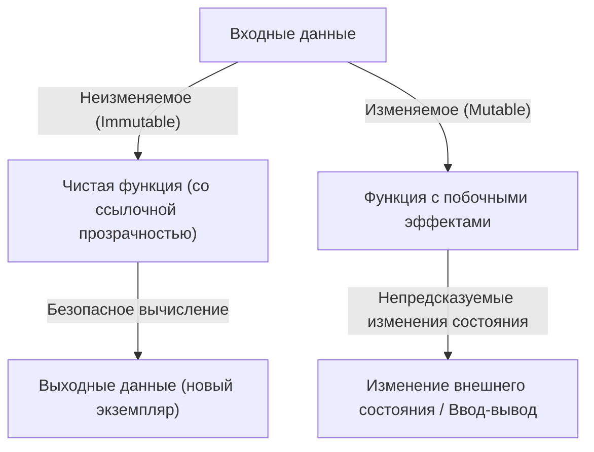

# Введение: Почему Haskell?

В языках программирования существует множество парадигм: императивная, объектно-ориентированная, процедурная и функциональная. Среди них Haskell, который называют «чисто функциональным языком» (Purely Functional Language), выделяется своим уникальным присутствием. У многих программистов сложилось представление, что Haskell «слишком академичен», «непрактичен» или что «монады слишком сложны». Однако философия программирования, предлагаемая Haskell, полна мощных идей для фундаментального улучшения качества кода, который мы пишем каждый день (на JavaScript, Python, Rust, Go и других языках).

В этой статье мы начнем с философии, лежащей в основе языка Haskell, и подробно исследуем чистые функции, управление побочными эффектами и мир «монад» (Monads), на котором сдаются многие ученики. К концу этой статьи вы поймете, что монада — это не просто непонятная математическая концепция, а элегантный паттерн проектирования в программировании.

## 1. Парадигма чисто функционального программирования

В основе функционального программирования лежит идея «рассматривать вычисления как оценку математических функций». В частности, в «чисто» функциональных языках, таких как Haskell, это правило соблюдается очень строго.

### Ссылочная прозрачность (Referential Transparency)

Одной из важнейших особенностей чисто функциональных языках является «ссылочная прозрачность». Это свойство означает, что если заменить любое выражение в программе результатом его вычисления, поведение всей программы не изменится.

Например, предположим, есть функция `f(x) = x + 1`. Вызов `f(2)` всегда возвращает `3`. Выполните его сегодня, завтра или на другой стороне земного шара — результат всегда будет `3`. Благодаря этому свойству «одинаковый вход всегда дает одинаковый выход» программист может предсказывать поведение кода, не беспокоясь о внутреннем состоянии функции или внешней среде.

### Неизменяемость (Immutability)

В чисто функциональных языках значения однажды определенных переменных не могут быть изменены (неизменяемость). Не существует деструктивного присваивания вроде `x = x + 1`, знакомого по C или Java. Вместо изменения состояния возвращаются данные с новым измененным состоянием. Структурно это исключает сложные ошибки, такие как состояние гонки (Race Condition) в многопоточных средах.

## 2. Как справляться со «злом» побочных эффектов

Чтобы программа была полезной в реальном мире, ей необходимо выводить текст на экран, записывать в файлы или осуществлять сетевое взаимодействие. Все это называется «побочными эффектами» (Side Effects). Побочные эффекты разрушают ссылочную прозрачность. Это происходит потому, что «функция получения текущего времени» или «функция чтения содержимого файла» могут менять результаты при каждом выполнении.

Haskell не запрещает побочные эффекты полностью. Если бы он это сделал, программа стала бы бессмысленным процессом, который только греет процессор. Подход Haskell — это «изоляция побочных эффектов». Он использует систему типов, чтобы четко разделить мир чистых вычислений и нечистый мир побочных эффектов.

И вот здесь наконец появляется концепция «монады».

## 3. Путь к монадам: Функтор (Functor) и Аппликатив (Applicative)

Чтобы понять монады, лучше всего начать с базовых концепций «функтора» (Functor) и «аппликатива» (Applicative).

### Значение с контекстом (Context)

При программировании часто приходится иметь дело не со «значениями» как таковыми, а со «значениями с каким-то контекстом».
- Контекст «значение может не существовать» (Maybe / Optional)
- Контекст «возможно, произошла ошибка» (Either / Result)
- Контекст «наличие нескольких значений» (List)
- Контекст «вычисление еще не завершено (асинхронность)» (Promise / Future)

### Функтор (Functor): Манипулирование значениями внутри контекста

Функтор — это механизм применения функции к этим «значениям с контекстом» с сохранением самого контекста. В Haskell он определен как функция `fmap` (в качестве оператора `<$>`).

Например, представьте, что в коробке «может быть значение (Maybe)» находится `5` (`Just 5`). Если мы хотим применить функцию `(* 2)` к этому значению, абстракция открытия коробки, вычисления и возвращения значения обратно в коробку — это и есть Функтор.

`fmap (* 2) (Just 5)` становится `Just 10`.
`fmap (* 2) Nothing` остается `Nothing`.

### Аппликатив (Applicative): Применение функций внутри контекста к значениям внутри контекста

Аппликатив делает Функтор еще более мощным. Если сама функция также находится в контексте (в коробке), её можно применить к значению внутри другой коробки (оператор `<*>`). Это позволяет легко работать с функциями, принимающими несколько аргументов в контексте.

## 4. Добро пожаловать в мир монад (Monad)

Наконец-то появились монады. Хотя монады — это концепция из математической «теории категорий» (Category Theory), в программировании их практичнее всего понимать как «паттерн проектирования для цепочек вычислений с контекстом».

Помимо вычислений, которые обрабатываются функторами и аппликативами, монады обладают мощной способностью «определять следующее вычисление (функцию, возвращающую новый контекст) на основе результата предыдущего вычисления (значения в контексте)».

### Оператор bind (`>>=`)

Основой монад является оператор, называемый `>>=` (bind). Этот оператор имеет следующий тип (упрощенное представление):

`m a -> (a -> m b) -> m b`

1. `m a` : Значение `a` в контексте `m` (например, `Just 5`)
2. `(a -> m b)` : Функция, принимающая обычное значение `a` и возвращающая значение `b` в контексте `m`
3. В результате возвращается значение `m b` в новом контексте

Благодаря этому механизму ряд операций (любая из которых может завершиться неудачей и вернуть `Nothing`), таких как «поиск пользователя в БД, в случае успеха — получение его профиля, а в случае успеха — получение URL его аватарки», может быть красиво связан без написания кода обработки ошибок (цепочек проверок на null с помощью инструкций if).

## 5. Конкретные примеры и практичность монад

Давайте рассмотрим некоторые типичные монады в Haskell. Все они используют один и тот же интерфейс `>>=`, но предоставляют разный «контекст».

### Монада Maybe: Вычисления, которые могут завершиться неудачей
Если во время вычисления происходит сбой (`Nothing`), последующие вычисления пропускаются, а конечный результат становится `Nothing`. Работает аналогично оператору безопасного вызова (`?.`) в других языках.

### Монада Either: Сбой с указанием причины ошибки
Похожа на Maybe, но в случае сбоя может нести дополнительную информацию (`Left`), такую как сообщение об ошибке или код ошибки. Служит альтернативой обработке исключений.

### Монада State: Вычисления с состоянием
Монада для симуляции «изменения состояния» в чисто функциональном языке. Скрывает передачу состояния (State) в цепочке вычислений, позволяя писать код так, как будто используются изменяемые переменные.

### Монада IO: Изоляция побочных эффектов
Самая важная монада, которая делает Haskell практичным языком. Она инкапсулирует побочный эффект «взаимодействия с внешним миром» в коробку под названием «монада IO». Вся программа на Haskell представлена как одна гигантская монада IO, и все функции остаются чистыми до тех пор, пока среда выполнения не выполнит это IO-действие в самом конце.

## 6. Философия программирования: Теория категорий и вычисления

Существует известное (и сбивающее с толку новичков) высказывание, что монада — это моноид в категории эндофункторов (A monad is just a monoid in the category of endofunctors). Однако для инженера-программиста важна не ее математическая строгость, а приносимая ею «сила абстракции».

Благодаря наличию общего интерфейса (класса типов), называемого монадой, мы можем работать с совершенно разными концепциями, такими как «сбой», «состояние», «асинхронность», «ввод-вывод» и «недетерминированность» (списки), используя одни и те же операторы (`>>=`) и синтаксис (нотация `do`). Это удивительный скачок в выразительности.

## Заключение: Чему нас учит Haskell

Сначала мир монад в Haskell может показаться крутой скалой. Однако, как только вы достигнете ее вершины и посмотрите на открывающийся через монады вид, ваш взгляд на программирование в корне изменится.

Как управлять побочными эффектами, как абстрагировать состояние, как масштабировать композицию функций. Решения, предлагаемые Haskell и чисто функциональной парадигмой, продолжают оказывать огромное влияние на современные мейнстримные языки: типы `Result` и `Option` в Rust, `Promise` и `async/await` в JavaScript и так далее.

Изучение Haskell — это не просто запоминание нового синтаксиса, это путешествие за новой «ментальной моделью» для самого процесса вычислений.
