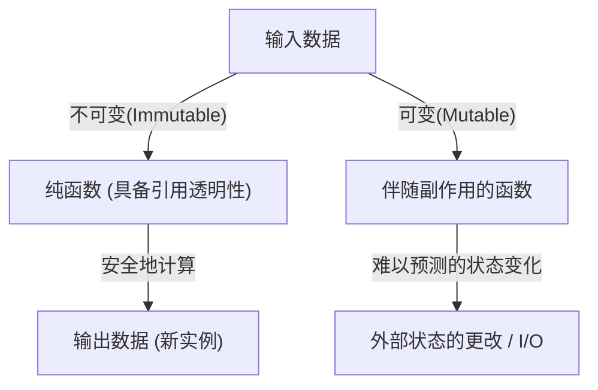

# 前言：为什么选择Haskell？

编程语言存在着许多范式。命令式、面向对象、过程式以及函数式。在这些范式中，被称为「纯函数式语言（Purely Functional Language）」的Haskell展现出了独特的存在感。对于许多程序员来说，Haskell往往给人留下「过于学术」、「不实用」、「Monad太难了」的印象。然而，Haskell所呈现的编程哲学，充满了能够从根本上提升我们日常编写的代码（如JavaScript、Python、Rust、Go等）质量的强大启示。

本文将从Haskell这门语言背后的哲学出发，深入且极其详尽地解析纯函数、副作用的管理，以及许多学习者感到挫败的「Monad」世界。当你读完这篇文章时，你将会明白Monad并不仅仅是一个晦涩难懂的数学概念，而是编程中优雅的设计模式。

## 1. 纯函数式编程的范式

函数式编程的根本在于「将计算视为数学函数的求值」这一理念。特别是在像Haskell这样的「纯」函数式语言中，这一规则被极其严格地遵守着。

### 引用透明性（Referential Transparency）

纯函数式语言最重要的特征之一就是「引用透明性」。这是指即使将程序中的任意表达式替换为其求值结果，程序整体的行为也不会改变的性质。

例如，假设有一个函数 `f(x) = x + 1`。`f(2)` 总是返回 `3`。无论你是今天执行、明天执行，还是在地球的另一端执行，结果必定是 `3`。这种「对相同的输入总是返回相同的输出」的性质，使得程序员可以在不关心函数内部状态或外部环境的情况下，预测代码的行为。

### 不可变性（Immutability）

在纯函数式语言中，一旦定义了变量的值，就无法更改（不可变性）。不存在C语言或Java中常见的类似 `x = x + 1` 的破坏性赋值。作为改变状态的替代，它会返回一个带有修改后新状态的数据。这使得在多线程环境中的竞争条件（Race Condition）等复杂漏洞，在结构上就不会发生。

## 2. 如何面对副作用这个「恶」

为了让程序在现实世界中发挥作用，必须要在屏幕上显示文字、写入文件或是进行网络通信。这些统称为「副作用（Side Effect）」。副作用会破坏引用透明性。因为「获取当前时间的函数」或「读取文件内容的函数」，每次执行时的结果都可能不同。

Haskell并没有完全禁止副作用。如果禁止的话，程序就会变成只能用来给CPU加热的毫无意义的存在。Haskell的做法是「隔离副作用」。它利用类型系统，将纯粹计算的世界与伴随着副作用的不纯世界明确地分离开来。

在这里登场的，终于就是「Monad」这个概念了。

## 3. 通往Monad之路：Functor与Applicative

为了理解Monad，最快的捷径是从作为其基础的「函子（Functor）」和「应用函子（Applicative）」的概念开始。

### 带有上下文（Context）的值

在编程时，我们经常处理的不是「值」本身，而是「带有着某种上下文的值」。
- 「值可能不存在」的上下文（Maybe / Optional）
- 「可能发生错误」的上下文（Either / Result）
- 「拥有多个值」的上下文（List）
- 「尚未被计算（异步）」的上下文（Promise / Future）

### 函子（Functor）：操作上下文中的值

Functor是一种机制，用于在保持上下文不变的情况下，将函数应用于这些「带有上下文的值」。在Haskell中，它被定义为 `fmap` 函数（作为运算符是 `<$>`）。

例如，假设在「可能存在值（Maybe）」的盒子里装着 `5`（`Just 5`）。如果你想对它应用 `(* 2)` 这个函数，将打开盒子、计算、然后再放回盒子的操作抽象化后的结果就是Functor。

`fmap (* 2) (Just 5)` 会变成 `Just 10`。
`fmap (* 2) Nothing` 则仍然是 `Nothing`。

### 应用函子（Applicative）：将上下文中的函数应用于上下文中的值

将Functor进一步强化的就是Applicative。当函数本身也处于上下文（盒子）中时，可以将其应用于另一个盒子中的值（运算符 `<*>`）。由此，我们可以轻松地在上下文中处理接收多个参数的函数。

## 4. 欢迎来到Monad的世界

终于轮到Monad登场了。Monad是一个源自数学「范畴论（Category Theory）」的概念，但在编程中，将其理解为「用于链式连接带有上下文的计算的设计模式」是最为实用的。

除了能够处理Functor和Applicative的计算之外，Monad还拥有一种强大的能力：「基于上一次的计算结果（处于上下文中的值），来决定下一次的计算（返回新上下文的函数）」。

### bind运算符（`>>=`）

Monad的核心是被称作 `>>=`（bind）的运算符。这个运算符具有以下类型（简化表示）：

`m a -> (a -> m b) -> m b`

1. `m a` : 带有上下文 m 的值 a（例：`Just 5`）
2. `(a -> m b)` : 接收普通值 a 并返回带有上下文 m 的值 b 的函数
3. 作为结果，返回一个带有新上下文的值 m b

借助这个机制，诸如「从数据库中查找用户，如果找到了就获取该用户的资料，如果找到了就获取其头像URL」这样一系列的处理（每一步都可能失败，即返回 `Nothing`），无需编写错误处理代码（使用if语句进行的连续null检查），就能优美地连接起来。

## 5. Monad的具体示例与实用性

让我们来看几个Haskell中具有代表性的Monad。它们都共享着相同的 `>>=` 接口，但分别提供着不同的「上下文」。

### Maybe Monad：可能会失败的计算
如果在计算途中发生了失败（`Nothing`），它将跳过之后的计算并将最终结果设为 `Nothing`。它的作用类似于其他语言中的空值条件运算符（`?.`）。

### Either Monad：带有错误原因的失败
与Maybe类似，但在失败时能够携带错误信息或错误代码等附加信息（`Left`）。它可以作为异常处理的替代方案。

### State Monad：伴随状态的计算
这是用于在纯函数式语言中模拟「状态变更」的Monad。在计算链中隐藏并传递状态（State），你可以写出仿佛在使用可变变量一般的代码。

### IO Monad：隔离副作用
这是最重要，也是使Haskell成为实用语言的Monad。它将「与外部世界交互」这一副作用封锁在名为「IO Monad」的盒子中。Haskell的整个程序被表示为一个巨大的IO Monad，在运行时环境最终执行该IO动作之前，所有的函数都保持着纯粹。

## 6. 编程哲学：范畴论与计算

关于Monad，有一句著名（并且让初学者感到困惑）的话：“Monad不过是自函子范畴上的一个幺半群（A monad is just a monoid in the category of endofunctors）”，但对软件工程师而言，比其数学严谨性更重要的是它所带来的「抽象化力量」。

正是由于存在Monad这样一个共同的接口（类型类），我们才能够使用完全相同的运算符（`>>=`）或语法（`do`记法）来处理「失败」、「状态」、「异步」、「I/O」、「非确定性（列表）」等截然不同的概念。这是表现力上一次惊人的飞跃。

## 结论：Haskell教给我们的事

Haskell的Monad世界，起初看起来可能像是一座陡峭的悬崖。然而，一旦你到达山顶，通过Monad俯瞰风景，你对编程的视角将会发生根本性的改变。

如何管理副作用，如何抽象状态，如何扩展函数的组合。Haskell和纯函数式范式所提出的这些解决方案，持续地对现代主流语言产生了深远的影响，例如Rust的 `Result` 类型和 `Option` 类型，JavaScript的 `Promise` 和 `async/await` 等。

学习Haskell不仅仅是记住新的语法，而是一次获得对于计算行为本身全新「心智模型」的旅程。
