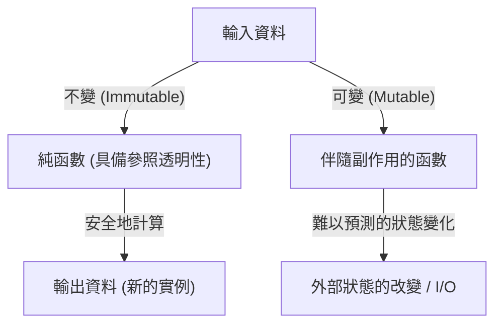
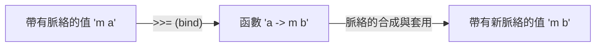

# 前言：為什麼選擇 Haskell？

程式語言存在著許多典範 (Paradigm)。指令式 (Imperative)、物件導向 (Object-Oriented)、程序式 (Procedural)，以及函數式 (Functional)。其中，被稱為「純函數式程式語言 (Purely Functional Language)」的 Haskell，散發著獨特的存在感。對於許多程式設計師來說，Haskell 往往給人「過於學術」、「不實用」、「單子 (Monad) 太難」等印象。然而，Haskell 所提示的程式設計哲學，充滿了能從根本上提升我們日常編寫程式碼 (如 JavaScript, Python, Rust, Go 等) 品質的強大啟發。

本文將從 Haskell 這個語言背後的哲學出發，從純函數、副作用的管理，一直到讓許多學習者受挫的「單子 (Monad)」世界，進行非常詳細且深入的解說。當您讀完這篇文章時，您將能理解單子不僅僅是一個艱澀的數學概念，更是程式設計中一種優雅的設計模式。

## 1. 純函數式程式設計的典範

函數式程式設計的根本在於「將計算視為數學函數的求值」這種思維。特別是在像 Haskell 這樣的「純」函數式語言中，這項規則被極其嚴格地遵守。

### 參照透明性（Referential Transparency）

純函數式語言最重要的特徵之一就是「參照透明性」。這指的是，即使將程式中任意的表達式替換為其求值結果，程式整體的行為也不會改變的性質。

例如，假設有一個函數 `f(x) = x + 1`。`f(2)` 總是回傳 `3`。無論是今天執行、明天執行，還是在地球的另一端執行，結果必定是 `3`。由於這種「相同的輸入總是回傳相同的輸出」的性質，程式設計師無需顧慮函數的內部狀態或外部環境，就能預測程式碼的行為。

### 不變性（Immutability）

在純函數式語言中，變數一旦被定義，其值就無法改變（不變性）。在 C 語言或 Java 中常見的如 `x = x + 1` 這種破壞性賦值並不存在。取而代之的是，它會回傳一個帶有修改後新狀態的資料，而不是直接改變原有狀態。如此一來，在多執行緒環境中的競爭危害（Race Condition）等複雜的錯誤，在結構上就不會發生。

## 2. 如何面對名為「副作用」的「惡」

為了讓程式在現實世界中發揮作用，我們必須在畫面上顯示文字、寫入檔案，或是進行網路通訊。這些全都被稱為「副作用 (Side Effect)」。副作用會破壞參照透明性。因為「取得現在時間的函數」或「讀取檔案內容的函數」，每次執行時結果都有可能不同。

Haskell 並不是完全禁止副作用。如果禁止了，程式將變成只會讓 CPU 發熱的無意義存在。Haskell 的方法是「隔離副作用」。它利用型別系統，將純粹的計算世界與伴隨著副作用的不純世界明確地分離開來。

在此登場的，終於是名為「單子 (Monad)」的概念。

## 3. 邁向單子之路：函子（Functor）與應用函子（Applicative）

為了理解單子，從作為其基礎的「函子 (Functor)」與「應用函子 (Applicative)」這兩個概念切入是一條捷徑。

### 帶有脈絡（Context）的值

在進行程式設計時，我們經常處理的不是「值」本身，而是「帶有某種脈絡的值」。
- 「值可能不存在」的脈絡（Maybe / Optional）
- 「可能發生了錯誤」的脈絡（Either / Result）
- 「持有多個值」的脈絡（List）
- 「尚未被計算（非同步）」的脈絡（Promise / Future）

### 函子（Functor）：操作脈絡中的值

Functor 是一種機制，能對這些「帶有脈絡的值」，在維持脈絡的情況下套用函數。在 Haskell 中，它被定義為 `fmap` 這個函數（作為運算子則是 `<$>`）。

例如，假設在「可能有值 (Maybe)」這個盒子裡裝著 `5`（`Just 5`）。如果想對它套用 `(* 2)` 這個函數，Functor 抽象化了「打開盒子、進行計算、再放回盒子裡」這個過程。

`fmap (* 2) (Just 5)` 會變成 `Just 10`。
`fmap (* 2) Nothing` 則依然是 `Nothing`。

### 應用函子（Applicative）：將脈絡中的函數套用到脈絡中的值

將 Functor 進一步強化的就是 Applicative。當函數本身也位於脈絡（盒子）中時，可以將其套用到另一個盒子裡的值上（運算子 `<*>`）。如此一來，就能在脈絡中輕易地處理接收多個參數的函數。

## 4. 歡迎來到單子（Monad）的世界

單子終於登場了。單子是源自於數學「範疇論 (Category Theory)」的概念，但在程式設計中，將其理解為「用來串聯 (連鎖) 帶有脈絡的計算的一種設計模式」是最實用的。

除了能處理 Functor 和 Applicative 所能處理的計算外，單子還擁有一種強大的能力：「根據前一個計算的結果（位於脈絡中的值），決定下一個計算（回傳新脈絡的函數）」。

### bind 運算子（`>>=`）

單子的核心是被稱為 `>>=` (bind) 的運算子。這個運算子具有以下型別（簡化表示）：

`m a -> (a -> m b) -> m b`

1. `m a` : 帶有脈絡 `m` 的值 `a` （例：`Just 5`）
2. `(a -> m b)` : 接收普通的值 `a`，並回傳帶有脈絡 `m` 的值 `b` 的函數
3. 結果會回傳一個帶有新脈絡的值 `m b`

透過這種機制，例如「從 DB 搜尋使用者，若找到則取得該使用者的個人資料，若又找到則取得其圖片 URL」這樣一連串的處理（每一項都有可能失敗＝回傳 `Nothing`），我們可以優雅地串接起來，而不需要寫任何錯誤處理的程式碼（利用 if 語句進行 null 檢查的連鎖）。

## 5. 單子的具體範例與實用性

讓我們來看看幾個 Haskell 中具代表性的單子。它們全部共享同一個 `>>=` 介面，但各自提供不同的「脈絡」。

### Maybe 單子：可能會失敗的計算
當計算途中發生失敗（`Nothing`）時，會跳過之後的計算，並將最終結果設為 `Nothing`。它的作用類似於其他語言中的 Null 條件運算子（`?.`）。

### Either 單子：帶有錯誤原因的失敗
與 Maybe 相似，但在失敗時可以攜帶錯誤訊息或錯誤代碼等額外資訊（`Left`）。它是例外處理的替代方案。

### State 單子：伴隨狀態的計算
在純函數式語言中用來模擬「狀態改變」的單子。在計算的連鎖中隱藏並傳遞狀態 (State)，讓您可以寫出彷彿在使用可變變數般的程式碼。

### IO 單子：隔離副作用
這是最重要，也是讓 Haskell 成為實用語言的單子。它將「與外界互動」這種副作用封裝進名為「IO 單子」的盒子裡。整個 Haskell 程式被表現為一個巨大的 IO 單子，直到執行環境在最後執行該 IO 動作為止，所有的函數都會保持純粹。

## 6. 程式設計的哲學：範疇論與計算

關於單子，有一句著名（同時也讓初學者困惑）的話：「單子不過就是自函子範疇上的一個么半群 (A monad is just a monoid in the category of endofunctors)」。然而，對於軟體工程師來說，比起數學上的嚴謹性，更重要的是它所帶來的「抽象化力量」。

正因為存在著單子這個共通的介面（型別類別），我們才能將「失敗」、「狀態」、「非同步」、「I/O」、「非決定性（串列）」等截然不同的概念，用完全相同的運算子（`>>=`）或語法（`do` 記法）來處理。這是表達能力上驚人的飛躍。

## 結論：Haskell 教會我們的事

Haskell 的單子世界，一開始看起來可能像是陡峭的懸崖。然而，一旦您抵達頂峰，並透過單子來眺望風景，您對程式設計的觀點將會從根本改變。

如何管理副作用、如何抽象化狀態、如何擴展函數的合成。Haskell 與純函數式典範所提出的這些解決方案，至今仍對 Rust 的 `Result` 型別或 `Option` 型別、JavaScript 的 `Promise` 或 `async/await` 等現代主流語言產生著巨大的影響。

學習 Haskell，不僅僅是記住新的語法，而是一趟為「計算」這個行為本身，獲得嶄新「心智模式 (Mental Model)」的旅程。
