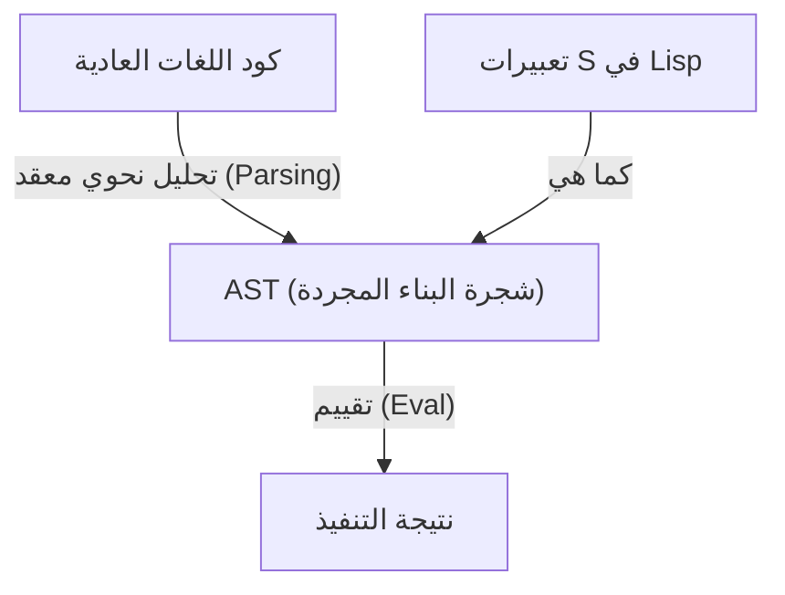
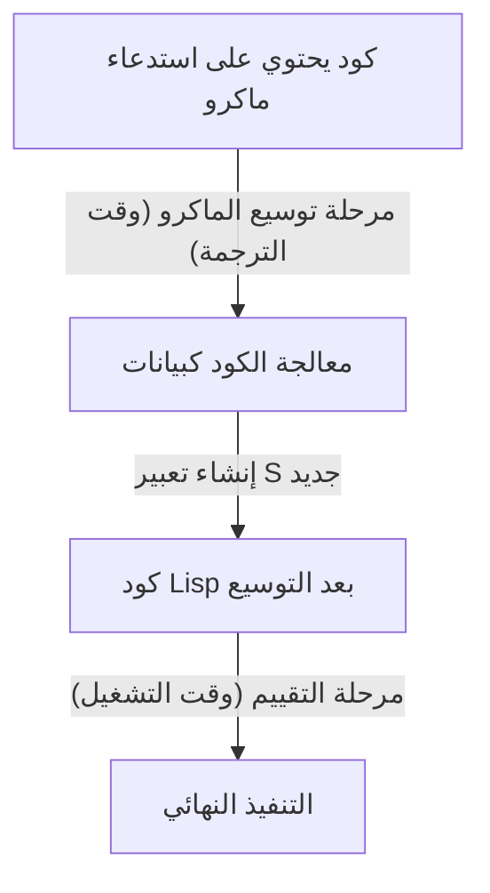

# Lisp و"لغة الإله" - جمال تعبيرات S وفلسفة الكود كبيانات

يوجد في عالم البرمجة لغات تتناقل كأنها نوع من "الأساطير". في مقدمة هذه اللغات تأتي لغة **Lisp (List Processing)** التي ابتكرها جون مكارثي في عام 1958. لا تقتصر Lisp على كونها مجرد لغة برمجة كأداة، بل يُشار إليها أحياناً بـ "لغة الإله" التي تجسد الجمال الأساسي لعلوم الحاسوب.

في هذا المقال، سنتعمق في استكشاف سبب الحب الجارف للغة Lisp، والذي يصل أحياناً إلى حد التقديس الديني، وذلك من خلال الغوص في جوهرها: جمال "تعبيرات S (S-expressions)"، والمفهوم المذهل لـ "التماثل البنيوي (Homoiconicity)"، وأعماق البرمجة الميتية (Metaprogramming) التي توفرها فلسفة الكود كبيانات.

## الفصل الأول: فجر علوم الحاسوب ورؤية مكارثي

في الخمسينيات من القرن الماضي، كانت أجهزة الكمبيوتر تُعتبر بشكل أساسي آلات حاسبة ضخمة لإجراء العمليات الحسابية الرقمية. وفي الوقت الذي تم فيه ابتكار FORTRAN للحسابات العلمية والتقنية، وتصميم COBOL للاستخدامات التجارية، كان لدى جون مكارثي وجهة نظر مختلفة تماماً. فقد كان يبحث عن طريقة لـ "المعالجة الرمزية (Symbolic Processing)"، أي تمثيل الفكر البشري والمنطق نفسه ومعالجته على الكمبيوتر.

استلهم مكارثي من "حساب التفاضل والتكامل لامدا (Lambda Calculus)" لألونزو تشيرش، وقام ببناء الأساس النظري للغة يمكنها كتابة دوال رياضية بحتة. وكانت النتيجة هي Lisp، التي تمثل بنية البرنامج في بنية بيانات بسيطة للغاية تُعرف بالقائمة (List).

منذ ولادتها، رسخت Lisp مكانتها كلغة قياسية في أبحاث الذكاء الاصطناعي (AI). والسبب في ذلك هو أنه من أجل نمذجة عملية التفكير البشري، كان من الضروري وجود بنية بيانات مرنة (قائمة) يمكن أن تتغير وتنمو ديناميكياً أثناء تنفيذ البرنامج، بدلاً من هياكل البيانات الثابتة المحددة مسبقاً.

## الفصل الثاني: الجمال المذهل لتعبيرات S (S-expressions)

الميزة الأكبر في Lisp، والتي تميزها عن كل اللغات الأخرى، هي **تعبيرات S (Symbolic Expressions)**. تعبيرات S هي مجرد قوائم عناصرها محاطة بأقواس.

```lisp
(+ 1 2)
(defun factorial (n)
  (if (<= n 1)
      1
      (* n (factorial (- n 1)))))
```

أولئك الذين يرون Lisp لأول مرة قد يغمرهم سيل الأقواس التي لا تعد ولا تحصى. وقد يتم السخرية منها أحياناً ووصفها بـ "Lots of Irritating Superfluous Parentheses (جبال من الأقواس المزعجة غير الضرورية)". ومع ذلك، يكمن وراء هذه الصيغة التي تبدو غريبة، شمولية وأناقة مطلقة.

لغات البرمجة الحديثة (مثل Python وJava وC++) تمتلك قواعد نحوية (Syntax) معقدة تركز على سهولة القراءة البشرية. هناك قواعد نحوية فريدة لكل من جمل if، وحلقات for، وتعريف الدوال، وما إلى ذلك. يقوم المترجم (Compiler) أو المفسر (Interpreter) بقراءة الكود المصدري هذا، وتحويله (Parsing) داخلياً إلى بنية بيانات شجرية تسمى **شجرة البناء المجردة (AST: Abstract Syntax Tree)** قبل معالجته.

في المقابل، تعبيرات S في Lisp تعني أن **المبرمج يكتب AST مباشرة بيده**.



تعتبر تعبيرات S صيغة عالمية قادرة على تمثيل بنية أي بيانات أو برنامج. قبل عقود من اختراع XML أو JSON، وصلت Lisp بالفعل إلى الحل النهائي المتمثل في "تمثيل بيانات البنية الشجرية كنص". خطط مكارثي في البداية لإدخال صيغة عامة تسمى "تعبيرات M (M-expressions)" للبشر، ولكن المبرمجين فضلوا الاستمرار في استخدام تعبيرات S البسيطة والمنتظمة، ونتيجة لذلك اختفت تعبيرات M في طيات التاريخ.

## الفصل الثالث: التماثل البنيوي (Homoiconicity) والكود كبيانات

ينبع الرعب الحقيقي (والجمال) لتعبيرات S من حقيقة أن **"كود البرنامج نفسه هو بنية البيانات الأساسية لـ Lisp (القائمة)"**. يُطلق على هذا في مصطلحات علوم الحاسوب اسم **التماثل البنيوي (Homoiconicity)**.

في Lisp، القائمة `(1 2 3)` كبيانات، والكود `(+ 1 2)` كبرنامج، متطابقان هيكلياً تماماً. يرى مفسر Lisp العنصر الأول في القائمة كدالة (أو ماكرو)، ويقوم ببساطة بتقييم العناصر المتبقية كمعاملات.

هذه الخاصية المتمثلة في "عدم وجود حدود بين الكود والبيانات" ولّدت الفلسفة القوية المتمثلة في **الكود كبيانات (Code as Data)**.

يمكن لبرنامج Lisp، أثناء وقت التشغيل، قراءة الكود الخاص به كبيانات، ومعالجته، وإنشاء كود جديد وتنفيذه. الأشياء التي تُقدم كميزات متقدمة ومعقدة مثل الانعكاس (Reflection) والبرمجة الميتية (Metaprogramming) في اللغات الأخرى، ليست سوى عمليات قائمة بسيطة (`car`, `cdr`, `cons` وغيرها) في Lisp.

## الفصل الرابع: امتلاك قوة الإله - سحر الماكرو

أعظم فائدة يوفرها التماثل البنيوي هي نظام **الماكرو (Macro)** في Lisp. يختلف هذا النظام اختلافاً جذرياً عن ماكرو استبدال النص في لغة C. ماكرو Lisp هو **"برنامج Lisp يتم تنفيذه في وقت الترجمة (Compile time)"**.

يستقبل الماكرو تعبير S (مقطع كود) قبل التقييم كمعامل، وينفذ أي عمليات قائمة تعسفية، ويرجع تعبير S جديد (الكود المحول). يتيح ذلك للمبرمجين توسيع مترجم اللغة بحرية وإنشاء بناء جملة جديد (DSL: Domain Specific Language) مُحسّن لمهامهم الخاصة.



في كتابه "Hackers & Painters"، يصف بول جراهام (Paul Graham) تطور لغات البرمجة بأنه "استعارة ميزات من لغات أخرى"، ولكن هذا لا يعني شيئاً لمستخدمي Lisp. "Lisp تفتقر إلى البرمجة كائنية التوجه؟ إذن أضفها باستخدام ماكرو." "تريد مطابقة الأنماط (Pattern matching)؟ اكتبها باستخدام ماكرو." في الواقع، معظم نظام CLOS (Common Lisp Object System)، وهو نظام التوجه الكائني القوي في Lisp، يتم تنفيذه بواسطة الماكرو من خلال Lisp نفسها.

باستخدام الماكرو، لم يعد المبرمجون مقيدين بقرارات مصممي اللغة. يمكنهم تطوير اللغة بأيديهم. هذا هو السبب في أن مبرمجي Lisp يفتخرون أحياناً بلغتهم لدرجة تبدو فيها متعجرفة، ولهذا السبب تُسمى بـ "لغة الإله".

## الفصل الخامس: لماذا لا تحكم Lisp العالم؟ (لعنة Lisp)

إذا كانت هذه اللغة قوية وجميلة إلى هذا الحد، فلماذا لا تتم كتابة جميع البرامج في العالم بلغة Lisp؟

أحد الأسباب يكمن في درجة حريتها العالية نفسها. البعض يسمي هذا **"لعنة Lisp (The Lisp Curse)"**.

لأن Lisp قوية جداً، يمكن لهاكر واحد لامع إنشاء أدوات وDSL خاصة ومُحسّنة لمشروعه على الفور، دون انتظار المكتبات أو الأدوات الحالية. ونتيجة لذلك، من الصعب أن ينمو نظام بيئي للمكتبات القياسية، وتصبح المشاريع الفردية عرضة لأن تكون "لهجات لا يمكن لأحد غير مطورها فهمها تماماً".

بالإضافة إلى ذلك، فإن الغرابة البصرية المتمثلة في "موجة الأقواس" المذكورة سابقاً، وحقيقة أن البرمجة الميتية القوية جداً تقلل من إمكانية القراءة في تطوير الفريق (الماكرو السحري الذي أنشأه شخص واحد لا يمكن للأعضاء الآخرين فك شفرته)، هي عوامل أعاقت انتشارها في الصناعة. في هندسة البرمجيات الحديثة، حيث يتم التطوير بواسطة فرق ضخمة من المبرمجين العاديين، تميل اللغات "شديدة التقييد التي تبدو متشابهة بغض النظر عمن يكتبها"، مثل Java أو Go، إلى أن تكون مفضلة.

## الفصل السادس: الحمض النووي لـ Lisp يستمر في العيش

ومع ذلك، لم تُهزم Lisp. لقد أثرت أفكار Lisp بعمق على كل لغات البرمجة الحديثة تقريباً.

جمع القمامة (Garbage Collection)، الكتابة الديناميكية (Dynamic typing)، بيئة التقييم التفاعلي (REPL)، دوال الدرجة الأولى (First-class functions / Closures)، والتفرع الشرطي (if-then-else) - كل هذه الأشياء قدمتها Lisp بشكل رائد، واعتمدتها اللغات اللاحقة كميزات قياسية. المبرمج الحديث يكتب الكود دائماً على إرث Lisp، سواء بوعي أو بغير وعي.

علاوة على ذلك، فإن السلالة المباشرة لـ Lisp لا تزال تحافظ على حضور قوي، مثل النجاح العملي لـ **Clojure** التي تعمل على JVM، والعمر شبه الأبدي لـ **Emacs Lisp** التي تشغل GNU Emacs، و **Scheme** التي لا تزال محبوبة للأغراض التعليمية.

## الخاتمة: تغيير في المنظور

تعلم Lisp ليس مجرد حفظ بناء جملة أو مكتبات جديدة. إنه **تحول نموذجي (Paradigm Shift)**، وتغيير جذري في المنظور تجاه فعل البرمجة نفسه.

تذوب الحدود بين الكود والبيانات، ويعيد البرنامج كتابة نفسه بشكل متكرر. في الأساس، لا يوجد سوى عدد قليل من العمليات الأساسية وبنية جميلة ومبسطة إلى أقصى حد تسمى تعبيرات S.

إذا كنت تشعر بالاختناق من قيود أطر العمل (Frameworks) وكود النماذج المعيارية (Boilerplate) المتكرر في برمجتك اليومية، فيرجى الدخول إلى عالم Lisp (Clojure أو Scheme جيدة أيضاً) ولو لمرة واحدة. عندما تلمس جزءاً من "لغة الإله"، فمن المؤكد أن طريقتك في رؤية العالم ستصبح مختلفة قليلاً عما كانت عليه من قبل.
