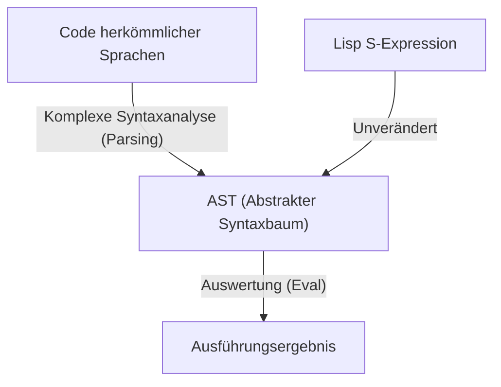
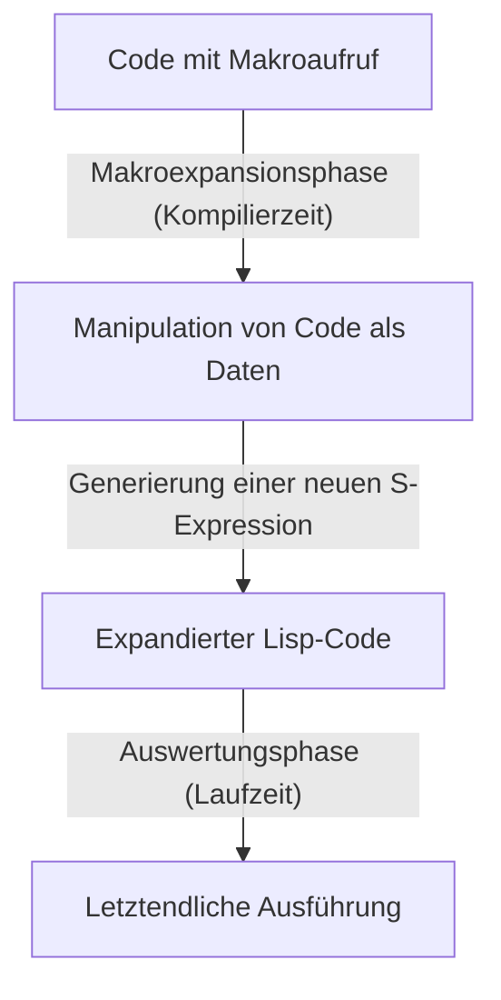

# Lisp und die „Sprache Gottes“ – Die Schönheit der S-Expressions und die Code-as-Data-Philosophie

In der Welt des Programmierens gibt es Sprachen, die als eine Art „Mythos“ weitergegeben werden. Allen voran steht **Lisp (List Processing)**, das 1958 von John McCarthy erschaffen wurde. Lisp ist nicht nur eine Programmiersprache als bloßes Werkzeug, sondern wird manchmal sogar als „Sprache Gottes“ bezeichnet, welche die grundlegende Schönheit der Informatik verkörpert.

In diesem Artikel werden wir tiefgründig untersuchen, warum Lisp so enthusiastisch geliebt wird und manchmal fast religiöse Ehrfurcht weckt. Im Mittelpunkt stehen die Schönheit der „S-Expressions (S-Ausdrücke)“, das erstaunliche Konzept der „Homoikonizität (Homoiconicity)“ und die tiefen Abgründe der Metaprogrammierung, die durch Code-as-Data ermöglicht werden.

## Kapitel 1: Die Morgendämmerung der Informatik und McCarthys Vision

In den 1950er Jahren wurden Computer hauptsächlich als riesige Rechenmaschinen für numerische Berechnungen angesehen. Während FORTRAN für wissenschaftlich-technische Berechnungen geboren wurde und COBOL für Geschäftsanwendungen entworfen wurde, hatte John McCarthy eine völlig andere Perspektive. Er suchte nach Wegen der „Symbolverarbeitung (Symbolic Processing)“, d. h. Methoden, menschliches Denken und Logik selbst auf einem Computer darzustellen und zu manipulieren.

Inspiriert vom „Lambda-Kalkül (Lambda Calculus)“ von Alonzo Church, konstruierte McCarthy eine theoretische Grundlage für eine Sprache, die rein mathematische Funktionen beschreiben konnte. Das Ergebnis war Lisp, das die Struktur eines Programms mit einer extrem einfachen Datenstruktur namens Liste (List) darstellt.

Unmittelbar nach seiner Entstehung etablierte sich Lisp als Standardsprache in der Erforschung der Künstlichen Intelligenz (KI). Das liegt daran, dass zur Modellierung menschlicher Denkprozesse eine flexible Datenstruktur (die Liste), die während der Ausführung des Programms dynamisch wachsen und sich verändern kann, unerlässlich war, anstatt einer vordefinierten statischen Datenstruktur.

## Kapitel 2: Die überwältigende Schönheit von S-Expressions

Das größte Merkmal von Lisp und das Element, das es von allen anderen Sprachen abhebt, sind die **S-Expressions (Symbolic Expressions)**. S-Expressions sind einfach Listen, deren Elemente in Klammern eingeschlossen sind.

```lisp
(+ 1 2)
(defun factorial (n)
  (if (<= n 1)
      1
      (* n (factorial (- n 1)))))
```

Wer Lisp zum ersten Mal sieht, mag von den endlosen Wellen an Klammern überwältigt sein. Es wird manchmal sogar als „Lots of Irritating Superfluous Parentheses (Ein Haufen irritierender überflüssiger Klammern)“ verspottet. Doch hinter dieser scheinbar seltsamen Syntax verbirgt sich ultimative Universalität und Eleganz.

Moderne Programmiersprachen (Python, Java, C++ usw.) haben eine komplexe Syntax, die auf menschliche Lesbarkeit ausgerichtet ist. if-Anweisungen, for-Schleifen, Funktionsdefinitionen etc. – für all diese gibt es jeweils eigene Syntaxregeln. Compiler oder Interpreter lesen diesen Quellcode und transformieren (parsen) ihn intern in eine Baumdatenstruktur, den sogenannten **Abstrakten Syntaxbaum (AST: Abstract Syntax Tree)**, bevor sie ihn verarbeiten.

Im Gegensatz dazu bedeutet die S-Expression von Lisp synonym, dass **der Programmierer den AST direkt von Hand schreibt**.



S-Expressions sind ein universelles Format, das beliebige Daten- und Programmstrukturen darstellen kann. Jahrzehnte vor der Erfindung von XML oder JSON hatte Lisp bereits die ultimative Lösung erreicht: „baumstrukturierte Daten als Text darstellen“. McCarthy plante ursprünglich, eine allgemeine Syntax namens „M-Expressions (M-Ausdrücke)“ für Menschen einzuführen, aber Programmierer zogen es vor, die einfachen und regelmäßigen S-Expressions zu verwenden, und als Ergebnis verschwanden die M-Expressions in der Dunkelheit der Geschichte.

## Kapitel 3: Homoikonizität und Code-as-Data

Das wahre Erschreckende (und die Schönheit) von S-Expressions rührt von der Tatsache her, dass **„der Programmcode selbst die grundlegende Datenstruktur (Liste) von Lisp ist“**. Dies wird in der Terminologie der Informatik als **Homoikonizität (Homoiconicity)** bezeichnet.

In Lisp sind die Liste als Daten `(1 2 3)` und der Code als Programm `(+ 1 2)` strukturell exakt dasselbe. Der Lisp-Interpreter betrachtet einfach das erste Element der Liste als Funktion (oder Makro) und wertet die verbleibenden Elemente als Argumente aus.

Diese Eigenschaft der „Nichtexistenz einer Grenze zwischen Code und Daten“ hat die mächtige Philosophie **Code-as-Data** hervorgebracht.

Ein Lisp-Programm kann seinen eigenen Code zur Laufzeit als Daten einlesen, manipulieren, neuen Code generieren und ausführen. Was in anderen Sprachen als fortgeschrittene und komplexe Funktionen wie Reflektion oder Metaprogrammierung bereitgestellt wird, ist in Lisp nur einfache Listenmanipulation (`car`, `cdr`, `cons` usw.).

## Kapitel 4: Die Macht Gottes erlangen – Die Magie der Makros

Der größte Vorteil der Homoikonizität ist das **Makrosystem (Macro)** von Lisp. Es unterscheidet sich grundlegend von Text-Ersetzungsmakros in der C-Sprache. Lisp-Makros sind **„Lisp-Programme, die zur Kompilierzeit ausgeführt werden“**.

Ein Makro nimmt unevaluierte S-Expressions (Code-Fragmente) als Argumente, führt beliebige Listenmanipulationen durch und gibt eine neue S-Expression (den transformierten Code) zurück. Dadurch können Programmierer den Compiler der Sprache frei erweitern und neue Syntax (DSL: Domain Specific Language) erstellen, die für ihre eigenen Aufgaben optimiert ist.



Paul Graham beschreibt in seinem Buch „Hackers & Painters“ die Evolution von Programmiersprachen als „Ausleihen von Funktionen aus anderen Sprachen“, aber für Lisp-Benutzer ist das bedeutungslos. „Lisp fehlt Objektorientierung? Dann füge sie mit einem Makro hinzu.“ „Du willst Pattern Matching? Lass es uns mit einem Makro schreiben.“ Tatsächlich ist ein Großteil des CLOS (Common Lisp Object System), dem mächtigen objektorientierten System von Lisp, mit Makros durch Lisp selbst implementiert.

Mit Makros sind Programmierer nicht länger an die Entscheidungen von Sprachdesignern gebunden. Sie können die Sprache mit ihren eigenen Händen weiterentwickeln. Das ist der Grund, warum Lisp-Programmierer so stolz auf ihre eigene Sprache sind, dass es manchmal arrogant erscheint, und warum sie „Sprache Gottes“ genannt wird.

## Kapitel 5: Warum wird die Welt nicht von Lisp beherrscht? (Der Lisp-Fluch)

Wenn es eine so mächtige und schöne Sprache ist, warum ist dann nicht jede Software auf der Welt in Lisp geschrieben?

Ein Grund liegt in genau diesem hohen Grad an Freiheit. Manche nennen dies den **„Lisp-Fluch (The Lisp Curse)“**.

Weil Lisp so mächtig ist, kann ein einziger fähiger Hacker sofort eine maßgeschneiderte DSL und ein Toolset für sein Projekt erstellen, ohne auf bestehende Bibliotheken und Werkzeuge zu warten. Infolgedessen ist es schwierig, ein standardisiertes Bibliotheks-Ökosystem zu entwickeln, und es ist das Problem entstanden, dass einzelne Projekte dazu neigen, zu „Dialekten, die nur von ihrem Entwickler vollständig verstanden werden können“, zu werden.

Auch das bereits erwähnte visuelle Fremdheitsgefühl der „Klammerwellen“ und der Aspekt, dass eine zu mächtige Metaprogrammierung die Lesbarkeit in der Teamentwicklung verringert (andere Mitglieder können ein magisches Makro, das von einer Person erstellt wurde, nicht entschlüsseln), sind Faktoren, die seine Verbreitung in der Industrie behindert haben. Im modernen Software Engineering, wo die Entwicklung in Teams von vielen durchschnittlichen Leuten durchgeführt wird, werden Sprachen wie Java oder Go bevorzugt, die „stark eingeschränkt sind und gleich aussehen, egal wer sie schreibt“.

## Kapitel 6: Die DNA von Lisp lebt weiter

Aber Lisp wurde nicht besiegt. Die Ideen von Lisp haben fast alle modernen Programmiersprachen tiefgreifend beeinflusst.

Garbage Collection (GC), dynamische Typisierung, REPL (Interaktive Auswertungsumgebung), First-Class-Funktionen (Closures), bedingte Verzweigungen (if-then-else) – all dies wurde zuerst von Lisp eingeführt und später als Standardfunktionen von nachfolgenden Sprachen übernommen. Moderne Programmierer schreiben Code, bewusst oder unbewusst, immer auf dem Erbe von Lisp.

Darüber hinaus haben die direkten Nachkommen von Lisp immer noch eine starke Präsenz, wie der praktische Erfolg von **Clojure**, das auf der JVM läuft, die scheinbar ewige Lebensdauer von **Emacs Lisp**, das GNU Emacs antreibt, und **Scheme**, das für Bildungszwecke weiterhin geliebt wird.

## Fazit: Ein Perspektivenwechsel

Lisp zu lernen bedeutet nicht nur, neue Grammatik oder Bibliotheken auswendig zu lernen. Es ist ein **Paradigmenwechsel** und ein fundamentaler Perspektivenwechsel auf den Akt des Programmierens selbst.

Die Grenze zwischen Code und Daten verschmilzt, und das Programm schreibt sich rekursiv selbst um. An der Basis davon existieren nur ein paar grundlegende Operationen und eine wunderschöne Struktur namens S-Expression, die auf das absolute Minimum reduziert wurde.

Wenn Sie in Ihrer täglichen Programmierung von den Einschränkungen von Frameworks oder redundantem Boilerplate-Code erstickt werden, treten Sie bitte einmal in die Welt von Lisp (Clojure oder Scheme ist auch in Ordnung) ein. Wenn Sie einen flüchtigen Blick auf die „Sprache Gottes“ erhascht haben, wird die Art, wie Sie die Welt sehen, sicherlich etwas anders sein als zuvor.
