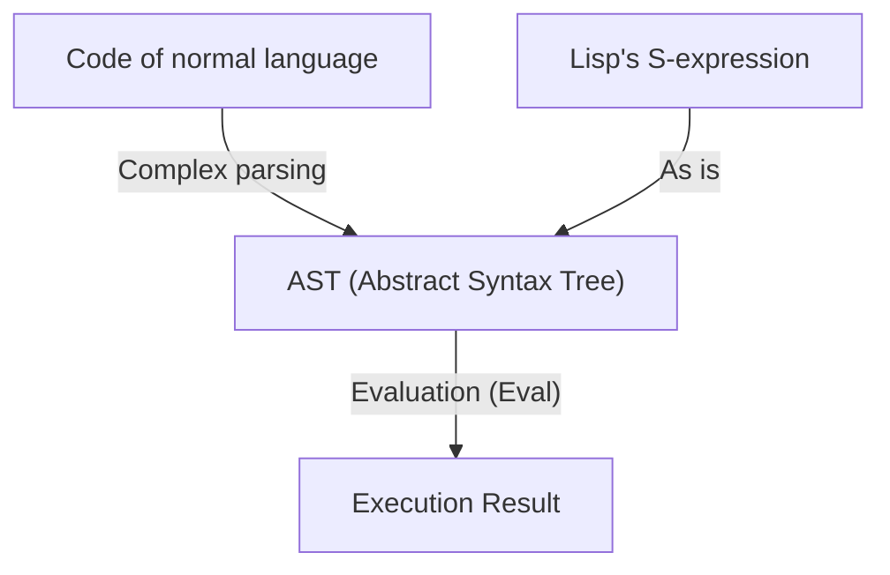
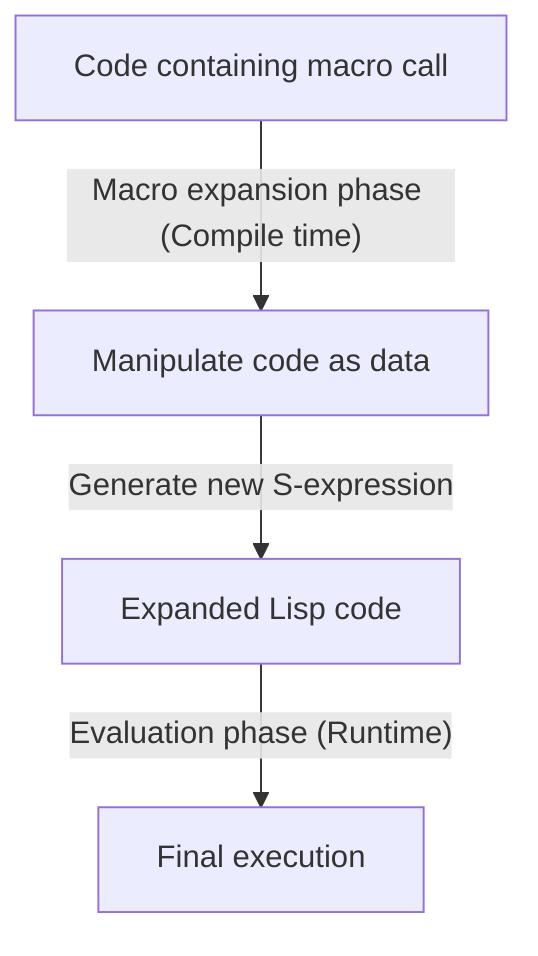

# Lisp and the "Language of God" — The Beauty of S-expressions and the Code as Data Philosophy

In the world of programming, there are languages that are passed down as a kind of "myth." Foremost among them is **Lisp (List Processing)**, created by John McCarthy in 1958. Lisp goes beyond being a mere programming language as a tool; it is sometimes hailed as the "Language of God," embodying the fundamental beauty of computer science.

In this article, we will dig deeply into why Lisp is so passionately loved, sometimes garnering almost religious awe, by exploring the beauty of "S-expressions (Symbolic Expressions)" at its core, the astonishing concept of "Homoiconicity," and the abyss of metaprogramming brought about by code-as-data.

## Chapter 1: The Dawn of Computer Science and McCarthy's Vision

In the 1950s, computers were primarily recognized as massive calculators for numerical computation. While FORTRAN was born for scientific and technical computing, and COBOL was designed for business applications, John McCarthy had a completely different perspective. He was seeking a way to represent and manipulate "Symbolic Processing"—that is, human thought and logic itself—on a computer.

McCarthy drew inspiration from Alonzo Church's "Lambda Calculus" to construct the theoretical foundation for a language that could describe pure mathematical functions. The result was Lisp, which represents the structure of a program with an extremely simple data structure called a List.

From the moment of its birth, Lisp established its position as the standard language in Artificial Intelligence (AI) research. This was because modeling human thought processes required a flexible data structure (lists) that could dynamically change and grow during program execution, rather than predefined static data structures.

## Chapter 2: The Overwhelming Beauty of S-expressions

The greatest feature of Lisp, which sets it apart from all other languages, is the **S-expression (Symbolic Expression)**. An S-expression is nothing more than a list of elements enclosed in parentheses.

```lisp
(+ 1 2)
(defun factorial (n)
  (if (<= n 1)
      1
      (* n (factorial (- n 1)))))
```

Those seeing Lisp for the first time might be overwhelmed by the endless waves of parentheses. It is sometimes ridiculed as "Lots of Irritating Superfluous Parentheses." However, behind this seemingly bizarre syntax hides ultimate universality and elegance.

Modern programming languages (such as Python, Java, C++, etc.) have complex syntax designed to prioritize human readability. Unique syntactic rules exist for if statements, for loops, function definitions, and so on. Compilers and interpreters read this source code and internally convert (parse) it into a tree-structured data format called an **Abstract Syntax Tree (AST)** before processing it.

In contrast, Lisp's S-expressions are synonymous with **the programmer hand-writing the AST directly**.



S-expressions are a universal format capable of representing any data and program structure. Decades before XML or JSON were invented, Lisp had already arrived at the ultimate solution of "representing tree-structured data in text." McCarthy initially planned to introduce a general syntax called "M-expressions" for humans, but programmers preferred to keep using the simple and regular S-expressions, and as a result, M-expressions vanished into the darkness of history.

## Chapter 3: Homoiconicity and Code as Data

The true terror (and beauty) of S-expressions stems from the fact that **"the program code itself is the fundamental data structure (list) of Lisp."** In computer science terminology, this is called **Homoiconicity**.

In Lisp, the list `(1 2 3)` as data and the code `(+ 1 2)` as a program are structurally exactly the same. The Lisp interpreter simply treats the first element of the list as a function (or macro) and evaluates the remaining elements as arguments.

This property of "having no boundary between code and data" gave rise to the powerful philosophy of **Code as Data**.

A Lisp program can read its own code as data at runtime, manipulate it, and generate and execute new code. What is provided as advanced and complex features like reflection and metaprogramming in other languages is nothing more than simple list operations (`car`, `cdr`, `cons`, etc.) in Lisp.

## Chapter 4: Wielding the Power of God — The Magic of Macros

The greatest benefit brought by homoiconicity is Lisp's **Macro** system. It is fundamentally different from C's text substitution macros. Lisp macros are **"Lisp programs executed at compile time."**

A macro takes an unevaluated S-expression (a fragment of code) as an argument, performs arbitrary list operations, and returns a new S-expression (the transformed code). This allows programmers to freely extend the language's compiler and create new syntax (DSL: Domain Specific Language) optimized for their own tasks.



In his book *Hackers & Painters*, Paul Graham depicts the evolution of programming languages as "borrowing features from other languages," but this holds no meaning for Lisp users. "Lisp lacks object orientation? Then just add it with a macro." "Want pattern matching? Let's write it in a macro." In fact, most of CLOS (Common Lisp Object System), Lisp's powerful object-oriented system, is implemented using macros by Lisp itself.

With macros, programmers are no longer bound by the decisions of language designers. They can evolve the language with their own hands. This is why Lisp programmers sometimes seem arrogantly proud of their language, and why it is called the "Language of God."

## Chapter 5: Why Doesn't Lisp Rule the World? (The Lisp Curse)

If it is such a powerful and beautiful language, why isn't all software in the world written in Lisp?

One reason lies in its very high degree of freedom. Some call this **"The Lisp Curse."**

Because Lisp is so powerful, a single brilliant hacker can instantly build their own DSL and toolset optimized for their project without waiting for existing libraries or tools. As a result, it became difficult for a standard library ecosystem to grow, and individual projects tended to become "dialects that only their developer could fully understand."

Furthermore, the visual strangeness of the aforementioned "waves of parentheses" and the fact that overly powerful metaprogramming reduces readability in team development (other members cannot decipher the magical macros created by one person) have also hindered its spread in the industry. In modern software engineering, where development proceeds with massive teams of average people, languages like Java and Go, which are "highly restricted, ensuring anyone writes code the same way," tend to be preferred.

## Chapter 6: Lisp's DNA Lives On

However, Lisp has not been defeated. Lisp's ideas have deeply influenced almost all modern programming languages.

Garbage Collection (GC), dynamic typing, REPL (Read-Eval-Print Loop), first-class functions (closures), conditional branching (if-then-else)—these were all pioneered by Lisp and adopted as standard features by subsequent languages. Modern programmers, whether consciously or unconsciously, are constantly writing code on top of Lisp's legacy.

Furthermore, Lisp's direct descendants still exert a powerful presence, such as the practical success of **Clojure** running on the JVM, the seemingly eternal lifespan of **Emacs Lisp** powering GNU Emacs, and **Scheme**, which continues to be loved for educational purposes.

## Conclusion: A Shift in Perspective

Learning Lisp is not simply about memorizing new syntax or libraries. It is a **paradigm shift**, a fundamental shift in perspective regarding the very act of programming.

The boundary between code and data dissolves, and the program recursively rewrites itself. At its foundation, there are only a few basic operations and the beautifully stripped-down structure of S-expressions.

If you ever feel suffocated by framework constraints or redundant boilerplate code in your daily programming, please step into the world of Lisp (Clojure or Scheme are fine too) at least once. When you touch a glimpse of the "Language of God," the way you see the world will surely have become slightly different than before.
