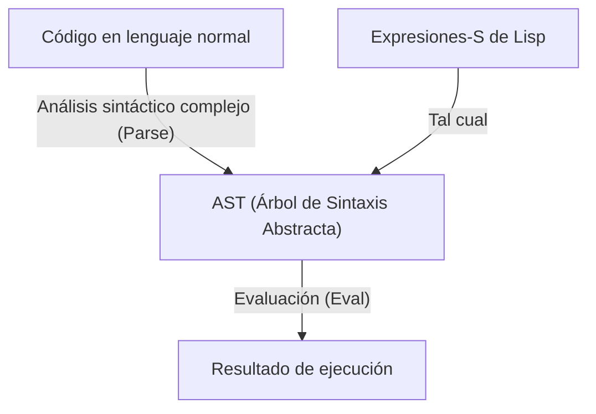
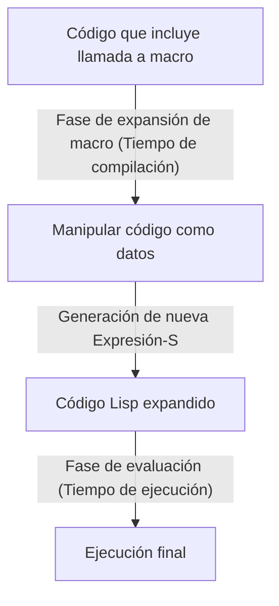

# Lisp y el "Lenguaje de Dios" — La Belleza de las Expresiones-S y la Filosofía del Código como Datos

En el mundo de la programación, existen lenguajes que se transmiten como un tipo de "mito". El primero de ellos es **Lisp (List Processing)**, creado por John McCarthy en 1958. Lisp va más allá de ser un simple lenguaje de programación como herramienta; a veces es aclamado como el "Lenguaje de Dios" que encarna la belleza fundamental de la informática.

En este artículo, profundizaremos en por qué Lisp es amado con tanto fervor y a veces cosecha una reverencia casi religiosa, explorando la belleza de las "Expresiones-S (S-expressions)" en su núcleo, el asombroso concepto de "Homoiconicidad" y el abismo de la metaprogramación que trae consigo el código como datos.

## Capítulo 1: El Amanecer de la Informática y la Visión de McCarthy

En la década de 1950, las computadoras eran percibidas principalmente como máquinas gigantes para cálculos numéricos. Mientras FORTRAN nacía para el cálculo científico y técnico, y COBOL se diseñaba para uso comercial, John McCarthy tenía una perspectiva completamente diferente. Él buscaba una forma de "Procesamiento Simbólico (Symbolic Processing)", es decir, cómo expresar y manipular el pensamiento humano y la lógica misma en una computadora.

Inspirado en el "Cálculo Lambda (Lambda Calculus)" de Alonzo Church, McCarthy construyó la base teórica de un lenguaje que podía describir funciones matemáticas puras. El resultado fue Lisp, que expresa la estructura de los programas utilizando una estructura de datos extremadamente simple llamada lista (List).

Desde su creación, Lisp estableció su posición como el lenguaje estándar en la investigación de Inteligencia Artificial (IA). Esto se debió a que, para modelar el proceso de pensamiento humano, era indispensable contar con una estructura de datos flexible (listas) que pudiera cambiar y crecer dinámicamente durante la ejecución del programa, en lugar de una estructura de datos estática definida de antemano.

## Capítulo 2: La Belleza Abrumadora de las Expresiones-S (S-expressions)

La característica más importante de Lisp, y el elemento que lo distingue de todos los demás lenguajes, son las **Expresiones-S (Symbolic Expressions)**. Las Expresiones-S no son más que simples listas con elementos encerrados entre paréntesis.

```lisp
(+ 1 2)
(defun factorial (n)
  (if (<= n 1)
      1
      (* n (factorial (- n 1)))))
```

Quienes ven Lisp por primera vez pueden sentirse abrumados por las interminables olas de paréntesis. A veces se burlan de él llamándolo "Lots of Irritating Superfluous Parentheses" (Un Montón de Paréntesis Superfluos Irritantes). Sin embargo, detrás de esta sintaxis aparentemente extraña, se esconde una universalidad y elegancia definitivas.

Los lenguajes de programación modernos (Python, Java, C++, etc.) tienen gramáticas complejas (sintaxis) que priorizan la legibilidad humana. Existen reglas de sintaxis específicas para sentencias if, bucles for, definiciones de funciones, etc. Los compiladores o intérpretes leen este código fuente y lo convierten internamente (analizan) en una estructura de datos de árbol llamada **Árbol de Sintaxis Abstracta (AST: Abstract Syntax Tree)** antes de procesarlo.

En contraste, las Expresiones-S de Lisp son sinónimos de que **el programador está escribiendo el AST directamente a mano**.



Las Expresiones-S son un formato universal que puede expresar cualquier estructura de datos y programas. Décadas antes de que se inventaran XML o JSON, Lisp ya había alcanzado la solución definitiva de "representar datos estructurados en árbol mediante texto". Inicialmente, McCarthy planeaba introducir una sintaxis general llamada "Expresiones-M (M-expressions)" para los humanos, pero los programadores prefirieron seguir usando las simples y regulares Expresiones-S, y como resultado, las Expresiones-M desaparecieron en la oscuridad de la historia.

## Capítulo 3: Homoiconicidad y Código como Datos

El verdadero terror (y belleza) de las Expresiones-S proviene del hecho de que **"el código del programa en sí mismo es exactamente la misma estructura de datos básica de Lisp (lista)"**. En términos informáticos, esto se llama **Homoiconicidad**.

En Lisp, la lista `(1 2 3)` como datos y el código `(+ 1 2)` como programa son estructuralmente idénticos. El intérprete de Lisp simplemente trata el primer elemento de la lista como una función (o macro) y evalúa los elementos restantes como argumentos.

Esta propiedad de "no haber frontera entre código y datos" dio origen a la poderosa filosofía de **Código como Datos (Code as Data)**.

Un programa Lisp puede leer su propio código como datos en tiempo de ejecución, manipularlo y generar nuevo código para ejecutarlo. Lo que en otros lenguajes se proporciona como características complejas y avanzadas como la reflexión o la metaprogramación, en Lisp no es más que una simple manipulación de listas (`car`, `cdr`, `cons`, etc.).

## Capítulo 4: Obteniendo el Poder de Dios — La Magia de las Macros

El mayor beneficio que aporta la Homoiconicidad es el sistema de **Macros (Macro)** de Lisp. Es fundamentalmente diferente de las macros de reemplazo de texto del lenguaje C. Las macros de Lisp son **"programas Lisp que se ejecutan en tiempo de compilación"**.

Una macro toma una Expresión-S no evaluada (un fragmento de código) como argumento, realiza cualquier manipulación de lista y devuelve una nueva Expresión-S (código transformado). Esto permite al programador extender libremente el compilador del lenguaje y crear una nueva sintaxis (DSL: Domain Specific Language) optimizada para sus propias tareas.



Paul Graham, en su libro "Hackers & Painters", describe la evolución de los lenguajes de programación como "el préstamo de características de otros lenguajes", pero esto no tiene sentido para un usuario de Lisp. "¿A Lisp le falta orientación a objetos? Entonces añádela con una macro". "¿Quieres coincidencia de patrones? Escríbela con una macro". De hecho, la mayor parte de CLOS (Common Lisp Object System), el poderoso sistema de orientación a objetos de Lisp, está implementado mediante macros escritas en el propio Lisp.

Con las macros, los programadores ya no están atados a las decisiones de los diseñadores de lenguajes. Pueden evolucionar el lenguaje con sus propias manos. Esta es la razón por la que los programadores de Lisp están tan orgullosos de su lenguaje que a veces parecen arrogantes, y por la que se le llama el "Lenguaje de Dios".

## Capítulo 5: ¿Por qué el mundo no está dominado por Lisp? (La Maldición de Lisp)

Si es un lenguaje tan poderoso y hermoso, ¿por qué no todo el software del mundo está escrito en Lisp?

Una de las razones radica en su propio alto grado de libertad. Algunos llaman a esto **"La Maldición de Lisp (The Lisp Curse)"**.

Debido a que Lisp es tan poderoso, un solo hacker brillante puede crear instantáneamente un DSL propio y un conjunto de herramientas optimizados para su proyecto, sin esperar a bibliotecas o herramientas existentes. Como resultado, es difícil que crezca un ecosistema estándar de bibliotecas, lo que genera el problema de que los proyectos individuales tiendan a convertirse en "dialectos que solo su desarrollador puede entender completamente".

Además, la apariencia extraña de las ya mencionadas "olas de paréntesis" y el hecho de que una metaprogramación demasiado poderosa reduce la legibilidad en el desarrollo en equipo (donde otros miembros no pueden descifrar las macros mágicas creadas por una persona), también han sido factores que obstaculizaron su adopción en la industria. En la ingeniería de software moderna, donde el desarrollo es llevado a cabo por equipos gigantes de programadores promedio, se prefieren lenguajes como Java o Go, "con muchas restricciones, que resultan iguales sin importar quién los escriba".

## Capítulo 6: El ADN de Lisp sigue vivo

Sin embargo, Lisp no fue derrotado. Las ideas de Lisp han influido profundamente en casi todos los lenguajes de programación modernos.

La recolección de basura (GC), el tipado dinámico, el REPL (entorno de evaluación interactiva), las funciones de primera clase (closures), la ramificación condicional (if-then-else)... todos estos fueron introducidos de manera pionera por Lisp, y los lenguajes posteriores los adoptaron como características estándar. Los programadores modernos, consciente o inconscientemente, siempre están escribiendo código sobre el legado de Lisp.

Además, los descendientes directos de Lisp siguen teniendo una fuerte presencia: el éxito práctico de **Clojure**, que se ejecuta en la JVM; la vida casi eterna de **Emacs Lisp**, que impulsa GNU Emacs; y **Scheme**, que sigue siendo amado con fines educativos.

## Conclusión: Un Cambio de Perspectiva

Aprender Lisp no se trata simplemente de memorizar una nueva sintaxis o bibliotecas. Es un **cambio de paradigma**, un cambio fundamental en la forma de ver el acto mismo de programar.

El límite entre código y datos se disuelve, y el programa se reescribe a sí mismo recursivamente. En su base, solo existen unas pocas operaciones básicas y la hermosa estructura reducida a su máxima expresión: la Expresión-S.

Si en tu programación diaria te sientes sofocado por las restricciones de los frameworks y el código repetitivo y redundante (boilerplate), por favor da un paso hacia el mundo de Lisp al menos una vez (Clojure o Scheme también sirven). Cuando toques un fragmento del "Lenguaje de Dios", la forma en que ves el mundo seguramente será un poco diferente a la de antes.
