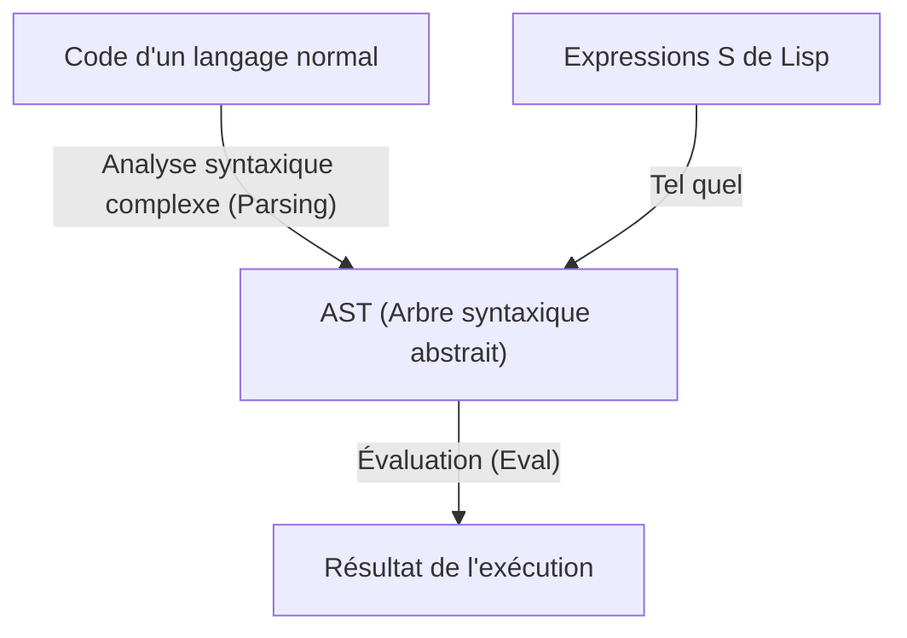
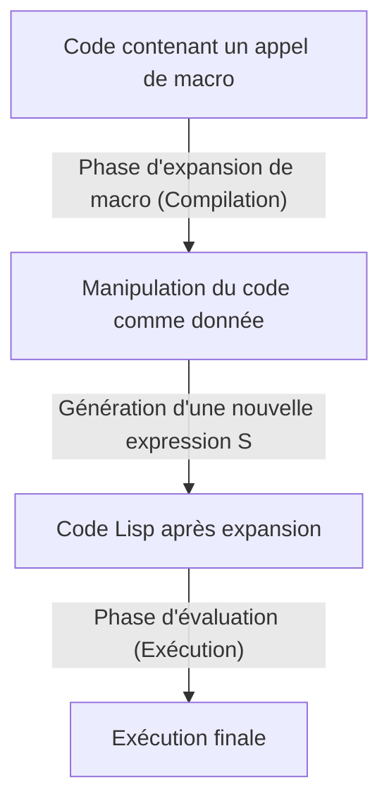

# Lisp et le "langage des dieux" ―― La beauté des expressions S et la philosophie du Code as Data

Dans le monde de la programmation, il existe des langages qui sont transmis comme une sorte de "mythe". Le premier d'entre eux est **Lisp (List Processing)**, créé par John McCarthy en 1958. Lisp ne se limite pas à être un simple langage de programmation utilitaire, mais est parfois qualifié de "langage des dieux" incarnant la beauté fondamentale de l'informatique.

Dans cet article, nous allons explorer en profondeur pourquoi Lisp est aimé avec tant de ferveur et suscite parfois une révérence quasi religieuse, en nous penchant sur la beauté des "expressions S" (S-expressions) qui sont à son cœur, le concept étonnant de "l'homoiconicité" (Homoiconicity), et les abysses de la métaprogrammation qu'apporte le Code as Data (le code en tant que donnée).

## Chapitre 1 : L'aube de l'informatique et la vision de McCarthy

Dans les années 1950, l'ordinateur était principalement perçu comme une gigantesque machine à calculer pour les calculs numériques. Alors que FORTRAN était né pour le calcul scientifique et technique, et que COBOL était conçu pour les applications commerciales, John McCarthy avait une perspective complètement différente. Il cherchait une méthode pour le "traitement symbolique" (Symbolic Processing), c'est-à-dire comment représenter et manipuler la pensée humaine et la logique elle-même sur un ordinateur.

S'inspirant du "calcul lambda" (Lambda Calculus) d'Alonzo Church, McCarthy a construit la base théorique d'un langage capable de décrire des fonctions mathématiques pures. Le résultat de cette démarche est Lisp, qui représente la structure d'un programme sous la forme d'une structure de données extrêmement simple appelée liste (List).

Dès sa création, Lisp a établi sa position en tant que langage standard dans la recherche en intelligence artificielle (IA). En effet, pour modéliser le processus de la pensée humaine, une structure de données flexible (une liste) capable de changer et de croître dynamiquement pendant l'exécution d'un programme était indispensable, bien plus que des structures de données statiques définies à l'avance.

## Chapitre 2 : La beauté écrasante des expressions S (S-expressions)

La plus grande caractéristique de Lisp, et l'élément qui le distingue de tout autre langage, ce sont les **expressions S (Symbolic Expressions)**. Une expression S n'est rien d'autre qu'une simple liste dont les éléments sont entourés de parenthèses.

```lisp
(+ 1 2)
(defun factorial (n)
  (if (<= n 1)
      1
      (* n (factorial (- n 1)))))
```

Ceux qui voient Lisp pour la première fois peuvent être submergés par la vague d'innombrables parenthèses. On s'en moque parfois en l'appelant "Lots of Irritating Superfluous Parentheses" (Un tas de parenthèses superflues et irritantes). Cependant, derrière cette syntaxe apparemment étrange se cachent une universalité et une élégance ultimes.

Les langages de programmation modernes (Python, Java, C++, etc.) ont des grammaires (syntaxes) complexes conçues pour faciliter la lecture humaine. Il existe des règles syntaxiques spécifiques pour les instructions if, les boucles for, les définitions de fonctions, etc. Le compilateur ou l'interpréteur lit ce code source et le transforme (parse) en interne en une structure de données arborescente appelée **AST (Abstract Syntax Tree, arbre syntaxique abstrait)** avant de le traiter.

En revanche, les expressions S de Lisp signifient que **le programmeur écrit directement l'AST à la main**.



Les expressions S sont un format universel capable de représenter n'importe quelle donnée et structure de programme. Des décennies avant l'invention de XML ou de JSON, Lisp avait déjà atteint la solution ultime consistant à "représenter des données sous forme d'arbre avec du texte". Initialement, McCarthy prévoyait d'introduire une syntaxe générale appelée "expressions M (M-expressions)" pour les humains, mais les programmeurs ont préféré utiliser les expressions S, simples et régulières, et par conséquent, les expressions M ont disparu dans l'obscurité de l'histoire.

## Chapitre 3 : L'homoiconicité (Homoiconicity) et le Code as Data

La véritable terreur (et beauté) des expressions S provient du fait que **"le code du programme lui-même est la structure de données de base de Lisp (la liste)"**. Dans la terminologie de l'informatique, cela s'appelle **l'homoiconicité (Homoiconicity)**.

En Lisp, la liste en tant que donnée `(1 2 3)` et le code en tant que programme `(+ 1 2)` sont structurellement identiques. L'interpréteur Lisp considère simplement le premier élément de la liste comme une fonction (ou une macro) et évalue les éléments restants comme ses arguments.

Cette propriété de "l'absence de frontière entre le code et les données" a donné naissance à la puissante philosophie du **Code as Data (le code en tant que donnée)**.

Un programme Lisp peut lire son propre code comme des données lors de l'exécution, le manipuler, générer un nouveau code et l'exécuter. Ce qui est fourni dans d'autres langages sous forme de fonctionnalités avancées et complexes comme la réflexion (reflection) ou la métaprogrammation n'est en Lisp qu'une simple manipulation de liste (`car`, `cdr`, `cons`, etc.).

## Chapitre 4 : Obtenir le pouvoir divin ―― La magie des macros

Le plus grand avantage de l'homoiconicité est le système de **macros (Macro)** de Lisp. Il est fondamentalement différent des macros de substitution de texte du langage C. Les macros Lisp sont **"des programmes Lisp exécutés au moment de la compilation"**.

Une macro prend en argument une expression S non évaluée (un fragment de code), effectue des opérations de liste arbitraires et renvoie une nouvelle expression S (le code transformé). Cela permet au programmeur d'étendre librement le compilateur du langage et de créer de nouvelles syntaxes optimisées pour ses propres tâches (DSL : Domain Specific Language).



Paul Graham, dans son livre "Hackers & Painters", décrit l'évolution des langages de programmation comme "l'emprunt de fonctionnalités à d'autres langages", mais cela n'a aucun sens pour un utilisateur de Lisp. "Lisp manque d'orientation objet ? Alors ajoutez-la avec une macro", "Vous voulez du pattern matching ? Écrivons-le avec une macro". En fait, la majeure partie du CLOS (Common Lisp Object System), le puissant système orienté objet de Lisp, est implémentée par Lisp lui-même à l'aide de macros.

Grâce aux macros, le programmeur n'est plus lié par les décisions du concepteur du langage. Il peut faire évoluer le langage de ses propres mains. C'est la raison pour laquelle les programmeurs Lisp sont si fiers de leur langage qu'ils en paraissent parfois arrogants, et c'est pourquoi on l'appelle le "langage des dieux".

## Chapitre 5 : Pourquoi le monde n'est-il pas dominé par Lisp ? (La malédiction de Lisp)

Si c'est un langage si puissant et si beau, pourquoi tous les logiciels du monde ne sont-ils pas écrits en Lisp ?

L'une des raisons réside dans son propre degré de liberté. Certains appellent cela **"la malédiction de Lisp (The Lisp Curse)"**.

Lisp est tellement puissant qu'un seul hacker brillant peut créer instantanément son propre DSL et un ensemble d'outils optimisés pour son projet sans attendre l'existence de bibliothèques ou d'outils existants. En conséquence, il est difficile pour un écosystème de bibliothèques standard de se développer, et chaque projet a tendance à devenir "un dialecte que seul son développeur peut comprendre pleinement".

De plus, l'étrangeté visuelle de la "vague de parenthèses" mentionnée précédemment, ainsi que le fait qu'une métaprogrammation trop puissante réduit la lisibilité dans le développement en équipe (les autres membres ne peuvent pas déchiffrer la macro magique créée par une seule personne), sont également des facteurs qui ont entravé son adoption dans l'industrie. Dans l'ingénierie logicielle moderne où le développement est mené par d'énormes équipes de personnes ordinaires, on a tendance à préférer des langages comme Java ou Go, "avec de nombreuses restrictions, où le code sera le même peu importe qui l'écrit".

## Chapitre 6 : L'ADN de Lisp survit

Cependant, Lisp n'a pas été vaincu. Les idées de Lisp ont profondément influencé presque tous les langages de programmation modernes.

Le ramasse-miettes (Garbage Collection, GC), le typage dynamique, le REPL (Read-Eval-Print Loop), les fonctions de première classe (closures), les branchements conditionnels (if-then-else) ―― tous ces éléments ont été introduits par Lisp de manière pionnière et adoptés comme fonctionnalités standard par les langages ultérieurs. Les programmeurs modernes, qu'ils en soient conscients ou non, écrivent toujours du code sur l'héritage de Lisp.

De plus, les descendants directs de Lisp ont toujours une forte présence, comme le succès pratique de **Clojure** fonctionnant sur la JVM, la longévité presque éternelle de **Emacs Lisp** qui propulse GNU Emacs, et **Scheme**, qui continue d'être apprécié à des fins éducatives.

## Conclusion : Un changement de perspective

Apprendre Lisp, ce n'est pas simplement mémoriser une nouvelle syntaxe ou de nouvelles bibliothèques. C'est un **changement de paradigme (paradigm shift)**, une transformation fondamentale de la perspective sur l'acte même de programmer.

Les frontières entre le code et les données se dissolvent, et le programme se réécrit récursivement. À la base, il n'y a que quelques opérations fondamentales et la belle structure des expressions S, réduite à son extrême.

Si vous vous sentez étouffé par les restrictions des frameworks et le code passe-partout (boilerplate code) redondant dans votre programmation quotidienne, n'hésitez pas à faire un pas dans le monde de Lisp (Clojure ou Scheme font aussi l'affaire). Lorsque vous toucherez un fragment du "langage des dieux", la façon dont vous voyez le monde sera certainement différente de ce qu'elle était auparavant.
