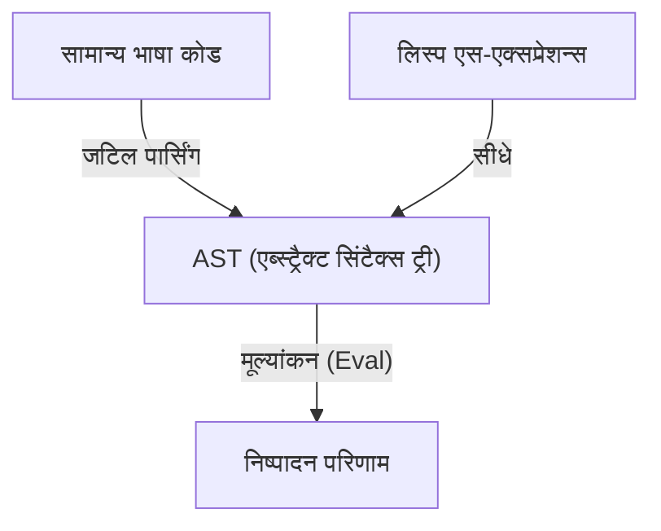
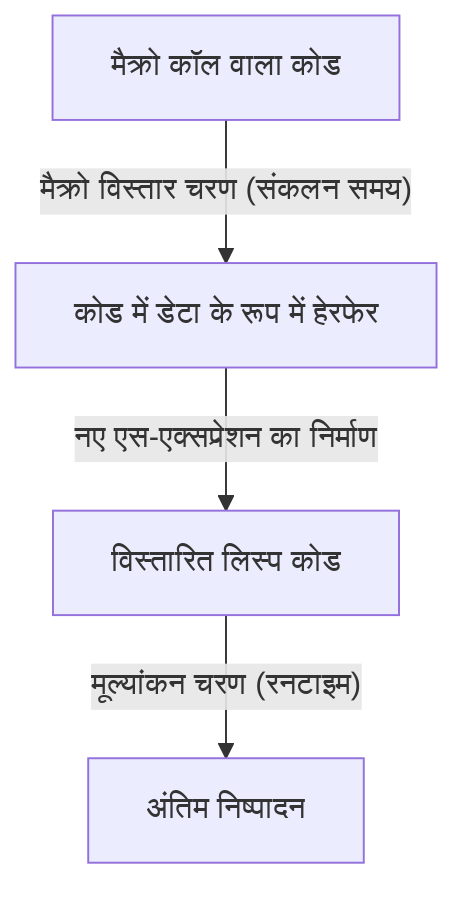

# लिस्प (Lisp) और "ईश्वर की भाषा" - एस-एक्सप्रेशन्स (S-expressions) का सौंदर्य और कोड-एज़-डेटा (Code-as-Data) दर्शन

प्रोग्रामिंग की दुनिया में कुछ ऐसी भाषाएँ हैं जिन्हें एक प्रकार के "मिथक" के रूप में याद किया जाता है। इनमें सबसे प्रमुख है **लिस्प (Lisp - List Processing)**, जिसे 1958 में जॉन मैकार्थी (John McCarthy) ने बनाया था। लिस्प केवल एक उपकरण के रूप में प्रोग्रामिंग भाषा तक सीमित नहीं है, बल्कि इसे अक्सर कंप्यूटर विज्ञान के मूलभूत सौंदर्य का प्रतीक मानते हुए "ईश्वर की भाषा" तक कहा जाता है।

इस लेख में, हम गहराई से जानेंगे कि लिस्प को इतनी उत्सुकता से क्यों प्यार किया जाता है, और कभी-कभी धार्मिक श्रद्धा क्यों प्राप्त होती है। हम इसके मूल में मौजूद "एस-एक्सप्रेशन्स (S-expressions)" के सौंदर्य, "होमोआइकॉनिसिटी (Homoiconicity)" की अद्भुत अवधारणा, और कोड-एज़-डेटा (Code as Data) द्वारा लाए गए मेटाप्रोग्रामिंग की गहराई का पता लगाएंगे।

## अध्याय 1: कंप्यूटर विज्ञान का उदय और मैकार्थी का दृष्टिकोण

1950 के दशक में, कंप्यूटर को मुख्य रूप से संख्यात्मक गणनाओं के लिए विशाल कैलकुलेटर के रूप में पहचाना जाता था। जबकि फोरट्रान (FORTRAN) का जन्म वैज्ञानिक कंप्यूटिंग के लिए हुआ था और कोबोल (COBOL) को व्यावसायिक उपयोग के लिए डिज़ाइन किया गया था, जॉन मैकार्थी का दृष्टिकोण पूरी तरह से अलग था। वे "प्रतीकात्मक प्रसंस्करण (Symbolic Processing)" की खोज कर रहे थे, यानी मानव विचार और तर्क को कंप्यूटर पर व्यक्त करने और हेरफेर करने के तरीके की।

मैकार्थी ने अलोंज़ो चर्च (Alonzo Church) के "लैम्ब्डा कैलकुलस (Lambda Calculus)" से प्रेरणा ली और एक ऐसी भाषा की सैद्धांतिक नींव रखी जो शुद्ध गणितीय कार्यों का वर्णन कर सके। इसका परिणाम लिस्प था, जो एक बहुत ही सरल डेटा संरचना का उपयोग करके प्रोग्राम की संरचना को व्यक्त करता है जिसे सूची (List) कहा जाता है।

अपने जन्म के तुरंत बाद से, लिस्प ने कृत्रिम बुद्धिमत्ता (AI) अनुसंधान में मानक भाषा के रूप में अपना स्थान स्थापित कर लिया। ऐसा इसलिए है क्योंकि मानव विचार प्रक्रिया को मॉडल करने के लिए, पहले से परिभाषित स्थिर डेटा संरचनाओं के बजाय एक लचीली डेटा संरचना (सूची) अपरिहार्य थी जो प्रोग्राम के निष्पादन के दौरान गतिशील रूप से बदल और बढ़ सकती थी।

## अध्याय 2: एस-एक्सप्रेशन्स (S-expressions) का जबरदस्त सौंदर्य

लिस्प की सबसे बड़ी विशेषता, जो इसे अन्य सभी भाषाओं से अलग करती है, वह है **एस-एक्सप्रेशन्स (Symbolic Expressions)**। एस-एक्सप्रेशन ब्रैकेट (कोष्ठक) में संलग्न तत्वों की एक साधारण सूची से अधिक कुछ नहीं है।

```lisp
(+ 1 2)
(defun factorial (n)
  (if (<= n 1)
      1
      (* n (factorial (- n 1)))))
```

जो लोग पहली बार लिस्प देखते हैं, वे अनगिनत ब्रैकेट की लहर से अभिभूत हो सकते हैं। कभी-कभी इसका मज़ाक "Lots of Irritating Superfluous Parentheses" (चिढ़ाने वाले फालतू ब्रैकेट का पहाड़) कहकर भी उड़ाया जाता है। हालाँकि, इस प्रतीत होने वाले अजीब सिंटैक्स के पीछे परम सार्वभौमिकता और लालित्य छिपा है।

आधुनिक प्रोग्रामिंग भाषाओं (Python, Java, C++, आदि) में जटिल सिंटैक्स (व्याकरण) होता है जो मानव पठनीयता पर जोर देता है। if स्टेटमेंट, for लूप और फ़ंक्शन परिभाषाओं के लिए विशिष्ट सिंटैक्स नियम हैं। कंपाइलर और इंटरप्रेटर इस स्रोत कोड को पढ़ते हैं और इसे संसाधित करने से पहले आंतरिक रूप से **एब्स्ट्रैक्ट सिंटैक्स ट्री (AST: Abstract Syntax Tree)** नामक ट्री-संरचित डेटा में परिवर्तित (पार्स) करते हैं।

इसके विपरीत, लिस्प के एस-एक्सप्रेशन्स का अर्थ है कि **प्रोग्रामर सीधे AST को हाथ से लिख रहा है**।



एस-एक्सप्रेशन्स एक सार्वभौमिक प्रारूप है जो किसी भी डेटा और प्रोग्राम संरचना का प्रतिनिधित्व कर सकता है। XML और JSON के आविष्कार से दशकों पहले, लिस्प पहले ही "ट्री-संरचित डेटा को टेक्स्ट के रूप में व्यक्त करने" के अंतिम समाधान तक पहुँच चुका था। मैकार्थी ने मूल रूप से मनुष्यों के लिए "एम-एक्सप्रेशन्स (M-expressions)" नामक एक सामान्य सिंटैक्स पेश करने की योजना बनाई थी, लेकिन प्रोग्रामरों ने सरल और नियमित एस-एक्सप्रेशन्स का उपयोग करना पसंद किया, और परिणामस्वरूप, एम-एक्सप्रेशन्स इतिहास के अंधकार में गायब हो गए।

## अध्याय 3: होमोआइकॉनिसिटी (Homoiconicity) और कोड-एज़-डेटा

एस-एक्सप्रेशन्स की वास्तविक भयावहता (और सुंदरता) इस तथ्य से उपजी है कि **"प्रोग्राम का कोड स्वयं लिस्प की मूल डेटा संरचना (सूची) ही है"**। कंप्यूटर विज्ञान की शब्दावली में इसे **होमोआइकॉनिसिटी (Homoiconicity)** कहा जाता है।

लिस्प में, डेटा के रूप में सूची `(1 2 3)` और प्रोग्राम के रूप में कोड `(+ 1 2)` संरचनात्मक रूप से बिल्कुल समान हैं। लिस्प इंटरप्रेटर सूची के पहले तत्व को एक फ़ंक्शन (या मैक्रो) के रूप में मानता है और शेष तत्वों का मूल्यांकन तर्कों के रूप में करता है।

यह गुण कि "कोड और डेटा के बीच कोई सीमा मौजूद नहीं है", **कोड-एज़-डेटा (Code as Data)** के शक्तिशाली दर्शन को जन्म देता है।

लिस्प प्रोग्राम रनटाइम पर अपने स्वयं के कोड को डेटा के रूप में पढ़ सकते हैं, हेरफेर कर सकते हैं, नया कोड उत्पन्न कर सकते हैं और इसे निष्पादित कर सकते हैं। जो अन्य भाषाओं में रिफ्लेक्शन और मेटाप्रोग्रामिंग जैसी उन्नत और जटिल विशेषताओं के रूप में प्रदान किया जाता है, वह लिस्प में सरल सूची संचालन (`car`, `cdr`, `cons`, आदि) से अधिक कुछ नहीं है।

## अध्याय 4: ईश्वरीय शक्ति प्राप्त करना - मैक्रोज़ का जादू

होमोआइकॉनिसिटी का सबसे बड़ा लाभ लिस्प का **मैक्रो (Macro)** सिस्टम है। यह सी (C) भाषा के टेक्स्ट रिप्लेसमेंट मैक्रोज़ से मौलिक रूप से अलग है। लिस्प मैक्रोज़ **"लिस्प प्रोग्राम हैं जो संकलन (compile) के समय निष्पादित होते हैं"**।

मैक्रोज़ एक गैर-मूल्यांकित एस-एक्सप्रेशन (कोड का टुकड़ा) को तर्क के रूप में लेते हैं, मनमाना सूची संचालन करते हैं, और एक नया एस-एक्सप्रेशन (रूपांतरित कोड) लौटाते हैं। यह प्रोग्रामर को भाषा के कंपाइलर को स्वतंत्र रूप से विस्तारित करने और अपने स्वयं के कार्यों के लिए अनुकूलित एक नया सिंटैक्स (DSL: Domain Specific Language) बनाने की अनुमति देता है।



पॉल ग्राहम (Paul Graham) ने अपनी पुस्तक "Hackers & Painters" में प्रोग्रामिंग भाषाओं के विकास को "अन्य भाषाओं से सुविधाओं के उधार" के रूप में वर्णित किया है, लेकिन लिस्प उपयोगकर्ताओं के लिए इसका कोई अर्थ नहीं है। "क्या लिस्प में ऑब्जेक्ट-ओरिएंटेशन की कमी है? तो इसे मैक्रोज़ के साथ जोड़ें।" "क्या पैटर्न मिलान (Pattern Matching) चाहिए? इसे मैक्रोज़ के साथ लिखें।" वास्तव में, CLOS (Common Lisp Object System), जो कि लिस्प का शक्तिशाली ऑब्जेक्ट-ओरिएंटेड सिस्टम है, का अधिकांश भाग लिस्प द्वारा ही मैक्रोज़ का उपयोग करके कार्यान्वित किया गया है।

मैक्रोज़ का उपयोग करके, प्रोग्रामर अब भाषा डिजाइनरों के निर्णयों से बंधे नहीं हैं। वे अपनी भाषा को अपने हाथों से विकसित कर सकते हैं। यही कारण है कि लिस्प प्रोग्रामर अपनी भाषा पर इतना गर्व करते हैं कि वे कभी-कभी अभिमानी लगते हैं, और यही कारण है कि इसे "ईश्वर की भाषा" कहा जाता है।

## अध्याय 5: दुनिया लिस्प द्वारा शासित क्यों नहीं है? (लिस्प का अभिशाप)

यदि यह इतनी शक्तिशाली और सुंदर भाषा है, तो दुनिया के सभी सॉफ़्टवेयर लिस्प में क्यों नहीं लिखे गए हैं?

एक कारण इसकी उच्च स्तर की स्वतंत्रता ही है। कुछ लोग इसे **"लिस्प का अभिशाप (The Lisp Curse)"** कहते हैं।

लिस्प इतना शक्तिशाली है कि यदि एक उत्कृष्ट हैकर मौजूद है, तो वह मौजूदा लाइब्रेरी और टूल की प्रतीक्षा किए बिना अपनी परियोजना के लिए अनुकूलित अपना स्वयं का DSL और टूलकिट तुरंत बना सकता है। परिणामस्वरूप, मानक लाइब्रेरी इकोसिस्टम के लिए विकसित होना मुश्किल होता है, और यह समस्या उत्पन्न होती है कि व्यक्तिगत परियोजनाएं "बोलियों (dialects) में बदल जाती हैं जिन्हें केवल उनका डेवलपर ही पूरी तरह से समझ सकता है।"

इसके अलावा, "ब्रैकेट की लहर" की अजीबोगरीब उपस्थिति और यह तथ्य कि बहुत शक्तिशाली मेटाप्रोग्रामिंग टीम के विकास में पठनीयता को कम कर देती है (एक व्यक्ति द्वारा बनाया गया जादुई मैक्रो अन्य सदस्यों द्वारा समझा नहीं जा सकता), ऐसे कारक हैं जिन्होंने उद्योग में इसके प्रसार में बाधा उत्पन्न की। आधुनिक सॉफ्टवेयर इंजीनियरिंग में, जो कि साधारण लोगों की विशाल टीमों के साथ किया जाता है, जावा (Java) या गो (Go) जैसी "सख्त प्रतिबंधों वाली भाषाएं, जिन्हें कोई भी लिखे तो परिणाम समान होता है" को प्राथमिकता दी जाती है।

## अध्याय 6: लिस्प का डीएनए जीवित है

हालाँकि, लिस्प हार नहीं माना है। लिस्प के विचारों ने लगभग सभी आधुनिक प्रोग्रामिंग भाषाओं को गहराई से प्रभावित किया है।

गारबेज कलेक्शन (GC), डायनेमिक टाइपिंग, REPL (इंटरएक्टिव इवैल्यूएशन एनवायरनमेंट), फर्स्ट-क्लास फंक्शन्स (क्लोज़र्स), और कंडीशनल ब्रांचिंग (if-then-else) - ये सभी लिस्प द्वारा शुरू किए गए थे और बाद की भाषाओं द्वारा मानक विशेषताओं के रूप में अपनाए गए। आधुनिक प्रोग्रामर, चाहे वे सचेत हों या अनजाने में, हमेशा लिस्प की विरासत पर कोड लिख रहे हैं।

इसके अलावा, JVM पर चलने वाले **Clojure** की व्यावहारिक सफलता, GNU Emacs को शक्ति प्रदान करने वाले **Emacs Lisp** का चिरस्थायी जीवन, और शिक्षा के लिए पसंद किए जाने वाले **Scheme** जैसे लिस्प के प्रत्यक्ष वंशज आज भी एक मजबूत उपस्थिति बनाए हुए हैं।

## निष्कर्ष: दृष्टिकोण में बदलाव

लिस्प सीखना केवल एक नया सिंटैक्स या लाइब्रेरी याद करने के बारे में नहीं है। यह एक **प्रतिमान बदलाव (Paradigm Shift)** है, प्रोग्रामिंग के कार्य के प्रति परिप्रेक्ष्य में एक मौलिक परिवर्तन है।

कोड और डेटा के बीच की सीमाएं धुंधली हो जाती हैं, और प्रोग्राम पुनरावर्ती रूप से खुद को फिर से लिखते हैं। इसके मूल में केवल कुछ बुनियादी संचालन और एस-एक्सप्रेशन्स की एक सुंदर संरचना है, जिसे इसकी परम सीमा तक छीन लिया गया है।

यदि आप अपनी दैनिक प्रोग्रामिंग में फ्रेमवर्क की बाधाओं और अनावश्यक बॉयलरप्लेट कोड से घुटन महसूस करते हैं, तो कृपया लिस्प (Clojure या Scheme भी ठीक हैं) की दुनिया में कदम रखें। जब आप "ईश्वर की भाषा" की एक झलक का अनुभव करेंगे, तो दुनिया को देखने का आपका नज़रिया पहले से थोड़ा अलग होगा。
