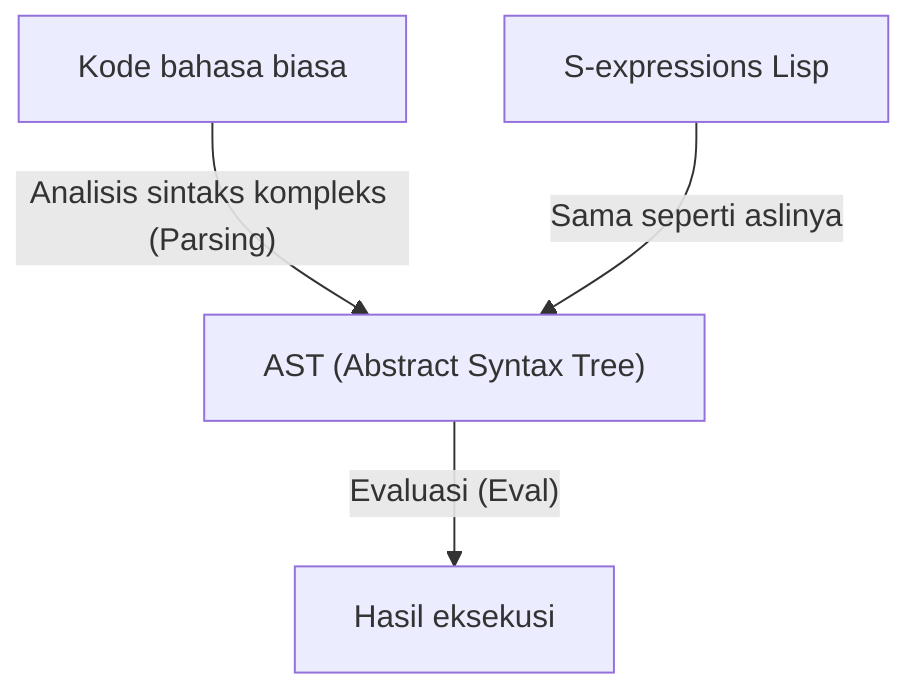
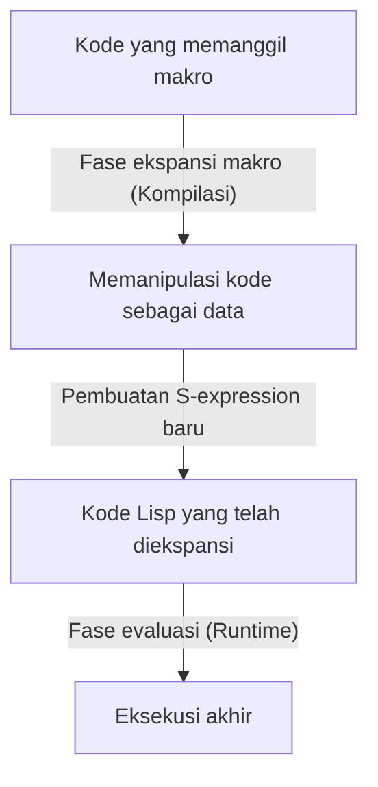

# Lisp dan "Bahasa Tuhan" ―― Keindahan S-Expressions dan Filosofi Code as Data

Di dunia pemrograman, terdapat bahasa yang diceritakan turun-temurun sebagai semacam "mitos". Yang paling utama di antaranya adalah **Lisp (List Processing)**, yang diciptakan oleh John McCarthy pada tahun 1958. Lisp tidak hanya sekadar alat berupa bahasa pemrograman, tetapi kadang-kadang dijuluki sebagai "Bahasa Tuhan" karena mewujudkan keindahan mendasar dari ilmu komputer.

Dalam artikel ini, kita akan menggali lebih dalam mengapa Lisp begitu dicintai dengan antusias, dan kadang-kadang mengumpulkan rasa kagum yang hampir bersifat religius. Kita akan membahas keindahan "S-expressions" di pusatnya, konsep luar biasa dari "Homoiconicity" (kesamaan bentuk), dan kedalaman metapemrograman yang dibawa oleh filosofi code as data.

## Bab 1: Fajar Ilmu Komputer dan Visi McCarthy

Pada tahun 1950-an, komputer utamanya diakui sebagai mesin hitung raksasa untuk komputasi numerik. Sementara FORTRAN lahir untuk komputasi ilmiah dan teknis, dan COBOL dirancang untuk keperluan bisnis, John McCarthy memiliki sudut pandang yang sama sekali berbeda. Ia mencari cara untuk mengekspresikan dan memanipulasi "Pemrosesan Simbolik (Symbolic Processing)", yaitu pemikiran dan logika manusia itu sendiri di dalam komputer.

McCarthy, terinspirasi oleh "Kalkulus Lambda (Lambda Calculus)" karya Alonzo Church, membangun dasar teoretis untuk sebuah bahasa yang dapat mendeskripsikan fungsi matematika murni. Hasilnya adalah Lisp, yang mengekspresikan struktur program dengan struktur data yang sangat sederhana yaitu list.

Sejak lahirnya, Lisp segera mengukuhkan posisinya sebagai bahasa standar dalam penelitian Kecerdasan Buatan (AI). Hal ini karena untuk memodelkan proses berpikir manusia, diperlukan struktur data fleksibel (list) yang dapat berubah dan berkembang secara dinamis selama eksekusi program, daripada struktur data statis yang didefinisikan sebelumnya.

## Bab 2: Keindahan Mutlak S-Expressions

Fitur terbesar dari Lisp, dan elemen yang membedakannya dari semua bahasa lain, adalah **S-expressions (Symbolic Expressions)**. S-expressions hanyalah list sederhana yang elemen-elemennya diapit oleh tanda kurung.

```lisp
(+ 1 2)
(defun factorial (n)
  (if (<= n 1)
      1
      (* n (factorial (- n 1)))))
```

Orang yang pertama kali melihat Lisp mungkin akan kewalahan oleh gelombang tanda kurung yang berderet tanpa henti. Kadang-kadang bahasa ini diejek sebagai "Lots of Irritating Superfluous Parentheses" (Tumpukan Tanda Kurung Berlebihan yang Menyebalkan). Namun, di balik sintaks yang sekilas tampak aneh ini, tersembunyi universalitas dan keanggunan tertinggi.

Bahasa pemrograman modern (Python, Java, C++, dll.) memiliki tata bahasa (sintaks) kompleks yang mengutamakan kemudahan membaca bagi manusia. Pernyataan if, perulangan for, definisi fungsi, dan lain-lain memiliki aturan sintaksnya masing-masing. Kompiler atau interpreter membaca kode sumber ini, lalu secara internal mem-parsing dan mengubahnya menjadi data berstruktur pohon yang disebut **Abstract Syntax Tree (AST)** sebelum memprosesnya.

Sebaliknya, S-expressions dalam Lisp identik dengan **programmer yang secara langsung menulis AST dengan tangan**.



S-expressions adalah format universal yang dapat mengekspresikan segala jenis data dan struktur program. Berpuluh-puluh tahun sebelum XML atau JSON ditemukan, Lisp telah mencapai solusi pamungkas yaitu "mengekspresikan data berstruktur pohon dengan teks". Awalnya, McCarthy berencana memperkenalkan sintaks umum bernama "M-expressions" untuk manusia, tetapi para programmer lebih suka menggunakan S-expressions yang sederhana dan teratur, sehingga M-expressions pun menghilang ditelan sejarah.

## Bab 3: Homoiconicity dan Code as Data

Kedahsyatan sejati (dan keindahan) S-expressions berasal dari fakta bahwa **"kode program itu sendiri adalah struktur data dasar Lisp (list) itu sendiri"**. Dalam istilah ilmu komputer, ini disebut **Homoiconicity**.

Dalam Lisp, list sebagai data `(1 2 3)` dan kode sebagai program `(+ 1 2)` secara struktural adalah hal yang persis sama. Interpreter Lisp hanya menganggap elemen pertama dari list sebagai fungsi (atau makro), dan mengevaluasi elemen sisanya sebagai argumen.

Sifat "tidak adanya batas antara kode dan data" ini melahirkan filosofi kuat bernama **Code as Data** (Kode sebagai Data).

Program Lisp dapat membaca kodenya sendiri sebagai data pada saat runtime, memanipulasinya, dan menghasilkan serta mengeksekusi kode baru. Hal-hal yang ditawarkan sebagai fitur tingkat tinggi dan kompleks seperti reflection atau metapemrograman dalam bahasa lain, hanyalah operasi list sederhana (`car`, `cdr`, `cons`, dll.) di dalam Lisp.

## Bab 4: Menggenggam Kekuatan Tuhan ―― Keajaiban Makro

Manfaat terbesar dari homoiconicity adalah sistem **Makro (Macro)** Lisp. Ini pada dasarnya berbeda dari makro penggantian teks pada bahasa C. Makro Lisp adalah **"Program Lisp yang dieksekusi pada saat kompilasi"**.

Makro menerima S-expression (potongan kode) yang belum dievaluasi sebagai argumen, melakukan operasi list apa pun, dan mengembalikan S-expression baru (kode setelah transformasi). Dengan ini, programmer bebas memperluas kompiler bahasa dan menciptakan sintaks baru (DSL: Domain Specific Language) yang dioptimalkan untuk tugas mereka sendiri.



Paul Graham dalam bukunya "Hackers & Painters" menggambarkan evolusi bahasa pemrograman sebagai "meminjam fitur dari bahasa lain", tetapi bagi pengguna Lisp hal itu tidak ada artinya. "Lisp kurang fitur object-oriented? Tambahkan saja dengan makro", "Butuh pattern matching? Mari tulis makronya". Faktanya, sebagian besar dari CLOS (Common Lisp Object System), yaitu sistem object-oriented kuat milik Lisp, diimplementasikan oleh Lisp itu sendiri melalui makro.

Dengan menggunakan makro, programmer tidak lagi terikat oleh keputusan perancang bahasa. Mereka dapat mengembangkan bahasa itu dengan tangan mereka sendiri. Inilah alasan mengapa programmer Lisp terkadang terlihat arogan dan sangat bangga dengan bahasa mereka, serta menjadi alasan mengapa bahasa ini disebut "Bahasa Tuhan".

## Bab 5: Mengapa Dunia Tidak Dikuasai oleh Lisp? (Kutukan Lisp)

Jika bahasa ini begitu kuat dan indah, mengapa tidak semua perangkat lunak di dunia ditulis dengan Lisp?

Salah satu alasannya terletak pada tingkat kebebasannya itu sendiri. Beberapa orang menyebutnya **"Kutukan Lisp (The Lisp Curse)"**.

Lisp terlalu kuat, sehingga jika ada satu peretas yang brilian, ia dapat langsung membuat sekumpulan alat atau DSL unik yang dioptimalkan untuk proyeknya tanpa perlu menunggu ketersediaan pustaka atau alat dari pihak ketiga. Akibatnya, ekosistem pustaka standar sulit berkembang, dan muncul masalah di mana setiap proyek cenderung menjadi "dialek yang hanya bisa dipahami sepenuhnya oleh pengembangnya".

Selain itu, keanehan visual dari "gelombang tanda kurung" yang telah disebutkan, dan aspek di mana metapemrograman yang terlalu kuat menurunkan keterbacaan dalam pengembangan tim (makro ajaib yang dibuat oleh satu orang tidak dapat diurai oleh anggota lain), juga menjadi faktor penghambat penyebarannya di industri. Dalam rekayasa perangkat lunak modern yang dikembangkan oleh tim besar berisi orang biasa, bahasa dengan "banyak batasan, di mana siapa pun yang menulis akan terlihat sama" seperti Java atau Go cenderung lebih disukai.

## Bab 6: DNA Lisp Terus Hidup

Namun, Lisp tidak kalah. Ide-ide Lisp telah memberikan pengaruh mendalam pada hampir semua bahasa pemrograman modern.

Garbage Collection (GC), Dynamic Typing, REPL (lingkungan evaluasi interaktif), First-class functions (Closure), dan percabangan kondisional (if-then-else) ―― semuanya diperkenalkan terlebih dahulu oleh Lisp, dan kemudian diadopsi sebagai fitur standar oleh bahasa-bahasa di generasi berikutnya. Programmer modern, sadar atau tidak, selalu menulis kode di atas warisan Lisp.

Terlebih lagi, kesuksesan praktis **Clojure** yang berjalan di atas JVM, umur abadi **Emacs Lisp** yang menggerakkan GNU Emacs, serta **Scheme** yang terus dicintai untuk tujuan pendidikan, menunjukkan bahwa keturunan langsung Lisp masih memancarkan kehadiran yang kuat.

## Penutup: Perubahan Paradigma

Mempelajari Lisp bukanlah sekadar menghafal tata bahasa atau pustaka baru. Ini adalah sebuah **pergeseran paradigma (paradigm shift)**, dan perubahan sudut pandang yang mendasar terhadap tindakan pemrograman itu sendiri.

Batas antara kode dan data melebur, dan program menulis ulang dirinya sendiri secara rekursif. Pada dasarnya, hanya ada beberapa operasi dasar dan struktur indah yang dipangkas hingga batas maksimal bernama S-expressions.

Jika Anda merasa pengap oleh batasan framework atau kode boilerplate yang berlebihan dalam pemrograman sehari-hari Anda, silakan coba melangkah ke dunia Lisp (baik Clojure maupun Scheme juga tidak masalah). Ketika Anda menyentuh sekilas "Bahasa Tuhan", cara Anda memandang dunia pasti akan sedikit berbeda dari sebelumnya.
