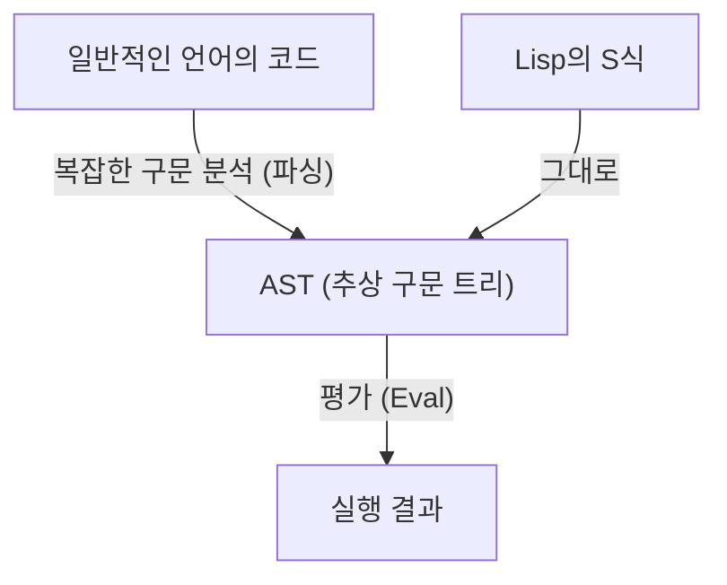
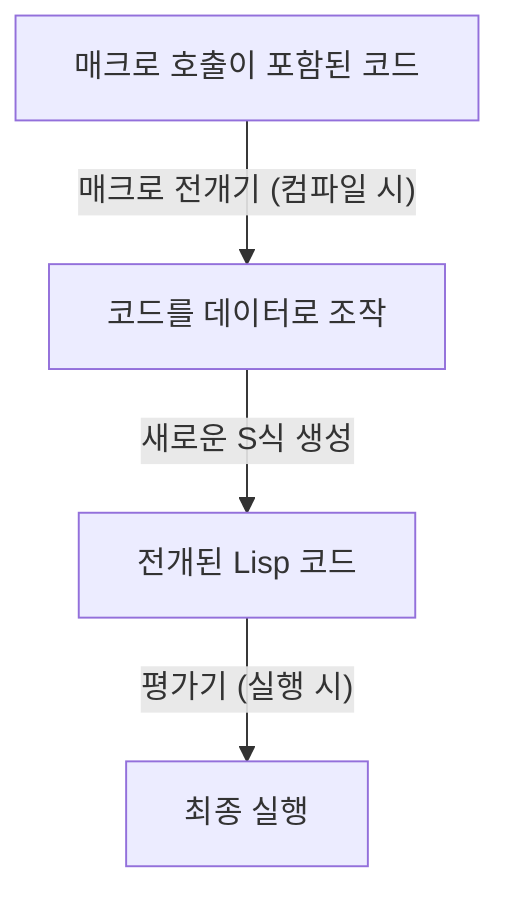

# Lisp와 "신의 언어"――S식의 아름다움과 코드-애즈-데이터 철학

프로그래밍 세계에는 일종의 "신화"처럼 전해 내려오는 언어가 존재합니다. 그 대표적인 것이 1958년 존 매카시가 만들어낸 **Lisp(List Processing)**입니다. Lisp는 단순한 도구로서의 프로그래밍 언어에 머물지 않고, 컴퓨터 과학의 근원적인 아름다움을 구현한 "신의 언어"라고까지 칭송받기도 합니다.

본 기사에서는 왜 Lisp가 이토록 열광적인 사랑을 받으며, 때로는 종교적일 정도의 경외심을 모으는지, 그 핵심에 있는 "S식(S-expressions)"의 아름다움, "동형성(Homoiconicity)"이라는 경이로운 개념, 그리고 코드-애즈-데이터(Code as Data)가 가져다주는 메타 프로그래밍의 심연에 대해 깊이 파헤쳐 보겠습니다.

## 제1장: 컴퓨터 과학의 여명과 매카시의 비전

1950년대, 컴퓨터는 주로 수치 계산을 위한 거대한 계산기로 인식되고 있었습니다. FORTRAN이 과학 기술 계산을 위해 탄생하고, COBOL이 비즈니스 용도로 설계되는 가운데, 존 매카시는 전혀 다른 관점을 가지고 있었습니다. 그는 "기호 처리(Symbolic Processing)", 즉 인간의 사고나 논리 그 자체를 컴퓨터 상에서 표현하고 조작하는 방법을 모색하고 있었던 것입니다.

매카시는 알론조 처치의 "람다 대수(Lambda Calculus)"에서 착안하여 순수한 수학적 함수를 기술할 수 있는 언어의 이론적 기반을 구축했습니다. 그 결과 탄생한 것이, 프로그램의 구조를 리스트(List)라는 지극히 단순한 데이터 구조로 표현하는 Lisp입니다.

Lisp는 탄생 직후부터 인공지능(AI) 연구의 표준 언어로서의 지위를 확립했습니다. 왜냐하면 인간의 사고 과정을 모델링하기 위해서는 사전에 정의된 정적인 데이터 구조보다, 프로그램 실행 중에 동적으로 변화하고 성장할 수 있는 유연한 데이터 구조(리스트)가 필수적이었기 때문입니다.

## 제2장: S식(S-expressions)의 압도적인 아름다움

Lisp의 가장 큰 특징이자, 다른 모든 언어와 선을 긋는 요소가 **S식(Symbolic Expressions)**입니다. S식은 요소를 괄호로 묶은 단순한 리스트에 불과합니다.

```lisp
(+ 1 2)
(defun factorial (n)
  (if (<= n 1)
      1
      (* n (factorial (- n 1)))))
```

처음 Lisp를 보는 사람은 무수히 이어지는 괄호의 물결에 압도될지도 모릅니다. "Lots of Irritating Superfluous Parentheses(짜증나고 쓸모없는 괄호 무더기)" 등으로 조롱받기도 합니다. 하지만 이 겉보기에 기묘한 구문 이면에는 궁극적인 보편성과 우아함이 숨겨져 있습니다.

현대의 프로그래밍 언어(Python, Java, C++ 등)는 인간의 가독성을 중시한 복잡한 문법(구문)을 가지고 있습니다. if문, for루프, 함수 정의 등 각각에 고유한 구문 규칙이 존재합니다. 컴파일러나 인터프리터는 이러한 소스 코드를 읽어 들여, 내부적으로 **추상 구문 트리(AST: Abstract Syntax Tree)**라는 트리 구조의 데이터로 변환(파싱)한 뒤 처리를 수행합니다.

대조적으로, Lisp의 S식은 **프로그래머가 직접 AST를 손으로 작성하고 있는 것**과 동의어입니다.



S식은 모든 데이터와 프로그램의 구조를 표현할 수 있는 보편적인 포맷입니다. XML이나 JSON이 발명되기 수십 년 전에, Lisp는 이미 "트리 구조의 데이터를 텍스트로 표현한다"는 궁극적인 해답에 도달해 있었습니다. 매카시는 애초에 인간을 위해 "M식(M-expressions)"이라는 일반적인 구문을 도입할 예정이었지만, 프로그래머들은 단순하고 규칙적인 S식을 즐겨 사용했고, 결과적으로 M식은 역사의 어둠 속으로 사라졌습니다.

## 제3장: 동형성(Homoiconicity)과 코드-애즈-데이터

S식의 진정한 무서움(그리고 아름다움)은 **"프로그램의 코드 자체가 Lisp의 기본 데이터 구조(리스트) 그 자체이다"**라는 사실에서 비롯됩니다. 이를 컴퓨터 과학 용어로 **동형성(Homoiconicity)**이라고 부릅니다.

Lisp에 있어서 데이터로서의 리스트 `(1 2 3)`과, 프로그램으로서의 코드 `(+ 1 2)`는 구조적으로 완전히 동일한 것입니다. Lisp 인터프리터는 리스트의 첫 번째 요소를 함수(또는 매크로)로 간주하고, 나머지 요소를 인수로 평가할 뿐입니다.

이 "코드와 데이터의 경계가 존재하지 않는다"는 성질은 **코드-애즈-데이터(Code as Data)**라는 강력한 철학을 탄생시켰습니다.

Lisp 프로그램은 실행 시에 자기 자신의 코드를 데이터로서 읽어 들이고 조작하여, 새로운 코드를 생성하고 실행할 수 있습니다. 다른 언어에서는 리플렉션이나 메타 프로그래밍과 같은 고도화되고 복잡한 기능으로 제공되는 것이, Lisp에서는 단순한 리스트 조작(`car`, `cdr`, `cons` 등)에 불과한 것입니다.

## 제4장: 신의 힘을 손에 넣다――매크로의 마법

동형성이 가져다주는 가장 큰 혜택이 Lisp의 **매크로(Macro)** 시스템입니다. C언어의 텍스트 치환 매크로와는 근본적으로 다릅니다. Lisp의 매크로는 **"컴파일 시에 실행되는 Lisp 프로그램"**입니다.

매크로는 평가 전의 S식(코드의 단편)을 인수로 받아, 임의의 리스트 조작을 수행하고 새로운 S식(변환 후의 코드)을 반환합니다. 이를 통해 프로그래머는 언어의 컴파일러를 자유롭게 확장하여, 자신의 작업에 최적화된 새로운 구문(DSL: Domain Specific Language)을 만들어낼 수 있습니다.



폴 그레이엄(Paul Graham)은 저서 『해커와 화가』에서 프로그래밍 언어의 진화를 "다른 언어로부터의 기능 차용"으로 묘사하고 있지만, Lisp 사용자에게 그것은 의미가 없습니다. "Lisp에 객체 지향이 부족하다고? 그러면 매크로로 추가하면 돼", "패턴 매칭이 필요하다고? 매크로로 짜자". 실제로 Lisp의 강력한 객체 지향 시스템인 CLOS(Common Lisp Object System)의 대부분은 Lisp 자신에 의한 매크로로 구현되어 있습니다.

매크로를 사용하면 프로그래머는 더 이상 언어 설계자의 결정에 얽매일 필요가 없습니다. 스스로의 손으로 언어를 진화시킬 수 있는 것입니다. 이것이 Lisp 프로그래머가 때로는 오만해 보일 정도로 자신의 언어를 자랑스러워하는 이유이며, "신의 언어"라고 불리는 이유입니다.

## 제5장: 왜 세상은 Lisp에 지배되지 않았는가? (Lisp의 저주)

이토록 강력하고 아름다운 언어라면, 왜 전 세계의 모든 소프트웨어는 Lisp로 작성되어 있지 않은 것일까요?

한 가지 이유는 그 자유도 자체에 있습니다. 이를 **"Lisp의 저주(The Lisp Curse)"**라고 부르는 사람도 있습니다.

Lisp는 너무나도 강력하기 때문에, 뛰어난 해커 한 명만 있으면 기존 라이브러리나 도구를 기다릴 것 없이 자신의 프로젝트에 최적화된 독자적인 DSL이나 도구들을 즉각 만들어냅니다. 그 결과, 표준적인 라이브러리 생태계가 자라기 어렵고, 개별 프로젝트가 "그 개발자만이 완벽하게 이해할 수 있는 방언"이 되기 쉽다는 문제가 발생했습니다.

또한 앞서 언급한 "괄호의 물결"이라는 외견상의 이질성이나, 너무 강력한 메타 프로그래밍이 팀 개발에서의 가독성을 떨어뜨린다는(한 명이 만든 마법 같은 매크로를 다른 팀원이 해독할 수 없다) 측면도 산업계에서의 보급을 방해한 요인입니다. 거대한 평범한 팀이 개발을 진행하는 현대 소프트웨어 공학에서는 Java나 Go와 같은 "제한이 많고, 누가 작성해도 똑같아지는 언어"가 선호되는 경향이 있습니다.

## 제6장: Lisp의 DNA는 살아 숨 쉰다

하지만 Lisp가 패배한 것은 아닙니다. Lisp의 아이디어는 현대 프로그래밍 언어의 거의 모든 것에 깊은 영향을 미치고 있습니다.

가비지 컬렉션(GC), 동적 타이핑, REPL(대화형 평가 환경), 일급 함수(클로저), 조건 분기(if-then-else)――이 모든 것은 Lisp가 앞장서서 도입했고, 후세의 언어들이 표준 기능으로 채택한 것들입니다. 현대 프로그래머는 의식적이든 무의식적이든 항상 Lisp의 유산 위에서 코드를 작성하고 있습니다.

게다가 JVM 상에서 동작하는 **Clojure**의 실용적인 성공이나, GNU Emacs를 구동하는 **Emacs Lisp**의 영원할 것 같은 수명, 교육 목적으로 계속해서 사랑받는 **Scheme** 등, Lisp의 직계 후손들도 여전히 강력한 존재감을 뽐내고 있습니다.

## 맺음말: 시점의 전환

Lisp를 배우는 것은 단순히 새로운 문법이나 라이브러리를 외우는 것이 아닙니다. 그것은 **패러다임 전환**이며, 프로그래밍이라는 행위 자체에 대한 관점의 근본적인 전환입니다.

코드와 데이터의 경계가 녹아내리고, 프로그램이 자신을 재귀적으로 다시 써 내려간다. 그 기저에는 단 몇 개의 기본 연산과, S식이라는 극한까지 군더더기를 없앤 아름다운 구조만이 존재한다――.

만약 당신이 매일의 프로그래밍에서 프레임워크의 제약이나 장황한 보일러플레이트 코드에 답답함을 느끼고 있다면, 꼭 한 번 Lisp의 세계(Clojure나 Scheme이라도 상관없습니다)에 발을 들여놓아 보시기 바랍니다. "신의 언어"의 단편을 접했을 때, 당신이 세상을 보는 눈은 이전과는 조금 달라져 있을 것입니다.
