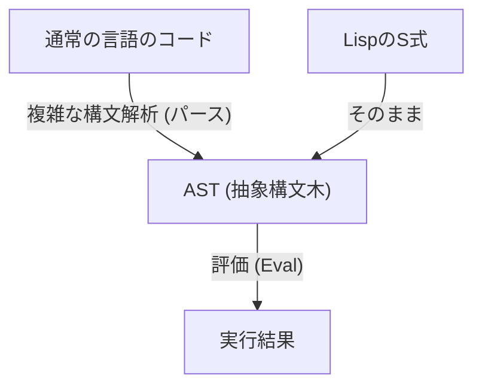
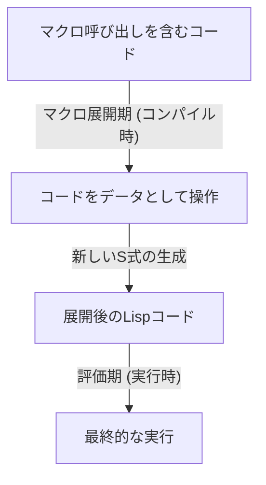

# Lispと「神の言語」――S式の美しさとコード・アズ・データの哲学

プログラミングの世界には、ある種の「神話」として語り継がれる言語が存在します。その筆頭が、1958年にジョン・マッカーシーによって生み出された**Lisp（List Processing）**です。Lispは単なるツールとしてのプログラミング言語にとどまらず、計算機科学の根源的な美しさを体現した「神の言語」とまで称されることがあります。

本記事では、なぜLispがこれほどまでに熱狂的に愛され、時には宗教的なまでの畏敬の念を集めるのか、その中核にある「S式（S-expressions）」の美しさ、「同図像性（Homoiconicity）」という驚異的な概念、そしてコード・アズ・データがもたらすメタプログラミングの深淵について、深く掘り下げていきます。

## 第1章：計算機科学の夜明けとマッカーシーのビジョン

1950年代、コンピュータは主に数値計算のための巨大な計算機として認識されていました。FORTRANが科学技術計算のために誕生し、COBOLがビジネス用途で設計される中、ジョン・マッカーシーは全く異なる視点を持っていました。彼は「記号処理（Symbolic Processing）」、すなわち人間の思考や論理そのものをコンピュータ上で表現し、操作する方法を模索していたのです。

マッカーシーは、アロンゾ・チャーチの「ラムダ計算（Lambda Calculus）」に着想を得て、純粋な数学的関数を記述できる言語の理論的基盤を構築しました。その結果生まれたのが、プログラムの構造をリスト（List）という極めて単純なデータ構造で表現するLispです。

Lispは誕生直後から、人工知能（AI）研究における標準言語としての地位を確立しました。なぜなら、人間の思考プロセスをモデリングするためには、事前に定義された静的なデータ構造よりも、プログラムの実行中に動的に変化・成長できる柔軟なデータ構造（リスト）が不可欠だったからです。

## 第2章：S式（S-expressions）の圧倒的な美しさ

Lispの最大の特徴であり、他のあらゆる言語と一線を画す要素が**S式（Symbolic Expressions）**です。S式は、要素を括弧で囲んだ単なるリストに過ぎません。

```lisp
(+ 1 2)
(defun factorial (n)
  (if (<= n 1)
      1
      (* n (factorial (- n 1)))))
```

初めてLispを見る人は、無数に連なる括弧の波に圧倒されるかもしれません。「Lots of Irritating Superfluous Parentheses（イライラする無用な括弧の山）」などと揶揄されることもあります。しかし、この一見奇妙な構文の背後には、究極の普遍性とエレガンスが隠されています。

現代のプログラミング言語（Python、Java、C++など）は、人間の読みやすさを重視した複雑な文法（シンタックス）を持っています。if文、forループ、関数定義など、それぞれに固有の構文規則が存在します。コンパイラやインタプリタは、これらのソースコードを読み込み、内部的に**抽象構文木（AST: Abstract Syntax Tree）**という木構造のデータに変換（パース）してから処理を行います。

対照的に、LispのS式は**プログラマが直接ASTを手書きしている**のと同義です。



S式は、あらゆるデータとプログラムの構造を表現できる普遍的なフォーマットです。XMLやJSONが発明される何十年も前に、Lispは既に「木構造のデータをテキストで表現する」という究極の解に到達していました。マッカーシーは当初、人間のために「M式（M-expressions）」という一般的な構文を導入する予定でしたが、プログラマたちは単純で規則的なS式を好んで使い続け、結果としてM式は歴史の闇に消えていきました。

## 第3章：同図像性（Homoiconicity）とコード・アズ・データ

S式の真の恐ろしさ（そして美しさ）は、**「プログラムのコード自体が、Lispの基本的なデータ構造（リスト）そのものである」**という事実に由来します。これを計算機科学の用語で**同図像性（Homoiconicity）**と呼びます。

Lispにおいては、データとしてのリスト `(1 2 3)` と、プログラムとしてのコード `(+ 1 2)` は、構造的に全く同じものです。Lispインタプリタは、リストの最初の要素を関数（またはマクロ）とみなし、残りの要素を引数として評価するだけです。

この「コードとデータの境界が存在しない」という性質は、**コード・アズ・データ（Code as Data）**という強力な哲学を生み出しました。

Lispプログラムは、実行時に自分自身のコードをデータとして読み込み、操作し、新しいコードを生成して実行することができます。他の言語ではリフレクションやメタプログラミングといった高度で複雑な機能として提供されるものが、Lispにおいては単なるリスト操作（`car`, `cdr`, `cons`など）に過ぎないのです。

## 第4章：神の力を手にする――マクロの魔法

同図像性がもたらす最大の恩恵が、Lispの**マクロ（Macro）**システムです。C言語のテキスト置換マクロとは根本的に異なります。Lispのマクロは、**「コンパイル時に実行されるLispプログラム」**です。

マクロは、評価前のS式（コードの断片）を引数として受け取り、任意のリスト操作を行って、新しいS式（変換後のコード）を返します。これにより、プログラマは言語のコンパイラを自由に拡張し、自分自身のタスクに最適化された新しい構文（DSL: Domain Specific Language）を創り出すことができます。



ポール・グレアム（Paul Graham）は著書『Hackers & Painters』の中で、プログラミング言語の進化を「他言語からの機能の借用」として描いていますが、Lispユーザーにとってそれは意味を持ちません。「Lispにオブジェクト指向が足りない？ ならばマクロで追加すればいい」「パターンマッチングが欲しい？ マクロで書こう」。事実、Lispの強力なオブジェクト指向システムであるCLOS（Common Lisp Object System）の大部分は、Lisp自身によるマクロで実装されています。

マクロを使えば、プログラマはもはや言語設計者の決定に縛られることはありません。自らの手で言語を進化させることができるのです。これが、Lispプログラマが時に傲慢に見えるほど自言語を誇りに思う理由であり、「神の言語」と呼ばれるゆえんです。

## 第5章：なぜ世界はLispに支配されていないのか？（Lispの呪い）

これほどまでに強力で美しい言語であるならば、なぜ世界中のすべてのソフトウェアはLispで書かれていないのでしょうか？ 

一つの理由は、その自由度の高さそのものにあります。これを**「Lispの呪い（The Lisp Curse）」**と呼ぶ者もいます。

Lispはあまりにも強力であるため、一人の優秀なハッカーがいれば、既存のライブラリやツールを待つことなく、自分のプロジェクトに最適化された独自のDSLやツール群を即座に作り上げてしまいます。その結果、標準的なライブラリのエコシステムが育ちにくく、個々のプロジェクトが「その開発者しか完全に理解できない方言」になりがちだという問題が生じました。

また、前述の「括弧の波」という見た目の異質さや、強力すぎるメタプログラミングがチーム開発における可読性を下げる（一人が作った魔法のようなマクロを、他のメンバーが解読できない）という側面も、産業界での普及を妨げた要因です。巨大な凡人のチームで開発を進める現代のソフトウェア工学においては、JavaやGoのような「制限の多い、誰が書いても同じになる言語」の方が好まれる傾向にあります。

## 第6章：LispのDNAは生き続ける

しかし、Lispが敗北したわけではありません。Lispのアイデアは、現代のプログラミング言語のほぼ全てに深い影響を与えています。

ガベージコレクション（GC）、動的型付け、REPL（対話型評価環境）、第一級関数（クロージャ）、条件分岐（if-then-else）――これらはすべて、Lispが先駆けて導入し、後世の言語が標準機能として取り入れたものです。現代のプログラマは、意識的であれ無意識的であれ、常にLispの遺産の上でコードを書いています。

さらに、JVM上で動作する**Clojure**の実用的な成功や、GNU Emacsを駆動する**Emacs Lisp**の永遠とも言える寿命、教育目的で愛され続ける**Scheme**など、Lispの直系の子孫たちも未だ強力な存在感を放っています。

## 終わりに：視点の転換

Lispを学ぶことは、単に新しい文法やライブラリを覚えることではありません。それは**パラダイムシフト**であり、プログラミングという行為そのものに対する視点の根本的な転換です。

コードとデータの境界が溶け合い、プログラムが自らを再帰的に書き換えていく。その根底には、わずか数個の基本演算と、S式という極限まで削ぎ落とされた美しい構造だけが存在する――。

もしあなたが日々のプログラミングで、フレームワークの制約や冗長なボイラープレートコードに息苦しさを感じているなら、ぜひ一度Lispの世界（ClojureやSchemeでも構いません）に足を踏み入れてみてください。「神の言語」の片鱗に触れたとき、あなたが世界を見る目は、以前とは少し違ったものになっているはずです。
