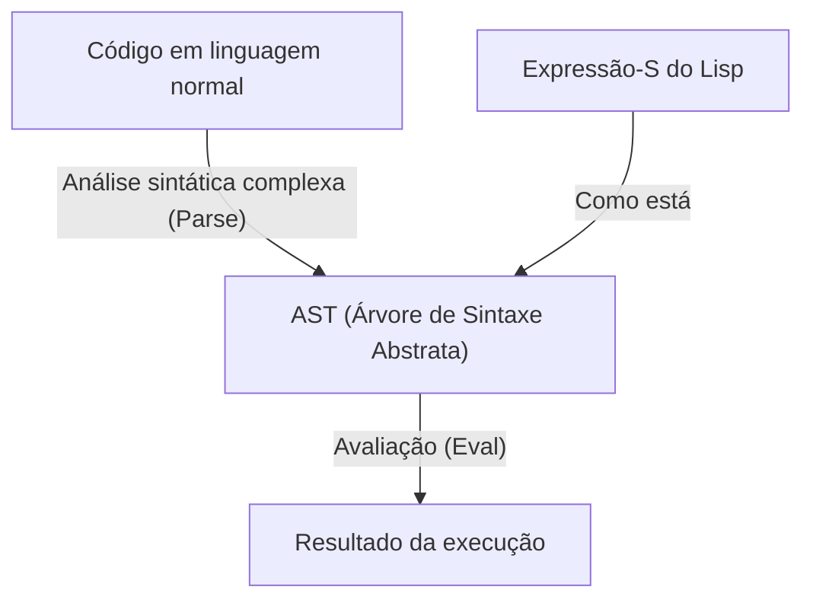
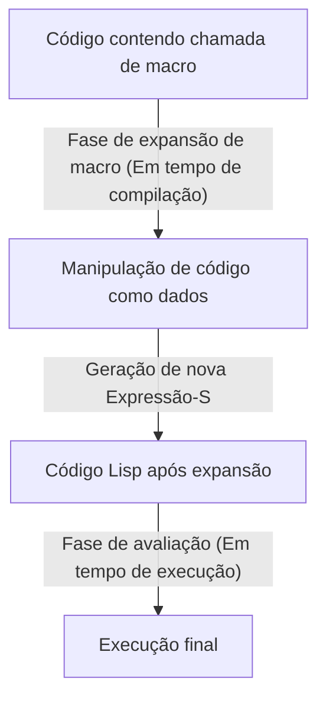

# Lisp e a "Linguagem de Deus" ―― A Beleza das Expressões-S e a Filosofia de Código como Dados

No mundo da programação, existem linguagens que são passadas de geração em geração como uma espécie de "mito". A principal delas é o **Lisp (List Processing)**, criado por John McCarthy em 1958. O Lisp vai além de ser apenas uma linguagem de programação como ferramenta, e às vezes é aclamado como a "linguagem de Deus" que personifica a beleza fundamental da ciência da computação.

Neste artigo, aprofundaremos por que o Lisp é tão amado com tanto fervor e, às vezes, atrai reverência quase religiosa, explorando a beleza das "Expressões-S (S-expressions)" em seu núcleo, o incrível conceito de "Homoiconicidade (Homoiconicity)" e o abismo da metaprogramação trazido pelo código como dados.

## Capítulo 1: O Amanhecer da Ciência da Computação e a Visão de McCarthy

Na década de 1950, os computadores eram reconhecidos principalmente como máquinas gigantescas para cálculos numéricos. Enquanto o FORTRAN nasceu para cálculos científicos e técnicos, e o COBOL foi projetado para uso comercial, John McCarthy tinha uma perspectiva completamente diferente. Ele buscava uma maneira de expressar e manipular o "Processamento Simbólico (Symbolic Processing)", ou seja, o próprio pensamento e lógica humana, em um computador.

Inspirado pelo "Cálculo Lambda (Lambda Calculus)" de Alonzo Church, McCarthy construiu a base teórica de uma linguagem que poderia descrever funções matemáticas puras. O resultado foi o Lisp, que expressa a estrutura de um programa em uma estrutura de dados extremamente simples chamada de lista (List).

Desde o seu nascimento, o Lisp estabeleceu sua posição como a linguagem padrão na pesquisa de inteligência artificial (IA). Isso ocorreu porque, para modelar os processos de pensamento humano, uma estrutura de dados flexível (lista) que poderia mudar e crescer dinamicamente durante a execução do programa era essencial, em oposição a estruturas de dados estáticas predefinidas.

## Capítulo 2: A Beleza Esmagadora das Expressões-S (S-expressions)

A maior característica do Lisp e o elemento que o diferencia de todas as outras linguagens são as **Expressões-S (Symbolic Expressions)**. Uma Expressão-S é simplesmente uma lista com seus elementos entre parênteses.

```lisp
(+ 1 2)
(defun factorial (n)
  (if (<= n 1)
      1
      (* n (factorial (- n 1)))))
```

Quem vê o Lisp pela primeira vez pode ficar sobrecarregado pela onda de inúmeros parênteses alinhados. Às vezes é ridicularizado como "Lots of Irritating Superfluous Parentheses" (Um monte de parênteses supérfluos e irritantes). No entanto, por trás dessa sintaxe aparentemente estranha esconde-se a universalidade e a elegância supremas.

Linguagens de programação modernas (Python, Java, C++, etc.) têm sintaxes (syntax) complexas que enfatizam a legibilidade humana. Existem regras de sintaxe específicas para declarações if, loops for, definições de funções, etc. O compilador ou interpretador lê esse código-fonte e o processa depois de convertê-lo (fazer o parse) internamente em uma estrutura de dados em forma de árvore chamada **Árvore de Sintaxe Abstrata (AST: Abstract Syntax Tree)**.

Em contraste, as Expressões-S do Lisp são sinônimos de **o programador escrevendo a AST diretamente à mão**.



Uma Expressão-S é um formato universal que pode expressar a estrutura de qualquer dado e programa. Décadas antes da invenção do XML ou do JSON, o Lisp já havia chegado à solução definitiva de "expressar dados em estrutura de árvore como texto". Inicialmente, McCarthy planejou introduzir uma sintaxe geral chamada "Expressões-M (M-expressions)" para humanos, mas os programadores preferiram continuar usando as Expressões-S simples e regulares, e como resultado, as Expressões-M desapareceram na escuridão da história.

## Capítulo 3: Homoiconicidade (Homoiconicity) e Código como Dados

O verdadeiro pavor (e a beleza) das Expressões-S vem do fato de que **"o próprio código do programa é a estrutura de dados básica (lista) do Lisp"**. Na terminologia da ciência da computação, isso é chamado de **Homoiconicidade (Homoiconicity)**.

No Lisp, a lista `(1 2 3)` como dado e o código `(+ 1 2)` como programa são estruturalmente exatamente iguais. O interpretador Lisp simplesmente considera o primeiro elemento da lista como uma função (ou macro) e avalia o resto dos elementos como argumentos.

Essa propriedade, onde "não há fronteira entre código e dados", deu origem à poderosa filosofia do **Código como Dados (Code as Data)**.

Um programa Lisp pode ler seu próprio código como dados em tempo de execução, manipulá-lo, gerar um novo código e executá-lo. O que em outras linguagens é fornecido como recursos altamente avançados e complexos, como reflexão e metaprogramação, no Lisp não passa de uma simples manipulação de lista (como `car`, `cdr`, `cons`, etc.).

## Capítulo 4: Obtendo o Poder de Deus ―― A Magia das Macros

O maior benefício trazido pela homoiconicidade é o sistema de **Macros (Macro)** do Lisp. É fundamentalmente diferente das macros de substituição de texto da linguagem C. As macros Lisp são **"programas Lisp executados em tempo de compilação"**.

Uma macro recebe uma Expressão-S não avaliada (um fragmento de código) como argumento, executa qualquer manipulação de lista e retorna uma nova Expressão-S (o código transformado). Isso permite que o programador estenda livremente o compilador da linguagem e crie uma nova sintaxe (DSL: Domain Specific Language - Linguagem Específica de Domínio) otimizada para suas próprias tarefas.



Em seu livro "Hackers & Painters", Paul Graham descreve a evolução das linguagens de programação como "empréstimo de recursos de outras linguagens", mas para os usuários de Lisp isso não tem sentido. "Falta orientação a objetos no Lisp? Então, basta adicioná-la com uma macro." "Quer correspondência de padrões (pattern matching)? Vamos escrever com uma macro." De fato, a maior parte do CLOS (Common Lisp Object System), o poderoso sistema de orientação a objetos do Lisp, é implementado através de macros no próprio Lisp.

Com as macros, os programadores não estão mais limitados pelas decisões dos designers da linguagem. Eles podem evoluir a linguagem com suas próprias mãos. Esta é a razão pela qual os programadores Lisp têm tanto orgulho de sua linguagem que às vezes parecem arrogantes, e a razão pela qual é chamada de "Linguagem de Deus".

## Capítulo 5: Por que o Mundo Não É Dominado pelo Lisp? (A Maldição do Lisp)

Se é uma linguagem tão poderosa e bela, por que todo software do mundo não é escrito em Lisp?

Um dos motivos está justamente no seu alto grau de liberdade. Alguns chamam isso de **"A Maldição do Lisp (The Lisp Curse)"**.

Como o Lisp é tão poderoso, se houver um único hacker brilhante, ele pode criar instantaneamente uma DSL e um conjunto de ferramentas próprios e otimizados para seu projeto, sem esperar por bibliotecas e ferramentas existentes. Como resultado, é difícil o crescimento de um ecossistema de bibliotecas padrão, criando o problema de que cada projeto tende a se tornar um "dialeto que apenas aquele desenvolvedor consegue compreender completamente".

Além disso, a estranheza visual da "onda de parênteses" mencionada anteriormente e o aspecto de que a metaprogramação excessivamente poderosa reduz a legibilidade no desenvolvimento em equipe (outros membros não conseguem decifrar uma macro mágica criada por uma pessoa) também foram fatores que impediram sua adoção pela indústria. Na moderna engenharia de software, onde o desenvolvimento é feito por enormes equipes de pessoas comuns, linguagens como Java ou Go, que são "mais restritivas e onde o código fica igual não importa quem o escreva", tendem a ser preferidas.

## Capítulo 6: O DNA do Lisp Continua Vivo

No entanto, o Lisp não foi derrotado. As ideias do Lisp tiveram uma profunda influência em quase todas as linguagens de programação modernas.

Coleta de lixo (Garbage Collection - GC), tipagem dinâmica, REPL (ambiente de avaliação interativo), funções de primeira classe (closures), ramificação condicional (if-then-else) ―― todos esses foram recursos pioneiros introduzidos pelo Lisp e posteriormente adotados como recursos padrão por linguagens de gerações subsequentes. Programadores modernos estão sempre escrevendo código no legado do Lisp, conscientemente ou não.

Além disso, o sucesso prático do **Clojure**, que roda na JVM, a vida quase eterna do **Emacs Lisp**, que move o GNU Emacs, e o **Scheme**, que continua a ser amado para fins educacionais, mostram que os descendentes diretos do Lisp ainda mantêm uma forte presença.

## Conclusão: Uma Mudança de Perspectiva

Aprender Lisp não é simplesmente memorizar uma nova sintaxe ou biblioteca. É uma **mudança de paradigma (paradigm shift)**, uma alteração fundamental na sua perspectiva sobre o próprio ato da programação.

As fronteiras entre o código e os dados se fundem, e o programa se reescreve recursivamente. Em sua base, existem apenas algumas operações básicas e a bela estrutura das Expressões-S, despojada ao seu limite extremo...

Se você se sente sufocado pelas restrições de frameworks e pelo código boilerplate redundante em sua programação diária, por favor, experimente entrar no mundo do Lisp (Clojure ou Scheme também servem) pelo menos uma vez. Quando você vislumbrar um pedaço da "Linguagem de Deus", a maneira como você vê o mundo certamente terá se tornado um pouco diferente de antes.
