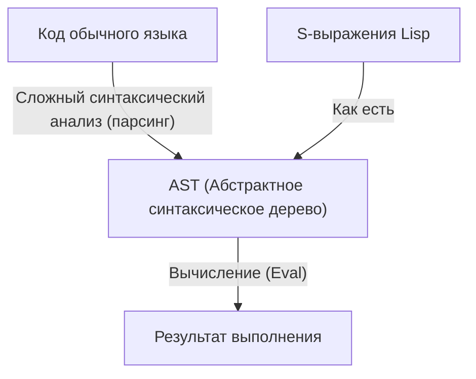
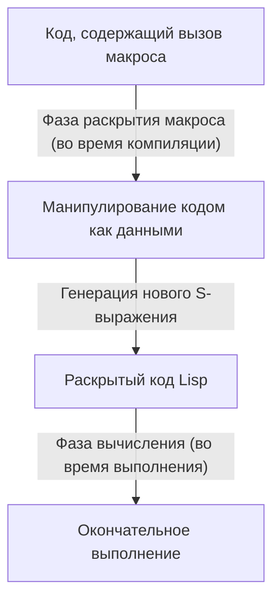

# Lisp и «Язык бога» — красота S-выражений и философия «код как данные»

В мире программирования существуют языки, передающиеся из уст в уста как своего рода «мифы». Первым среди них является **Lisp (List Processing)**, созданный Джоном Маккарти в 1958 году. Lisp — это не просто язык программирования как инструмент, его иногда называют «языком бога», который воплощает в себе фундаментальную красоту информатики.

В этой статье мы глубоко погрузимся в то, почему Lisp пользуется такой фанатичной любовью, а иногда и религиозным благоговением. Мы исследуем его ядро: красоту S-выражений (S-expressions), удивительную концепцию гомоиконичности (Homoiconicity) и бездну метапрограммирования, порожденную философией «код как данные».

## Глава 1: Рассвет информатики и видение Маккарти

В 1950-х годах компьютеры воспринимались в основном как гигантские вычислительные машины для числовых расчетов. В то время как FORTRAN создавался для научно-технических вычислений, а COBOL проектировался для бизнес-приложений, у Джона Маккарти была совершенно иная точка зрения. Он искал способы «символьной обработки» (Symbolic Processing) — то есть выражения и манипулирования самим человеческим мышлением и логикой на компьютере.

Вдохновленный «лямбда-исчислением» (Lambda Calculus) Алонзо Чёрча, Маккарти заложил теоретические основы языка, способного описывать чистые математические функции. Результатом стал Lisp — язык, представляющий структуру программы в виде предельно простой структуры данных, называемой списком (List).

Сразу после своего появления Lisp утвердился в качестве стандартного языка для исследований в области искусственного интеллекта (ИИ). Это произошло потому, что для моделирования процессов человеческого мышления требовалась не заранее определенная статичная структура данных, а гибкая структура (список), способная динамически изменяться и расти во время выполнения программы.

## Глава 2: Потрясающая красота S-выражений (S-expressions)

Самая главная особенность Lisp, отличающая его от всех других языков — это **S-выражения (Symbolic Expressions)**. S-выражение — это просто список элементов, заключенный в скобки.

```lisp
(+ 1 2)
(defun factorial (n)
  (if (<= n 1)
      1
      (* n (factorial (- n 1)))))
```

Те, кто видит Lisp впервые, могут быть ошеломлены бесчисленными волнами скобок. Иногда его даже насмешливо расшифровывают как «Lots of Irritating Superfluous Parentheses» (Куча раздражающих лишних скобок). Однако за этим, на первый взгляд, странным синтаксисом скрывается абсолютная универсальность и элегантность.

Современные языки программирования (Python, Java, C++ и др.) имеют сложный синтаксис, ориентированный на удобство чтения человеком. Для операторов if, циклов for, определений функций существуют свои собственные синтаксические правила. Компиляторы и интерпретаторы считывают этот исходный код и внутренне преобразуют (парсят) его в древовидную структуру данных, называемую **абстрактным синтаксическим деревом (AST: Abstract Syntax Tree)**, прежде чем начать обработку.

В отличие от них, S-выражения в Lisp эквивалентны тому, что **программист напрямую пишет AST вручную**.



S-выражения — это универсальный формат, способный представить любую структуру данных и программ. За десятилетия до изобретения XML и JSON, Lisp уже пришел к абсолютному решению — «текстовому представлению древовидных данных». Изначально Маккарти планировал внедрить общий синтаксис под названием «M-выражения (M-expressions)» для удобства людей, но программисты предпочли использовать простые и регулярные S-выражения, в результате чего M-выражения канули в лету истории.

## Глава 3: Гомоиконичность (Homoiconicity) и «код как данные»

Истинный ужас (и красота) S-выражений проистекает из того факта, что **«сам код программы является фундаментальной структурой данных Lisp (списком)»**. В терминологии информатики это называется **гомоиконичностью (Homoiconicity)**.

В Lisp список `(1 2 3)` как данные и код `(+ 1 2)` как программа структурно абсолютно идентичны. Интерпретатор Lisp просто рассматривает первый элемент списка как функцию (или макрос), а остальные элементы вычисляет как аргументы.

Это свойство отсутствия границы между кодом и данными породило мощную философию **«код как данные» (Code as Data)**.

Программы на Lisp могут читать свой собственный код как данные во время выполнения, манипулировать им, генерировать новый код и выполнять его. То, что в других языках предоставляется в виде сложных и продвинутых функций, таких как рефлексия и метапрограммирование, в Lisp является не более чем простыми операциями над списками (`car`, `cdr`, `cons` и т.д.).

## Глава 4: Обретение божественной силы — магия макросов

Самым большим преимуществом, которое дает гомоиконичность, является система **макросов (Macro)** в Lisp. Она в корне отличается от макросов текстовой подстановки в языке C. Макросы Lisp — это **«программы на Lisp, выполняемые во время компиляции»**.

Макрос принимает невычисленное S-выражение (фрагмент кода) в качестве аргумента, выполняет произвольные операции над списком и возвращает новое S-выражение (преобразованный код). Это позволяет программисту свободно расширять компилятор языка и создавать новые синтаксические конструкции (DSL: Domain Specific Language), оптимизированные для его собственных задач.



Пол Грэм (Paul Graham) в своей книге «Хакеры и художники» (Hackers & Painters) описывает эволюцию языков программирования как «заимствование функций из других языков», но для пользователей Lisp это не имеет смысла. «В Lisp не хватает объектно-ориентированности? Тогда просто добавьте ее с помощью макроса». «Нужно сопоставление с образцом? Напишем его через макрос». Фактически, большая часть CLOS (Common Lisp Object System), мощной объектно-ориентированной системы Lisp, реализована с помощью макросов на самом Lisp.

Используя макросы, программист больше не связан решениями создателей языка. Он может развивать язык своими собственными руками. Именно поэтому программисты на Lisp часто гордятся своим языком до такой степени, что могут казаться высокомерными, и именно поэтому его называют «языком бога».

## Глава 5: Почему мир не управляется Lisp? (Проклятие Lisp)

Если это такой мощный и красивый язык, то почему не все программное обеспечение в мире написано на Lisp?

Одна из причин кроется в самой его высокой степени свободы. Некоторые называют это **«Проклятием Lisp» (The Lisp Curse)**.

Lisp настолько мощен, что один талантливый хакер может мгновенно создать собственные DSL и наборы инструментов, оптимизированные для его проекта, не дожидаясь появления готовых библиотек и инструментов. В результате стандартная экосистема библиотек развивается с трудом, и каждый проект часто превращается в «диалект, который может полностью понять только его разработчик».

Кроме того, странный внешний вид «волн скобок» и слишком мощное метапрограммирование, снижающее читаемость при командной разработке (когда другие члены команды не могут расшифровать волшебный макрос, написанный одним человеком), также стали факторами, препятствующими его широкому распространению в индустрии. В современной программной инженерии, где разработка ведется огромными командами обычных программистов, предпочтение часто отдается языкам вроде Java или Go, которые «имеют множество ограничений и заставляют всех писать одинаково».

## Глава 6: ДНК Lisp продолжает жить

Однако Lisp не потерпел поражения. Идеи Lisp оказали глубокое влияние почти на все современные языки программирования.

Сборка мусора (GC), динамическая типизация, REPL (интерактивная среда вычисления), функции первого класса (замыкания), условное ветвление (if-then-else) — все это было впервые внедрено в Lisp, а затем перенято последующими языками в качестве стандартных функций. Современные программисты, осознанно или бессознательно, всегда пишут код, опираясь на наследие Lisp.

Более того, прямые потомки Lisp по-прежнему сохраняют сильное присутствие, такие как практический успех **Clojure**, работающего на JVM, почти вечная жизнь **Emacs Lisp**, который управляет GNU Emacs, и **Scheme**, который продолжают любить за его образовательную ценность.

## Заключение: Смена перспективы

Изучение Lisp — это не просто запоминание нового синтаксиса и библиотек. Это **смена парадигмы** и фундаментальное изменение взгляда на сам процесс программирования.

Границы между кодом и данными стираются, и программа рекурсивно переписывает саму себя. В основе всего этого лежат лишь несколько базовых операций и предельно минималистичная, красивая структура S-выражений.

Если вы задыхаетесь от ограничений фреймворков и избыточного шаблонного кода в вашем повседневном программировании, обязательно попробуйте войти в мир Lisp (подойдут и Clojure, и Scheme). Когда вы прикоснетесь к частичке «языка бога», ваш взгляд на мир наверняка немного изменится.
