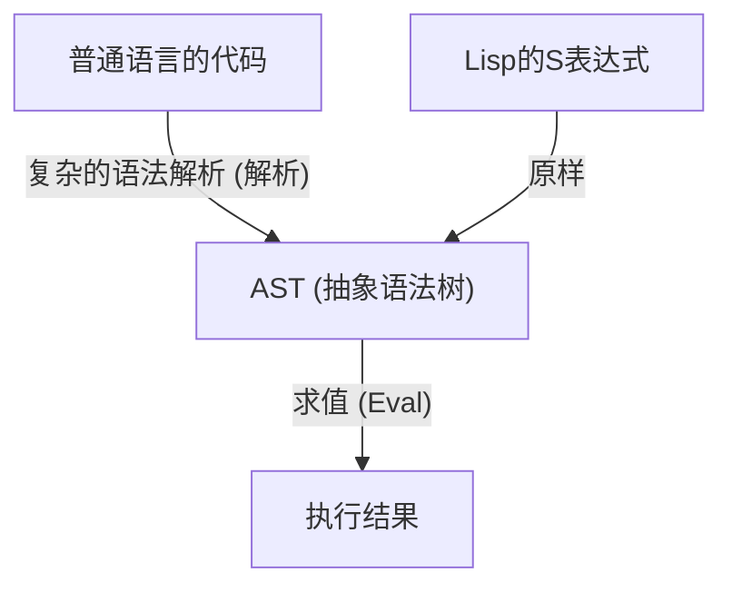
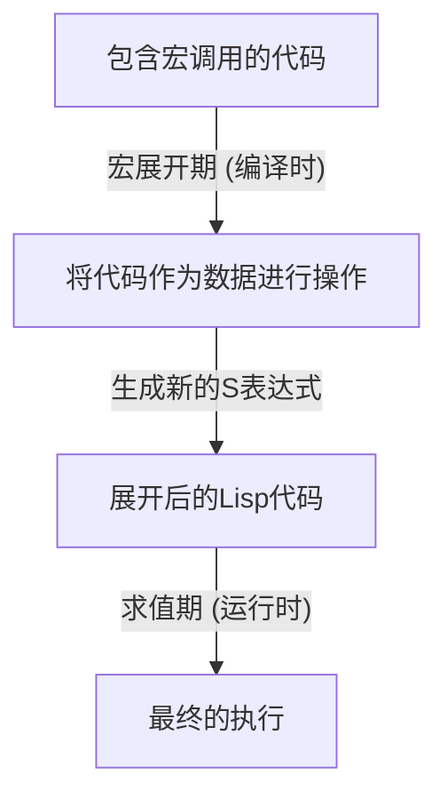

# Lisp与“神的语言”——S表达式之美与代码即数据的哲学

在编程世界中，存在着一些被作为某种“神话”代代相传的语言。其中最具代表性的便是1958年由约翰·麦卡锡（John McCarthy）创造的**Lisp（List Processing）**。Lisp不仅仅是作为一种工具的编程语言，它甚至有时被称为体现了计算机科学根本之美的“神的语言”。

本文将深入探讨Lisp为何能受到如此狂热的喜爱，甚至有时能汇聚近乎宗教般的敬畏之情，剖析其核心中“S表达式（S-expressions）”的美感、“同像性（Homoiconicity）”这一惊人的概念，以及代码即数据（Code as Data）所带来的元编程的深渊。

## 第1章：计算机科学的黎明与麦卡锡的愿景

在20世纪50年代，计算机主要被视为用于数值计算的庞大计算机器。在FORTRAN为科学技术计算而诞生、COBOL被设计用于商业用途的背景下，约翰·麦卡锡却拥有着截然不同的视角。他正在探索“符号处理（Symbolic Processing）”，即如何在计算机上表达和操作人类的思维与逻辑本身的方法。

麦卡锡从阿隆佐·邱奇（Alonzo Church）的“λ演算（Lambda Calculus）”中获得灵感，构建了一种能够描述纯数学函数的语言的理论基础。其结果便是Lisp的诞生，它使用列表（List）这种极其简单的数据结构来表示程序的结构。

自诞生之初，Lisp便确立了其作为人工智能（AI）研究中标准语言的地位。这是因为，为了对人类的思考过程进行建模，比起预先定义的静态数据结构，能够在程序执行过程中动态变化和成长的灵活数据结构（列表）是不可或缺的。

## 第2章：S表达式（S-expressions）的压倒性之美

Lisp最大的特征，也是使其与其他所有语言划清界限的要素，就是**S表达式（Symbolic Expressions）**。S表达式只不过是将元素用括号括起来的列表而已。

```lisp
(+ 1 2)
(defun factorial (n)
  (if (<= n 1)
      1
      (* n (factorial (- n 1)))))
```

初次见到Lisp的人，可能会被那无数连绵的括号之浪所震撼。它甚至被戏称为“Lots of Irritating Superfluous Parentheses（令人恼火的无数多余括号）”。然而，在这乍看之下颇为怪异的语法背后，却隐藏着极致的普遍性与优雅。

现代的编程语言（如Python、Java、C++等）为了重视人类的可读性，拥有着复杂的语法（Syntax）。if语句、for循环、函数定义等，各自都存在特定的语法规则。编译器或解释器在读取这些源代码后，会先在内部将其转换（解析）为一种名为**抽象语法树（AST: Abstract Syntax Tree）**的树状数据结构，然后才进行处理。

相比之下，Lisp的S表达式就等同于**程序员在直接手写AST**。



S表达式是一种能够表达所有数据和程序结构的普遍格式。在XML和JSON被发明出来的几十年前，Lisp就已经达到了“用文本表示树状数据”这一终极解。麦卡锡最初曾计划为人类引入一种名为“M表达式（M-expressions）”的通用语法，但程序员们更喜欢继续使用简单且规律的S表达式，结果M表达式便消失在了历史的阴影之中。

## 第3章：同像性（Homoiconicity）与代码即数据

S表达式真正的可怕之处（以及它的美丽之处），源于这样一个事实：**“程序代码本身就是Lisp的基本数据结构（列表）”**。在计算机科学的术语中，这被称为**同像性（Homoiconicity）**。

在Lisp中，作为数据的列表 `(1 2 3)` 与作为程序的代码 `(+ 1 2)`，在结构上是完全相同的。Lisp解释器只是将列表的第一个元素视为函数（或宏），然后将其余元素作为参数来进行求值。

这种“代码与数据之间不存在边界”的性质，孕育出了**代码即数据（Code as Data）**这一强大的哲学。

Lisp程序可以在运行时将自身的代码作为数据进行读取和操作，生成新的代码并执行。在其他语言中，作为反射或元编程等高级复杂功能提供的东西，在Lisp中只不过是简单的列表操作（如 `car`, `cdr`, `cons`）而已。

## 第4章：获取神之力量——宏的魔法

同像性带来的最大恩惠，便是Lisp的**宏（Macro）**系统。它与C语言的文本替换宏有着根本的不同。Lisp的宏是**“在编译时执行的Lisp程序”**。

宏接收求值前的S表达式（代码片段）作为参数，执行任意的列表操作，然后返回新的S表达式（转换后的代码）。通过这种方式，程序员可以自由地扩展语言的编译器，创造出针对自身任务优化的新语法（DSL: 领域特定语言，Domain Specific Language）。



保罗·格雷厄姆（Paul Graham）在著作《黑客与画家》（Hackers & Painters）中，将编程语言的进化描绘为“从其他语言借用功能”，但这对于Lisp用户来说毫无意义。“Lisp缺少面向对象？那就用宏加上去吧”、“想要模式匹配？用宏来写吧”。事实上，Lisp强大的面向对象系统CLOS（Common Lisp Object System），其大部分就是通过Lisp自身的宏来实现的。

有了宏，程序员就不再受制于语言设计者的决定。他们可以用自己的双手让语言进化。这就是Lisp程序员有时显得有些傲慢，对自己的语言感到如此自豪的原因，也是它被称为“神的语言”的缘由。

## 第5章：为什么世界没有被Lisp统治？（Lisp的诅咒）

既然这门语言如此强大和优美，为什么全世界所有的软件没有都用Lisp来编写呢？ 

其中一个原因，就在于它那极高的自由度本身。也有人将其称为**“Lisp的诅咒（The Lisp Curse）”**。

因为Lisp太过强大，只要有一名优秀的黑客，他就不需要等待现有的库或工具，而是可以立刻打造出一套针对自己项目优化的独特DSL和工具群。其结果是，标准库的生态系统难以培育，并且每个项目都很容易变成“只有那个开发者才能完全理解的方言”，从而产生了这样的问题。

此外，前面提到的“括号之浪”在外观上的怪异感，以及过于强大的元编程会降低团队开发中的可读性（一个人写出的如同魔法般的宏，其他成员可能无法解读），这些因素也阻碍了它在工业界的普及。在由庞大的普通人团队推进开发的现代软件工程中，人们更倾向于选择像Java或Go那样“限制多，谁写都一样”的语言。

## 第6章：Lisp的DNA生生不息

然而，Lisp并没有失败。Lisp的思想对现代几乎所有的编程语言都产生了深远的影响。

垃圾回收（GC）、动态类型、REPL（交互式求值环境）、一等函数（闭包）、条件分支（if-then-else）——所有这些都是Lisp率先引入，后来被后世语言采纳为标准功能的。现代程序员无论是有意还是无意，都一直在Lisp的遗产之上编写代码。

此外，在JVM上运行的**Clojure**在实用上的成功、驱动GNU Emacs的**Emacs Lisp**近乎永恒的寿命，以及因教育目的而持续受到喜爱的**Scheme**等，Lisp的直系后代们依然散发着强大的存在感。

## 结语：视角的转换

学习Lisp并不只是记住新的语法和库。这是一种**范式转移（Paradigm Shift）**，是对编程这一行为本身视角的根本性转换。

代码与数据的边界相互交融，程序会递归地改写自身。在其根基处，只存在寥寥几个基本运算，以及S表达式这种被精简到极致的美丽结构——。

如果在日常的编程中，你对框架的限制或冗长的样板代码感到窒息，请务必踏入Lisp的世界（Clojure或Scheme也可以）去试一试。当你触碰到这“神的语言”的一丝鳞片时，你看世界的眼光，一定会变得与以前有些不同。
