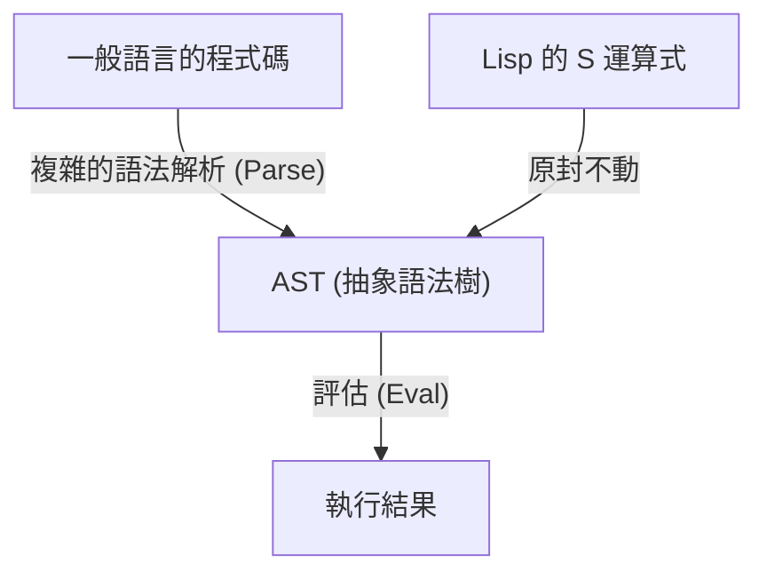
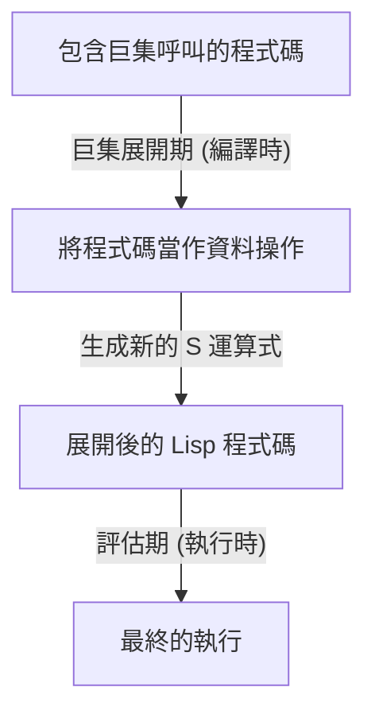

# Lisp 與「神的語言」——S 運算式的極致之美與程式碼即資料的哲學

在程式設計的世界中，存在著一些被當作「神話」流傳下來的語言。其中最具代表性的，就是由約翰·麥卡錫 (John McCarthy) 於 1958 年創造的 **Lisp (List Processing)**。Lisp 不僅僅是作為一種工具的程式語言，它有時甚至被譽為體現了電腦科學根本之美的「神的語言」。

在本文中，我們將深入探討為何 Lisp 能夠如此受到狂熱的喜愛，甚至引發宗教般的敬畏。我們將深入挖掘其核心的「S 運算式 (S-expressions)」之美、「同像性 (Homoiconicity)」這令人驚嘆的概念，以及「程式碼即資料 (Code as Data)」所帶來的後設程式設計 (Metaprogramming) 深淵。

## 第 1 章：電腦科學的黎明與麥卡錫的願景

在 1950 年代，電腦主要被視為用於數值計算的巨型計算機。在 FORTRAN 為了科學運算而誕生，COBOL 被設計用於商業用途的時代背景下，約翰·麥卡錫卻有著截然不同的視角。他正在探索「符號處理 (Symbolic Processing)」，也就是如何在電腦上表達和操作人類思考與邏輯本身的方法。

麥卡錫從阿隆佐·邱奇 (Alonzo Church) 的「λ 演算 (Lambda Calculus)」中獲得靈感，建構了能描述純粹數學函數語言的理論基礎。由此誕生的便是 Lisp，它透過一種極其簡單被稱為串列 (List) 的資料結構來表達程式的結構。

Lisp 自誕生之初，就確立了其作為人工智慧 (AI) 研究標準語言的地位。因為要對人類的思考過程進行建模，比起預先定義好的靜態資料結構，在程式執行中能動態變化與成長的彈性資料結構 (串列) 是不可或缺的。

## 第 2 章：S 運算式 (S-expressions) 壓倒性的美感

Lisp 最大的特徵，也是讓它與其他所有語言劃清界線的要素，就是 **S 運算式 (Symbolic Expressions)**。S 運算式不過就是將元素用括號括起來的單純串列。

```lisp
(+ 1 2)
(defun factorial (n)
  (if (<= n 1)
      1
      (* n (factorial (- n 1)))))
```

第一次看到 Lisp 的人，可能會被那無窮無盡的括號海給震懾住。甚至有人嘲諷它是「Lots of Irritating Superfluous Parentheses (一堆令人煩躁的多餘括號)」。然而，在這個看似怪異的語法背後，隱藏著終極的普遍性與優雅。

現代的程式語言（如 Python、Java、C++ 等），都擁有一套重視人類可讀性、複雜的語法 (Syntax)。if 條件句、for 迴圈、函式定義等，各自都存在著獨特的語法規則。編譯器 (Compiler) 或直譯器 (Interpreter) 會讀取這些原始碼，在內部將其轉換 (解析, Parse) 為被稱為**抽象語法樹 (AST: Abstract Syntax Tree)** 的樹狀資料結構，然後才進行處理。

相比之下，Lisp 的 S 運算式，就等同於**程式設計師直接手寫 AST**。



S 運算式是一種能表達任何資料與程式結構的普遍格式。在 XML 或 JSON 發明的前幾十年，Lisp 就已經達到了「用純文字表達樹狀資料結構」的終極解答。麥卡錫最初打算為了人類引入一種被稱為「M 運算式 (M-expressions)」的通用語法，但程式設計師們卻偏好繼續使用簡單且具備規則性的 S 運算式，導致 M 運算式最終消失在歷史的洪流中。

## 第 3 章：同像性 (Homoiconicity) 與程式碼即資料

S 運算式真正可怕（同時也是美麗）的地方，源自於**「程式碼本身，就是 Lisp 的基本資料結構 (串列)」**這個事實。這在電腦科學術語中被稱為**同像性 (Homoiconicity)**。

在 Lisp 中，作為資料的串列 `(1 2 3)` 與作為程式碼的 `(+ 1 2)`，在結構上是完全相同的東西。Lisp 直譯器只是將串列的第一個元素視為函數 (或巨集)，並將剩餘的元素作為引數進行評估。

這種「程式碼與資料之間不存在界線」的特性，孕育出了**程式碼即資料 (Code as Data)** 這個強大的哲學。

Lisp 程式在執行時，可以將自己的程式碼當作資料來讀取、操作，進而生成新的程式碼並執行。在其他語言中，作為高階且複雜功能提供的反射 (Reflection) 或後設程式設計 (Metaprogramming)，在 Lisp 中不過就是單純的串列操作（如 `car`、`cdr`、`cons` 等）。

## 第 4 章：獲得神的力量——巨集的魔法

同像性所帶來的最大恩惠，就是 Lisp 的**巨集 (Macro)** 系統。它與 C 語言的文字替換巨集有著根本上的不同。Lisp 的巨集是**「在編譯期執行的 Lisp 程式」**。

巨集接收評估前的 S 運算式 (程式碼片段) 作為引數，進行任意的串列操作後，回傳一個新的 S 運算式 (轉換後的程式碼)。這使得程式設計師能夠自由地擴充語言的編譯器，創造出專門針對自身任務最佳化的新語法 (DSL: 領域特定語言, Domain Specific Language)。



保羅·格雷厄姆 (Paul Graham) 在其著作《駭客與畫家》中，將程式語言的演進描繪為「從其他語言借鑒功能」，但這對 Lisp 使用者來說毫無意義。「Lisp 缺少物件導向？那就用巨集加上去就好了」、「想要模式匹配 (Pattern Matching)？自己用巨集寫一個吧」。事實上，Lisp 強大的物件導向系統 CLOS (Common Lisp Object System) 的絕大部分，就是透過 Lisp 自身的巨集實作出來的。

有了巨集，程式設計師就不再受到語言設計者決定的束縛。他們能夠親手讓語言進化。這就是為何 Lisp 程式設計師有時看起來會傲慢地為自己的語言感到自豪的原因，也是它被稱為「神的語言」的由來。

## 第 5 章：為何世界沒有被 Lisp 統治？（Lisp 的詛咒）

既然它是一種如此強大且優美的語言，為何世界上所有的軟體不是都用 Lisp 寫的呢？

其中一個原因，就在於它極高的自由度。有些人將此稱為**「Lisp 的詛咒 (The Lisp Curse)」**。

因為 Lisp 實在太過強大，只要有一位優秀的駭客，他就不需要等待現有的函式庫或工具，能立刻打造出為自己專案量身訂作的專屬 DSL 和工具群。結果導致標準的函式庫生態系難以發展，各個專案往往會變成「只有該開發者才能完全理解的方言」。

此外，前面提到的「括號海」這種外觀上的異質性，以及過於強大的後設程式設計會降低團隊開發時的可讀性（一個人寫出來的魔法般的巨集，其他成員無法解讀）等層面，也成為了阻礙其在產業界普及的因素。在由龐大的凡人團隊進行開發的現代軟體工程中，像 Java 或 Go 這樣「限制很多、誰寫出來都差不多的語言」反而更受青睞。

## 第 6 章：Lisp 的 DNA 仍在延續

然而，Lisp 並沒有失敗。Lisp 的思想已經對現代幾乎所有的程式語言產生了深遠的影響。

垃圾回收機制 (GC)、動態型別、REPL (互動式評估環境)、一級函式 (閉包, Closure)、條件分支 (if-then-else)——這些全都是 Lisp 率先引入，並被後世語言採納為標準功能的特性。現代的程式設計師，無論是有意還是無意，總是在 Lisp 的遺產之上編寫著程式碼。

此外，在 JVM 上運作且取得實務成功的 **Clojure**、驅動 GNU Emacs 且擁有近乎永恆壽命的 **Emacs Lisp**，以及因為教育目的而持續備受喜愛的 **Scheme** 等，這些 Lisp 的直系後裔們至今依然散發著強大的存在感。

## 結語：視角的轉換

學習 Lisp 並不只是記住新的語法或函式庫。那是一場**典範轉移 (Paradigm Shift)**，是對「寫程式」這個行為本身視角的根本性轉換。

程式碼與資料的邊界逐漸消融，程式將遞迴地改寫自身。在其根基之處，僅僅存在著寥寥幾個基本運算，以及名為 S 運算式這種被削減至極限的優美結構——。

如果你在日常的程式開發中，對框架的限制或冗長的樣板程式碼 (Boilerplate Code) 感到窒息，請務必踏入 Lisp 的世界（Clojure 或 Scheme 也可以）一次看看。當你接觸到「神的語言」的片鱗半爪時，你看待世界的眼光，想必會與以前有些許不同吧。
