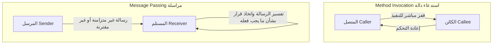
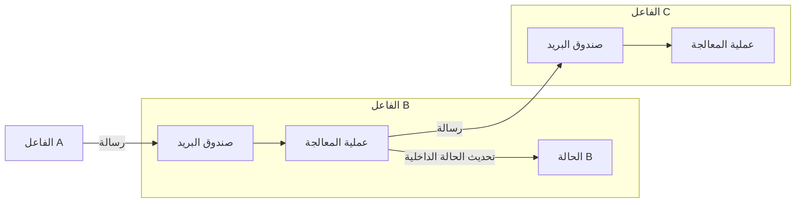

## 1. مقدمة: هل "البرمجة كائنية التوجه" التي نعرفها حقيقية؟

في تطوير البرمجيات الحديثة، لا يمر يوم دون أن نسمع مصطلح "البرمجة كائنية التوجه (OOP: Object-Oriented Programming)". تعتمد معظم لغات البرمجة السائدة مثل Java و C# و Python و Ruby و C++ على نموذج البرمجة كائنية التوجه، مما يجعلها معرفة أساسية للمطورين.

ولكن، هل تعلم أن "العناصر الثلاثة الرئيسية للبرمجة كائنية التوجه" التي يتعلمها معظم المطورين في البداية — وهي "التغليف Encapsulation" و"الوراثة Inheritance" و"تعدد الأشكال Polymorphism" — تنحرف في الواقع بشكل كبير عن الجوهر الذي قصده آلان كاي (Alan Kay)، والذي يمكن اعتباره الأب الروحي للبرمجة كائنية التوجه؟

الأسلوب الذي نكتب به التعليمات البرمجية يوميًا من خلال "تعريف الفئات، وإنشاء الكائنات، واستدعاء الدوال (الأساليب) باستخدام التدوين النقطي" هو بالفعل شكل من أشكال البرمجة كائنية التوجه التي أنشأتها لغات معينة (مثل C++ و Java). ومع ذلك، فإن هذا لا يمثل سوى جزء صغير جدًا من المفهوم الواسع للبرمجة كائنية التوجه، أو مجرد تفسير محدد له.

في هذا المقال، سنعود إلى التاريخ المبكر لظهور مصطلح البرمجة كائنية التوجه، وإلى الرؤية التي أراد آلان كاي حقًا تحقيقها. الكلمة الأساسية هنا هي **"المراسلة (Messaging)"**. من خلال فهم مفهوم المراسلة بشكل صحيح، ستتوسع آفاقك في تصميم الأنظمة بشكل كبير، وستكتسب رؤى عميقة تنطبق على تصميم الأنظمة الموزعة الحديثة مثل بنية الخدمات المصغرة ونموذج الفاعل (Actor Model).

## 2. رؤية آلان كاي: الإلهام من علم الأحياء

آلان كاي، الذي ابتكر مصطلح البرمجة كائنية التوجه، كان يدرس الرياضيات وعلم الأحياء في الأصل. عندما كان يبحث عن نموذج جديد لبناء البرمجيات، استلهم الكثير من آلية **"الخلية البيولوجية (Cell)"**.

يتكون جسم الإنسان من تريليونات الخلايا. تتصرف كل خلية ككائن حي مستقل، ولا يتم التلاعب بحالتها الداخلية (مثل الحمض النووي والبروتينات) مباشرة من الخارج. تتواصل الخلايا مع بعضها البعض عن طريق تبادل "رسائل" مثل المواد الكيميائية والإشارات الكهربائية، وبذلك تحافظ على أنشطة حيوية معقدة ومتقدمة ككل.

هذه الاستعارة الخاصة بـ "التواصل بين الخلايا" هي بالضبط نقطة البداية للبرمجة كائنية التوجه كما تصورها آلان كاي.

- **استقلالية الخلية**: يخفي كل كائن حالته (البيانات) بشكل كامل، ولا يتم إعادة كتابته مباشرة من الخارج.
- **إرسال واستقبال الرسائل**: تتعاون الكائنات مع بعضها البعض فقط من خلال إرسال "رسائل" لبعضها البعض.
- **السلوك المستقل**: يقرر الكائن الذي يتلقى الرسالة بنفسه كيفية التعامل معها (أو تجاهلها) على مسؤوليته الخاصة.

قال آلان كاي ذات مرة:
> "I'm sorry that I long ago coined the term 'objects' for this topic because it gets many people to focus on the lesser idea. The big idea is 'messaging'."
> (أنا آسف لأنني صغت مصطلح "الكائنات" لهذا الموضوع منذ زمن طويل، لأنه يجعل الكثير من الناس يركزون على الفكرة الأقل أهمية. الفكرة الكبرى هي "المراسلة".)

كما تشير هذه الكلمات، البطل ليس "الكائن (الشيء)" نفسه، بل "الرسائل" التي تنتقل بين الكائنات.

## 3. الفرق الحاسم بين "استدعاء الدالة" و"المراسلة"

في اللغات التي نعرفها جيدًا مثل Java و C++، نقوم بـ "استدعاء الدوال (Method Invocation)" لاستخدام وظائف الكائن.

```java
// مثال على استدعاء الدوال بأسلوب Java
Receiver obj = new Receiver();
obj.doSomething();
```

للوهلة الأولى، يبدو هذا كما لو أننا "نرسل رسالة تسمى `doSomething` إلى `obj`". ومع ذلك، على مستوى المترجم أو وقت التشغيل، هذا ليس سوى **"سكر نحوي (Syntactic Sugar)" لـ "استدعاء دالة (Function Call)"**. يعرف المتصل (Caller) عنوان الذاكرة الخاص بالجهة المستدعاة (Callee)، وينتقل إليه مباشرة لتنفيذ العملية. إذا لم تكن الدالة `doSomething` موجودة، فسيؤدي ذلك إلى خطأ في التجميع (في اللغات المكتوبة بشكل ثابت) أو خطأ في وقت التشغيل.

من ناحية أخرى، "تمرير الرسائل (Message Passing)" بالمعنى الحقيقي يختلف اختلافًا جوهريًا عن ذلك. في لغة "Smalltalk"، التي شارك آلان كاي في تصميمها، يتم نمذجة جميع التفاعلات بين الكائنات على أنها إرسال رسائل.

في عالم المراسلة، يقوم المرسل ببساطة بإلقاء طلب (مجموعة من الاسم والمتغيرات) إلى المستلم قائلاً "أريدك أن تفعل هذا".



خصائص المراسلة هي كما يلي:

1. **الارتباط المتأخر الشديد (Extreme Late Binding)**
   في حين أن استدعاء الدوال غالبًا ما يكون مرتبطًا في وقت التجميع أو وقت الربط (الارتباط الثابت)، فإن المراسلة لا يتم ربطها تمامًا حتى وقت التشغيل (الارتباط الديناميكي). يقوم الكائن الذي يستقبل الرسالة بتفسيرها ديناميكيًا في وقت التشغيل والبحث عن المعالجة المقابلة وتنفيذها.
2. **تفويض الرسائل وتجاهلها**
   عندما يتلقى كائن ما رسالة لا يفهمها، يمكنه التعامل معها بمرونة وبشكل مستقل، ليس فقط من خلال اعتبارها خطأ، ولكن من خلال إعادة توجيهها (Forwarding) إلى كائن آخر، أو تجاهلها.
3. **الشفافية عبر الشبكة**
   يمكن لنموذج المراسلة التعامل مع الكائنات الموجودة في نفس مساحة الذاكرة (العملية)، وكذلك الكائنات الموجودة على خوادم منفصلة عبر الشبكة، بنفس الطريقة تمامًا. يفترض استدعاء الدوال وجود الكائنات في نفس مساحة الذاكرة، بينما تتمتع المراسلة بخصائص تجعلها تتوسع بشكل طبيعي في الأنظمة الموزعة.

## 4. لماذا أصبحت "الفئات" و"الوراثة" مصدرًا لسوء الفهم؟

إذن، لماذا أصبحت البرمجة كائنية التوجه، التي كان من المفترض أن تكون "المراسلة" هي الأهم فيها، تُناقش حاليًا بشكل أساسي حول "الفئات والوراثة"؟

السبب الرئيسي لذلك هو **النجاح الساحق للغتي C++ و Java**.

في الثمانينيات والتسعينيات من القرن الماضي، ظهرت لغة C++، والتي اعتمدت مفاهيم البرمجة كائنية التوجه على أساس لغة C، وهي لغة إجرائية. من أجل زيادة أداء التنفيذ إلى أقصى حد، لم تعتمد C++ على المراسلة الديناميكية البحتة مثل Smalltalk، بل تبنت استدعاء دوال فعال باستخدام الفئات الثابتة والوراثة التي يمكن حلها في وقت التجميع، وجداول الدوال الافتراضية (vtable).

بعد ذلك، تأثرت لغة Java، التي تلتها، بشدة بلغة C++ من الناحية النحوية، ونشرت على نطاق واسع أسلوب "تعريف الفئات وإنشاء الكائنات منها" كمعيار للبرمجة كائنية التوجه. نتيجة لذلك، ترسخ تصور قوي في الصناعة بأن "البرمجة كائنية التوجه = تصميم تسلسل هرمي للفئات".

تعتبر الفئات والوراثة مفيدة جدًا لإعادة استخدام التعليمات البرمجية وتنظيم هياكل البيانات. ومع ذلك، أدى الاعتماد المفرط عليها إلى ظهور المشكلات التالية:

- **أشجار وراثة فئات ضخمة ومعقدة**: تصبح ضعيفة أمام التغييرات، وتؤثر أي تعديلات في الفئة الأم على جميع الفئات الفرعية (اقتران وثيق).
- **ولادة فئة الإله (God Class)**: ظهور فئات ضخمة تجمع كل البيانات والدوال، بعيدًا عن المفهوم الأصلي لـ "الكائنات الصغيرة المستقلة".
- **تسرب الحالة الداخلية**: يتم إساءة استخدام دوال الحصول (Getter) والتعيين (Setter)، مما يؤدي إلى تدمير التغليف والتلاعب المباشر بالحالة من الخارج.

يمكن اعتبار كل هذه الأشياء أنماطًا مضادة ناتجة عن فقدان الفلسفة الأصلية للمراسلة، والتي تنص على أن "الكائنات المستقلة ترسل رسائل لبعضها البعض".

## 5. نموذج الفاعل والأنظمة الموزعة: إحياء فلسفة المراسلة

في العصر الحديث، ما هي البنية أو النموذج الذي يجسد رؤية آلان كاي لـ "المراسلة" في أنقى صورها؟

أحد هذه النماذج هو **"نموذج الفاعل (Actor Model)"**. اقترح هذا النموذج الحسابي كارل هيويت (Carl Hewitt) وآخرون، وأصبح أساسًا لتقنيات مثل Erlang و Elixir و Akka في Scala.

في نموذج الفاعل، تسمى الوحدة الأساسية للحساب "الفاعل (Actor)". يمتلك الفاعل حالة وسلوكًا مستقلين تمامًا، والوسيلة الوحيدة للتواصل مع الآخرين هي **"إرسال رسائل غير متزامنة"**. يتطابق هذا بشكل مذهل مع استعارة خلية آلان كاي.



في Erlang/Elixir، تعمل مئات الآلاف من الفاعلين (العمليات) خفيفي الوزن بشكل متوازٍ، ويقومون ببناء أنظمة ضخمة عن طريق إرسال الرسائل لبعضهم البعض. حتى إذا تعطل أحد الفاعلين، يتم إرسال رسالة إلى فاعل آخر لإعادة تشغيله (فلسفة Let it crash)، مما يحقق درجة عالية جدًا من تحمل الأخطاء.

علاوة على ذلك، يمكن اعتبار **"بنية الخدمات المصغرة (Microservices Architecture)"** الحديثة في جوهرها نسخة ضخمة من البرمجة كائنية التوجه الموجهة نحو المراسلة. إذا اعتبرنا كل خدمة مصغرة كـ "كائن" ضخم واحد، فإنها تخفي تمامًا قاعدة البيانات الخاصة بها (الحالة الداخلية)، وتبني النظام بأكمله من خلال تبادل "الرسائل" عبر REST API أو gRPC أو Kafka وما إلى ذلك.

رؤية آلان كاي بأن "الكائنات المتناثرة عبر عقد مختلفة على الشبكة ترسل رسائل لبعضها البعض" قد تحققت بشكل عفوي في عصر الحوسبة السحابية الأصلية (Cloud Native) في شكل خدمات مصغرة.

## 6. الخلاصة: ما يجب أن نتعلمه حقًا من البرمجة كائنية التوجه

لقد أصبح مصطلح "البرمجة كائنية التوجه" يشمل الكثير من المعاني. الفئات، والوراثة، والواجهات، وتعدد الأشكال... ليس هناك شك في أن هذه أدوات مفيدة في التطوير الحديث.

ولكن، من أجل إدارة تعقيد الأنظمة وتصميمها بشكل مرن وقابل للتوسع، نحتاج إلى تذكر الجوهر الذي قصده آلان كاي في الأصل، وهو **"المراسلة"**.

1. **لا تكشف البيانات والسلوكيات بشكل عشوائي** (حماية جدار الخلية).
2. **أرسل الرسائل كـ "طلبات" بدلاً من استدعاء الدوال** (احترام الاستقلالية).
3. **كن على دراية بالمرونة والارتباط المتأخر في وقت التشغيل**.
4. **فهم البنية باستخدام استعارة مشتركة، من داخل العملية الواحدة إلى الأنظمة الموزعة**.

في المرة القادمة التي تكتب فيها تعليمات برمجية، أو تفكر في تصميم نظام، حاول أن تسأل نفسك: "ما هي الرسالة التي يجب أن يرسلها هذا الكائن إلى الكائنات الأخرى؟". من خلال التركيز على "شبكة الكائنات والتواصل بينها" بدلاً من "التسلسل الهرمي للفئات"، سيكون تصميمك أكثر دقة، وأكثر مقاومة للتغيير، وذو "توجه كائني" بالمعنى الحقيقي للكلمة.

---
*Reference: Alan Kay's emails, Smalltalk-80 documentation, and the Actor Model principles.*
