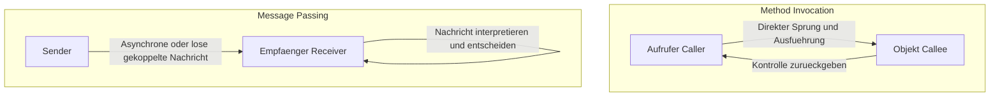
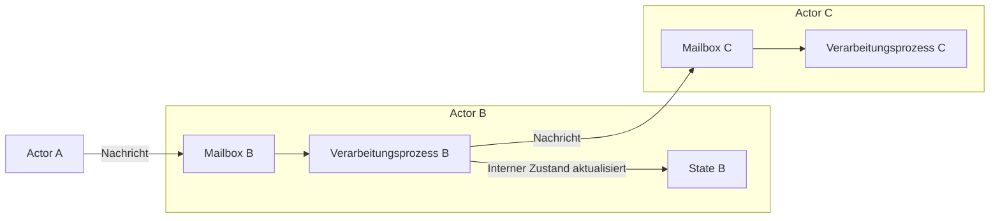

## 1. Einleitung: Ist die "Objektorientierung", die wir kennen, echt?

In der modernen Softwareentwicklung vergeht kaum ein Tag, an dem man nicht den Begriff "Objektorientierte Programmierung (OOP)" hört. Die meisten Mainstream-Programmiersprachen wie Java, C#, Python, Ruby und C++ haben objektorientierte Paradigmen übernommen, was sie zu einem unverzichtbaren Wissen für Entwickler macht.

Wussten Sie jedoch, dass die "drei Hauptelemente der Objektorientierung", die viele Entwickler zuerst lernen – nämlich "Kapselung" (Encapsulation), "Vererbung" (Inheritance) und "Polymorphismus" (Polymorphism) –, tatsächlich stark von der Essenz abweichen, die Alan Kay, der Vater der Objektorientierung, ursprünglich beabsichtigte?

Der Stil, den wir täglich schreiben – "Klassen definieren, Instanzen erzeugen und Methoden mit der Punktnotation aufrufen" – ist sicherlich eine Form der Objektorientierung, die von bestimmten Sprachen (wie C++ und Java) geprägt wurde. Es ist jedoch nur ein winziger Teil oder eine spezifische Interpretation des weitreichenden Konzepts der Objektorientierung.

In diesem Artikel kehren wir zur frühen Geschichte des Begriffs Objektorientierung und zu der Vision zurück, die Alan Kay wirklich verwirklichen wollte. Das Schlüsselwort dabei ist **"Messaging"**. Wenn Sie das Konzept des Messaging richtig verstehen, wird sich Ihre Perspektive auf das Systemdesign erheblich erweitern, und Sie werden tiefe Einblicke gewinnen, die auf moderne verteilte Systemarchitekturen wie Microservices und das Aktorenmodell anwendbar sind.

## 2. Alan Kays Vision: Inspiration aus der Biologie

Alan Kay, der den Begriff Objektorientierung prägte, studierte ursprünglich Mathematik und Biologie. Als er nach einem neuen Paradigma für die Softwareentwicklung suchte, wurde er stark von der Funktionsweise der **"Zellen" (Cell)** von Lebewesen inspiriert.

Der menschliche Körper besteht aus Billionen von Zellen. Jede Zelle verhält sich wie ein unabhängiger Organismus, und ihr innerer Zustand (wie DNA und Proteine) wird nicht direkt von außen manipuliert. Die Zellen kommunizieren miteinander durch chemische oder elektrische "Nachrichten" (Messages), um komplexe und hochentwickelte Lebensvorgänge als Ganzes aufrechtzuerhalten.

Diese Metapher der "Kommunikation zwischen Zellen" ist der Ursprung der Objektorientierung, wie sie sich Alan Kay vorstellte.

- **Unabhängigkeit der Zellen**: Jedes Objekt verbirgt seinen Zustand (Daten) vollständig, und er kann nicht direkt von außen überschrieben werden.
- **Senden und Empfangen von Nachrichten**: Objekte kooperieren ausschließlich, indem sie sich gegenseitig "Nachrichten" senden.
- **Autonomes Verhalten**: Das Objekt, das eine Nachricht empfängt, entscheidet in eigener Verantwortung, wie es sie verarbeitet (oder ob es sie ignoriert).

Alan Kay sagte einmal:
> "I'm sorry that I long ago coined the term 'objects' for this topic because it gets many people to focus on the lesser idea. The big idea is 'messaging'."
> (Es tut mir leid, dass ich vor langer Zeit den Begriff "Objekte" für dieses Thema geprägt habe, denn das bringt viele Leute dazu, sich auf die unbedeutendere Idee zu konzentrieren. Die große Idee ist "Messaging".)

Wie dieses Zitat zeigt, liegt das Hauptaugenmerk nicht auf den "Objekten" selbst, sondern auf den "Nachrichten", die zwischen den Objekten ausgetauscht werden.

## 3. Der entscheidende Unterschied zwischen "Methodenaufruf" und "Messaging"

In bekannten Sprachen wie Java oder C++ verwenden wir "Methodenaufrufe" (Method Invocation), um die Funktionen eines Objekts zu nutzen.

```java
// Beispiel für einen Java-ähnlichen Methodenaufruf
Receiver obj = new Receiver();
obj.doSomething();
```

Auf den ersten Blick sieht das so aus, als würden wir "die Nachricht `doSomething` an `obj` senden". Auf der Compiler- oder Runtime-Ebene betrachtet, handelt es sich jedoch lediglich um **"syntaktischen Zucker für einen Funktionsaufruf" (Function Call)**. Der Aufrufer (Caller) kennt die Speicheradresse des Aufgerufenen (Callee) und springt direkt dorthin, um die Verarbeitung auszuführen. Wenn die Methode `doSomething` nicht existiert, führt dies zu einem Kompilierungsfehler (bei statisch typisierten Sprachen) oder einem Laufzeitfehler.

Andererseits ist echtes "Message Passing" im Kern etwas völlig anderes. In "Smalltalk", einer Sprache, an deren Design Alan Kay beteiligt war, wird jede Interaktion zwischen Objekten als das Senden einer Nachricht modelliert.

In der Welt des Messaging wirft der Sender lediglich eine Anfrage (ein Set aus Name und Argumenten) im Sinne von "Ich möchte, dass du das tust" an den Empfänger.



Die Merkmale des Messaging sind wie folgt:

1. **Extreme späte Bindung (Extreme Late Binding)**
   Während Methodenaufrufe oft zur Kompilier- oder Linkzeit gebunden werden (statische Bindung), wird Messaging bis zur Laufzeit überhaupt nicht gebunden (dynamische Bindung). Das Objekt, das die Nachricht empfängt, interpretiert diese zur Laufzeit dynamisch, sucht nach der entsprechenden Verarbeitung und führt sie aus.
2. **Delegieren und Ignorieren von Nachrichten**
   Wenn ein Objekt eine Nachricht erhält, die es nicht versteht, kann es nicht nur einfach einen Fehler auslösen, sondern autonom und flexibel reagieren, indem es die Nachricht an ein anderes Objekt weiterleitet (Forwarding) oder ignoriert.
3. **Transparenz im Netzwerk**
   Das Paradigma des Messaging ermöglicht es, Objekte im selben Speicherraum (Prozess) genau so zu behandeln wie Objekte auf verschiedenen Servern über ein Netzwerk. Während ein Methodenaufruf zwingend den gleichen Speicherraum voraussetzt, besitzt das Messaging die Eigenschaft, natürlich auf verteilte Systeme zu skalieren.

## 4. Warum wurden "Klassen" und "Vererbung" zur Quelle von Missverständnissen?

Warum wird also die Objektorientierung, bei der das "Messaging" ursprünglich im Mittelpunkt stehen sollte, heute hauptsächlich über "Klassen und Vererbung" definiert?

Der Hauptgrund dafür ist der **überwältigende Erfolg von C++ und Java**.

In den 1980er und 90er Jahren erschien C++, das auf der prozeduralen Sprache C basierte und objektorientierte Konzepte integrierte. Um die Ausführungsleistung zu maximieren, entschied sich C++ gegen reines dynamisches Messaging wie in Smalltalk und stattdessen für effiziente Methodenaufrufe mittels statischer Klassen, Vererbung und virtuellen Funktionstabellen (vtable), die zur Kompilierzeit aufgelöst werden können.

Das darauffolgende Java wurde syntaktisch stark von C++ beeinflusst und etablierte den Stil "Klassen definieren und daraus Instanzen erzeugen" weithin als Standard der Objektorientierung. Infolgedessen verfestigte sich in der Industrie die feste Überzeugung: "Objektorientierung = Entwurf von Klassenhierarchien".

Klassen und Vererbung sind äußerst nützlich, um Code wiederzuverwenden und Datenstrukturen zu organisieren. Eine übermäßige Abhängigkeit davon führte jedoch zu folgenden Problemen:

- **Riesige und komplexe Klassenvererbungsbäume**: Fehleranfällig bei Änderungen; eine Änderung in der übergeordneten Klasse wirkt sich auf alle Unterklassen aus (enge Kopplung).
- **Die Entstehung der Gott-Klasse (God Class)**: Ein riesiger Klassenkomplex, der alle Daten und Methoden anhäuft und weit entfernt ist vom eigentlichen "kleinen, autonomen Objekt".
- **Leck des inneren Zustands**: Der missbräuchliche Einsatz von Gettern und Settern bricht die Kapselung, wodurch der Zustand direkt von außen manipuliert wird.

All dies sind Anti-Pattern, die entstanden sind, weil die ursprüngliche Philosophie des Messaging – "unabhängige Objekte, die sich gegenseitig Nachrichten senden" – aus den Augen verloren wurde.

## 5. Das Aktorenmodell und verteilte Systeme: Die Wiedergeburt der Messaging-Philosophie

Welche Architekturen oder Paradigmen verkörpern heutzutage Alan Kays Vision des "Messaging" in ihrer reinsten Form?

Eines davon ist das **"Aktorenmodell" (Actor Model)**. Dieses von Carl Hewitt und anderen vorgeschlagene Berechnungsmodell bildet die Grundlage für Technologien wie Erlang, Elixir und Akka in Scala.

Im Aktorenmodell wird die grundlegende Berechnungseinheit "Aktor" (Actor) genannt. Ein Aktor hat einen völlig unabhängigen Zustand und ein eigenes Verhalten, und das einzige Mittel zur Kommunikation mit anderen ist das **"Senden asynchroner Nachrichten"**. Dies stimmt erstaunlich genau mit Alan Kays Zellmetapher überein.



In Erlang/Elixir laufen Hunderttausende leichtgewichtige Aktoren (Prozesse) parallel und bilden durch den Austausch von Nachrichten riesige Systeme. Selbst wenn ein Aktor abstürzt, wird eine extrem hohe Fehlertoleranz erreicht, beispielsweise indem andere Aktoren eine Nachricht senden, um ihn neu zu starten (der "Let it crash"-Ansatz).

Darüber hinaus kann die moderne **"Microservices-Architektur"** im Wesentlichen als eine riesige, messaging-orientierte Version der Objektorientierung betrachtet werden. Betrachtet man jeden Microservice als ein riesiges "Objekt", verbergen sie ihre eigenen Datenbanken (innerer Zustand) vollständig und bauen das gesamte System durch den Austausch von "Nachrichten" über REST-APIs, gRPC, Kafka usw. auf.

Alan Kays Vision von "Objekten, die über verschiedene Knoten im Netzwerk verteilt sind und sich gegenseitig Nachrichten senden", ist in der Cloud-Native-Ära unerwartet in Form von Microservices Realität geworden.

## 6. Fazit: Was wir wirklich von der Objektorientierung lernen sollten

Der Begriff "Objektorientierung" umfasst mittlerweile viel zu viele Bedeutungen. Klassen, Vererbung, Schnittstellen, Polymorphismus ... es besteht kein Zweifel, dass dies nützliche Werkzeuge in der modernen Entwicklung sind.

Um jedoch die Komplexität von Systemen zu bewältigen und flexible, skalierbare Designs zu entwerfen, müssen wir uns an den wahren Kern des **"Messaging"** erinnern, den Alan Kay ursprünglich beabsichtigt hatte.

1. **Daten und Verhalten nicht rücksichtslos offenlegen** (die Zellwände schützen).
2. **Keine Methodenaufrufe verwenden, sondern Nachrichten als "Anfragen" senden** (Respektierung der Autonomie).
3. **Sich der Flexibilität zur Laufzeit und der späten Bindung bewusst sein**.
4. **Die Architektur vom prozessinternen bis zum verteilten System mit einer gemeinsamen Metapher begreifen**.

Wenn Sie das nächste Mal Code schreiben oder über ein Systemdesign nachdenken, nehmen Sie die Perspektive ein: "Welche Nachrichten sollte dieses Objekt an andere Objekte senden?" Indem Sie sich auf das "Netzwerk und die Kommunikation der Objekte" konzentrieren, anstatt auf "Klassenhierarchien", wird Ihr Design raffinierter, robuster gegenüber Änderungen und im wahrsten Sinne "objektorientiert".

---
*Reference: Alan Kay's emails, Smalltalk-80 documentation, and the Actor Model principles.*
