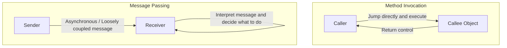
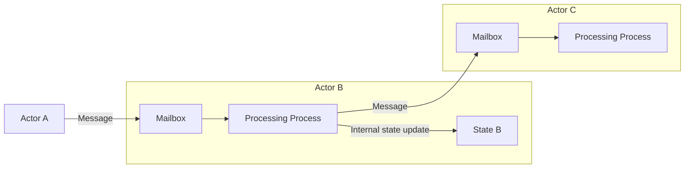

## 1. Introduction: Is the "Object-Oriented Programming" We Know Authentic?

In modern software development, not a day goes by without hearing the term "Object-Oriented Programming (OOP)". Most mainstream programming languages, such as Java, C#, Python, Ruby, and C++, have adopted the object-oriented paradigm, making it essential knowledge for developers.

However, did you know that the "three major elements of object-oriented programming" that many developers learn first—namely "Encapsulation", "Inheritance", and "Polymorphism"—actually deviate significantly from the original essence intended by Alan Kay, who is considered the father of object-oriented programming?

The style we routinely write, "defining a class, generating an instance, and calling a method using dot notation", is certainly one form of object-oriented programming built by specific languages (e.g., C++ and Java). But that is only a small part, or rather a specific interpretation, of the vast concept of object-oriented programming.

In this article, we will return to the early history when the term object-oriented was born and the vision Alan Kay truly wanted to realize. The key word here is **"Messaging"**. By correctly understanding the concept of messaging, your perspective on system design will greatly expand, providing you with deep insights that connect to modern distributed system designs such as microservices architecture and the actor model.

## 2. Alan Kay's Vision: Inspiration from Biology

Alan Kay, who coined the term object-oriented, originally studied mathematics and biology. When he was exploring a new paradigm for building software, he was strongly inspired by the mechanism of **"biological cells"**.

The human body is composed of trillions of cells. Each cell behaves like an independent organism, and its internal state (such as DNA and proteins) is never directly manipulated from the outside. Cells maintain complex and sophisticated life activities as a whole by exchanging "messages" in the form of chemical substances and electrical signals.

This metaphor of "communication between cells" is the very origin of object-oriented programming envisioned by Alan Kay.

- **Cell Independence**: Each object completely hides its state (data) and is never directly rewritten from the outside.
- **Message Sending and Receiving**: Objects coordinate only by sending "messages" to each other.
- **Autonomous Behavior**: An object that receives a message decides on its own responsibility how to process it (or whether to ignore it).

Alan Kay once stated:
> "I'm sorry that I long ago coined the term 'objects' for this topic because it gets many people to focus on the lesser idea. The big idea is 'messaging'."

As these words indicate, the main character is not the "object" itself, but the "messages" passing back and forth between objects.

## 3. The Decisive Difference Between "Method Invocation" and "Messaging"

In languages we know well, like Java or C++, we perform a "Method Invocation" to use the functionality of an object.

```java
// Example of a Java-like method invocation
Receiver obj = new Receiver();
obj.doSomething();
```

At first glance, this seems like "sending the message `doSomething` to `obj`". However, at the compiler or runtime level, this is merely **syntactic sugar for a "Function Call"**. The caller knows the memory address of the callee and jumps directly there to execute the process. If the method `doSomething` does not exist, it results in a compile error (in the case of a statically typed language) or a runtime error.

On the other hand, true "Message Passing" is fundamentally different from this. In "Smalltalk", a language Alan Kay helped design, all interactions between objects are modeled as message sending.

In the world of messaging, the sender simply throws a request (a set of name and arguments) saying "I want you to do this" to the receiver.



The characteristics of messaging are as follows:

1. **Extreme Late Binding**
   While method invocation is often bound at compile time or link time (static binding), messaging is not completely bound until runtime (dynamic binding). An object that receives a message dynamically interprets the message at runtime, searches for the corresponding process, and executes it.
2. **Delegation and Ignoring of Messages**
   When an object receives a message it does not understand, it can autonomously respond flexibly, such as by forwarding it to another object or ignoring it, rather than just treating it as an error.
3. **Network Transparency**
   The paradigm of messaging allows objects within the same memory space (process) or objects on entirely separate servers across a network to be treated in the same way. While method invocation presupposes being in the same memory space, messaging has the property of naturally scaling to distributed systems.

## 4. Why Did "Classes" and "Inheritance" Become the Source of Misunderstanding?

So, why has object-oriented programming, where "messaging" should have originally been important, come to be discussed centering on "classes and inheritance" as it is today?

The biggest reason for this is the **overwhelming success of C++ and Java**.

From the 1980s to the 1990s, C++ emerged, incorporating object-oriented concepts based on the procedural language C. In order to maximize execution performance, C++ adopted efficient method invocation using static classes, inheritance, and virtual function tables (vtables) that could be resolved at compile time, rather than pure dynamic messaging like Smalltalk.

The subsequent Java was also strongly influenced by C++ syntactically, and widely popularized the style of "defining classes and generating instances from them" as the standard for object-oriented programming. As a result, the firm perception that "object-oriented programming = designing class hierarchies" became established in the industry.

Classes and inheritance are very useful for reusing code and organizing data structures. However, over-relying on them has led to the following problems:

- **Huge and Complex Class Inheritance Trees**: Vulnerable to changes, and modifications to a parent class ripple through all child classes (tight coupling).
- **Birth of the God Class**: The emergence of huge classes that hoard all kinds of data and methods, far removed from the original "small, autonomous objects".
- **Leakage of Internal State**: The abuse of getters and setters destroys encapsulation, allowing the state to be manipulated directly from the outside.

These can all be said to be anti-patterns caused by losing sight of the original messaging philosophy of "independent objects sending messages to each other".

## 5. Actor Model and Distributed Systems: The Resurrected Philosophy of Messaging

In the modern era, what are the architectures or paradigms that most purely embody Alan Kay's vision of "messaging"?

One of them is the **"Actor Model"**. Proposed by Carl Hewitt and others, this computational model serves as the foundation for technologies like Erlang, Elixir, and Scala's Akka.

In the Actor Model, the basic unit of computation is called an "Actor". An Actor has a completely independent state and behavior, and the only means of communicating with others is by **"sending asynchronous messages"**. This is surprisingly consistent with Alan Kay's cell metaphor.



In Erlang/Elixir, hundreds of thousands of lightweight actors (processes) run concurrently and build huge systems by sending messages to each other. Even if one actor crashes, it achieves extremely high fault tolerance by sending a message to another actor to restart it (the "Let it crash" philosophy).

Furthermore, the modern **"Microservices Architecture"** is essentially a giant version of messaging-oriented OOP. If each microservice is viewed as one massive "object", they completely hide their own databases (internal state) and build the entire system through the exchange of "messages" via REST APIs, gRPC, Kafka, and the like.

The vision Alan Kay dreamed of, "objects scattered across different nodes on a network sending messages to each other", has unexpectedly been realized in the cloud-native era in the form of microservices.

## 6. Conclusion: What We Should Truly Learn from Object-Oriented Programming

The term "Object-Oriented" has come to encompass entirely too many meanings. Classes, inheritance, interfaces, polymorphism... there is no doubt that these are useful tools in modern development.

However, in order to manage system complexity and perform flexible, scalable design, we need to remember the core of **"Messaging"** that Alan Kay originally intended.

1. **Do not needlessly expose data and behavior** (protect the cell wall).
2. **Send messages as "requests", not as method invocations** (respect autonomy).
3. **Be conscious of runtime flexibility and late binding**.
4. **Understand architecture through a common metaphor, from within a process to distributed systems**.

The next time you write code or think about system design, try to have the perspective of "What kind of messages should this object send to other objects?". By focusing on "the network and communication of objects" rather than "class hierarchies", your design should become more refined, resilient to change, and truly "object-oriented".

---
*Reference: Alan Kay's emails, Smalltalk-80 documentation, and the Actor Model principles.*
