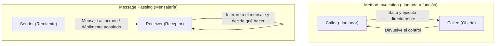
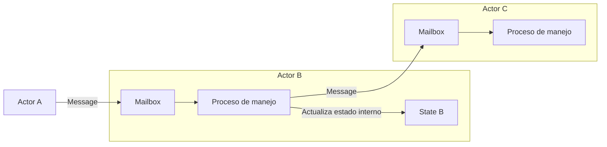

## 1. Introducción: ¿Es real la "Orientación a Objetos" que conocemos?

En el desarrollo de software moderno, no hay un día en el que no escuchemos el término "Programación Orientada a Objetos (POO: Object-Oriented Programming)". La mayoría de los lenguajes de programación predominantes como Java, C#, Python, Ruby, C++, entre otros, han adoptado el paradigma orientado a objetos, convirtiéndose en un conocimiento esencial para los desarrolladores.

Sin embargo, ¿sabías que los "tres grandes elementos de la orientación a objetos" que muchos desarrolladores aprenden primero —es decir, "Encapsulamiento (Encapsulation)", "Herencia (Inheritance)" y "Polimorfismo (Polymorphism)"— en realidad se desvían significativamente de la esencia prevista por Alan Kay, a quien se le puede llamar el padre de la orientación a objetos?

El estilo que escribimos a diario, "definir una clase, crear una instancia y llamar a un método con notación de punto", es ciertamente una forma de orientación a objetos construida por lenguajes específicos (por ejemplo, C++ o Java). Sin embargo, eso es solo una pequeña parte del vasto concepto de la orientación a objetos, o simplemente una interpretación específica.

En este artículo, volveremos a la historia temprana de cuándo se acuñó el término orientación a objetos y a la visión que Alan Kay realmente quería hacer realidad. La palabra clave para esto es **"Mensajería (Messaging)"**. Al comprender correctamente el concepto de mensajería, tu perspectiva de diseño de sistemas se ampliará en gran medida, y podrás obtener conocimientos profundos que se conectan con el diseño de sistemas distribuidos modernos, como la arquitectura de microservicios o el modelo de actores.

## 2. La visión de Alan Kay: Inspiración desde la biología

Alan Kay, quien inventó el término orientación a objetos, originalmente estudió matemáticas y biología. Cuando buscaba un nuevo paradigma de construcción de software, recibió una fuerte inspiración del mecanismo de las **"Células biológicas (Cell)"**.

El cuerpo humano está compuesto por billones de células. Cada célula se comporta como un organismo vivo independiente, y su estado interno (como el ADN o las proteínas) no es manipulado directamente desde el exterior. Las células mantienen actividades vitales complejas y avanzadas en su conjunto intercambiando "mensajes" a través de sustancias químicas o señales eléctricas.

Esta metáfora de "comunicación entre células" es exactamente el origen de la orientación a objetos imaginada por Alan Kay.

- **Independencia celular**: Cada objeto oculta completamente su estado (datos) y nunca es reescrito directamente desde el exterior.
- **Envío y recepción de mensajes**: Los objetos cooperan solo enviándose "mensajes" entre sí.
- **Comportamiento autónomo**: El objeto que recibe un mensaje decide bajo su propia responsabilidad cómo procesarlo (o si lo ignora).

Alan Kay dijo una vez:
> "I'm sorry that I long ago coined the term 'objects' for this topic because it gets many people to focus on the lesser idea. The big idea is 'messaging'."
> (Lamento haber acuñado hace mucho tiempo el término 'objetos' para este tema porque hace que mucha gente se centre en la idea menor. La gran idea es la 'mensajería'.)

Como indica esta cita, el protagonista no es el "objeto (cosa)" en sí, sino el "mensaje" que viaja entre los objetos.

## 3. La diferencia decisiva entre "Llamada a método" y "Mensajería"

En lenguajes muy conocidos como Java y C++, realizamos una "Llamada a método (Method Invocation)" para utilizar las funciones de un objeto.

```java
// Ejemplo de llamada a método al estilo Java
Receiver obj = new Receiver();
obj.doSomething();
```

A primera vista, parece que "se está enviando el mensaje `doSomething` a `obj`". Sin embargo, a nivel de compilador o tiempo de ejecución, esto es solo **azúcar sintáctico para una "Llamada a función (Function Call)"**. El que llama (Caller) conoce la dirección de memoria del llamado (Callee) y salta directamente allí para ejecutar el proceso. Si el método `doSomething` no existe, resulta en un error de compilación (en lenguajes de tipado estático) o un error de tiempo de ejecución.

Por otro lado, la verdadera "Mensajería (Message Passing)" es fundamentalmente diferente de esto. En "Smalltalk", el lenguaje en cuyo diseño participó Alan Kay, todas las interacciones entre objetos están modeladas como el envío de mensajes.

En el mundo de la mensajería, el remitente simplemente arroja una solicitud (un conjunto de nombre y argumentos) al receptor diciendo "quiero que hagas esto".



Las características de la mensajería son las siguientes:

1. **Ligadura extremadamente tardía (Extreme Late Binding)**
   Mientras que las llamadas a métodos a menudo se vinculan en tiempo de compilación o enlace (ligadura estática), la mensajería no se vincula en absoluto hasta el tiempo de ejecución (ligadura dinámica). El objeto que recibe el mensaje lo interpreta dinámicamente en tiempo de ejecución, busca el proceso correspondiente y lo ejecuta.
2. **Delegación e ignorancia de mensajes**
   Cuando un objeto recibe un mensaje que no puede entender, no simplemente genera un error, sino que puede tomar medidas flexibles de forma autónoma, como reenviarlo (forward) a otro objeto o ignorarlo.
3. **Transparencia en la red**
   El paradigma de la mensajería puede tratar a objetos dentro del mismo espacio de memoria (proceso) de la misma manera que a objetos en servidores separados a través de una red. Las llamadas a métodos asumen como premisa básica que están en el mismo espacio de memoria, pero la mensajería tiene la propiedad de escalar naturalmente a sistemas distribuidos.

## 4. ¿Por qué las "Clases" y la "Herencia" causaron malentendidos?

Entonces, ¿por qué la orientación a objetos, donde la "mensajería" originalmente debería haber sido importante, ahora se discute centrándose en "clases y herencia"?

La razón principal es el **éxito abrumador de C++ y Java**.

Entre las décadas de 1980 y 1990, apareció C++, que incorporó conceptos de orientación a objetos basándose en C, un lenguaje procedimental. Para maximizar el rendimiento de ejecución, C++ adoptó llamadas a métodos eficientes utilizando clases estáticas, herencia y tablas de funciones virtuales (vtable) que se pueden resolver en tiempo de compilación, en lugar de la mensajería dinámica pura como Smalltalk.

Java, que le siguió, también estuvo fuertemente influenciado sintácticamente por C++ y popularizó ampliamente el estilo de "definir una clase y crear una instancia a partir de ella" como el estándar para la orientación a objetos. Como resultado, la sólida percepción de que "Orientación a objetos = Diseñar jerarquías de clases" se estableció en la industria.

Las clases y la herencia son muy convenientes para reutilizar código y organizar estructuras de datos. Sin embargo, depender excesivamente de ellas ha provocado los siguientes problemas:

- **Árboles de herencia de clases gigantes y complejos**: Frágiles a los cambios, donde las modificaciones en la clase padre se propagan a todas las clases hijas (fuerte acoplamiento).
- **Nacimiento de la Clase Dios (God Class)**: La aparición de clases gigantescas que acumulan todos los datos y métodos, muy alejadas del "pequeño objeto autónomo" original.
- **Fuga de estado interno**: El abuso de Getters y Setters destruye el encapsulamiento y permite que el estado sea manipulado directamente desde el exterior.

Se puede decir que todos estos son antipatrones causados por haber perdido de vista la filosofía original de la mensajería: "objetos independientes enviándose mensajes entre sí".

## 5. El modelo de actores y los sistemas distribuidos: El renacimiento de la filosofía de la mensajería

En la actualidad, ¿qué arquitecturas o paradigmas encarnan la visión de "mensajería" de Alan Kay en su forma más pura?

Uno de ellos es el **"Modelo de Actores (Actor Model)"**. Este modelo computacional propuesto por Carl Hewitt y otros es la base de tecnologías como Erlang, Elixir y Akka en Scala.

En el modelo de actores, la unidad básica de computación se llama "Actor". Un actor tiene un estado y un comportamiento completamente independientes, y el único medio para comunicarse con otros es **"enviar mensajes asíncronos"**. Esto coincide sorprendentemente con la metáfora celular de Alan Kay.



En Erlang/Elixir, cientos de miles de actores (procesos) livianos se ejecutan en paralelo, construyendo un sistema gigantesco enviándose mensajes entre sí. Si un actor falla, se envía un mensaje a otro actor para reiniciarlo (la filosofía de 'Let it crash'), logrando una tolerancia a fallos extremadamente alta.

Además, la moderna **"Arquitectura de Microservicios (Microservices Architecture)"** también se puede considerar esencialmente como una versión gigante de la orientación a objetos orientada a mensajes. Si consideramos cada microservicio como un "objeto" gigante, estos ocultan completamente su propia base de datos (estado interno) y construyen el sistema en su conjunto a través del intercambio de "mensajes" vía REST API, gRPC, Kafka, etc.

La visión con la que soñaba Alan Kay, donde "objetos dispersos en diferentes nodos de la red se envían mensajes entre sí", se ha materializado inadvertidamente en la era nativa de la nube en forma de microservicios.

## 6. Conclusión: Lo que realmente deberíamos aprender de la Orientación a Objetos

El término "Orientación a Objetos" ha llegado a abarcar demasiados significados. Clases, herencia, interfaces, polimorfismo... no hay duda de que estas son herramientas útiles en el desarrollo moderno.

Sin embargo, para gestionar la complejidad de los sistemas y diseñar de manera flexible y escalable, es necesario recordar el núcleo de la **"Mensajería"** que Alan Kay originalmente pretendió.

1. **No exponer datos y comportamiento innecesariamente** (Proteger la pared celular).
2. **Enviar mensajes como "solicitudes" en lugar de llamadas a métodos** (Respeto por la autonomía).
3. **Ser consciente de la flexibilidad en tiempo de ejecución y la ligadura tardía**.
4. **Comprender la arquitectura con una metáfora común, desde dentro del proceso hasta los sistemas distribuidos**.

La próxima vez que escribas código o pienses en el diseño de un sistema, intenta adoptar la perspectiva de "¿Qué mensaje debería enviar este objeto a otros objetos?". Al centrarte en "la red y la comunicación de objetos" en lugar de en la "estructura jerárquica de clases", tu diseño debería volverse más refinado, resistente a los cambios y verdaderamente "orientado a objetos".

---
*Reference: Alan Kay's emails, Smalltalk-80 documentation, and the Actor Model principles.*
