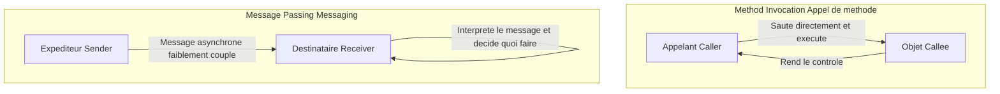
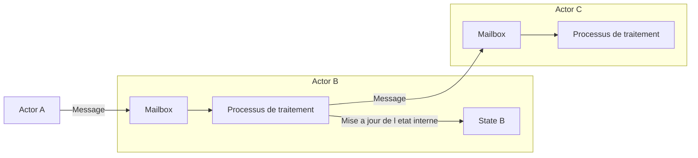

## 1. Introduction : La programmation orientée objet que nous connaissons est-elle la vraie ?

Dans le développement logiciel moderne, il ne se passe pas un jour sans entendre parler de programmation orientée objet (POO : Object-Oriented Programming). La plupart des langages de programmation grand public, tels que Java, C#, Python, Ruby ou C++, ont adopté le paradigme de l'orienté objet, devenant ainsi des connaissances indispensables pour les développeurs.

Cependant, saviez-vous que les trois grands principes de l'orienté objet que de nombreux développeurs apprennent en premier — à savoir l'encapsulation, l'héritage et le polymorphisme — s'écartent grandement de l'essence voulue par Alan Kay, que l'on peut considérer comme le père de l'orienté objet ?

Le style que nous écrivons au quotidien : définir une classe, créer une instance et appeler une méthode avec la notation point, est certes une forme d'orienté objet construite par certains langages (comme C++ ou Java). Mais ce n'est qu'une infime partie, ou plutôt une interprétation spécifique, du vaste concept qu'est l'orienté objet.

Dans cet article, nous revenons à l'histoire des débuts du terme orienté objet et à la vision qu'Alan Kay voulait réellement concrétiser. Le mot-clé en est le **messaging**. En comprenant correctement ce concept de messaging, votre vision de la conception de systèmes s'élargira considérablement, vous offrant des perspectives profondes qui rejoignent la conception des systèmes distribués modernes, tels que l'architecture microservices ou le modèle d'acteur.

## 2. La vision d'Alan Kay : l'inspiration tirée de la biologie

Alan Kay, qui a inventé le terme orienté objet, avait étudié à l'origine les mathématiques et la biologie. Alors qu'il cherchait un nouveau paradigme pour construire des logiciels, il a été fortement inspiré par le fonctionnement de la **cellule biologique**.

Le corps humain est composé de milliards de cellules. Chaque cellule se comporte comme un organisme vivant indépendant, et son état interne (comme l'ADN ou les protéines) n'est jamais manipulé directement de l'extérieur. Les cellules échangent des messages sous forme de substances chimiques ou de signaux électriques, maintenant ainsi une activité vitale complexe et sophistiquée dans son ensemble.

Cette métaphore de la communication entre les cellules constitue le point de départ de la programmation orientée objet telle qu'imaginée par Alan Kay.

- **L'indépendance des cellules** : chaque objet cache complètement son état (données) et ne peut pas être modifié directement depuis l'extérieur.
- **L'envoi et la réception de messages** : les objets ne collaborent qu'en s'envoyant des messages.
- **Un comportement autonome** : un objet qui reçoit un message décide, sous sa propre responsabilité, comment le traiter (ou l'ignorer).

Alan Kay a un jour déclaré :
> "I'm sorry that I long ago coined the term 'objects' for this topic because it gets many people to focus on the lesser idea. The big idea is 'messaging'."
> (Je regrette d'avoir inventé il y a longtemps le terme d'« objets » pour ce sujet, car il pousse de nombreuses personnes à se concentrer sur l'idée la moins importante. La grande idée est le « messaging ».)

Comme le montrent ces mots, le rôle principal n'appartient pas à l'objet en soi, mais au message qui circule entre les objets.

## 3. La différence décisive entre appel de méthode et messaging

Dans les langages que nous connaissons bien comme Java ou C++, nous utilisons l'appel de méthode (Method Invocation) pour utiliser les fonctionnalités d'un objet.

```java
// Exemple d'appel de méthode à la Java
Receiver obj = new Receiver();
obj.doSomething();
```

À première vue, on pourrait penser que cela envoie le message `doSomething` à `obj`. Mais au niveau du compilateur ou du runtime, ce n'est qu'un simple **sucre syntaxique pour un appel de fonction**. L'appelant (Caller) connaît l'adresse mémoire de l'appelé (Callee), saute directement à cet emplacement et exécute le traitement. Si la méthode `doSomething` n'existe pas, cela entraîne une erreur de compilation (dans le cas d'un langage à typage statique) ou une erreur d'exécution.

D'autre part, le véritable messaging (Message Passing) est fondamentalement différent. Dans le langage Smalltalk, à la conception duquel Alan Kay a participé, toutes les interactions entre les objets sont modélisées comme des envois de messages.

Dans le monde du messaging, l'expéditeur se contente d'envoyer une requête (un ensemble composé d'un nom et d'arguments) au destinataire pour lui demander de faire ceci.



Les caractéristiques du messaging sont les suivantes :

1. **Liaison tardive extrême (Extreme Late Binding)**
   Alors que les appels de méthode sont souvent liés à la compilation ou au moment de l'édition de liens (liaison statique), le messaging n'est lié qu'au moment de l'exécution (liaison dynamique). L'objet qui reçoit un message l'interprète dynamiquement lors de l'exécution, cherche le traitement correspondant et l'exécute.
2. **Délégation et ignorance des messages**
   Lorsqu'un objet reçoit un message qu'il ne comprend pas, au lieu de déclencher une simple erreur, il peut réagir de manière autonome et flexible, par exemple en le transférant (forwarding) à un autre objet ou en l'ignorant.
3. **Transparence sur le réseau**
   Le paradigme du messaging peut être traité de la même manière que les objets se trouvent dans le même espace mémoire (processus) ou sur des serveurs distincts via le réseau. L'appel de méthode présuppose que tout se trouve dans le même espace mémoire, mais le messaging possède la propriété de s'adapter naturellement aux systèmes distribués.

## 4. Pourquoi les classes et l'héritage ont-ils conduit à des malentendus ?

Alors pourquoi l'orienté objet, où le messaging était censé être central, est-il devenu aujourd'hui principalement associé aux classes et héritage ?

La principale raison est le **succès écrasant du C++ et de Java**.

Dans les années 1980 et 1990, le C++ est apparu en intégrant des concepts d'orienté objet sur la base du langage procédural C. Afin de maximiser les performances d'exécution, le C++ n'a pas adopté le messaging dynamique pur comme dans Smalltalk, mais a préféré des appels de méthode efficaces reposant sur des classes statiques, de l'héritage et des tables de fonctions virtuelles (vtable) résolubles à la compilation.

Java, qui a suivi, a également été fortement influencé par la syntaxe de C++, popularisant largement le style consistant à définir une classe et en instancier des objets comme norme de l'orienté objet. De ce fait, dans l'industrie, la forte conviction que l'orienté objet équivaut à concevoir une hiérarchie de classes s'est solidement ancrée.

Les classes et l'héritage sont extrêmement utiles pour la réutilisation du code et l'organisation des structures de données. Cependant, une dépendance excessive à leur égard a entraîné les problèmes suivants :

- **Des arbres d'héritage de classes gigantesques et complexes** : fragiles face aux changements, où la modification d'une classe parente se répercute sur toutes ses classes enfants (couplage fort).
- **L'émergence des classes dieu (God Class)** : l'apparition de classes massives accumulant toutes sortes de données et de méthodes, très éloignées de l'idée initiale de petits objets autonomes.
- **La fuite de l'état interne** : l'abus des accesseurs (Getter) et des mutateurs (Setter) détruit l'encapsulation, permettant à l'état d'être manipulé directement depuis l'extérieur.

Ce sont tous des anti-patrons provoqués par la perte de vue de la philosophie originale du messaging, selon laquelle des objets indépendants s'envoient des messages.

## 5. Le modèle d'acteur et les systèmes distribués : la renaissance de la philosophie du messaging

À notre époque, quelles sont les architectures ou paradigmes qui incarnent sous la forme la plus pure la vision du messaging d'Alan Kay ?

L'un d'eux est le **modèle d'acteur (Actor Model)**. Ce modèle de calcul proposé par Carl Hewitt et d'autres sert de base à des technologies telles qu'Erlang, Elixir ou Akka en Scala.

Dans le modèle d'acteur, l'unité fondamentale de calcul est appelée un acteur (Actor). Un acteur possède un état et un comportement totalement indépendants, et son seul moyen de communiquer avec les autres est **l'envoi de messages asynchrones**. Cela correspond de manière étonnante à la métaphore cellulaire d'Alan Kay.



Dans Erlang/Elixir, des centaines de milliers de petits acteurs (processus) légers s'exécutent en parallèle, construisant des systèmes massifs en s'envoyant mutuellement des messages. Même si un acteur plante, il permet d'atteindre une tolérance aux pannes extrêmement élevée, par exemple en envoyant un message à d'autres acteurs pour le redémarrer (la philosophie du Let it crash).

De plus, l'**architecture microservices (Microservices Architecture)** moderne peut également être considérée comme une version géante de l'orienté objet basé sur le messaging. Si l'on considère chaque microservice comme un grand objet, ils masquent entièrement leur propre base de données (état interne) et construisent le système global via l'échange de messages en utilisant des API REST, gRPC ou Kafka.

La vision d'Alan Kay, rêvant que des objets dispersés sur différents nœuds d'un réseau s'envoient mutuellement des messages, s'est involontairement réalisée à l'ère du cloud-native sous la forme des microservices.

## 6. Conclusion : Ce que nous devrions vraiment apprendre de l'orienté objet

Le terme orienté objet a fini par englober beaucoup trop de significations. Classes, héritage, interfaces, polymorphisme... Il ne fait aucun doute qu'il s'agit d'outils utiles dans le développement moderne.

Cependant, pour gérer la complexité des systèmes et réaliser des conceptions flexibles et évolutives, il est nécessaire de se remémorer le cœur du **messaging** que voulait transmettre initialement Alan Kay.

1. **Ne pas exposer inutilement les données et les comportements** (protéger la paroi de la cellule).
2. **Envoyer des messages en tant que requêtes plutôt que de faire des appels de méthode** (respecter l'autonomie).
3. **Être conscient de la flexibilité à l'exécution et de la liaison tardive**.
4. **Appréhender l'architecture avec une métaphore commune, allant du cœur du processus aux systèmes distribués**.

La prochaine fois que vous écrirez du code, ou que vous réfléchirez à la conception d'un système, essayez d'adopter cette perspective : Quel message cet objet devrait-il envoyer à d'autres objets ? En vous concentrant sur le réseau et la communication des objets plutôt que sur la hiérarchie des classes, votre conception deviendra plus raffinée, résiliente aux changements et véritablement orientée objet.

---
*Reference : Alan Kay's emails, Smalltalk-80 documentation, and the Actor Model principles.*
