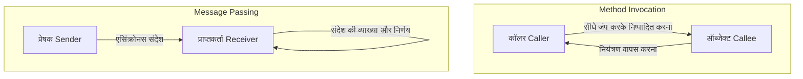
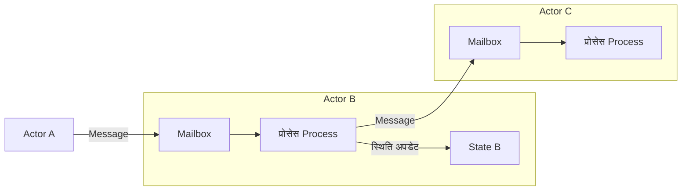

## 1. प्रस्तावना: क्या वह "ऑब्जेक्ट-ओरिएंटेड" जिसे हम जानते हैं, असली है?

आधुनिक सॉफ्टवेयर विकास में, ऐसा कोई दिन नहीं जाता जब हम "ऑब्जेक्ट-ओरिएंटेड प्रोग्रामिंग (OOP)" शब्द न सुनें। Java, C#, Python, Ruby, C++ जैसी अधिकांश मुख्यधारा की प्रोग्रामिंग भाषाएं ऑब्जेक्ट-ओरिएंटेड प्रतिमान को अपनाती हैं, जो इसे डेवलपर्स के लिए एक आवश्यक ज्ञान बनाता है।

हालाँकि, क्या आप जानते हैं कि कई डेवलपर्स द्वारा सीखे गए "ऑब्जेक्ट-ओरिएंटेड के तीन मुख्य तत्व" — अर्थात् "एनकैप्सुलेशन", "इनहेरिटेंस", और "पॉलीमॉर्फिज्म" — वास्तव में उस मूल सार से काफी भटक गए हैं जिसका इरादा ऑब्जेक्ट-ओरिएंटेड के जनक माने जाने वाले एलन के (Alan Kay) का था?

जिस शैली में हम प्रतिदिन कोड लिखते हैं - "क्लास को परिभाषित करना, इंस्टेंस बनाना और डॉट नोटेशन के साथ मेथड कॉल करना" - निश्चित रूप से ऑब्जेक्ट-ओरिएंटेड का एक रूप है जो विशिष्ट भाषाओं (जैसे C++ और Java) द्वारा बनाया गया है। लेकिन यह ऑब्जेक्ट-ओरिएंटेड नामक विशाल अवधारणा का केवल एक छोटा सा हिस्सा या एक विशिष्ट व्याख्या मात्र है।

इस लेख में, हम उस प्रारंभिक इतिहास की ओर लौटेंगे जब ऑब्जेक्ट-ओरिएंटेड शब्द गढ़ा गया था, और उस दृष्टिकोण की ओर जो एलन के वास्तव में प्राप्त करना चाहते थे। इसका मुख्य शब्द **"मैसेजिंग (Messaging)"** है। मैसेजिंग की अवधारणा को सही ढंग से समझने से, आपके सिस्टम डिज़ाइन का दृष्टिकोण बहुत व्यापक हो जाएगा, और आप आधुनिक डिस्ट्रिब्यूटेड सिस्टम डिज़ाइन, जैसे माइक्रो-सर्विसेज आर्किटेक्चर और एक्टर मॉडल में गहरी अंतर्दृष्टि प्राप्त कर सकेंगे।

## 2. एलन के का दृष्टिकोण: जीव विज्ञान से प्रेरणा

ऑब्जेक्ट-ओरिएंटेड शब्द गढ़ने वाले एलन के ने मूल रूप से गणित और जीव विज्ञान का अध्ययन किया था। जब वे सॉफ्टवेयर निर्माण के एक नए प्रतिमान की तलाश कर रहे थे, तो उन्हें **"जैविक कोशिकाओं Cells"** के तंत्र से बहुत प्रेरणा मिली।

मानव शरीर खरबों कोशिकाओं से बना है। प्रत्येक कोशिका एक स्वतंत्र जीवित जीव की तरह व्यवहार करती है, और इसकी आंतरिक अवस्था (जैसे DNA और प्रोटीन) को बाहर से सीधे हेरफेर नहीं किया जा सकता है। कोशिकाएं एक-दूसरे के साथ रसायनों और विद्युत संकेतों के "संदेशों" का आदान-प्रदान करके संपूर्ण रूप से जटिल और उन्नत जीवन गतिविधियों को बनाए रखती हैं।

"कोशिकाओं के बीच संचार" का यह रूपक एलन के द्वारा परिकल्पित ऑब्जेक्ट-ओरिएंटेड की उत्पत्ति है।

- **कोशिकाओं की स्वतंत्रता**: प्रत्येक ऑब्जेक्ट अपनी स्थिति (डेटा) को पूरी तरह से छिपाकर रखता है और इसे सीधे बाहर से फिर से नहीं लिखा जा सकता है।
- **संदेश भेजना और प्राप्त करना**: ऑब्जेक्ट केवल एक-दूसरे को "संदेश" भेजकर ही समन्वय करते हैं।
- **स्वायत्त व्यवहार**: संदेश प्राप्त करने वाला ऑब्जेक्ट अपनी जिम्मेदारी पर यह तय करता है कि इसे कैसे प्रोसेस किया जाए (या अनदेखा किया जाए)।

एलन के ने एक बार कहा था:
> "I'm sorry that I long ago coined the term 'objects' for this topic because it gets many people to focus on the lesser idea. The big idea is 'messaging'."
> (मुझे खेद है कि मैंने बहुत पहले इस विषय के लिए 'ऑब्जेक्ट्स' शब्द गढ़ा था क्योंकि यह कई लोगों को कम महत्वपूर्ण विचार पर ध्यान केंद्रित करवाता है। सबसे महत्वपूर्ण विचार 'मैसेजिंग' है।)

जैसा कि ये शब्द दर्शाते हैं, मुख्य पात्र स्वयं "ऑब्जेक्ट" नहीं हैं, बल्कि ऑब्जेक्ट्स के बीच प्रवाहित होने वाले "संदेश" हैं।

## 3. "मेथड कॉल" और "मैसेजिंग" के बीच निर्णायक अंतर

Java और C++ जैसी भाषाओं में, जिनसे हम अच्छी तरह परिचित हैं, हम ऑब्जेक्ट के कार्यों का उपयोग करने के लिए "मेथड कॉल" करते हैं।

```java
// Java-style method invocation example
Receiver obj = new Receiver();
obj.doSomething();
```

पहली नज़र में, ऐसा लगता है कि यह "`obj` को `doSomething` संदेश भेज रहा है"। हालाँकि, कंपाइलर या रनटाइम के स्तर पर, यह केवल **"फंक्शन कॉल" का सिंटैक्टिक शुगर** है। कॉलर को कॉली का मेमोरी एड्रेस पता होता है और वह निष्पादन करने के लिए सीधे वहां जंप करता है। यदि `doSomething` नामक कोई मेथड मौजूद नहीं है, तो इसके परिणामस्वरूप कंपाइल एरर (स्टैटिकली-टाइप्ड भाषाओं में) या रनटाइम एरर होगा।

दूसरी ओर, सही अर्थों में "मैसेज पासिंग (Message Passing)" इससे मौलिक रूप से भिन्न है। एलन के द्वारा डिज़ाइन की गई भाषा "Smalltalk" में, ऑब्जेक्ट्स के बीच सभी इंटरैक्शन को संदेश भेजने के रूप में मॉडल किया गया है।

मैसेजिंग की दुनिया में, भेजने वाला प्राप्तकर्ता को केवल एक अनुरोध (नाम और तर्कों का एक सेट) फेंकता है जो कहता है, "मैं चाहता हूं कि आप यह करें"।



मैसेजिंग की विशेषताएं इस प्रकार हैं:

1. **एक्सट्रीम लेट बाइंडिंग Extreme Late Binding**
   जबकि मेथड कॉल्स अक्सर कंपाइल-टाइम या लिंक-टाइम पर जुड़े होते हैं, मैसेजिंग पूरी तरह से रनटाइम तक जुड़ी नहीं होती है। संदेश प्राप्त करने वाला ऑब्जेक्ट रनटाइम पर संदेश की गतिशील रूप से व्याख्या करता है और निष्पादित करने के लिए संबंधित प्रक्रिया को खोजता है।
2. **संदेशों का प्रत्यायोजन और उपेक्षा**
   जब किसी ऑब्जेक्ट को ऐसा संदेश प्राप्त होता है जिसे वह समझ नहीं पाता है, तो वह न केवल एक त्रुटि देता है, बल्कि स्वायत्त रूप से इसे किसी अन्य ऑब्जेक्ट को अग्रेषित कर सकता है या इसे अनदेखा भी कर सकता है।
3. **नेटवर्क पर पारदर्शिता**
   मैसेजिंग प्रतिमान का उपयोग समान मेमोरी स्पेस में ऑब्जेक्ट्स के बीच या नेटवर्क पर अलग-अलग सर्वर पर ऑब्जेक्ट्स के बीच समान रूप से किया जा सकता है। मेथड कॉल यह मानकर चलते हैं कि वे समान मेमोरी स्पेस में हैं, लेकिन मैसेजिंग में डिस्ट्रिब्यूटेड सिस्टम्स में स्वाभाविक रूप से स्केल करने का गुण होता है।

## 4. "क्लासेस" और "इनहेरिटेंस" गलतफहमी का कारण क्यों बने?

तो, वह ऑब्जेक्ट-ओरिएंटेड जो मूल रूप से "मैसेजिंग" के बारे में था, अब "क्लासेस और इनहेरिटेंस" पर इतना केंद्रित क्यों हो गया है?

इसका सबसे बड़ा कारण **C++ और Java की जबरदस्त सफलता** है।

1980 और 90 के दशक में, C++ उभरा, जिसने एक प्रोसीजरल भाषा C में ऑब्जेक्ट-ओरिएंटेड अवधारणाओं को शामिल किया। निष्पादन प्रदर्शन को अधिकतम करने के लिए, C++ ने Smalltalk की तरह शुद्ध डायनेमिक मैसेजिंग को नहीं अपनाया, बल्कि इसके बजाय स्थिर क्लासेज, इनहेरिटेंस और वर्चुअल फंक्शन टेबल्स का उपयोग करके कुशल मेथड कॉल्स को अपनाया जिन्हें कंपाइल समय पर हल किया जा सकता है।

उसके बाद आने वाली Java भी सिंटैक्टिक रूप से C++ से काफी प्रभावित थी, और इसने ऑब्जेक्ट-ओरिएंटेड मानक के रूप में "क्लास को परिभाषित करना और उससे इंस्टेंस बनाना" की शैली को व्यापक रूप से लोकप्रिय बना दिया। नतीजतन, उद्योग में एक मजबूत धारणा स्थापित हो गई कि "ऑब्जेक्ट-ओरिएंटेड = क्लास पदानुक्रम डिजाइन करना"।

कोड के पुन: उपयोग और डेटा संरचनाओं को व्यवस्थित करने के लिए क्लासेस और इनहेरिटेंस बहुत उपयोगी हैं। हालाँकि, उन पर बहुत अधिक निर्भर होने से निम्नलिखित समस्याएं पैदा हुई हैं:

- **विशाल और जटिल क्लास इनहेरिटेंस ट्री**: परिवर्तनों के प्रति संवेदनशील; मूल क्लास में संशोधन सभी चाइल्ड क्लासेस को प्रभावित करता है।
- **गॉड क्लास God Class का जन्म**: ऐसे विशाल क्लासेस का उद्भव जो सभी डेटा और विधियों को जमा करते हैं, और मूल "स्वायत्त छोटे ऑब्जेक्ट" से बहुत दूर होते हैं।
- **आंतरिक स्थिति का रिसाव**: गेटर्स और सेटर्स के दुरुपयोग से एनकैप्सुलेशन टूट जाता है, और स्थिति को बाहर से सीधे हेरफेर किया जाता है।

यह सब वे एंटी-पैटर्न हैं जो "स्वतंत्र ऑब्जेक्ट्स का एक-दूसरे को संदेश भेजना" के मूल मैसेजिंग दर्शन को भूलने के परिणामस्वरूप उत्पन्न हुए हैं।

## 5. एक्टर मॉडल और डिस्ट्रिब्यूटेड सिस्टम: मैसेजिंग दर्शन का पुनरुद्धार

आधुनिक समय में कौन सा आर्किटेक्चर या प्रतिमान एलन के के "मैसेजिंग" दृष्टिकोण को सबसे शुद्ध रूप में प्रस्तुत करता है?

उनमें से एक **"एक्टर मॉडल Actor Model"** है। कार्ल हेविट और अन्य लोगों द्वारा प्रस्तावित यह कम्प्यूटेशनल मॉडल Erlang, Elixir, और Scala के Akka जैसी तकनीकों की नींव है।

एक्टर मॉडल में, गणना की मूल इकाई को "एक्टर Actor" कहा जाता है। एक्टर्स के पास पूरी तरह से स्वतंत्र स्थिति और व्यवहार होता है, और दूसरों के साथ संवाद करने का एकमात्र तरीका **"एसिंक्रोनस संदेश भेजना"** है। यह आश्चर्यजनक रूप से एलन के के कोशिका रूपक से मेल खाता है।



Erlang/Elixir में, सैकड़ों-हजारों हल्के एक्टर्स समानांतर में चलते हैं और एक-दूसरे को संदेश भेजकर विशाल सिस्टम बनाते हैं। भले ही कोई एक्टर क्रैश हो जाए, यह अन्य एक्टर्स को संदेश भेजकर उसे फिर से शुरू करने जैसी अत्यधिक उच्च फॉल्ट टॉलरेंस प्राप्त करता है।

इसके अलावा, आधुनिक **"माइक्रो-सर्विसेज आर्किटेक्चर"** भी मूल रूप से मैसेजिंग-उन्मुख ऑब्जेक्ट-ओरिएंटेड का एक विशाल संस्करण है। यदि हम प्रत्येक माइक्रो-सर्विस को एक विशाल "ऑब्जेक्ट" के रूप में मानते हैं, तो वे अपने डेटाबेस को पूरी तरह से छुपाते हैं, और पूरे सिस्टम को REST API, gRPC, Kafka आदि के माध्यम से "संदेशों" के आदान-प्रदान द्वारा बनाया गया है।

एलन के का यह विजन कि "नेटवर्क पर विभिन्न नोड्स में फैले ऑब्जेक्ट्स एक-दूसरे को संदेश भेजते हैं" क्लाउड-नेटिव युग में अनजाने में माइक्रो-सर्विसेज के रूप में साकार हो गया है।

## 6. निष्कर्ष: हमें वास्तव में ऑब्जेक्ट-ओरिएंटेड से क्या सीखना चाहिए

"ऑब्जेक्ट-ओरिएंटेड" शब्द में बहुत सारे अर्थ समाहित हो गए हैं। Classes, Inheritance, Interfaces, Polymorphism... इसमें कोई शक नहीं है कि ये आधुनिक विकास में उपयोगी उपकरण हैं।

हालाँकि, सिस्टम की जटिलता को प्रबंधित करने और लचीले, स्केलेबल डिज़ाइनों का निर्माण करने के लिए, हमें उस **"मैसेजिंग"** के मूल को याद रखने की आवश्यकता है जिसका एलन के ने वास्तव में इरादा किया था।

1. **डेटा और व्यवहार को अनावश्यक रूप से उजागर न करें** (कोशिका की दीवारों की रक्षा करें)।
2. **मेथड कॉल के बजाय "अनुरोध" के रूप में संदेश भेजें** (स्वायत्तता का सम्मान)।
3. **रनटाइम के लचीलेपन और लेट बाइंडिंग के प्रति सचेत रहें**।
4. **इन-प्रोसेस से लेकर डिस्ट्रिब्यूटेड सिस्टम तक एक सामान्य रूपक के साथ आर्किटेक्चर को समझें**。

अगली बार जब आप कोड लिखें या सिस्टम डिज़ाइन पर विचार करें, तो इस दृष्टिकोण से सोचें: "इस ऑब्जेक्ट को अन्य ऑब्जेक्ट्स को कौन से संदेश भेजने चाहिए?" "क्लास पदानुक्रम" के बजाय "ऑब्जेक्ट नेटवर्क और संचार" पर ध्यान केंद्रित करके, आपका डिज़ाइन अधिक परिष्कृत, परिवर्तनों के प्रति लचीला, और सही अर्थों में "ऑब्जेक्ट-ओरिएंटेड" बन जाएगा।

---
*Reference: Alan Kay's emails, Smalltalk-80 documentation, and the Actor Model principles.*
