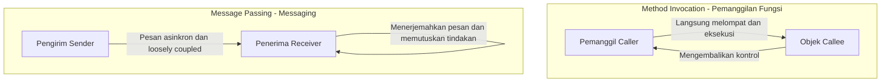
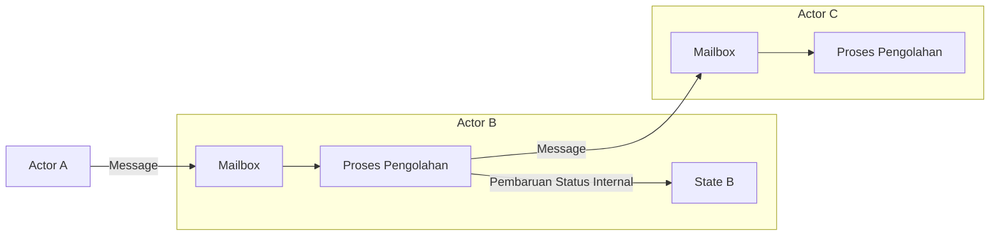

## 1. Pendahuluan: Apakah "Pemrograman Berorientasi Objek" yang Kita Kenal Asli?

Dalam pengembangan perangkat lunak modern, tidak ada hari tanpa mendengar istilah "Pemrograman Berorientasi Objek" ([OOP](/id/p/object-oriented-programming-oop-solid-principles/): Object-Oriented Programming). Sebagian besar bahasa pemrograman utama seperti Java, C#, Python, Ruby, dan C++ mengadopsi paradigma berorientasi objek, menjadikannya pengetahuan wajib bagi para pengembang.

Namun, tahukah Anda bahwa "[Tiga Elemen Utama Pemrograman Berorientasi Objek](/id/p/object-oriented-programming-oop-solid-principles/)" yang sering dipelajari pertama kali oleh banyak pengembang—yaitu "Enkapsulasi" (Encapsulation), "Pewarisan" (Inheritance), dan "Polimorfisme" (Polymorphism)—sebenarnya sangat menyimpang dari esensi yang dimaksudkan oleh Alan Kay, yang bisa disebut sebagai bapak pemrograman berorientasi objek?

Gaya yang biasa kita tulis sehari-hari—mendefinisikan kelas, membuat instans, dan memanggil metode dengan notasi titik—memang merupakan salah satu bentuk berorientasi objek yang dibangun oleh bahasa tertentu (seperti C++ atau Java). Namun, itu hanyalah sebagian kecil dari konsep luas pemrograman berorientasi objek, atau sekadar interpretasi spesifik.

Dalam artikel ini, kita akan kembali ke sejarah awal munculnya istilah berorientasi objek dan visi yang sebenarnya ingin dicapai oleh Alan Kay. Kata kuncinya adalah **"Messaging"** (Penyampaian Pesan). Dengan memahami konsep messaging secara benar, wawasan desain sistem Anda akan meluas, dan Anda akan mendapatkan pemahaman mendalam yang relevan dengan desain [sistem terdistribusi](/id/p/cap-theorem-distributed-systems-tradeoff/) modern seperti [arsitektur microservices](/id/p/microservices-architecture-bff-api-gateway/) atau model aktor.

## 2. Visi Alan Kay: Inspirasi dari Biologi

Alan Kay, yang menciptakan istilah pemrograman berorientasi objek, awalnya mempelajari matematika dan biologi. Ketika ia mencari paradigma baru untuk membangun perangkat lunak, ia mendapat inspirasi kuat dari mekanisme **"Sel Biologis" (Cell)**.

Tubuh manusia terdiri dari triliunan sel. Setiap sel berperilaku layaknya organisme mandiri, dan keadaan internalnya (seperti DNA atau protein) tidak dimanipulasi secara langsung dari luar. Sel-sel saling bertukar "pesan" berupa bahan kimia atau sinyal listrik, dan dengan cara ini mereka mempertahankan aktivitas kehidupan yang kompleks dan tingkat tinggi secara keseluruhan.

Metafora "komunikasi antar sel" inilah yang menjadi titik awal dari pemrograman berorientasi objek yang dibayangkan oleh Alan Kay.

- **Kemandirian Sel**: Setiap objek sepenuhnya menyembunyikan statusnya (data) dan tidak pernah diubah secara langsung dari luar.
- **Pengiriman dan Penerimaan Pesan**: Objek berkolaborasi satu sama lain semata-mata dengan saling mengirim "pesan".
- **Perilaku Otonom**: Objek yang menerima pesan memutuskan sendiri dengan tanggung jawabnya sendiri bagaimana menanganinya (atau mengabaikannya).

Alan Kay pernah menyatakan:
> "I'm sorry that I long ago coined the term 'objects' for this topic because it gets many people to focus on the lesser idea. The big idea is 'messaging'."
> (Saya menyesal karena dulu saya menciptakan istilah "objek" untuk topik ini karena hal itu membuat banyak orang fokus pada gagasan yang lebih kecil. Gagasan terbesarnya adalah "messaging".)

Seperti yang ditunjukkan oleh kutipan ini, peran utama bukanlah pada "objek" (benda) itu sendiri, melainkan "pesan" yang mengalir di antara objek-objek tersebut.

## 3. Perbedaan Mendesak Antara "Pemanggilan Metode" dan "Messaging"

Dalam bahasa seperti Java atau C++ yang kita kenal, kita melakukan "Pemanggilan Metode" (Method Invocation) untuk menggunakan fungsionalitas objek.

```java
// Contoh pemanggilan metode ala Java
Receiver obj = new Receiver();
obj.doSomething();
```

Sekilas, ini tampak seperti "mengirim pesan `doSomething` ke `obj`". Namun, pada tingkat kompilator atau runtime, ini hanyalah **syntax sugar untuk "Pemanggilan Fungsi" (Function Call)** biasa. Pemanggil (Caller) mengetahui alamat memori yang dipanggil (Callee), dan langsung melompat ke sana untuk mengeksekusi prosesnya. Jika metode `doSomething` tidak ada, maka akan terjadi error kompilasi (pada bahasa dengan pengetikan statis) atau error runtime.

Di sisi lain, "Penyampaian Pesan" (Message Passing) dalam arti sebenarnya berbeda secara mendasar dari ini. Dalam bahasa "Smalltalk" yang ikut dirancang oleh Alan Kay, setiap interaksi antar objek dimodelkan sebagai pengiriman pesan.

Dalam dunia messaging, pengirim hanya melemparkan permintaan (set nama dan argumen) kepada penerima dengan mengatakan "tolong lakukan ini".



Karakteristik dari messaging adalah sebagai berikut:

1. **Pengikatan Sangat Terlambat (Extreme Late Binding)**
   Pemanggilan metode sering kali diikat pada saat kompilasi atau penautan (static binding), sedangkan messaging sepenuhnya tidak diikat hingga waktu berjalan (dynamic binding). Objek yang menerima pesan akan secara dinamis menerjemahkan pesan tersebut saat runtime, mencari dan mengeksekusi proses yang sesuai.
2. **Delegasi dan Pengabaian Pesan**
   Jika objek menerima pesan yang tidak dipahaminya, ia tidak sekadar menjadikannya error, melainkan bisa bereaksi secara otonom dan fleksibel, seperti meneruskannya (forward) ke objek lain atau mengabaikannya.
3. **Transparansi pada Jaringan**
   Paradigma messaging memungkinkan kita memperlakukan objek yang berada di ruang memori (proses) yang sama atau objek di server terpisah melalui jaringan dengan cara yang identik. Pemanggilan metode sangat bergantung pada kondisi berada di ruang memori yang sama, namun messaging memiliki sifat alami untuk dapat diskalakan dalam [sistem terdistribusi](/id/p/cap-theorem-distributed-systems-tradeoff/).

## 4. Mengapa "Kelas" dan "Pewarisan" Menjadi Akar Kesalahpahaman?

Lalu, mengapa pemrograman berorientasi objek, di mana seharusnya "messaging" menjadi hal terpenting, kini lebih banyak dibahas dengan berpusat pada "kelas dan pewarisan"?

Alasan terbesarnya adalah **kesuksesan luar biasa dari C++ dan Java**.

Dari tahun 1980-an hingga 1990-an, C++ muncul dengan menggabungkan konsep berorientasi objek berdasarkan bahasa C yang merupakan bahasa prosedural. Untuk memaksimalkan performa eksekusi, C++ tidak mengadopsi dynamic messaging murni seperti Smalltalk, melainkan menerapkan metode pemanggilan efisien dengan kelas dan pewarisan statis, serta tabel fungsi virtual (vtable) yang bisa diselesaikan saat kompilasi.

Java yang menyusul kemudian, juga sangat dipengaruhi oleh sintaks C++ dan menyebarluaskan gaya "mendefinisikan kelas dan membuat instans darinya" sebagai standar berorientasi objek yang luas. Akibatnya, pemahaman yang kuat bahwa "berorientasi objek = merancang hierarki kelas" mengakar di industri ini.

Kelas dan pewarisan sangat berguna untuk penggunaan ulang kode (code reuse) dan pengorganisasian struktur data. Namun, ketergantungan yang berlebihan pada hal-hal ini telah menyebabkan masalah berikut:

- **Pohon pewarisan kelas yang besar dan rumit**: Rentan terhadap perubahan, dan modifikasi pada parent class akan merembet ke semua child class (tight coupling).
- **Lahirnya Kelas Dewa (God Class)**: Kelas besar yang menimbun semua data dan metode, jauh dari "objek kecil yang otonom" seperti pada asalnya.
- **Kebocoran Status Internal**: Penyalahgunaan Getter dan Setter yang merusak enkapsulasi, sehingga keadaan dapat dimanipulasi secara langsung dari luar.

Semua ini bisa dikatakan sebagai anti-pattern yang terjadi karena hilangnya filosofi messaging asli, yaitu "objek independen saling mengirim pesan".

## 5. Model Aktor dan Sistem Terdistribusi: Kebangkitan Filosofi Messaging

Di zaman modern, arsitektur atau paradigma apa yang mewujudkan visi "messaging" Alan Kay dalam bentuknya yang paling murni?

Salah satunya adalah **"Model Aktor" (Actor Model)**. Model komputasi yang digagas oleh Carl Hewitt dan lainnya ini menjadi dasar teknologi seperti Erlang, Elixir, dan Akka dari Scala.

Dalam model aktor, unit dasar komputasi disebut "Aktor" (Actor). Aktor memiliki status dan perilaku yang sepenuhnya independen, dan satu-satunya cara berinteraksi dengan orang lain adalah melalui **"pengiriman pesan asinkron"**. Ini secara mengejutkan sejalan dengan metafora sel Alan Kay.



Dalam Erlang/Elixir, ratusan ribu aktor ringan (proses) berjalan secara paralel dan saling mengirim pesan untuk membangun sistem yang masif. Bahkan jika satu aktor gagal (crash), sistem dapat mencapai toleransi kesalahan yang sangat tinggi, misalnya dengan mengirim pesan ke aktor lain untuk me-restart-nya (prinsip "Let it crash").

Lebih jauh lagi, **"[Arsitektur Microservices](/id/p/microservices-architecture-bff-api-gateway/)" (Microservices Architecture)** modern pada dasarnya bisa dianggap sebagai versi raksasa dari pemrograman berorientasi objek yang berorientasi pada pesan (message-oriented). Jika kita menganggap setiap microservice sebagai sebuah "objek" raksasa, mereka benar-benar menyembunyikan basis data mereka sendiri (status internal) dan membangun seluruh sistem melalui pertukaran "pesan" via REST API, gRPC, atau Kafka.

Visi yang diimpikan Alan Kay—di mana "objek-objek yang tersebar di node yang berbeda di jaringan saling berkirim pesan"—tanpa disadari telah terwujud di era cloud-native dalam bentuk microservices.

## 6. Kesimpulan: Apa yang Seharusnya Kita Pelajari dari Pemrograman Berorientasi Objek

Istilah "pemrograman berorientasi objek" telah mencakup terlalu banyak makna. Kelas, pewarisan, antarmuka, polimorfisme... tidak diragukan lagi bahwa ini semua adalah alat yang berguna dalam pengembangan modern.

Namun, untuk mengelola kompleksitas sistem dan menghasilkan desain yang fleksibel serta dapat diskalakan (scalable), kita perlu mengingat inti dari **"Messaging"** yang awalnya dimaksudkan oleh Alan Kay.

1. **Jangan mengekspos data dan perilaku secara sembarangan** (melindungi dinding sel).
2. **Kirim pesan sebagai "permintaan" daripada memanggil metode** (menghargai otonomi).
3. **Sadari fleksibilitas pada saat runtime dan pengikatan lambat (late binding)**.
4. **Pahami arsitektur dengan metafora yang sama, dari dalam proses hingga [sistem terdistribusi](/id/p/cap-theorem-distributed-systems-tradeoff/)**.

Saat Anda menulis kode atau memikirkan desain sistem Anda di masa depan, cobalah untuk mengambil sudut pandang: "Pesan seperti apa yang harus dikirimkan objek ini ke objek lain?" Dengan berfokus pada "jaringan dan komunikasi objek" alih-alih "hierarki kelas", desain Anda akan menjadi lebih elegan, tangguh terhadap perubahan, dan berorientasi objek dalam arti yang sebenarnya.

---
*Reference: Alan Kay's emails, Smalltalk-80 documentation, and the Actor Model principles.*
