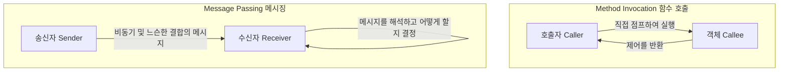
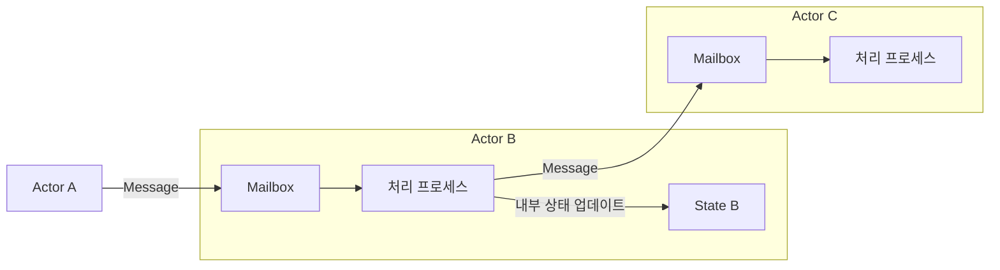

## 1. 시작하며: 우리가 알고 있는 "객체 지향"은 진짜인가?

현대의 소프트웨어 개발에 있어 "[객체 지향 프로그래밍](/ko/p/object-oriented-programming-oop-solid-principles/)([OOP](/ko/p/object-oriented-programming-oop-solid-principles/): Object-Oriented Programming)"이라는 말을 듣지 않는 날은 없습니다. Java, C#, Python, Ruby, C++ 등 주류가 된 프로그래밍 언어 대부분이 객체 지향 패러다임을 도입하고 있어 개발자에게 필수적인 지식이 되었습니다.

하지만 많은 개발자가 처음 배우는 "객체 지향의 3대 요소" —— 즉 "캡슐화(Encapsulation)", "상속(Inheritance)", "다형성(Polymorphism)" —— 은 사실 객체 지향의 창시자라고도 할 수 있는 앨런 케이(Alan Kay)가 의도한 본질에서 크게 벗어나 있다는 사실을 알고 계십니까?

우리가 일상적으로 작성하는 "클래스를 정의하고, 인스턴스를 생성하며, 점(dot) 표기법으로 메서드를 호출하는" 스타일은 분명 특정 언어(예: C++나 Java)가 구축한 객체 지향의 한 형태이기는 합니다. 하지만 그것은 객체 지향이라는 광대한 개념의 극히 일부, 혹은 특정 해석에 불과합니다.

이 글에서는 객체 지향이라는 말이 탄생한 초기의 역사와, 앨런 케이가 진정으로 실현하고 싶었던 비전으로 돌아가 봅니다. 그 키워드가 되는 것이 바로 **"메시징(Messaging)"**입니다. 메시징이라는 개념을 올바르게 이해함으로써 여러분의 시스템 설계 시야는 크게 넓어지고, [마이크로서비스 아키텍처](/ko/p/microservices-architecture-bff-api-gateway/)나 액터 모델 등 현대의 [분산 시스템](/ko/p/cap-theorem-distributed-systems-tradeoff/) 설계로 이어지는 깊은 통찰을 얻을 수 있을 것입니다.

## 2. 앨런 케이의 비전: 생물학으로부터의 영감

객체 지향이라는 말을 고안한 앨런 케이는 원래 수학과 생물학을 공부했습니다. 그가 소프트웨어의 새로운 구축 패러다임을 모색하고 있을 때 강한 영감을 받은 것이 바로 **"생물의 세포(Cell)"** 구조입니다.

인간의 몸은 수조 개의 세포로 구성되어 있습니다. 각각의 세포는 독립적인 생명체처럼 행동하며, 자신의 내부 상태(DNA나 단백질 등)를 외부에서 직접 조작당하는 일은 없습니다. 세포들은 화학 물질이나 전기 신호라는 "메시지"를 주고받음으로써 전체적으로 복잡하고 고도화된 생명 활동을 유지하고 있습니다.

이 "세포 간의 커뮤니케이션"이라는 메타포야말로 앨런 케이가 마음속에 그렸던 객체 지향의 원점입니다.

- **세포의 독립성**: 각 객체는 자신의 상태(데이터)를 완전히 은닉하며, 외부에서 직접 덮어쓸 수 없다.
- **메시지의 송수신**: 객체들은 "메시지"를 서로 전송함으로써만 협력한다.
- **자율적인 행동**: 메시지를 받은 객체는 그것을 어떻게 처리할지(혹은 무시할지)를 자신의 책임하에 결정한다.

앨런 케이는 예전에 이렇게 말했습니다.
> "I'm sorry that I long ago coined the term 'objects' for this topic because it gets many people to focus on the lesser idea. The big idea is 'messaging'."
> (오래전에 이 주제에 대해 '객체'라는 단어를 만들어낸 것을 유감스럽게 생각한다. 왜냐하면 많은 사람이 그 사소한 아이디어에 주목하게 만들기 때문이다. 가장 중요한 아이디어는 '메시징'이다.)

이 말이 보여주듯이 주인공은 "객체(사물)" 그 자체가 아니라 객체들 사이를 오가는 "메시지"인 것입니다.

## 3. "메서드 호출"과 "메시징"의 결정적인 차이

우리가 잘 아는 Java나 C++ 같은 언어에서는 객체의 기능을 사용하기 위해 "메서드 호출(Method Invocation)"을 수행합니다.

```java
// Java적인 메서드 호출의 예
Receiver obj = new Receiver();
obj.doSomething();
```

언뜻 보면 이는 "`obj`에 대해 `doSomething`이라는 메시지를 보내고 있다"고 생각될 수 있습니다. 하지만 컴파일러나 런타임 레벨에서 보면 이는 단순한 **"함수 호출(Function Call)"의 구문 설탕(Syntax Sugar)**에 불과합니다. 호출자(Caller)는 호출 대상(Callee)의 메모리 주소를 알고 있으며, 직접 그곳으로 점프하여 처리를 실행시킵니다. 만약 `doSomething`이라는 메서드가 존재하지 않는다면 컴파일 에러(정적 타입 언어의 경우)나 런타임 에러가 발생합니다.

반면 진정한 의미의 "메시징(Message Passing)"은 이와 본질적으로 다릅니다. 앨런 케이가 설계에 참여한 언어인 "Smalltalk"에서는 객체 간의 상호작용이 모두 메시지 전송으로 모델링되어 있습니다.

메시징의 세계에서는 송신자가 수신자에게 "이것을 해달라"는 요청(이름과 인수의 집합)을 던질 뿐입니다.



메시징의 특징은 다음과 같습니다.

1. **극한의 지연 바인딩 (Extreme Late Binding)**
   메서드 호출이 컴파일 시점이나 링크 시점에 결합되는(정적 결합) 경우가 많은 반면, 메시징은 완전히 실행 시점까지 결합되지 않습니다(동적 결합). 메시지를 받은 객체는 실행 시점에 그 메시지를 동적으로 해석하고, 대응하는 처리를 찾아 실행합니다.
2. **메시지의 위임과 무시**
   객체는 자신이 이해할 수 없는 메시지를 받았을 때 그것을 단순히 에러로 처리할 뿐만 아니라, 다른 객체로 전달(포워드)하거나 무시하는 등의 유연한 대응을 자율적으로 수행할 수 있습니다.
3. **네트워크상의 투명성**
   메시징이라는 패러다임은 같은 메모리 공간(프로세스) 내에 있는 객체들끼리도, 네트워크 너머 별도의 서버에 있는 객체들끼리도 동일하게 다룰 수 있습니다. 메서드 호출은 같은 메모리 공간에 있는 것이 대전제지만, 메시징은 [분산 시스템](/ko/p/cap-theorem-distributed-systems-tradeoff/)으로 자연스럽게 확장되는 성질을 가지고 있습니다.

## 4. 왜 "클래스"나 "상속"이 오해의 원인이 되었는가?

그렇다면 왜 본래 "메시징"이 중요했어야 할 객체 지향이 현재처럼 "클래스와 상속"을 중심으로 이야기하게 된 것일까요?

그 가장 큰 이유는 **C++와 Java의 압도적인 성공**입니다.

1980년대부터 90년대에 걸쳐 절차적 언어인 C언어를 기반으로 객체 지향 개념을 도입한 C++가 등장했습니다. C++는 실행 퍼포먼스를 극한까지 높이기 위해 Smalltalk와 같은 순수한 동적 메시징이 아니라, 컴파일 시점에 해결할 수 있는 정적인 클래스나 상속, 가상 함수 테이블(vtable)을 이용한 효율적인 메서드 호출을 채택했습니다.

이어진 Java 역시 구문적으로 C++의 영향을 강하게 받아, "클래스를 정의하고 거기서 인스턴스를 생성한다"는 스타일을 객체 지향의 표준으로 널리 보급했습니다. 이로 인해 산업계에서는 "객체 지향 = 클래스 계층을 설계하는 것"이라는 확고한 인식이 정착되고 말았습니다.

클래스나 상속은 코드 재사용이나 데이터 구조의 정리에는 매우 편리합니다. 하지만 그것에 과도하게 의존함으로써 다음과 같은 문제가 발생하게 되었습니다.

- **거대하고 복잡한 클래스 상속 트리**: 변경에 취약하고, 부모 클래스의 수정이 모든 자식 클래스에 파급된다(강한 결합).
- **갓 클래스(God Class)의 탄생**: 온갖 데이터와 메서드를 축적하여 본래의 "자율적인 작은 객체"와는 동떨어진 거대한 클래스의 출현.
- **내부 상태의 누출**: 게터(Getter)와 세터(Setter)를 남용하여 캡슐화가 파괴되고 외부에서 직접 상태를 조작당한다.

이들은 모두 "독립적인 객체끼리 메시지를 주고받는다"는 본래의 메시징 철학을 잃어버린 결과 초래된 안티 패턴이라고 할 수 있습니다.

## 5. 액터 모델과 분산 시스템: 되살아나는 메시징의 철학

현대에 이르러 앨런 케이의 "메시징" 비전을 가장 순수한 형태로 체현하고 있는 아키텍처나 패러다임은 무엇일까요?

그중 하나가 **"액터 모델(Actor Model)"**입니다. 칼 휴이트(Carl Hewitt) 등에 의해 제창된 이 계산 모델은 Erlang이나 Elixir, Scala의 Akka와 같은 기술의 기반이 되고 있습니다.

액터 모델에서는 계산의 기본 단위를 "액터(Actor)"라고 부릅니다. 액터는 완전히 독립적인 상태와 행동을 가지며, 타인과 커뮤니케이션하는 유일한 수단은 **"비동기 메시지 전송"**입니다. 이것은 놀라울 정도로 앨런 케이의 세포 메타포와 일치합니다.



Erlang/Elixir에서는 수십만 개의 경량 액터(프로세스)가 병행하여 움직이며, 서로 메시지를 주고받음으로써 거대한 시스템을 구축합니다. 어떤 액터가 크래시(충돌)하더라도 다른 액터에 메시지를 보내 재시작시키는('Let it crash' 사상) 등 극히 높은 내결함성을 실현하고 있습니다.

게다가 현대의 **"[마이크로서비스 아키텍처](/ko/p/microservices-architecture-bff-api-gateway/)(Microservices Architecture)"**도 본질적으로는 메시징 지향의 객체 지향의 거대 버전이라고 할 수 있습니다. 각 마이크로서비스를 하나의 거대한 "객체"로 본다면, 이들은 자신의 데이터베이스(내부 상태)를 완전히 은닉하고 REST API나 gRPC, Kafka 등을 통한 "메시지" 교환을 통해 시스템 전체를 구축하고 있습니다.

앨런 케이가 꿈꿨던 "네트워크상의 서로 다른 노드에 흩어져 있는 객체끼리 메시지를 주고받는다"는 비전은 클라우드 네이티브 시대에 뜻하지 않게 마이크로서비스라는 형태로 실현되고 있는 것입니다.

## 6. 요약: 우리가 객체 지향에서 진정으로 배워야 할 것

"객체 지향"이라는 말은 너무나 많은 의미를 포괄하게 되었습니다. 클래스, 상속, 인터페이스, 다형성…… 이들이 현대의 개발에서 유용한 도구라는 점에는 틀림이 없습니다.

하지만 시스템의 복잡성을 관리하고 유연하며 확장 가능한 설계를 수행하기 위해서는, 앨런 케이가 본래 의도했던 **"메시징"**이라는 핵심을 떠올릴 필요가 있습니다.

1. **데이터와 행동을 함부로 공개하지 않는다** (세포벽을 지킨다).
2. **메서드 호출이 아니라 "의뢰"로서 메시지를 보낸다** (자율성의 존중).
3. **실행 시점의 유연성과 지연 바인딩을 의식한다**.
4. **프로세스 내부터 [분산 시스템](/ko/p/cap-theorem-distributed-systems-tradeoff/)까지 공통된 메타포로 아키텍처를 파악한다**.

다음에 당신이 코드를 작성할 때, 혹은 시스템 설계를 고민할 때 "이 객체는 다른 객체에 어떤 메시지를 보내야 하는가?"라는 관점을 가져보시기 바랍니다. "클래스의 계층 구조"가 아니라 "객체의 네트워크와 커뮤니케이션"에 초점을 맞춤으로써, 여러분의 설계는 더욱 세련되고 변경에 강하며 진정한 의미에서 "객체 지향적"이 될 것입니다.

---
*Reference: Alan Kay's emails, Smalltalk-80 documentation, and the Actor Model principles.*
