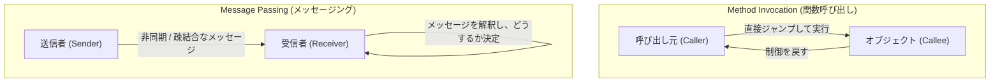
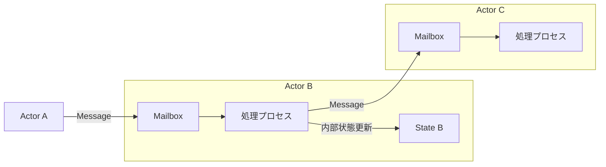

## 1. はじめに：私たちが知っている「オブジェクト指向」は本物か？

現代のソフトウェア開発において、「オブジェクト指向プログラミング（OOP: Object-Oriented Programming）」という言葉を聞かない日はありません。Java、C#、Python、Ruby、C++など、主流となっているプログラミング言語のほとんどがオブジェクト指向のパラダイムを取り入れており、開発者にとって必須の知識となっています。

しかし、多くの開発者が最初に学ぶ「オブジェクト指向の三大要素」——すなわち「カプセル化（Encapsulation）」「継承（Inheritance）」「ポリモーフィズム（Polymorphism）」——は、実はオブジェクト指向の生みの親とも言えるアラン・ケイ（Alan Kay）が意図した本質から大きく逸脱しているという事実をご存知でしょうか。

私たちが日常的に書いている「クラスを定義し、インスタンスを生成し、ドット記法でメソッドを呼び出す」というスタイルは、確かに特定の言語（例えばC++やJava）が構築したオブジェクト指向のひとつの形ではあります。しかしそれは、オブジェクト指向という広大な概念のごく一部、あるいは特定の解釈に過ぎません。

この記事では、オブジェクト指向という言葉が生まれた初期の歴史と、アラン・ケイが本当に実現したかったビジョンに立ち返ります。そのキーワードとなるのが**「メッセージング（Messaging）」**です。メッセージングという概念を正しく理解することで、あなたのシステム設計の視野は大きく広がり、マイクロサービスアーキテクチャやアクターモデルなど、現代の分散システム設計に通じる深い洞察を得ることができるでしょう。

## 2. アラン・ケイのビジョン：生物学からのインスピレーション

オブジェクト指向という言葉を考案したアラン・ケイは、もともと数学と生物学を学んでいました。彼がソフトウェアの新しい構築パラダイムを模索していたとき、強いインスピレーションを受けたのが**「生物の細胞（Cell）」**の仕組みです。

人間の身体は、数兆個もの細胞から構成されています。それぞれの細胞は独立した生命体のように振る舞い、自身の内部状態（DNAやタンパク質など）を外部から直接操作されることはありません。細胞同士は、化学物質や電気信号という「メッセージ」をやり取りすることで、全体として複雑で高度な生命活動を維持しています。

この「細胞同士のコミュニケーション」というメタファーこそが、アラン・ケイの思い描いたオブジェクト指向の原点です。

- **細胞の独立性**：各オブジェクトは自身の状態（データ）を完全に隠蔽し、外部から直接書き換えられることはない。
- **メッセージの送受信**：オブジェクト同士は「メッセージ」を送信し合うことでのみ連携する。
- **自律的な振る舞い**：メッセージを受け取ったオブジェクトは、それをどう処理するか（あるいは無視するか）を自身の責任で決定する。

アラン・ケイはかつてこう述べました。
> "I'm sorry that I long ago coined the term 'objects' for this topic because it gets many people to focus on the lesser idea. The big idea is 'messaging'."
> （ずっと昔にこのトピックに対して「オブジェクト」という言葉を作ってしまったことを申し訳なく思っている。なぜなら、多くの人がその小さなアイデアに注目してしまうからだ。最も重要なアイデアは「メッセージング」である。）

この言葉が示す通り、主役は「オブジェクト（モノ）」それ自体ではなく、オブジェクト同士の間を行き交う「メッセージ」なのです。

## 3. 「メソッド呼び出し」と「メッセージング」の決定的な違い

私たちがよく知るJavaやC++のような言語では、オブジェクトの機能を使うために「メソッド呼び出し（Method Invocation）」を行います。

```java
// Java的なメソッド呼び出しの例
Receiver obj = new Receiver();
obj.doSomething();
```

一見すると、これは「`obj` に対して `doSomething` というメッセージを送っている」ように思えます。しかし、コンパイラやランタイムのレベルで見ると、これは単なる**「関数呼び出し（Function Call）」の構文糖衣**に過ぎません。呼び出し元（Caller）は、呼び出し先（Callee）のメモリアドレスを知っており、直接そこにジャンプして処理を実行させます。もし `doSomething` というメソッドが存在しなければ、コンパイルエラー（静的型付け言語の場合）や実行時エラーとなります。

一方で、真の意味での「メッセージング（Message Passing）」は、これとは本質的に異なります。アラン・ケイが設計に関わった言語「Smalltalk」では、オブジェクト間のやり取りはすべてメッセージの送信としてモデル化されています。

メッセージングの世界では、送信者は受信者に対して「これをやってほしい」というリクエスト（名前と引数のセット）を投げるだけです。



メッセージングの特徴は以下の通りです。

1. **極度の遅延束縛（Extreme Late Binding）**
   メソッド呼び出しがコンパイル時やリンク時に結合される（静的結合）ことが多いのに対し、メッセージングは完全に実行時まで結合されません（動的結合）。メッセージを受け取ったオブジェクトは、実行時にそのメッセージを動的に解釈し、対応する処理を探して実行します。
2. **メッセージの委譲と無視**
   オブジェクトは、自分が理解できないメッセージを受け取った場合、それを単にエラーにするだけでなく、別のオブジェクトに転送（フォワード）したり、無視したりといった柔軟な対応を自律的に行うことができます。
3. **ネットワーク上の透過性**
   メッセージングというパラダイムは、同じメモリ空間（プロセス）内にあるオブジェクト同士でも、ネットワーク越しの別々のサーバーにあるオブジェクト同士でも、同じように扱うことができます。メソッド呼び出しは同じメモリ空間にあることが大前提ですが、メッセージングは分散システムに自然にスケールする性質を持っています。

## 4. なぜ「クラス」や「継承」が誤解の元になったのか？

では、なぜ本来「メッセージング」が重要だったはずのオブジェクト指向が、現在のように「クラスと継承」を中心に語られるようになったのでしょうか。

その最大の理由は、**C++とJavaの圧倒的な成功**です。

1980年代から90年代にかけて、手続き型言語であるC言語をベースにオブジェクト指向の概念を取り入れたC++が登場しました。C++は実行パフォーマンスを極限まで高めるため、Smalltalkのような純粋な動的メッセージングではなく、コンパイル時に解決できる静的なクラスや継承、仮想関数テーブル（vtable）を用いた効率的なメソッド呼び出しを採用しました。

続くJavaも、構文的にC++の影響を強く受け、「クラスを定義してそこからインスタンスを生成する」というスタイルをオブジェクト指向の標準として広く普及させました。これにより、産業界では「オブジェクト指向＝クラス階層を設計すること」という強固な認識が定着してしまいました。

クラスや継承は、コードの再利用やデータ構造の整理には非常に便利です。しかし、それに過度に依存することで、以下のような問題が生じるようになりました。

- **巨大で複雑なクラス継承ツリー**：変更に弱く、親クラスの修正がすべての子クラスに波及する（密結合）。
- **ゴッドクラス（God Class）の誕生**：あらゆるデータとメソッドを溜め込み、本来の「自律した小さなオブジェクト」からかけ離れた巨大なクラスの出現。
- **内部状態の漏洩**：ゲッター（Getter）とセッター（Setter）を乱用し、カプセル化が破壊され、外部から直接状態を操作される。

これらはすべて、「独立したオブジェクト同士がメッセージを送り合う」という本来のメッセージングの哲学を見失った結果、引き起こされたアンチパターンと言えます。

## 5. アクターモデルと分散システム：蘇るメッセージングの哲学

現代において、アラン・ケイの「メッセージング」のビジョンを最も純粋な形で体現しているアーキテクチャやパラダイムは何でしょうか。

その一つが**「アクターモデル（Actor Model）」**です。Carl Hewittらによって提唱されたこの計算モデルは、ErlangやElixir、ScalaのAkkaといった技術の基盤となっています。

アクターモデルでは、計算の基本単位を「アクター（Actor）」と呼びます。アクターは完全に独立した状態と振る舞いを持ち、他者とコミュニケーションする唯一の手段は**「非同期メッセージの送信」**です。これは驚くほど、アラン・ケイの細胞メタファーと一致しています。



Erlang/Elixirでは、何十万もの軽量なアクター（プロセス）が並行して動き、互いにメッセージを送り合うことで巨大なシステムを構築します。あるアクターがクラッシュしても、他のアクターにメッセージを送って再起動させる（Let it crashの思想）など、極めて高い耐障害性を実現しています。

さらに、現代の**「マイクロサービスアーキテクチャ（Microservices Architecture）」**も、本質的にはメッセージング指向のオブジェクト指向の巨大版と言えます。各マイクロサービスを一つの巨大な「オブジェクト」と見立てれば、それらは自身のデータベース（内部状態）を完全に隠蔽し、REST APIやgRPC、Kafkaなどを介した「メッセージ」のやり取りによってシステム全体を構築しています。

アラン・ケイが夢見た「ネットワーク上の異なるノードに散らばるオブジェクト同士がメッセージを送り合う」というビジョンは、クラウドネイティブ時代において、図らずもマイクロサービスという形で実現しているのです。

## 6. まとめ：私たちがオブジェクト指向から本当に学ぶべきこと

「オブジェクト指向」という言葉は、あまりにも多くの意味を包含しすぎてしまいました。クラス、継承、インターフェース、ポリモーフィズム……これらは現代の開発において有用なツールであることには間違いありません。

しかし、システムの複雑さを管理し、柔軟でスケーラブルな設計を行うためには、アラン・ケイが本来意図した**「メッセージング」**という核心を思い出す必要があります。

1. **データと振る舞いをむやみに公開しない**（細胞の壁を守る）。
2. **メソッド呼び出しではなく、「依頼」としてメッセージを送る**（自律性の尊重）。
3. **実行時の柔軟性と遅延束縛を意識する**。
4. **プロセス内から分散システムまで、共通のメタファーでアーキテクチャを捉える**。

次にあなたがコードを書くとき、あるいはシステムの設計を考えるとき、「このオブジェクトは他のオブジェクトにどのようなメッセージを送るべきか？」という視点を持ってみてください。「クラスの階層構造」ではなく、「オブジェクトのネットワークとコミュニケーション」に焦点を当てることで、あなたの設計はより洗練され、変更に強く、真の意味で「オブジェクト指向的」になるはずです。

---
*Reference: Alan Kay's emails, Smalltalk-80 documentation, and the Actor Model principles.*
