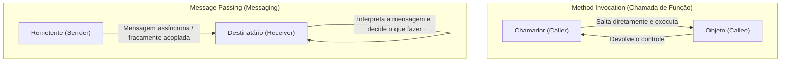
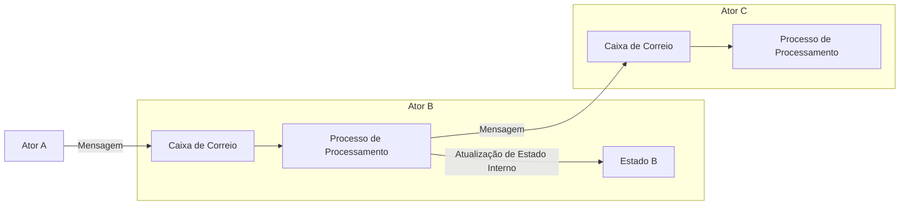

## 1. Introdução: A "Orientação a Objetos" que conhecemos é real?

No desenvolvimento de software moderno, não há um dia em que não ouçamos o termo "Programação Orientada a Objetos (OOP)". A maioria das linguagens de programação dominantes, como Java, C#, Python, Ruby e C++, adotaram o paradigma orientado a objetos, tornando-se um conhecimento essencial para os desenvolvedores.

No entanto, você sabia que os "três grandes pilares da orientação a objetos" que muitos desenvolvedores aprendem primeiro — a saber, "Encapsulamento", "Herança" e "Polimorfismo" — na verdade se desviam significativamente da essência original pretendida por Alan Kay, considerado o pai da orientação a objetos?

O estilo que escrevemos diariamente — "definir uma classe, criar uma instância e chamar um método usando a notação de ponto" — é certamente uma forma de orientação a objetos construída por linguagens específicas (como C++ e Java). No entanto, isso é apenas uma pequena parte do vasto conceito de orientação a objetos, ou apenas uma interpretação específica.

Neste artigo, retornaremos à história inicial de como o termo orientação a objetos surgiu e à visão que Alan Kay realmente queria alcançar. A palavra-chave para isso é o **"Messaging" (Troca de Mensagens)**. Ao entender corretamente o conceito de mensagens, a sua visão sobre design de sistemas se expandirá muito, e você obterá percepções profundas que se aplicam ao design de sistemas distribuídos modernos, como arquitetura de microsserviços e o modelo de atores.

## 2. A Visão de Alan Kay: Inspiração na Biologia

Alan Kay, que cunhou o termo orientação a objetos, estudou originalmente matemática e biologia. Quando ele estava procurando por um novo paradigma para construir software, ele foi fortemente inspirado pelo funcionamento das **"Células Biológicas"**.

O corpo humano é composto por trilhões de células. Cada célula se comporta como uma forma de vida independente e seu estado interno (como DNA e proteínas) não é manipulado diretamente de fora. As células mantêm atividades vitais complexas e avançadas como um todo, trocando "mensagens" na forma de substâncias químicas e sinais elétricos.

Essa metáfora de "comunicação entre células" é a origem da orientação a objetos imaginada por Alan Kay.

- **Independência das células**: Cada objeto oculta completamente o seu estado (dados) e nunca é reescrito diretamente de fora.
- **Envio e recebimento de mensagens**: Os objetos colaboram apenas enviando "mensagens" uns aos outros.
- **Comportamento autônomo**: O objeto que recebe uma mensagem decide, sob sua própria responsabilidade, como processá-la (ou ignorá-la).

Alan Kay disse certa vez:
> "I'm sorry that I long ago coined the term 'objects' for this topic because it gets many people to focus on the lesser idea. The big idea is 'messaging'."
> (Lamento muito ter cunhado o termo 'objetos' para este tópico há muito tempo, porque faz com que muitas pessoas se concentrem na ideia menor. A grande ideia é o 'messaging'.)

Como essas palavras mostram, o protagonista não é o "objeto" em si, mas as "mensagens" que vão e voltam entre os objetos.

## 3. A Diferença Crucial entre "Chamada de Método" e "Messaging"

Em linguagens conhecidas como Java e C++, usamos a "Chamada de Método (Method Invocation)" para usar os recursos de um objeto.

```java
// Exemplo de chamada de método semelhante a Java
Receiver obj = new Receiver();
obj.doSomething();
```

À primeira vista, parece que estamos "enviando a mensagem `doSomething` para o `obj`". No entanto, no nível do compilador e do tempo de execução, isso é apenas um **açúcar sintático para uma "Chamada de Função (Function Call)"**. O chamador (Caller) conhece o endereço de memória do destinatário (Callee) e salta diretamente para ele para executar o processamento. Se o método `doSomething` não existir, ocorrerá um erro de compilação (no caso de linguagens de tipagem estática) ou um erro em tempo de execução.

Por outro lado, o verdadeiro "Messaging (Message Passing)" é fundamentalmente diferente disso. No Smalltalk, uma linguagem em cujo design Alan Kay esteve envolvido, todas as interações entre objetos são modeladas como envio de mensagens.

No mundo do messaging, o remetente apenas lança um pedido (um conjunto de nome e argumentos) dizendo "quero que você faça isso" para o destinatário.



As características do messaging são as seguintes:

1. **Ligação Extremamente Tardia (Extreme Late Binding)**
   Enquanto a chamada de método é frequentemente ligada em tempo de compilação ou vinculação (ligação estática), o messaging não é completamente ligado até o tempo de execução (ligação dinâmica). O objeto que recebe a mensagem a interpreta dinamicamente em tempo de execução, procura o processamento correspondente e o executa.
2. **Delegação e Ignorar Mensagens**
   Quando um objeto recebe uma mensagem que não entende, ele não precisa apenas gerar um erro; ele pode agir de forma autônoma e flexível, como encaminhar a mensagem para outro objeto ou ignorá-la.
3. **Transparência de Rede**
   O paradigma de mensagens pode lidar da mesma forma com objetos que estão no mesmo espaço de memória (processo) ou objetos que estão em servidores separados através de uma rede. Enquanto a chamada de método pressupõe estar no mesmo espaço de memória, o messaging tem a propriedade de escalar naturalmente para sistemas distribuídos.

## 4. Por que "Classes" e "Herança" causaram mal-entendidos?

Então, por que a orientação a objetos, onde o "messaging" deveria ser originalmente importante, passou a ser discutida focando em "classes e herança" como é hoje?

O maior motivo é o **sucesso esmagador do C++ e Java**.

Nas décadas de 1980 e 1990, surgiu o C++, que incorporou conceitos de orientação a objetos baseados na linguagem processual C. Para maximizar o desempenho de execução, o C++ não adotou o messaging dinâmico puro como o Smalltalk, mas adotou uma chamada de método eficiente usando classes estáticas, herança e tabelas de funções virtuais (vtable) que poderiam ser resolvidas em tempo de compilação.

O Java que se seguiu também foi fortemente influenciado sintaticamente pelo C++ e popularizou amplamente o estilo de "definir classes e criar instâncias a partir delas" como o padrão para orientação a objetos. Como resultado, o forte reconhecimento de que "orientação a objetos = projetar uma hierarquia de classes" se enraizou na indústria.

Classes e herança são muito úteis para reutilização de código e organização de estruturas de dados. No entanto, a dependência excessiva deles levou aos seguintes problemas:

- **Árvores de herança de classes enormes e complexas**: Frágeis a mudanças, e as modificações na classe pai afetam todas as classes filhas (acoplamento forte).
- **Nascimento da God Class (Classe Deus)**: O surgimento de uma classe gigante que acumula todos os dados e métodos, longe do "pequeno objeto autônomo" original.
- **Vazamento do estado interno**: O abuso de Getters e Setters, destruindo o encapsulamento e permitindo que o estado seja manipulado diretamente de fora.

Pode-se dizer que todos esses são antipadrões causados pela perda da filosofia original de mensagens de que "objetos independentes enviam mensagens uns aos outros".

## 5. O Modelo de Atores e Sistemas Distribuídos: A Filosofia das Mensagens Renascida

No mundo moderno, qual arquitetura ou paradigma incorpora a visão de "messaging" de Alan Kay em sua forma mais pura?

Um deles é o **"Modelo de Atores (Actor Model)"**. Este modelo computacional, proposto por Carl Hewitt e outros, é a base para tecnologias como Erlang, Elixir e Akka do Scala.

No modelo de atores, a unidade básica de computação é chamada de "Ator (Actor)". Um ator tem estado e comportamento completamente independentes, e o único meio de comunicação com os outros é o **"envio de mensagens assíncronas"**. Isso combina surpreendentemente com a metáfora celular de Alan Kay.



Em Erlang/Elixir, centenas de milhares de atores (processos) leves rodam em paralelo, construindo um sistema enorme através da troca de mensagens entre si. Se um ator falhar, ele envia uma mensagem para outro ator reiniciá-lo (a filosofia "Let it crash"), alcançando uma tolerância a falhas extremamente alta.

Além disso, a moderna **"Arquitetura de Microsserviços (Microservices Architecture)"** também é essencialmente uma versão gigante da orientação a objetos baseada em mensagens. Se considerarmos cada microsserviço como um "objeto" gigante, eles ocultam completamente o seu próprio banco de dados (estado interno) e constroem todo o sistema trocando "mensagens" através de REST APIs, gRPC, Kafka, etc.

A visão com a qual Alan Kay sonhava, onde "objetos espalhados por diferentes nós em uma rede enviam mensagens uns aos outros", foi inesperadamente realizada na forma de microsserviços na era nativa da nuvem.

## 6. Conclusão: O que realmente deveríamos aprender com a Orientação a Objetos

O termo "Orientação a Objetos" passou a englobar muitos significados. Classes, herança, interfaces, polimorfismo... não há dúvida de que essas são ferramentas úteis no desenvolvimento moderno.

No entanto, para gerenciar a complexidade do sistema e criar projetos flexíveis e escaláveis, precisamos lembrar do núcleo do **"Messaging"** que Alan Kay originalmente pretendia.

1. **Não expor dados e comportamentos desnecessariamente** (proteger a parede celular).
2. **Em vez de chamadas de métodos, enviar mensagens como "pedidos"** (respeitar a autonomia).
3. **Estar ciente da flexibilidade em tempo de execução e da ligação tardia**.
4. **Compreender a arquitetura com uma metáfora comum, desde o interior de um processo até um sistema distribuído**.

Da próxima vez que você escrever código ou pensar no design do sistema, tente adotar a perspectiva: "Que tipo de mensagens esse objeto deve enviar para outros objetos?". Ao se concentrar na "rede e comunicação de objetos" em vez da "hierarquia de classes", o seu design deve se tornar mais refinado, resistente a mudanças e verdadeiramente "orientado a objetos" no sentido real.

---
*Reference: Alan Kay's emails, Smalltalk-80 documentation, and the Actor Model principles.*
