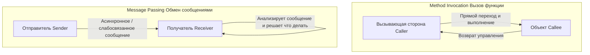
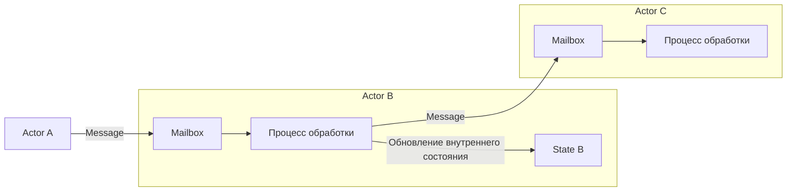

## 1. Введение: Является ли то "объектно-ориентированное программирование", которое мы знаем, настоящим?

В современной разработке программного обеспечения не проходит и дня без упоминания "объектно-ориентированного программирования (ООП)". Большинство основных языков программирования, таких как Java, C#, Python, Ruby и C++, переняли парадигму ООП, и это стало обязательным знанием для разработчиков.

Однако знаете ли вы, что "три главных элемента ООП", которые многие разработчики изучают в первую очередь — "Инкапсуляция (Encapsulation)", "Наследование (Inheritance)" и "Полиморфизм (Polymorphism)" — на самом деле сильно отклоняются от изначальной сути, задуманной Аланом Кэем (Alan Kay), которого можно назвать создателем объектно-ориентированного подхода?

Тот стиль, который мы используем каждый день: "определение классов, создание экземпляров и вызов методов через точечную нотацию", безусловно, является одной из форм ООП, созданной в рамках определенных языков (например, C++ или Java). Но это лишь малая часть огромной концепции ООП, или, скорее, ее специфическая интерпретация.

В этой статье мы вернемся к ранней истории возникновения термина "объектно-ориентированный" и к тому видению, которое действительно хотел реализовать Алан Кэй. Ключевым словом здесь является **"Обмен сообщениями (Messaging)"**. Правильное понимание концепции обмена сообщениями значительно расширит ваш взгляд на проектирование систем и позволит глубже понять современное проектирование распределенных систем, таких как микросервисная архитектура и модель акторов (Actor Model).

## 2. Видение Алана Кэя: Вдохновение из биологии

Алан Кэй, придумавший термин "объектно-ориентированный", изначально изучал математику и биологию. Когда он искал новую парадигму для создания программного обеспечения, сильным источником вдохновения для него послужил механизм **"биологической клетки (Cell)"**.

Человеческое тело состоит из триллионов клеток. Каждая клетка ведет себя как независимый живой организм, и ее внутреннее состояние (ДНК, белки и т. д.) не может напрямую управляться извне. Клетки общаются друг с другом посредством "сообщений" в виде химических веществ или электрических сигналов, поддерживая в целом сложную и высокоорганизованную жизнедеятельность.

Именно эта метафора "общения между клетками" стала отправной точкой ООП в представлении Алана Кэя.

- **Независимость клеток**: Каждый объект полностью скрывает свое состояние (данные) и никогда не изменяется напрямую извне.
- **Отправка и получение сообщений**: Объекты взаимодействуют друг с другом исключительно путем отправки "сообщений".
- **Автономное поведение**: Объект, получивший сообщение, берет на себя ответственность за то, как его обработать (или игнорировать).

Алан Кэй однажды сказал:
> "I'm sorry that I long ago coined the term 'objects' for this topic because it gets many people to focus on the lesser idea. The big idea is 'messaging'."
> (Мне жаль, что я давным-давно придумал термин "объекты" для этой темы, потому что он заставляет многих людей сосредотачиваться на менее значимой идее. Главная идея — это "обмен сообщениями".)

Как показывает эта цитата, главным героем является не сам "объект (вещь)", а "сообщения", которыми обмениваются объекты.

## 3. Решающее различие между "Вызовом метода" и "Обменом сообщениями"

В таких языках, как Java или C++, с которыми мы хорошо знакомы, для использования функций объекта мы используем "вызов метода (Method Invocation)".

```java
// Пример вызова метода в стиле Java
Receiver obj = new Receiver();
obj.doSomething();
```

На первый взгляд кажется, что это "отправка сообщения `doSomething` объекту `obj`". Однако на уровне компилятора или среды выполнения это не более чем синтаксический сахар для **"вызова функции (Function Call)"**. Вызывающая сторона (Caller) знает адрес памяти вызываемой стороны (Callee) и осуществляет прямой переход туда для выполнения кода. Если метод `doSomething` не существует, возникает ошибка компиляции (в языках со статической типизацией) или ошибка во время выполнения.

С другой стороны, истинный "обмен сообщениями (Message Passing)" фундаментально отличается от этого. В языке "Smalltalk", в проектировании которого участвовал Алан Кэй, взаимодействие между объектами полностью моделируется как отправка сообщений.

В мире обмена сообщениями отправитель просто бросает получателю запрос (набор из имени и аргументов): "я хочу, чтобы ты это сделал".



Особенности обмена сообщениями заключаются в следующем:

1. **Экстремальное позднее связывание (Extreme Late Binding)**
   В то время как вызовы методов часто связываются во время компиляции или компоновки (статическое связывание), сообщения полностью не связываются вплоть до времени выполнения (динамическое связывание). Объект, получивший сообщение, динамически интерпретирует его во время выполнения, находит соответствующий обработчик и выполняет его.
2. **Делегирование и игнорирование сообщений**
   Если объект получает сообщение, которое он не понимает, он может не только выдать ошибку, но и автономно выполнить гибкие действия, например, переслать (forward) его другому объекту или проигнорировать.
3. **Прозрачность в сети**
   Парадигма обмена сообщениями позволяет одинаково работать с объектами, находящимися как в одном адресном пространстве (процессе), так и на разных серверах через сеть. Если для вызова метода обязательным условием является нахождение в одном пространстве памяти, то обмен сообщениями имеет свойство естественного масштабирования для распределенных систем.

## 4. Почему "классы" и "наследование" стали источником недопонимания?

Так почему же объектно-ориентированное программирование, где изначально главным был "обмен сообщениями", в наше время стало обсуждаться вокруг "классов и наследования"?

Главная причина кроется в **оглушительном успехе C++ и Java**.

В 1980-х и 1990-х годах появился C++, который внедрил концепции ООП на базе процедурного языка C. Чтобы максимизировать производительность выполнения, C++ принял не чистый динамический обмен сообщениями, как в Smalltalk, а эффективный вызов методов с использованием статических классов, наследования и таблиц виртуальных функций (vtable), которые можно разрешить во время компиляции.

Последующий Java также находился под сильным влиянием C++ с точки зрения синтаксиса и широко популяризовал стиль "определение класса и создание экземпляров на его основе" в качестве стандарта ООП. В результате в индустрии прочно укоренилось представление о том, что "объектно-ориентированное = проектирование иерархии классов".

Классы и наследование очень удобны для повторного использования кода и организации структур данных. Однако чрезмерная зависимость от них привела к следующим проблемам:

- **Огромные и сложные деревья наследования классов**: Хрупкие к изменениям, модификации родительского класса распространяются на все дочерние классы (сильная связность).
- **Появление "Божественного класса" (God Class)**: Огромные классы, которые накапливают все данные и методы, находясь невероятно далеко от оригинальных "автономных маленьких объектов".
- **Утечка внутреннего состояния**: Злоупотребление геттерами (Getter) и сеттерами (Setter), разрушение инкапсуляции и прямое управление состоянием извне.

Все это можно назвать антипаттернами, вызванными потерей оригинальной философии обмена сообщениями, гласящей, что "независимые объекты обмениваются сообщениями друг с другом".

## 5. Модель акторов и распределенные системы: Возрождение философии обмена сообщениями

Какая архитектура или парадигма в наше время в наиболее чистом виде воплощает видение "обмена сообщениями" Алана Кэя?

Одна из них — это **"Модель акторов (Actor Model)"**. Эта вычислительная модель, предложенная Карлом Хьюиттом (Carl Hewitt) и его коллегами, является основой таких технологий, как Erlang, Elixir и Akka в Scala.

В модели акторов базовой единицей вычислений является "актор (Actor)". Актор имеет полностью независимое состояние и поведение, и единственный способ общения с другими — это **"отправка асинхронных сообщений"**. Это удивительным образом совпадает с метафорой клетки Алана Кэя.



В Erlang/Elixir сотни тысяч легковесных акторов (процессов) работают параллельно, создавая огромные системы путем обмена сообщениями друг с другом. Даже если один актор выходит из строя, он обладает чрезвычайно высокой отказоустойчивостью благодаря идеологии "пусть падает" (Let it crash), при которой отправляется сообщение другим акторам для его перезапуска.

Более того, современная **"Микросервисная архитектура (Microservices Architecture)"** по своей сути является гигантской версией объектно-ориентированного подхода, основанного на обмене сообщениями. Если мы будем рассматривать каждый микросервис как один гигантский "объект", то они полностью скрывают свои базы данных (внутренние состояния) и строят всю систему посредством обмена "сообщениями" через REST API, gRPC, Kafka и так далее.

Видение Алана Кэя о том, что "объекты, разбросанные по разным узлам в сети, отправляют друг другу сообщения", в эпоху Cloud Native неожиданно воплотилось в виде микросервисов.

## 6. Заключение: Чему мы действительно должны научиться у объектно-ориентированного программирования

Термин "объектно-ориентированный" стал охватывать слишком много значений. Классы, наследование, интерфейсы, полиморфизм... несомненно, все они являются полезными инструментами в современной разработке.

Однако, чтобы управлять сложностью систем и проектировать гибкие и масштабируемые архитектуры, нам нужно вспомнить изначальную суть **"обмена сообщениями"**, которую задумывал Алан Кэй.

1. **Не раскрывать без необходимости данные и поведение** (защищать стенку клетки).
2. **Использовать отправку сообщения как "запрос", а не вызов метода** (уважение автономии).
3. **Осознавать гибкость во время выполнения и позднее связывание**.
4. **Рассматривать архитектуру через общую метафору: от процессов внутри до распределенных систем**.

В следующий раз, когда вы будете писать код или думать о проектировании системы, попробуйте взглянуть с такой точки зрения: "какое сообщение этот объект должен отправить другому объекту?". Сосредоточившись на "сети объектов и коммуникации", а не на "иерархической структуре классов", ваше проектирование станет более элегантным, устойчивым к изменениям и "объектно-ориентированным" в истинном смысле этого слова.

---
*Reference: Alan Kay's emails, Smalltalk-80 documentation, and the Actor Model principles.*
