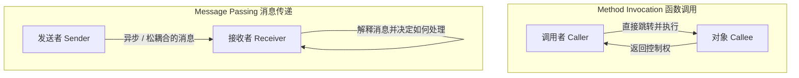
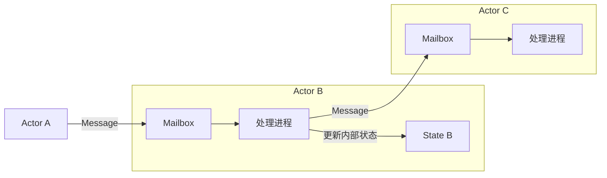

## 1. 引言：我们所知道的“面向对象”是真正的面向对象吗？

在现代软件开发中，没有哪一天听不到“面向对象编程（OOP: Object-Oriented Programming）”这个词。Java、C#、Python、Ruby、C++ 等几乎所有主流编程语言都引入了面向对象范式，这已成为开发者的必备知识。

然而，许多开发者最初学到的“面向对象三大要素”——即“封装（Encapsulation）”、“继承（Inheritance）”和“多态（Polymorphism）”——实际上已经严重偏离了可以说是面向对象之父的艾伦·凯（Alan Kay）所构想的本质，你知道这个事实吗？

我们每天都在写的“定义类、创建实例、通过点表示法调用方法”的风格，确实是特定语言（比如 C++ 和 Java）所构建的面向对象的一种形式。但这仅仅是面向对象这个广阔概念中的冰山一角，或者说只是某一种特定的诠释。

在这篇文章中，我们将回顾“面向对象”一词诞生初期的历史，并回归到艾伦·凯真正想要实现的愿景。其中的关键词就是**“消息传递（Messaging）”**。只要正确理解消息传递的概念，你的系统设计视野将会大大拓宽，从而获得与微服务架构、Actor 模型等现代分布式系统设计相通的深刻洞察。

## 2. 艾伦·凯的愿景：来自生物学的灵感

发明了“面向对象”一词的艾伦·凯，原本学习的是数学和生物学。当他在探索一种全新的软件构建范式时，他从**“生物细胞（Cell）”**的机制中获得了强烈的灵感。

人体由数万亿个细胞组成。每个细胞都像一个独立的生命体一样运作，其内部状态（如 DNA 和蛋白质等）不会被外部直接操作。细胞之间通过传递化学物质和电信号等“消息”，作为一个整体来维持复杂而高级的生命活动。

这种“细胞之间的交流”隐喻，正是艾伦·凯构想面向对象的起点。

- **细胞的独立性**：每个对象都完全隐藏其自身状态（数据），绝不会被外部直接修改。
- **消息的发送与接收**：对象之间只能通过互相发送“消息”来进行协作。
- **自主的行为**：接收到消息的对象将自主决定如何处理（或者忽略）该消息。

艾伦·凯曾这样说过：
> "I'm sorry that I long ago coined the term 'objects' for this topic because it gets many people to focus on the lesser idea. The big idea is 'messaging'."
> （很抱歉很久以前我为这个话题创造了“对象”这个词，因为这让很多人把注意力集中在了次要的想法上。最重要的想法是“消息传递”。）

正如这句话所指出的，主角并不是“对象（物体）”本身，而是穿梭于对象之间的“消息”。

## 3. “方法调用”与“消息传递”的决定性差异

在我们熟知的 Java 或 C++ 等语言中，为了使用对象的功能，我们会进行“方法调用（Method Invocation）”。

```java
// Java风格的方法调用示例
Receiver obj = new Receiver();
obj.doSomething();
```

乍看之下，这似乎是“在向 `obj` 发送 `doSomething` 的消息”。但是，在编译器或运行时的层面上，这只不过是**“函数调用（Function Call）”的语法糖**罢了。调用者（Caller）知道被调用者（Callee）的内存地址，并直接跳转到那里执行处理。如果 `doSomething` 方法不存在，就会发生编译错误（在静态类型语言中）或运行时错误。

另一方面，真正意义上的“消息传递（Message Passing）”在本质上与此完全不同。在艾伦·凯参与设计的语言“Smalltalk”中，对象之间的所有交互都被建模为消息的发送。

在消息传递的世界里，发送者仅仅是向接收者抛出一个“希望你做这个”的请求（包含名称和参数）。



消息传递的特点如下：

1. **极度延迟绑定（Extreme Late Binding）**
   方法调用通常在编译时或链接时绑定（静态绑定），而消息传递则是直到运行时才进行绑定（动态绑定）。接收到消息的对象在运行时动态解释该消息，寻找并执行相应的处理。
2. **消息的委托与忽略**
   当对象收到自己无法理解的消息时，它不仅可以将其视为错误，还可以自主地采取灵活的应对措施，比如转发（委派）给其他对象，或者直接忽略。
3. **网络透明性**
   消息传递这一范式，无论是对于同一内存空间（进程）内的对象，还是对于跨网络不同服务器上的对象，都可以一视同仁地处理。方法调用的大前提是在同一内存空间内，而消息传递则天生具备向分布式系统扩展的特性。

## 4. 为什么“类”和“继承”成了误解的根源？

那么，为什么原本以“消息传递”为核心的面向对象，现在却变成了以“类和继承”为中心来讨论呢？

最大的原因是 **C++ 和 Java 的巨大成功**。

在 20 世纪 80 年代到 90 年代，以过程式语言 C 语言为基础并引入面向对象概念的 C++ 登场了。为了将执行性能提升到极致，C++ 没有采用 Smalltalk 那样纯粹的动态消息传递，而是采用了能在编译时解析的静态类、继承以及使用虚函数表（vtable）的高效方法调用。

随后的 Java 在语法上也受到了 C++ 的强烈影响，并将“定义类并从中创建实例”的风格作为面向对象的标准广泛普及开来。由此，“面向对象 ＝ 设计类层次结构”这种根深蒂固的认知在工业界就此定型。

类和继承在代码复用和整理数据结构方面非常方便。但是，过度依赖它们也引发了以下问题：

- **庞大且复杂的类继承树**：脆弱，难以修改，父类的任何修改都会波及所有子类（紧耦合）。
- **上帝类（God Class）的诞生**：囤积了所有数据和方法，出现了与最初“自主的小型对象”相去甚远的庞大类。
- **内部状态的泄漏**：滥用 Getter 和 Setter，破坏了封装，导致外部直接操作内部状态。

这些都可以说是由于迷失了“独立对象之间互相发送消息”这一原本的消息传递哲学，从而引发的反模式。

## 5. Actor 模型与分布式系统：复苏的消息传递哲学

在现代，能够以最纯粹的形式体现艾伦·凯“消息传递”愿景的架构或范式是什么呢？

其中之一就是**“Actor 模型（Actor Model）”**。由 Carl Hewitt 等人提出的这种计算模型，正是 Erlang、Elixir 以及 Scala 的 Akka 等技术的基础。

在 Actor 模型中，计算的基本单位被称为“Actor”。Actor 拥有完全独立的状态和行为，与其他对象交流的唯一手段就是**“发送异步消息”**。这令人惊讶地与艾伦·凯的细胞隐喻高度一致。



在 Erlang/Elixir 中，成千上万个轻量级 Actor（进程）并行运行，通过互相发送消息构建起庞大的系统。即使某个 Actor 崩溃，也会通过向其他 Actor 发送消息来重启（Let it crash 的思想），从而实现了极高的容错性。

此外，现代的**“微服务架构（Microservices Architecture）”**本质上也可以说是一个基于消息传递的庞大面向对象系统。如果把每个微服务看作一个巨大的“对象”，它们完全隐藏了自己的数据库（内部状态），而是通过 REST API、gRPC、Kafka 等进行“消息”交互，从而构建出整个系统。

艾伦·凯所梦想的“散布在网络不同节点上的对象之间互相发送消息”的愿景，在云原生时代，不期演然地以微服务的形式得以实现。

## 6. 总结：我们真正应该从面向对象中学到什么

“面向对象”这个词已经包含了太多太多的含义。类、继承、接口、多态……毫无疑问，这些都是现代开发中非常有用的工具。

但是，为了控制系统的复杂性，设计出灵活且可扩展的系统，我们必须回想起艾伦·凯最初构想的核心——**“消息传递”**。

1. **不要随意公开数据和行为**（守护细胞壁）。
2. **与其说是方法调用，不如作为“请求”发送消息**（尊重自主性）。
3. **保持对运行时灵活性和延迟绑定的意识**。
4. **从进程内到分布式系统，用统一的隐喻来理解架构**。

下次当你编写代码，或是思考系统设计时，试着带上这样一个视角：“这个对象应该向其他对象发送怎样的消息？”不要将焦点放在“类的层次结构”上，而是聚焦于“对象的网络与交流”，这样你的设计必将变得更加优雅、更易于修改，并且成为真正意义上的“面向对象”。

---
*Reference: Alan Kay's emails, Smalltalk-80 documentation, and the Actor Model principles.*
