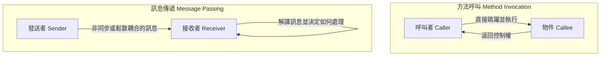
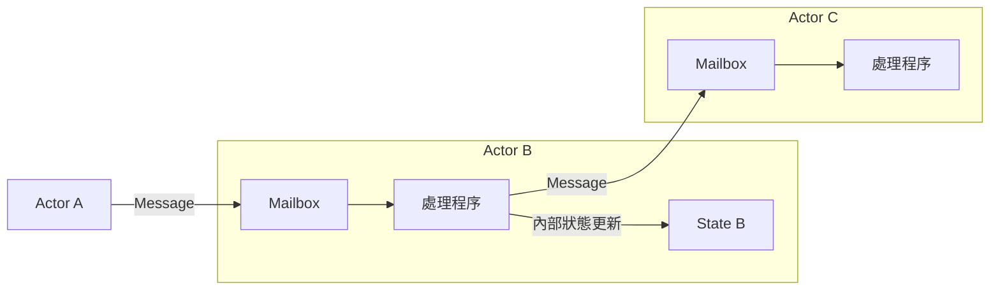

## 1. 前言：我們所知道的「物件導向」是真的嗎？

在現代軟體開發中，幾乎每天都會聽到「物件導向程式設計（OOP: Object-Oriented Programming）」這個詞。Java、C#、Python、Ruby、C++ 等主流程式語言幾乎都引入了物件導向的典範，成為開發者必備的知識。

然而，許多開發者最初學到的「物件導向三大要素」——也就是「封裝（Encapsulation）」、「繼承（Inheritance）」、「多型（Polymorphism）」——其實與可以說是物件導向之父的 Alan Kay 所構想的本質有著巨大的偏差，您知道這個事實嗎？

我們日常撰寫的「定義類別、建立實體，並使用點記號來呼叫方法」的風格，確實是特定語言（例如 C++ 或 Java）所建構的一種物件導向形式。但那只不過是物件導向這個廣大概念的一小部分，或者只是一種特定的解釋而已。

在本文中，我們將回顧物件導向一詞誕生初期的歷史，以及 Alan Kay 真正想要實現的願景。其關鍵字就是**「訊息傳遞（Messaging）」**。透過正確理解訊息傳遞的概念，您的系統設計視野將大幅擴展，並能獲得通往現代分散式系統設計（如微服務架構和 Actor 模型）的深刻洞察。

## 2. Alan Kay 的願景：來自生物學的啟發

發明「物件導向」一詞的 Alan Kay，原本學習的是數學與生物學。當他在摸索新的軟體建構典範時，強烈啟發他的便是**「生物細胞（Cell）」**的機制。

人體是由數兆個細胞所組成的。每個細胞的行為都像是一個獨立的生命體，其內部狀態（如 DNA 和蛋白質）不會被外部直接操作。細胞之間透過交換化學物質或電子訊號等「訊息」，以整體維持複雜且高度的生命活動。

這個「細胞間的溝通」隱喻，正是 Alan Kay 心中描繪的物件導向原點。

- **細胞的獨立性**：每個物件都完全隱藏自己的狀態（資料），不會被外部直接改寫。
- **訊息的收發**：物件之間只透過互相發送「訊息」來進行協作。
- **自律的行為**：接收到訊息的物件，將自行決定如何處理（或是忽略）該訊息。

Alan Kay 曾經這麼說過：
> "I'm sorry that I long ago coined the term 'objects' for this topic because it gets many people to focus on the lesser idea. The big idea is 'messaging'."
> （我對於很久以前為這個主題發明了「物件」這個詞感到抱歉，因為它讓許多人將焦點放在次要的想法上。最核心的想法是「訊息傳遞」。）

正如這句話所表達的，主角並非「物件（物品）」本身，而是穿梭於物件之間的「訊息」。

## 3. 「方法呼叫」與「訊息傳遞」的決定性差異

在我們熟知的 Java 或 C++ 等語言中，為了使用物件的功能，我們會進行「方法呼叫（Method Invocation）」。

```java
// Java 風格的方法呼叫範例
Receiver obj = new Receiver();
obj.doSomething();
```

乍看之下，這似乎是在「對 `obj` 發送一個名為 `doSomething` 的訊息」。然而，從編譯器或執行環境的層次來看，這只不過是**「函式呼叫（Function Call）」的語法糖**罷了。呼叫者（Caller）知道被呼叫者（Callee）的記憶體位址，並直接跳躍到那裡執行處理。如果 `doSomething` 這個方法不存在，就會發生編譯錯誤（在靜態型別語言的情況下）或執行時期錯誤。

另一方面，真正意義上的「訊息傳遞（Message Passing）」在本質上與此不同。在 Alan Kay 參與設計的語言「Smalltalk」中，物件之間的互動全部被模型化為訊息的發送。

在訊息傳遞的世界裡，發送者只是對接收者拋出一個「希望你做這件事」的請求（名稱與參數的組合）。



訊息傳遞的特徵如下：

1. **極度的延遲綁定（Extreme Late Binding）**
   相較於方法呼叫通常在編譯時期或連結時期綁定（靜態綁定），訊息傳遞則完全延遲到執行時期才進行綁定（動態綁定）。接收到訊息的物件會在執行時期動態地解譯該訊息，尋找對應的處理並執行。
2. **訊息的委派與忽略**
   當物件接收到自己無法理解的訊息時，不僅僅是單純地報錯，它還能自律地進行靈活的應對，例如將訊息轉發（Forward）給其他物件，或是直接忽略它。
3. **網路上的透通性**
   訊息傳遞這個典範，無論是位在同一個記憶體空間（行程）內的物件之間，還是透過網路位於不同伺服器上的物件之間，都可以用相同的方式來處理。方法呼叫的大前提是必須在同一個記憶體空間內，但訊息傳遞則具有能自然擴展至分散式系統的特性。

## 4. 為什麼「類別」和「繼承」會成為誤解的根源？

那麼，為什麼原本應該以「訊息傳遞」為重心的物件導向，現在卻變成以「類別與繼承」為中心來探討呢？

其最大的原因，在於 **C++ 與 Java 的壓倒性成功**。

在 1980 年代到 90 年代期間，以程序導向語言 C 語言為基礎，並引入了物件導向概念的 C++ 問世。為了將執行效能提升至極限，C++ 沒有採用像 Smalltalk 那樣純粹的動態訊息傳遞，而是採用了能在編譯時期解決的靜態類別與繼承，以及使用虛擬函式表（vtable）的高效方法呼叫。

隨後的 Java 在語法上也深受 C++ 的影響，將「定義類別並從中建立實體」的風格作為物件導向的標準廣泛地普及開來。因此，在產業界中便根深蒂固地形成了「物件導向等於設計類別階層」的強烈認知。

類別與繼承在程式碼的重複使用與資料結構的整理上非常方便。但是，過度依賴它們也導致了以下問題的產生：

- **巨大且複雜的類別繼承樹**：對變更的適應力弱，父類別的修改會波及所有子類別（緊密耦合）。
- **上帝類別 God Class 的誕生**：囤積了所有資料與方法，出現了偏離原本「自律的小型物件」的巨大類別。
- **內部狀態的洩漏**：濫用 Getter 和 Setter，破壞了封裝性，使得狀態被外部直接操作。

這些全都可以說是遺忘了「獨立物件之間互相發送訊息」這個原本的訊息傳遞哲學，所引發的反模式（Anti-pattern）。

## 5. Actor 模型與分散式系統：復甦的訊息傳遞哲學

在現代，最純粹地體現了 Alan Kay「訊息傳遞」願景的架構或典範是什麼呢？

其中之一就是**「Actor 模型 Actor Model」**。由 Carl Hewitt 等人所提倡的這個運算模型，成為了 Erlang、Elixir 以及 Scala 的 Akka 等技術的基礎。

在 Actor 模型中，運算的基本單位稱為「Actor」。Actor 擁有完全獨立的狀態與行為，與他人溝通的唯一手段就是**「非同步訊息的發送」**。這與 Alan Kay 的細胞隱喻驚人地一致。



在 Erlang 或 Elixir 中，數以十萬計的輕量級 Actor（行程）會平行運作，並透過互相發送訊息來建構巨大的系統。即使某個 Actor 崩潰了，也能透過發送訊息給其他 Actor 來讓其重新啟動（Let it crash 的思想），實現了極高的容錯能力。

此外，現代的**「微服務架構 Microservices Architecture」**，本質上也可以說是訊息傳遞導向的物件導向之巨大版。如果將每個微服務視為一個巨大的「物件」，它們會完全隱藏自己的資料庫（內部狀態），並透過 REST API、gRPC 或 Kafka 等方式進行「訊息」的交換，藉此建構出整個系統。

Alan Kay 夢想中「散佈在網路上不同節點的物件之間互相發送訊息」的願景，在雲端原生時代中，意外地以微服務的形式實現了。

## 6. 總結：我們真正該從物件導向學到的事

「物件導向」這個詞包含的意義實在太多了。類別、繼承、介面、多型……毫無疑問，這些都是現代開發中非常有用的工具。

但是，為了管理系統的複雜度，並進行靈活且可擴展的設計，我們必須回想起 Alan Kay 原本意圖的**「訊息傳遞」**這個核心。

1. **不要隨意公開資料與行為**（守護細胞壁）。
2. **不只是方法呼叫，而是作為「請求」發送訊息**（尊重自律性）。
3. **意識到執行時期的靈活性與延遲綁定**。
4. **從行程內到分散式系統，以共通的隱喻來理解架構**。

下次當您在撰寫程式碼，或是思考系統設計時，請試著抱持「這個物件應該發送什麼樣的訊息給其他物件？」的觀點。將焦點放在「物件的網路與溝通」而不是「類別的階層結構」，您的設計將會變得更加洗鍊、對變更的適應力更強，並成為真正意義上的「物件導向」。

---
*Reference: Alan Kay's emails, Smalltalk-80 documentation, and the Actor Model principles.*
