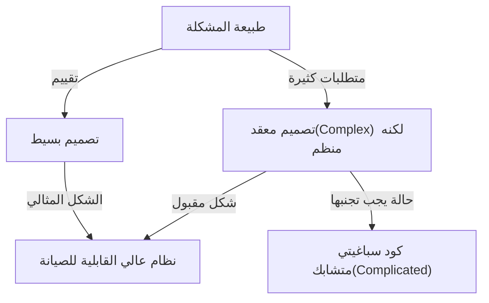
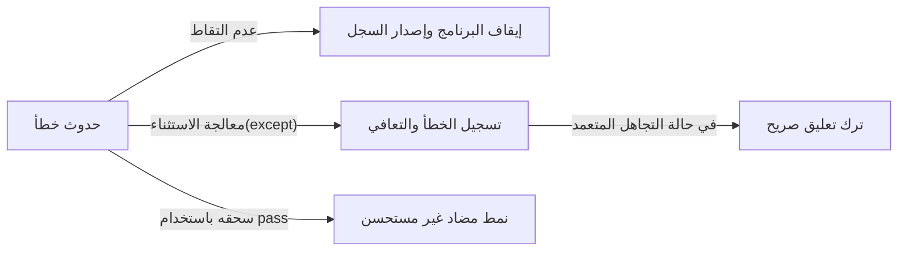

لغات البرمجة ليست مجرد سلسلة من الأوامر لجهاز الكمبيوتر. إنها وسيلة للتعبير عن أفكار المطورين، ولغة مشتركة يتقاسمها الفريق بأكمله. ومن بين العديد من لغات البرمجة، تمتلك بايثون "فلسفة" فريدة بشكل بارز. ألا وهي **"The Zen of Python (زن بايثون)"**.

في هذا المقال، سوف نتعمق بالتفصيل في "زن (Zen)" الذي يشكل أساس فلسفة تصميم بايثون، بدءًا من خلفية نشأته، والفلسفة العميقة التي يعنيها كل قول مأثور، وكيف ينبغي لنا تطبيق هذه الأفكار في تطويرنا اليومي للبرمجيات.

---

## 1. ما هو "The Zen of Python"؟

هل سبق لك أن فتحت الصدفة التفاعلية (REPL) في بايثون وأدخلت الأمر التالي؟

```python
import this
```

عند تنفيذ هذا الكود القصير، سيظهر نص يشبه قصيدة من 19 سطرًا على الشاشة كـ "بيضة عيد الفصح" (Easter egg). هذا هو "The Zen of Python"، والذي يمكن القول إنه الركيزة الروحية لمجتمع بايثون.

في عالم هندسة البرمجيات، توجد العديد من أفضل الممارسات وأنماط التصميم، ولكن من النادر جدًا أن تقوم لغة برمجة معينة بصياغة فلسفتها الأساسية كـ "قصيدة" ودمجها في اللغة نفسها.

### خلفية النشأة: تيم بيترز و PEP 20

كُتب The Zen of Python بواسطة تيم بيترز (Tim Peters)، وهو مطور أساسي شارك في تطوير بايثون لسنوات عديدة. قام تيم بتنظيم "التفاهمات الضمنية" و"الحدس" في تصميم منشئ بايثون، غيدو فان روسوم (Guido van Rossum)، وصياغتها في كلمات لمشاركتها مع المجتمع.

تم توثيق هذا لاحقًا رسميًا كـ **PEP 20 (اقتراح تحسين بايثون 20)**. عند إضافة ميزات جديدة أو إجراء تغييرات على بايثون، يعمل PEP 20 دائمًا كنقطة انطلاق يجب الرجوع إليها.

ومن المثير للاهتمام أن The Zen of Python يُعرف بـ "19 قولًا مأثورًا"، لكن تيم ذكر أن "هناك 20 في المجموع، ولكن الأخير تُرِكَ فارغًا ليكتبه غيدو". لا يزال السطر الأخير فارغًا حتى الآن، ويبدو أنه يجسد نوعًا من "جمال الفراغ".

---

## 2. فلسفة الزن: فك رموز الأقوال المأثورة الـ 19

كل سطر في The Zen of Python هو سلسلة من الكلمات التي تبدو بسيطة للوهلة الأولى، ولكن وراءها تكمن رؤى عميقة في هندسة البرمجيات. دعونا نكشف عن معنى كل منها واحدًا تلو الآخر.

### Beautiful is better than ugly. (الجميل أفضل من القبيح)

الكود هو شيء تنفذه الآلات، ولكنه قبل كل شيء "شيء يقرأه البشر". تضمن بايثون الجمال البصري من خلال فرض المسافات البادئة (indentation) ككتل لغوية.

الكود الجميل يحتوي على تدفق منطقي واضح، وينقل القصد على الفور. الكود القبيح (مثل التداخل العميق غير الضروري، واصطلاحات التسمية غير المتسقة، والمنطق المعكرونة) لا يصبح مرتعًا للأخطاء فحسب، بل يقلل أيضًا من دافع الفريق. السعي وراء الجمال ليس مجرد جماليات، بل هو نهج عملي لإنشاء برمجيات قابلة للصيانة بدرجة عالية.

### Explicit is better than implicit. (الصريح أفضل من الضمني)

هذا المبدأ هو أحد الميزات الرئيسية التي تميز بايثون عن العديد من اللغات الأخرى (مثل Ruby و JavaScript، إلخ).
قد تبدو السلوكيات الضمنية أو "السحر" مريحة عند كتابة الكود. ولكن عندما تقرأ هذا الكود بعد ستة أشهر أو عندما ينضم عضو جديد إلى المشروع، تصبح الافتراضات الضمنية حاجزًا كبيرًا.

تفضل بايثون التصريح بـ "ما الذي يتم استيراده" و"أي المتغيرات يتم التلاعب بها". على سبيل المثال، لا يُنصح باستخدام `from module import *`. لأن مصدر الدالة يصبح ضمنيًا.

### Simple is better than complex. (البسيط أفضل من المعقد)
### Complex is better than complicated. (المعقد أفضل من المتشابك)

يجب التفكير في هذين القولين معًا. أولاً، يجب أن تبحث دائمًا عن الحل "الأبسط" لأي مشكلة. يجب تجنب التسلسلات الهرمية الإضافية للفئات (classes) والتجريد المفرط.

ومع ذلك، لا يكون منطق الأعمال في العالم الحقيقي بسيطًا دائمًا. إذا كانت المشكلة نفسها معقدة بطبيعتها (Complex)، فمن المقبول أن يكون الكود معقدًا ليعكس ذلك.

ولكن، لا يجب أن تجعل الأشياء المعقدة "متشابكة (Complicated)". "المعقد (Complex)" يشير إلى حالة منظمة ذات عناصر عديدة، بينما "المتشابك (Complicated)" يشير إلى حالة حيث فشل التصميم وتشابكت الأمور ببعضها.



### Flat is better than nested. (المسطح أفضل من المتداخل)

يقلل التداخل العميق (المسافات البادئة) بشكل كبير من قابلية قراءة الكود. خاصة عندما تتداخل الحلقات (loops) والشروط الشرطية عدة مرات، فإن ذلك يضغط على الذاكرة العاملة للدماغ ويجعل من السهل تفويت الأخطاء.

في بايثون، يُنصح بإبقاء الكود مسطحًا (Flat) قدر الإمكان عن طريق استخدام تفهمات القوائم (list comprehensions) واستخدام نمط العودة المبكرة (Early Return).

### Sparse is better than dense. (المتفرق أفضل من الكثيف)

حشر الكود في سطر واحد هو فكرة سيئة. إذا قمت بحشر عمليات متعددة في سطر واحد (مثل، المعادلات الرياضية المعقدة، وتسلسل الدوال، والمعاملات الثلاثية، وما إلى ذلك)، فلن تعرف أين حدث الخطأ عند تنفيذ الكود خطوة بخطوة في المصحح (debugger).

عن طريق وضع مسافات مناسبة وفواصل أسطر لإبقاء المعالجة "متفرقة (Sparse)"، يصبح القصد من الكود واضحًا.

### Readability counts. (قابلية القراءة مهمة)

هذه إحدى أهم القيم في تصميم بايثون. إنها مبنية على حقيقة أن "الكود يُقرأ عدد مرات أكثر بكثير مما يُكتب". تم تصميم بناء الجملة في بايثون ليكون أقرب إلى اللغة الإنجليزية الطبيعية لزيادة "قابلية القراءة" هذه إلى أقصى حد.

### Special cases aren't special enough to break the rules. (الحالات الخاصة ليست خاصة بما يكفي لكسر القواعد)
### Although practicality beats purity. (على الرغم من أن التطبيق العملي يتغلب على النقاء)

هذان أيضًا قولان مأثوران متلازمان. كقاعدة عامة، يجب أن نلتزم بدقة بالقواعد ومعايير البرمجة المعمول بها (مثل PEP 8). إذا بدأت في كسر القواعد قائلاً "هذه المرة استثناء"، فسوف ينهار النظام بأكمله.

ولكن في نفس الوقت، بايثون هي لغة "براغماتية (عملية)". إذا كان السعي وراء "النقاء" النظري يؤدي إلى انخفاض شديد في الأداء أو يقلل من قابلية الاستخدام، فيجب إعطاء الأولوية للتطبيق العملي. هذا التوازن هو السبب وراء الاستخدام الواسع النطاق لبايثون.

### Errors should never pass silently. (يجب ألا تمر الأخطاء بصمت أبدًا)
### Unless explicitly silenced. (إلا إذا تم إسكاتها بشكل صريح)

إذا حدثت حالة غير طبيعية في النظام، فيجب أن يفشل الكود على الفور (Fail Fast). إذا تم سحق الخطأ واستمر البرنامج في العمل، فسوف يظهر كخطأ غير معروف السبب لاحقًا، مما يجعل عملية اكتشاف الأخطاء وتصحيحها صعبة للغاية.



إذا كنت ترغب حقًا في تجاهل الخطأ، فيجب عليك استخدام كتلة `try...except` لتجاهله "بشكل صريح".

### In the face of ambiguity, refuse the temptation to guess. (في مواجهة الغموض، ارفض إغراء التخمين)

توجد لغات حيث يقوم المترجم (compiler) أو المفسر (interpreter) بـ "تخمين" نية المبرمج والمضي قدمًا في المعالجة. على سبيل المثال، تعد تحويلات الأنواع الضمنية مثالًا كلاسيكيًا.

بايثون تكره هذا النوع من السلوك الذي يعتمد على "قراءة الأفكار". إذا حاولت إضافة سلسلة نصية ورقم، فلن تقوم بايثون بدمج السلسلة بشكل عشوائي، بل سترمي خطأ `TypeError`. في المواقف الغامضة، تطلب تعليمات واضحة من الإنسان (المبرمج).

### There should be one-- and preferably only one --obvious way to do it. (يجب أن تكون هناك طريقة واحدة - ويفضل أن تكون طريقة واحدة فقط - واضحة للقيام بذلك)
### Although that way may not be obvious at first unless you're Dutch. (على الرغم من أن هذه الطريقة قد لا تكون واضحة في البداية إلا إذا كنت هولنديًا)

لغة بيرل (Perl) تمتلك فلسفة تقول "هناك أكثر من طريقة للقيام بذلك" (TIMTOWTDI)، لكن بايثون تتبع مسارًا معاكسًا تمامًا.

للقيام بنفس المعالجة، من المثالي أن يكتبها الجميع بنفس الطريقة. هذا يقلل بشكل كبير من العبء المعرفي عند قراءة الكود الذي كتبه أشخاص آخرون.
تجدر الإشارة إلى أن "الهولندي" يشير إلى غيدو فان روسوم، مبتكر بايثون. تتضمن هذه الجملة بعض الدعابة بأن الفهم الكامل لنية مصمم اللغة قد يستغرق بعض الوقت.

### Now is better than never. (الآن أفضل من لا شيء أبدًا)
### Although never is often better than *right* now. (على الرغم من أن لا شيء أبدًا غالبًا ما يكون أفضل من الآن *مباشرة*)

هذه فلسفة للجدولة واتخاذ القرارات في تطوير البرمجيات. بدلاً من انتظار الحل المثالي وعدم القيام بأي شيء، يجب أن تبذل قصارى جهدك الآن لإطلاق الكود والحصول على تعليقات (التفكير الرشيق أو Agile).

ولكن من ناحية أخرى، بدلاً من إدخال اختراقات (hacks) عشوائية أو إصلاحات غير مكتملة "الآن"، فمن الأفضل غالبًا "عدم القيام بأي شيء" حتى يتم تحديد السبب الجذري. هذا تحذير من زيادة الديون التقنية بلا مبالاة.

### If the implementation is hard to explain, it's a bad idea. (إذا كان التنفيذ صعب الشرح، فهي فكرة سيئة)
### If the implementation is easy to explain, it may be a good idea. (إذا كان التنفيذ سهل الشرح، فقد تكون فكرة جيدة)

هذا أحد المؤشرات النهائية لقياس جودة الكود. إذا كنت تكافح لشرح كيف يعمل الكود الذي كتبته لأعضاء فريقك، فإن هذا التصميم خاطئ.

على العكس من ذلك، إذا تمكنت من شرح تدفق الكود بسهولة على السبورة البيضاء، فمن المحتمل جدًا أن يكون التصميم ممتازًا. (ومع ذلك، "سهل = صحيح تمامًا" ليس صحيحًا دائمًا، لذلك تُستخدم العبارة المتحفظة "may be").

### Namespaces are one honking great idea -- let's do more ofそういう活用しよう！)

"مساحات الأسماء (Namespaces)" (مثل الوحدات والفئات) التي تمنع تعارض أسماء المتغيرات والدوال، هي مفهوم أساسي في بناء البرمجيات واسعة النطاق. تشجع بايثون على استخدام مساحات الأسماء القائمة على الوحدات (modules) للحفاظ على التزاوج (coupling) المنخفض في النظام.

---

## 3. كيف تطبق The Zen of Python في التطوير اليومي

The Zen of Python لا ينطبق فقط عند استخدام بايثون. الفلسفة المذكورة هنا تحمل حقائق عالمية يمكن تطبيقها على تصميم النظام باستخدام أي لغة برمجة، بل وحتى على تواصل الفريق ونظرية التنظيم.

1. **استخدامه كمعيار لمراجعة الكود**: عندما تتردد في التصميم داخل الفريق، فإن استخدام كلمات Zen مثل "هل هذا بسيط أم معقد؟" أو "هل أصبح ضمنيًا؟" كلغة مشتركة سيمنع الصراعات العاطفية ويتيح نقاشًا بناءً.
2. **استخدامه كبوصلة للتصميم**: عند إضافة ميزات جديدة، فإن الانتباه إلى "هل يمكننا إبقاؤه مسطحًا؟" و"هل يتم التعامل مع الأخطاء بشكل صحيح؟" سيسمح لك بالحفاظ على بنية قابلة للصيانة على المدى الطويل.
3. **إعادة الهيكلة المستمرة**: من خلال مشاركة الحس الجمالي "الجميل أفضل من القبيح" داخل الفريق بأكمله، سيتم القضاء على التنازلات مثل "طالما أنه يعمل فهو جيد"، وستنمو ثقافة الحفاظ على قاعدة الكود في حالة صحية دائمًا.

## الخلاصة

"The Zen of Python" يركز الحكمة العميقة لهندسة البرمجيات في نص قصير مكون من 19 سطرًا فقط. السبب وراء كون بايثون محبوبة جدًا في جميع أنحاء العالم اليوم وأصبحت لغة مشهورة بامتياز تُستخدم في جميع المجالات مثل الذكاء الاصطناعي، وعلوم البيانات، وتطوير الويب، هو وجود هذه "الفلسفة" الجميلة والمرنة.

في المرة القادمة التي تكتب فيها الكود، توقف قليلاً وتذكر كلمات "الزن" هذه. بالتأكيد، سيتطور الكود الخاص بك ليصبح أكثر جمالًا وقابلية للقراءة و"Pythonic".
