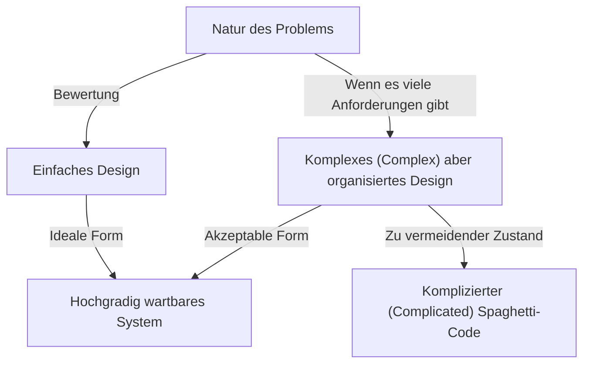
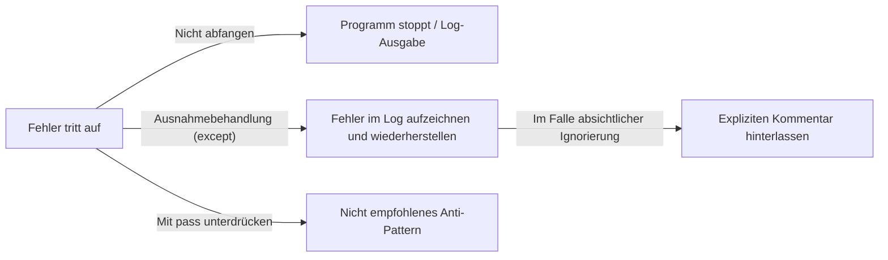

Programmiersprachen sind nicht nur eine Reihe von Befehlen für einen Computer. Sie sind ein Medium für Entwickler, um ihre Gedanken auszudrücken, und eine gemeinsame Sprache, die vom gesamten Team geteilt wird. Unter den vielen Programmiersprachen hat Python eine bemerkenswert einzigartige "Philosophie". Das ist **"The Zen of Python"**.

In diesem Artikel werden wir tief in dieses "Zen" eintauchen, das den Kern von Pythons Designphilosophie bildet: von den Hintergründen seiner Entstehung über die tiefe Philosophie hinter jedem Aphorismus bis hin dazu, wie wir dieses Denken in unserer täglichen Softwareentwicklung anwenden sollten.

---

## 1. Was ist "The Zen of Python"?

Haben Sie jemals die interaktive Python-Shell (REPL) geöffnet und den folgenden Befehl eingegeben?

```python
import this
```

Wenn Sie diesen kurzen Code ausführen, wird ein 19-zeiliger gedichtartiger Text als Easter Egg auf dem Bildschirm ausgegeben. Dies ist "The Zen of Python", das als spirituelles Rückgrat der Python-Community angesehen werden kann.

Es gibt verschiedene Best Practices und Entwurfsmuster in der Welt des Software Engineerings, aber es ist extrem selten, dass eine bestimmte Programmiersprache ihre Kernphilosophie als "Gedicht" verbalisiert und in die Sprache selbst integriert.

### Hintergrund der Entstehung: Tim Peters und PEP 20

The Zen of Python wurde von Tim Peters geschrieben, einem Core-Entwickler, der seit vielen Jahren an der Entwicklung von Python beteiligt ist. Tim systematisierte das "stillschweigende Verständnis" und die "Intuition" im Design von Guido van Rossum, dem Schöpfer von Python, sodass es in Worte gefasst und mit der Community geteilt werden konnte.

Dies wurde später offiziell als **PEP 20 (Python Enhancement Proposal 20)** dokumentiert. Wenn Funktionen in Python hinzugefügt oder geändert werden, dient dieses PEP 20 stets als Ausgangspunkt, auf den man zurückgreifen sollte.

Interessanterweise ist The Zen of Python als die "19 Aphorismen" bekannt, aber Tim erklärte: "Es gibt insgesamt 20, aber der letzte wurde freigelassen, damit Guido ihn schreiben kann." Dieser letzte ist immer noch leer und scheint eine Art "Schönheit der Leere" zu verkörpern.

---

## 2. Die Zen-Philosophie: Die 19 Aphorismen entschlüsseln

Jede Zeile von The Zen of Python mag auf den ersten Blick wie eine einfache Aneinanderreihung von Wörtern aussehen, aber dahinter verbirgt sich tiefes Wissen über Software Engineering. Lassen Sie uns die Bedeutung jedes einzelnen entschlüsseln.

### Beautiful is better than ugly. (Schön ist besser als hässlich)

Code wird von Maschinen ausgeführt, aber noch mehr wird er "von Menschen gelesen". Python erzwingt Einrückungen als Syntaxblöcke und garantiert so visuelle Schönheit.

Schöner Code hat einen klaren logischen Ablauf und seine Absichten werden sofort vermittelt. Hässlicher Code (z.B. unnötig tiefe Verschachtelungen, inkonsistente Namenskonventionen, Spaghetti-Logik) ist nicht nur ein Nährboden für Bugs, sondern senkt auch die Motivation des Teams. Das Streben nach Schönheit ist keine bloße Ästhetik, sondern ein praktischer Ansatz, um hochgradig wartbare Software zu erstellen.

### Explicit is better than implicit. (Explizit ist besser als implizit)

Dieses Prinzip ist eines der Hauptmerkmale, die Python von einigen anderen Sprachen (wie Ruby oder JavaScript) unterscheiden.
Implizites Verhalten oder "Magie" mögen praktisch erscheinen, wenn man den Code schreibt. Aber wenn man diesen Code ein halbes Jahr später liest oder neue Mitglieder dem Projekt beitreten, werden implizite Annahmen zu einem riesigen Hindernis.

Python bevorzugt es, explizit zu machen, "was importiert wird" und "welche Variablen manipuliert werden". Zum Beispiel wird die Schreibweise `from module import *` nicht empfohlen. Das liegt daran, dass unklar wird, woher welche Funktion kommt.

### Simple is better than complex. (Einfach ist besser als komplex)
### Complex is better than complicated. (Komplex ist besser als kompliziert)

Diese beiden Aphorismen sollten zusammen betrachtet werden. Zunächst sollte die "einfachste" Lösung für jedes Problem gesucht werden. Unnötige Klassenhierarchien oder übermäßige Abstraktionen sollten vermieden werden.

Die Geschäftslogik der realen Welt ist jedoch nicht immer einfach. Wenn das Problem selbst inhärent komplex (Complex) ist, ist es akzeptabel, dass der Code diese Komplexität widerspiegelt.

Allerdings darf Komplexes nicht in einen "komplizierten Zustand (Complicated)" geraten. "Complex (komplex)" ist ein Zustand, in dem die Struktur organisiert ist, aber es viele Elemente gibt, während "Complicated (kompliziert)" einen Zustand beschreibt, in dem das Design gebrochen und verworren ist.



### Flat is better than nested. (Flach ist besser als verschachtelt)

Tiefe Verschachtelungen (Einrückungen) verringern die Lesbarkeit des Codes erheblich. Besonders wenn Schleifen oder bedingte Verzweigungen mehrfach übereinanderliegen, belasten sie das Arbeitsgedächtnis des Gehirns und machen es leicht, Bugs zu übersehen.

In Python wird empfohlen, den Code so flach wie möglich zu halten, indem man List Comprehensions oder Early Return Patterns verwendet.

### Sparse is better than dense. (Spärlich ist besser als dicht)

Es ist eine schlechte Idee, zu viel Code in eine Zeile zu packen. Wenn mehrere Operationen (z. B. komplexe mathematische Formeln, Method Chains, ternäre Operatoren usw.) in einer Zeile gebündelt sind, wird es beim schrittweisen Ausführen im Debugger unmöglich zu erkennen, wo der Fehler aufgetreten ist.

Indem man angemessene Leerzeichen und Zeilenumbrüche einfügt und den Prozess "spärlich (Sparse)" hält, wird die Absicht des Codes klar ersichtlich.

### Readability counts. (Lesbarkeit zählt)

Dies ist einer der wichtigsten Werte im Design von Python. Es basiert auf der Tatsache, dass "Code viel öfter gelesen als geschrieben wird". Pythons Syntax ist so gestaltet, dass sie der natürlichen englischen Sprache nahe kommt, um diese "Lesbarkeit" auf das Äußerste zu maximieren.

### Special cases aren't special enough to break the rules. (Spezialfälle sind nicht speziell genug, um die Regeln zu brechen)
### Although practicality beats purity. (Obwohl Praktikabilität Reinheit schlägt)

Auch diese beiden sind ein Paar. Im Prinzip sollten wir die festgelegten Regeln und Coding-Standards (wie PEP 8) strikt befolgen. Wenn wir anfangen, Regeln zu brechen mit der Ausrede "nur dieses eine Mal ist es eine Ausnahme", wird das ganze System auf einen Zusammenbruch zusteuern.

Gleichzeitig ist Python aber auch eine Sprache des "Pragmatismus". Wenn das Streben nach theoretischer "Reinheit" dazu führt, dass die Leistung extrem abfällt oder die Benutzerfreundlichkeit leidet, sollte die Praktikabilität Vorrang haben. Dieses Gespür für Balance ist genau der Grund, warum Python so weit verbreitet ist.

### Errors should never pass silently. (Fehler sollten niemals stillschweigend weitergegeben werden)
### Unless explicitly silenced. (Es sei denn, sie werden explizit zum Schweigen gebracht)

Wenn ein abnormaler Zustand im System auftritt, sollte der Code sofort fehlschlagen (Fail Fast). Das Unterdrücken von Fehlern und das Fortsetzen des Programms manifestiert sich später als Bug mit unbekannter Ursache, was das Debuggen extrem schwierig macht.



Wenn Sie einen Fehler wirklich ignorieren wollen, müssen Sie ihn "explizit" ignorieren, indem Sie einen `try...except`-Block verwenden.

### In the face of ambiguity, refuse the temptation to guess. (Angesichts von Mehrdeutigkeit, widerstehe der Versuchung zu raten)

Es gibt Sprachen, in denen der Compiler oder Interpreter die Absicht des Programmierers selbstständig "errät" und den Prozess fortsetzt. Ein typisches Beispiel dafür ist die implizite Typumwandlung.

Python hasst dieses Verhalten, die "Luft zu lesen". Wenn Sie versuchen, einen String und eine Zahl zu addieren, wird Python nicht einfach die Strings verketten, sondern einen `TypeError` auslösen. In zweideutigen Situationen verlangt es klare Anweisungen vom Menschen (Programmierer).

### There should be one-- and preferably only one --obvious way to do it. (Es sollte einen -- und vorzugsweise nur einen -- offensichtlichen Weg geben, es zu tun)
### Although that way may not be obvious at first unless you're Dutch. (Obwohl dieser Weg anfangs vielleicht nicht offensichtlich ist, es sei denn, man ist Niederländer)

Die Sprache Perl hat eine Philosophie, die besagt "There's more than one way to do it" (TIMTOWTDI), aber Python macht genau das Gegenteil.

Für denselben Prozess ist es ideal, wenn jeder denselben Code schreibt. Dies verringert drastisch die kognitive Belastung beim Lesen von Code, der von anderen geschrieben wurde.
Übrigens bezieht sich "Niederländer" auf Guido van Rossum, den Schöpfer von Python. Es enthält den Humor, dass es einige Zeit dauern kann, die Absichten des Sprachdesigners vollständig zu verstehen.

### Now is better than never. (Jetzt ist besser als nie)
### Although never is often better than *right* now. (Obwohl nie oft besser ist als *genau* jetzt)

Dies ist eine Philosophie der Terminplanung und Entscheidungsfindung in der Softwareentwicklung. Anstatt auf die perfekte Lösung zu warten und nichts zu tun, sollten Sie das Beste tun, was Sie jetzt tun können, den Code veröffentlichen und Feedback einholen (agiles Denken).

Andererseits ist es oft besser, "nichts" zu tun, bis man die Grundursache versteht, anstatt Ad-hoc-Hacks oder unvollständige Fixes "genau jetzt" einzufügen. Es ist eine Warnung, technische Schulden nicht unachtsam zu erhöhen.

### If the implementation is hard to explain, it's a bad idea. (Wenn die Implementierung schwer zu erklären ist, ist es eine schlechte Idee)
### If the implementation is easy to explain, it may be a good idea. (Wenn die Implementierung leicht zu erklären ist, könnte es eine gute Idee sein)

Dies ist einer der ultimativen Indikatoren zur Messung der Codequalität. Wenn Sie Schwierigkeiten haben, Teammitgliedern zu erklären, wie der von Ihnen geschriebene Code funktioniert, ist das Design falsch.

Umgekehrt, wenn Sie den Ablauf des Codes leicht auf einem Whiteboard erklären können, ist die Wahrscheinlichkeit hoch, dass das Design hervorragend ist. (Da "einfach" jedoch nicht immer "absolut richtig" bedeutet, wird der konservative Ausdruck "may be" verwendet.)

### Namespaces are one honking great idea -- let's do more of those! (Namensräume sind eine verdammt großartige Idee -- lasst uns mehr davon machen!)

"Namensräume" (wie Module und Klassen), die Kollisionen von Variablen- und Funktionsnamen verhindern, sind ein wesentliches Konzept beim Aufbau großer Software. Python fördert die Nutzung modulbasierter Namensräume, um die Kopplung des Systems gering zu halten.

---

## 3. Wie man The Zen of Python in der täglichen Entwicklung nutzt

The Zen of Python gilt keineswegs nur bei der Verwendung von Python. Die hier dargelegte Philosophie birgt universelle Wahrheiten, die auf das Systemdesign mit jeder Programmiersprache und sogar auf die Teamkommunikation und Organisationstheorie angewendet werden können.

1. **Als Standard für Code-Reviews nutzen**: Wenn man beim Design im Team unschlüssig ist, kann die Verwendung von Zen-Begriffen wie "Ist es Simple oder Complex?" oder "Ist es implizit geworden?" als gemeinsame Sprache emotionale Konflikte verhindern und konstruktive Diskussionen ermöglichen.
2. **Als Kompass für das Design nutzen**: Wenn Sie neue Funktionen hinzufügen, können Sie eine langfristig wartbare Architektur beibehalten, indem Sie darauf achten, ob Sie es "flach halten" und "Fehler richtig behandeln".
3. **Kontinuierliches Refactoring**: Ein teamweites Bewusstsein für Ästhetik ("Schön ist besser als hässlich") zu haben, beseitigt den Kompromiss "Solange es funktioniert, ist es gut" und fördert eine Kultur, in der die Codebasis immer in einem gesunden Zustand gehalten wird.

## Zusammenfassung

"The Zen of Python" verdichtet die tiefe Weisheit des Software Engineerings in nur 19 kurzen Zeilen. Hinter der Tatsache, dass Python heute auf der ganzen Welt so geliebt wird und eine überwältigend populäre Sprache ist, die in allen Bereichen von KI, Data Science und Webentwicklung verwendet wird, steht diese schöne und robuste "Philosophie".

Wenn Sie das nächste Mal Code schreiben, halten Sie einen Moment inne und versuchen Sie, sich an diese "Zen"-Worte zu erinnern. Ihr Code wird sich sicherlich zu etwas Schönerem, Lesbarerem und Pythonischerem entwickeln.
