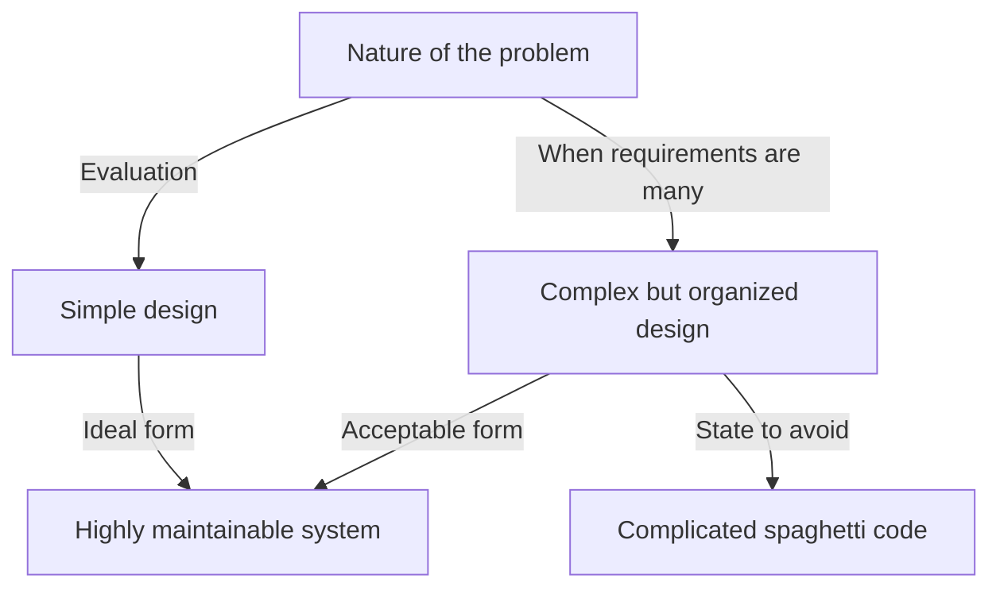
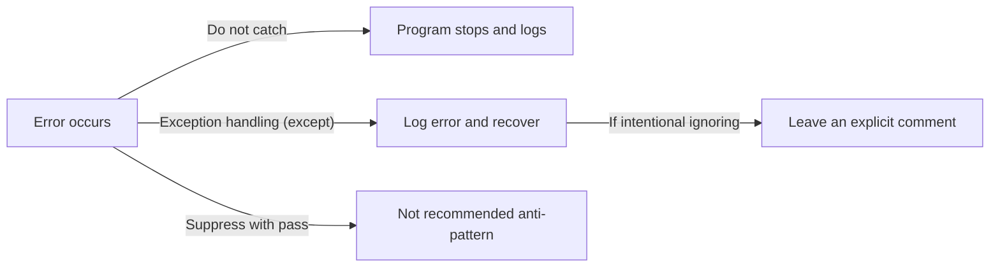

Programming languages are not just sequences of commands to computers. They are media for expressing developer's thoughts, and a common language shared by the entire team. Among many programming languages, Python has a uniquely distinct "philosophy". That is **"The Zen of Python"**.

In this article, we will delve into the details of this "Zen", the core of Python's design philosophy, from the background of its birth, to the deep philosophy behind each aphorism, and how we should apply this thought in our daily software development.

---

## 1. What is "The Zen of Python"?

Have you ever opened a Python interactive shell (REPL) and typed the following command?

```python
import this
```

When you run this short code, an easter egg of 19 lines of poem-like text is output to the screen. This is "The Zen of Python", which can be said to be the spiritual pillar of the Python community.

While there are various best practices and design patterns in the world of software engineering, it is extremely rare for a specific programming language to verbalize its core philosophy as a "poem" and incorporate it into the language itself.

### Background of Birth: Tim Peters and PEP 20

The Zen of Python was written by Tim Peters, a core developer who has been involved in Python development for many years. Tim verbalized the "implicit understandings" and "intuition" in the design of Guido van Rossum, the creator of Python, and systematized them so they could be shared within the community.

This was later officially documented as **PEP 20 (Python Enhancement Proposal 20)**. When features are added or modified in Python, this PEP 20 always functions as a starting point to return to.

Interestingly, although The Zen of Python is known as the "19 aphorisms", Tim stated that "there are 20 in total, but the last one is left blank for Guido to write." The last one remains blank to this day, as if embodying a kind of "beauty of whitespace".

---

## 2. The Philosophy of Zen: Deciphering the 19 Aphorisms

Each line of The Zen of Python may seem like a simple sequence of words at first glance, but deep insights of software engineering are hidden behind them. Let's unravel their meanings one by one.

### Beautiful is better than ugly.

Code is something machines execute, but more than that, it is "something humans read". Python enforces visual beauty by making indentation a syntactical block.

Beautiful code has a clear flow of logic and its intent is immediately conveyed. Ugly code (e.g., unnecessarily deep nesting, inconsistent naming conventions, spaghetti logic) not only becomes a hotbed for bugs but also lowers the team's motivation. Pursuing beauty is not just aesthetics, but a practical approach to building highly maintainable software.

### Explicit is better than implicit.

This principle is one of the major features that separates Python from several other languages (such as Ruby or JavaScript).
Implicit behavior or "magic" might feel convenient when writing code. However, when reading that code six months later, or when a new member joins the project, implicit assumptions become a huge barrier.

Python prefers to make explicit "what is being imported" and "which variables are being manipulated". For example, writing `from module import *` is not recommended because where each function comes from becomes implicit.

### Simple is better than complex.
### Complex is better than complicated.

These two aphorisms should be considered as a set. First, you should look for the most "simple" solution for any problem. Unnecessary class hierarchies and excessive abstraction should be avoided.

However, real-world business logic is not always simple. When the problem itself is inherently complex, it is acceptable for the code to become complex to reflect that.

However, you must not make complex things "complicated". "Complex" means a state where there are many elements but the structure is organized, while "Complicated" refers to a state where the design is broken and intertwined.



### Flat is better than nested.

Deep nesting (indentation) significantly reduces code readability. Especially when loops and conditional branches overlap multiple times, it compresses the brain's working memory, making it easier to overlook bugs.

In Python, it is recommended to keep code as flat as possible by using list comprehensions and early return patterns.

### Sparse is better than dense.

Packing too much code into a single line is a bad move. If you pack multiple operations (e.g., complex mathematical formulas, method chains, ternary operators, etc.) into one line, you won't know where the error occurred when step-executing with a debugger.

By inserting appropriate spaces and line breaks, and keeping operations "sparse", the intent of the code becomes clearly visible.

### Readability counts.

This is one of the most important values in Python's design. It is based on the fact that "code is read far more times than it is written". The reason Python's syntax is designed to be close to natural English is also to maximize this "readability".

### Special cases aren't special enough to break the rules.
### Although practicality beats purity.

This is also a paired set of aphorisms. In principle, we should strictly adhere to established rules and coding conventions (like PEP 8). If you start breaking rules saying "this time is an exception", the whole system will head towards collapse.

However, at the same time, Python is also a language of "Pragmatism". If pursuing theoretical "purity" leads to extremely poor performance or usability, practicality should take precedence. This sense of balance is exactly why Python is widely used.

### Errors should never pass silently.
### Unless explicitly silenced.

When an abnormal state occurs in the system, the code should fail immediately (Fail Fast). If you suppress errors and continue the program, they will manifest later as bugs of unknown cause, making debugging extremely difficult.



If you really want to ignore an error, you must "explicitly" ignore it using a `try...except` block.

### In the face of ambiguity, refuse the temptation to guess.

Some languages have compilers or interpreters that arbitrarily "guess" the programmer's intent and proceed with processing. For example, implicit type conversion is a typical case.

Python hates this kind of "reading between the lines" behavior. If you try to add a string and a number, Python won't arbitrarily concatenate strings, but will throw a `TypeError`. In ambiguous situations, it demands clear instructions from the human (programmer).

### There should be one-- and preferably only one --obvious way to do it.
### Although that way may not be obvious at first unless you're Dutch.

The language Perl has a philosophy that "There's more than one way to do it" (TIMTOWTDI), but Python goes in the exact opposite direction.

If you are doing the same operation, it is ideal that everyone writes it the same way. This dramatically lowers the cognitive load when reading code written by others.
Note that the "Dutch" refers to Guido van Rossum, the creator of Python. It includes the humor that it might take time to fully understand the language designer's intentions.

### Now is better than never.
### Although never is often better than *right* now.

This is the philosophy of scheduling and decision-making in software development. Rather than doing nothing while waiting for a perfect solution, you should do the best you can now, release the code, and get feedback (agile thinking).

However, on the other hand, there are many cases where "doing nothing" until the root cause is understood is better than applying an ad-hoc hack or incomplete fix "right now". It is a warning against carelessly increasing technical debt.

### If the implementation is hard to explain, it's a bad idea.
### If the implementation is easy to explain, it may be a good idea.

This is one of the ultimate metrics for measuring code quality. If you are struggling to explain the behavior of the code you wrote to your team members, the design is wrong.

Conversely, if you can easily explain the flow of the code on a whiteboard, there is a high probability that the design is excellent. (However, it is modestly expressed as "may be" because "easy = absolutely correct" is not always true.)

### Namespaces are one honking great idea -- let's do more of those!

"Namespaces" (modules, classes, etc.) that prevent variable and function name collisions are an essential concept when building large-scale software. Python promotes keeping the system's coupling low by actively using module-based namespaces.

---

## 3. How to apply The Zen of Python to daily development

The Zen of Python is by no means only applicable when using Python. The philosophy told here holds universal truths that can be applied to system design using any programming language, and by extension, to team communication and organizational theory.

1. **Use it as a standard for code review**: When hesitating over a design within a team, using Zen words like "Is it Simple or Complex?" or "Is it becoming implicit?" as a common language prevents emotional conflicts and enables constructive discussions.
2. **Use it as a compass for design**: When adding new features, being conscious of "Can we keep it flat?" and "Are we handling errors properly?" allows you to maintain a long-term maintainable architecture.
3. **Continuous refactoring**: By having a team-wide aesthetic of "Beautiful is better than ugly", you eliminate the compromise of "as long as it works", and foster a culture of keeping the codebase constantly in a healthy state.

## Summary

"The Zen of Python" condenses the deep wisdom of software engineering into just 19 short lines. The reason Python is loved worldwide today and has become an overwhelmingly popular language used in all fields such as AI, Data Science, and Web Development, is because of the existence of this beautiful and robust "philosophy".

Next time you write code, stop for a moment and try to remember the words of this "Zen". Surely, your code will evolve into something more beautiful, more readable, and more Pythonic.
